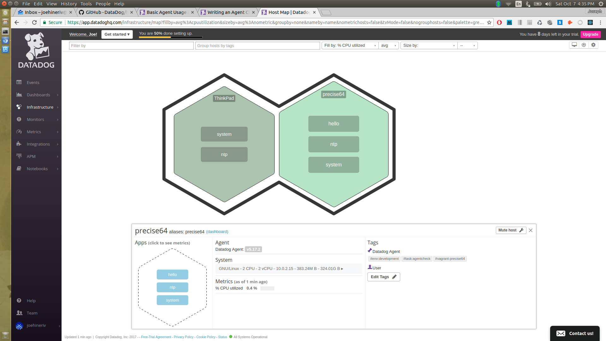

## Joe Hiner IV - Support Engineer Technical Exercise

### Level 1 - Collecting your Data

What is the agent?
At the risk of anthropomorphizing, the Agent is DataDog's local representative residing on the Client's Host. A program which collects data and metrics concerning the state and activities of the host and sends that information to DataDog. In turn, DataDog is able to process and present that information back to the Client.

##### Host Map with Tags:

##### MongoDB Integrated:

Following the 'Writing an Agent Check' tutorial, I created a random number Agent Check which looks strkingly similar to the 'hello.world' Agent Check.

### Level 2 - Visualizing your Data

##### Dashboard:
https://app.datadoghq.com/dash/376140/custom-metrics---test-support-random?live=true&page=0&is_auto=false&from_ts=1507572194171&to_ts=1507575794171&tile_size=m

What is the difference between a timeboard and a screenboard?
Timeboards are coordinated across the metrics by time. Mouse hover over one data point and all other metrics are highlighted at their corresponding time. This is useful for troubleshooting, visualizing separate parts of the system based on points of interest from a single metric.
ScreenBoards are not coordinated across metrics by time. The information presented can be on different timescales and have more visual customization. These boards may be useful in argumentative presentations as they would have the ability of comparing the results of one technique against another.

##### Snapshot of Anamoly:

Surprisingly, I have not recieved an email notification of this snapshot. It is the only missing piece of this exercise I was unable to implement.

### Level 3 - Alerting on your Data

##### Monitor Defined:

##### Alert emails, Triggered and Recovered:

I experimented with this process multiple times before writing everything up. Yesterday I had multiple warnings, alerts, and resolutions emailed to me while I was at the FleetWeek AirShow. I wanted to confirm that my Host would continue without interruption for some length of time. In addition, below are the emails I received notifying me when the 'downtime' I scheduled for overnight was executed.

