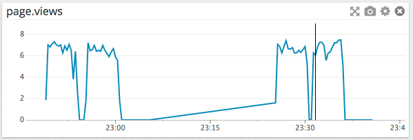

Your answers to the questions go here.

## Level 1

#### Sign up for Datadog, get the agent reporting metrics from your local machine.

*This is what you should see in your terminal upon initial install.  You will also notice that the Data Dog Agent is automatically run upon installation.*

*You can now go into your DataDog account and see the reporting metrics for your local machine.*

#### Bonus question: what is the agent?

The DataDog Agent is software that runs on the clients host environment. It collects event data and metrics and sends it to DataDog. The client can then use that data to make adjustments to monitoring or performance optimization.  The data is presented in rich visual graphs on your Datadog account which you can customize to suit your needs.

There are three components to the Datadog agent:

1. The Collector
  * Runs checks on the current machine for current integrations you have and it will capture system metrics.

2. Dogstatsd
  * A statsd backend server that receives custom metrics from application.

3. Forwarder
  * Retrieves data from both the Collector and Dogstatsd and queues it up to send it to Datadog.

#### Submit an event via the API.
* Submit a test event via the API in Ruby.

* Run the file from the command line

* The event will then be visible in your Events feed

####  Get an event to appear in your email inbox (the email address you signed up for the account with)

____

## Level 2

#### Take a simple web app ([in any of our supported languages](http://docs.datadoghq.com/libraries/)) that you've already built and instrument your code with dogstatsd. This will create **metrics**.

In the rails app I added the 'gem 'dogstatsd-ruby'' gem to the gem file. Then added the following bit to the controller to get metrics from the "recipes/index" page.

This leads to the graph below.  You can load Test with Apache Benchmark from the command line.

#### While running a load test (see References) for a few minutes, visualize page views per second. Send us the link to this graph!

[PageViewsGraph](https://app.datadoghq.com/dash/47811/recipe-menu?from_ts=1429997451354&to_ts=1429998109419&tile_size=m&fullscreen=58266516)

#### Create a histogram to see the latency; also give us the link to the graph

In the same recipes_controller.rb file you can add
'statsd.histogram 'page.latency', rand(100)'  This will create a histogram to check the page latency for the recipes#index page in our example.

[PageLatency](https://app.datadoghq.com/dash/47811/recipe-menu?live=true&from_ts=1430025189984&to_ts=1430028789984&tile_size=m&fullscreen=58282083)

#### Bonus points for putting together more creative dashboards.

____

## Level 3
Using the same web app from level 2:

#### tag your metrics with `support` (one tag for all metrics)
To tag your Metrics with support you can do so like this.
'''statsd.increment('page.views', :tags => ["support"])'''

#### tag your metrics per page (e.g. metrics generated on `/` can be tagged with `page:home`, `/page1` with  `page:page1`)
You can then tag the metrics/page in this case page.views, for the next section  we will need to tag the Latency metric with this tag.

'''statsd.increment('page.views', :tags => ["support", "page:recipes"])'''

#### visualize the latency by page on a graph (using stacked areas, with one color per `page`)
The following tag creates a histogram of Page latency and tags it with support, and page.
'''
statsd.histogram('page.latency', rand(100), :tags => ["support", "page:recipes"])
'''

This graph visualizes the latency for the recipes#index and recipes#new pages in the recipes controller.  The index page doesn't have a lot of images or text to render so performance was across the board a little better than the recipes#new page.

____

## Level 4
###Same web app:

#### Count the overall number of page views using dogstatsd counters.

#### Count the number of page views, split by page (hint: use tags)
#### visualize the results on a graph
#### Bonus question: do you know why the graphs are very spiky?