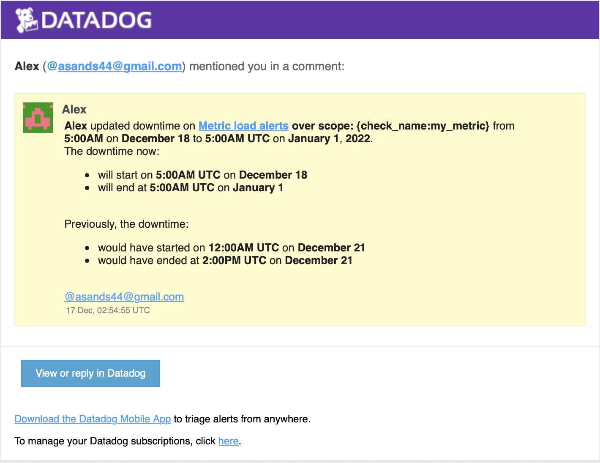
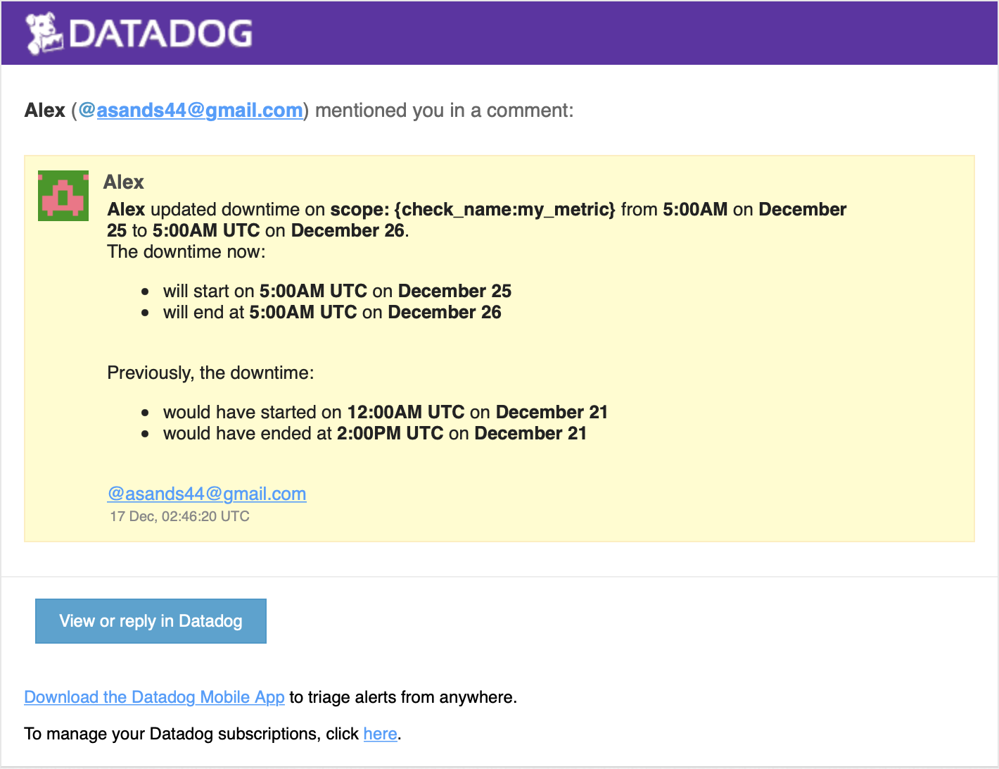

# DataDog Solutions Engineer Answers
Todd Densmore

## Level 0 (optional) - Setup an Ubuntu VM

### Answer 1

My running VM

## Level 1 - Collecting your Data

### Answer 1 - Datadog Account

I have signed up for DataDog

### Answer 2 - Datadog Agent (Bonus) 

The Datadog Agent is a background process that collects metrics from different `checks` and forwards the data to the Datadog server in the cloud. Some checks are enabled by default, and others can be enabled manually. If a custom metrics is needed, it can be written using the simple Datadog check framework.

### Answer 3 - Custom Tags

A screenshot showing the tags `test.domain` in the Agent config file:

Also a screenshot of the Host Dashboard:

### Answer 4 - MongoDB

My `mongodb` database integration:

### Answer 5 - Custom Check

My custom agent check called `test.support.random`:

**NOTE**: 
The documentation might be improved by telling the user that the check will not get compiled if the config file is missing (which is strange). 

**NOTE**: 
The custom check code might be improved in two ways:

1. By writing better error messages if the config file is missing. Currently check will fail, without any meaningful message. 
2. By supporting `*.yml` config files as well as the more standard `*.yaml` files (or by explicitly calling this out as a `gotcha`). See [this link](https://stackoverflow.com/questions/21059124/is-it-yaml-or-yml). 

## Level 2 - Visualizing your Data

### Answer 1 - Additional Database Metrics

Since your database integration is reporting now, clone your database integration dashboard and add additional database metrics to it as well as your test.support.random metric from the custom Agent check.

### Answer 2 - Timeboard and Screenboard

* A timeboard is a grid display for time series information. Each timeboard graph can be shared individually.
* A screenboard is a higher level display of the state of the system. Screenboards can be shared as a read-only view, and are perfect for executive summaries.

### Answer 3 - Timeboard and Screenboard

A snapshot of the `test.support.random` graph with a box showing numbers above 0.90. 

## Level 3 - Alerting on your Data

### Answer 1 - Monitor

### Answer 2 - Multi-Alert (Bonus)

The key here is `from (everywhere)`

### Answer 4 - Email Alert

### Answer 5 - Alert Downtime (Bonus)

