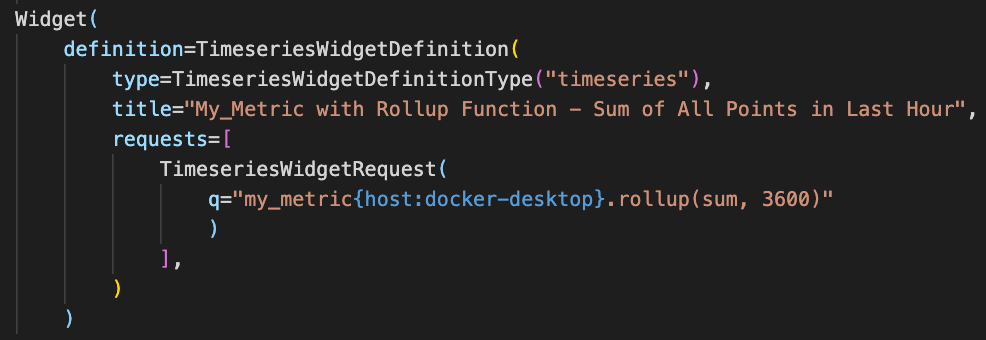
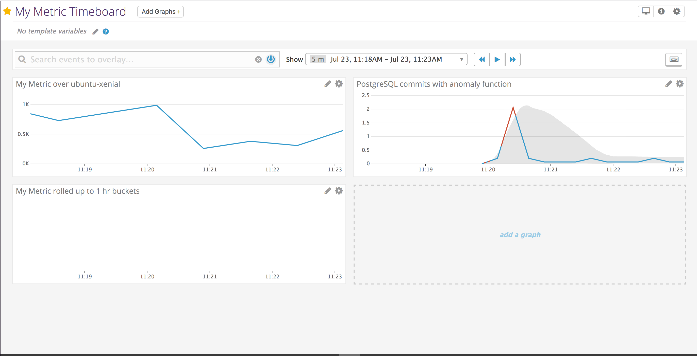
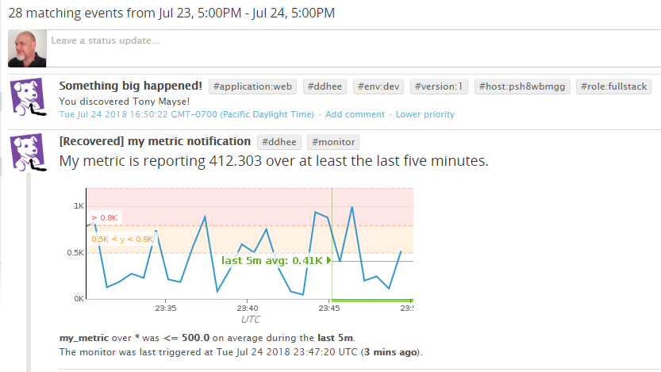
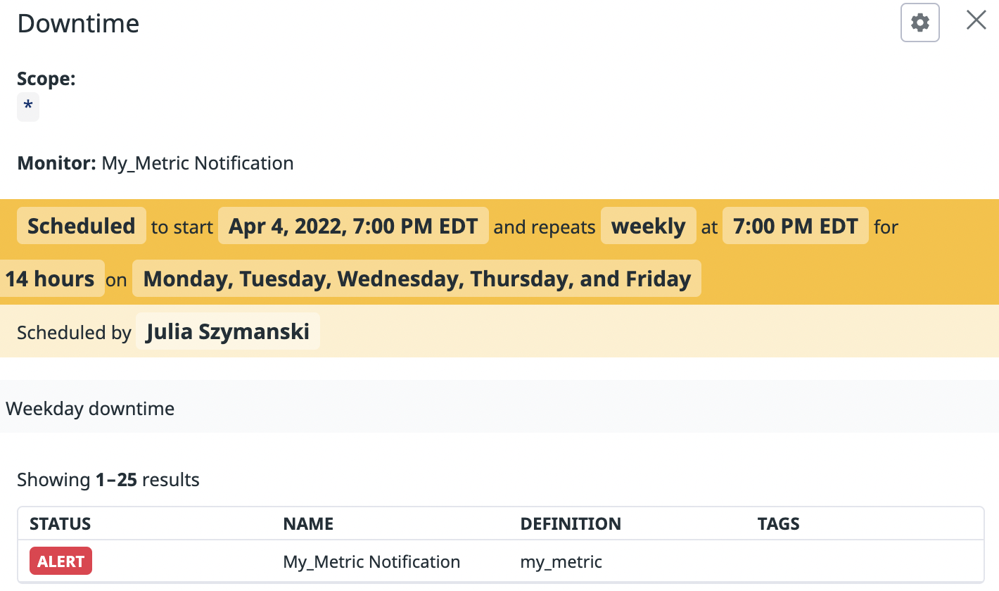
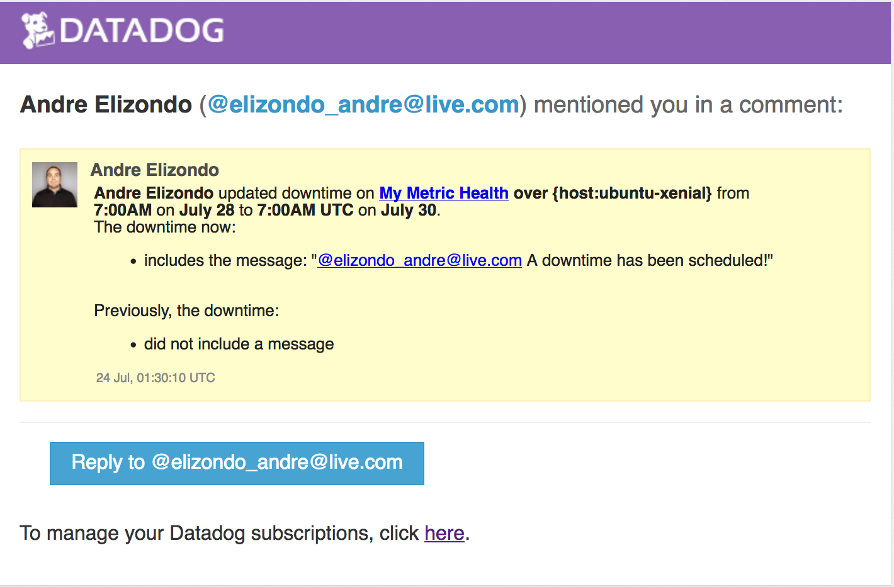

## Prerequisites - Setup the environment
I chose to go with a basic xenial 16.04 host running on vagrant in virutalbox. I installed the agent on this host by running the one liner at the setup page (I debated on installing the agent and managing the checks using the datadog chef cookbook but I wanted to focus on the simplest solution using the fewest moving parts).

I installed the agent on my laptop using the same method.

`DD_API_KEY=YOUR_API_KEY bash -c "$(curl -L https://raw.githubusercontent.com/DataDog/datadog-agent/master/cmd/agent/install_mac_os.sh)"`

Screenshot:


## Collecting Metrics

* Add tags in the Agent config file and show us a screenshot of your host and its tags on the Host Map page in Datadog.
I added tags to this host by modifying the `/etc/datadog-agent/datadog.yaml` config file and adding a tag under the `tags` section.
```yaml
# Set the host's tags (optional)
tags:
  - datadog:candidate
  - hired:yes
```
Screenshot:


* Install a database on your machine (MongoDB, MySQL, or PostgreSQL) and then install the respective Datadog integration for that database.

For the database I went with postgres, I installed it through bash by adding a shell provisioner to my Vagrantfile. To enable the Datadog integration with postgres I ensured my database had the proper permissions on the datadog user and created the `/etc/datadog-agent/conf.d/postgres.d/conf.yaml` file using the example file.
```yaml
init_config:

instances:
  - host: localhost
    port: 5432
    username: datadog
    password: '123456'
#    dbname: db_name
#    ssl: False
#    use_psycopg2: False # Force using psycogp2 instead of pg8000 to connect. WARNING: psycopg2 doesn't support ssl mode.
    tags:
#      - optional_tag1
#      - optional_tag2
```
Screenshot:


* Create a custom Agent check that submits a metric named my_metric with a random value between 0 and 1000.
I created a custom agent check that submitted a metric named `my_metric`, the code I used to accomplish this is below.

`/etc/datadog-agent/checks.d/my_metric.py`
```python
import random
from checks import AgentCheck

class MyMetric(AgentCheck):
  def check(self, instance):
    random_number = random.randint(0,1001)
    self.gauge('my_metric', random_number)
```

`/etc/datadog-agent/checks.d/my_metric.yaml`
```yaml
init_config:

instances:
    - min_collection_interval: 45
```

* Change your check's collection interval so that it only submits the metric once every 45 seconds.

To do this I added a `min_collection_interval` attribute to the single instance in my conf file.

* **Bonus Question** Can you change the collection interval without modifying the Python check file you created?

Yes! Using the `min_collection_interval` attribute you can define the interval in which the collector will gather this particular metric on each individual instance.

## Visualizing Data:

* Your custom metric scoped over your host.
```hcl
  graph {
    title = "My Metric over ubuntu-xenial"
    viz   = "timeseries"

    request {
      q    = "avg:my_metric{host:ubuntu-xenial}"
      type = "line"
    }
  }
```
* Any metric from the Integration on your Database with the anomaly function applied.
```hcl
  graph {
    title  = "PostgreSQL commits with anomaly function"
    viz    = "timeseries"
    
    request {
      q    = "anomalies(avg:postgresql.commits{*}, 'basic', 2)"
      type = "line"
    }
  }
```
* Your custom metric with the rollup function applied to sum up all the points for the past hour into one bucket
```hcl
  graph {
    title  = "My Metric rolled up to 1 hr buckets"
    viz    = "timeseries"

    request {
      q    = "avg:my_metric{*}.rollup(sum, 3600)"
      type = "line"
    }
  }
```

The code I used to create the above is defined in `datadog.tf`, it requires `DATADOG_API_KEY` and `DATADOG_APP_KEY` to be defined in your environment variables. Once those are defined you can just do a `terraform apply` from the root of this repo.

Screenshot of timeboard @ 4hr to show rollup:


Timeboard link: https://app.datadoghq.com/dash/868605/my-metric-timeboard?live=true&page=0&is_auto=false&from_ts=1532380987502&to_ts=1532395387502&tile_size=m

* Set the Timeboard's timeframe to the past 5 minutes

I did this by highlighting the 5 minute section of the graph that I was interested in.


* Take a snapshot of this graph and use the @ notation to send it to yourself.

To do this I created a spike in connections to my database using `pgbench` to simulate an actual scenario where you may want to reach out to a DBA or someone more versed in PG on your team.

 What this would look like to someone reaching out to another teammate.
 The event in the event stream, this may be useful for others on the team to gain awareness potentially in the middle of an incident when you want to make something known to a team.

* **Bonus Question**: What is the Anomaly graph displaying?
The anomaly graph is looking at the historical trend of this metric and identifying where something may look out of place. This is a great solution for metrics where it is important to understand a historical trend so that the viewer can quickly gain context.

## Monitoring Data

To accomplish this I continued using terraform to define the monitor and associated downtime schedule, it can be found in `datadog.tf` and can be deployed using `terraform apply`. I created the monitor and named it 'My Metric Health' using the query `avg(last_5m):avg:my_metric{host:ubuntu-xenial} > 800`.


* Warning threshold of 500

In my monitor definition I set a warning threshold of 500
```hcl
  thresholds {
    warning           = 500
    critical          = 800
  }
```

* Alerting threshold of 800

In my monitor definition I set a critical threshold of 800
```hcl
  thresholds {
    warning           = 500
    critical          = 800
  }
```

* And also ensure that it will notify you if there is No Data for this query over the past 10m.

To accomplish this I added a `notify_no_data` attribute set to true, then I defined the amount of time in minutes that would trigger a no data notification.
```hcl
  notify_no_data    = true
  no_data_timeframe = 10 # how many minutes before calling no data
```

* Send you an email whenever the monitor triggers.

To do this I added a line in my alert message that included my email address prepended with an `@`, this can also be used to trigger things like slack notifications if that is more visible than email.
```hcl
message            = <<EOF
Notify: @elizondo_andre@live.com
{{#is_warning}} Your metric is in a warning state! {{/is_warning}}
{{#is_alert}} Your metric is alerting on Host IP: {{host.ip}} {{/is_alert}}
{{#is_no_data}} Looks like we're not getting any data! Fix it! {{/is_no_data}}
EOF
```

* Create different messages based on whether the monitor is in an Alert, Warning, or No Data state.

Datadog alert notifications are powerful in that they can quickly give you context in the event of an incident, for instance if a machine is tagged in a particular way you can have possibly a runbook relevant to that tag. In this case since we want to have a different message during different alerting levels I used the template variables to determine which text to display based on the current level.
```hcl
message            = <<EOF
Notify: @elizondo_andre@live.com
{{#is_warning}} Your metric is in a warning state! {{/is_warning}}
{{#is_alert}} Your metric is alerting on Host IP: {{host.ip}} {{/is_alert}}
{{#is_no_data}} Looks like we're not getting any data! Fix it! {{/is_no_data}}
EOF
```

* Include the metric value that caused the monitor to trigger and host ip when the Monitor triggers an Alert state.

I did this by including the template variable `{{host.ip}}` in the conditional output for `{{is_alert}}`.
```hcl
message            = <<EOF
Notify: @elizondo_andre@live.com
{{#is_warning}} Your metric is in a warning state! {{/is_warning}}
{{#is_alert}} Your metric is alerting on Host IP: {{host.ip}} {{/is_alert}}
{{#is_no_data}} Looks like we're not getting any data! Fix it! {{/is_no_data}}
EOF
```

* When this monitor sends you an email notification, take a screenshot of the email that it sends you.
This is the email I received for a warning.


* **Bonus Question**: Since this monitor is going to alert pretty often, you don’t want to be alerted when you are out of the office. Set up two scheduled downtimes for this monitor:

  * One that silences it from 7pm to 9am daily on M-F,
  I accomplished this by creating the following `datadog_downtime` resource, it starts at 7pm and ends at 9am with a weekly rotation to only go on Mon-Fri. I limited the scope to my ubuntu machine and linked it directly to my monitor created earlier.
```hcl
resource "datadog_downtime" "my_metric" {
  scope = ["host:ubuntu-xenial"]
  start = 1532397600
  end   = 1532448000

  recurrence {
    type   = "weeks"
    period = 1
    week_days = ["Mon","Tue","Wed","Thu","Fri"]
  }

  message = "@elizondo_andre@live.com A downtime has been scheduled!"

  monitor_id = "${datadog_monitor.my_metric.id}"
}
```
  

  * And one that silences it all day on Sat-Sun.
  I created the following similar to above but with a 48 hour timeframe starting on Saturday and repeating weekly.

```hcl
resource "datadog_downtime" "my_metric_weekend" {
  scope = ["host:ubuntu-xenial"]
  start = 1532761200
  end   = 1532934000

  recurrence {
    type   = "weeks"
    period = 1
    week_days = ["Sat","Sun"]
  }

  message = "@elizondo_andre@live.com A downtime has been scheduled!"
  
  monitor_id = "${datadog_monitor.my_metric.id}"
}
```
  

  * Make sure that your email is notified when you schedule the downtime and take a screenshot of that notification.
  I accomplished this by adding a message to my downtime that includes `@elizondo_andre@live.com` to notify my via email.
  

## Collecting APM Data
I configured the sample flask app by ensuring apm was configured and running (I verified that this is set to enable by default), then I added the following lines to the application to import the blinker library and configure ddtrace.

```python
import blinker as _
from ddtrace import tracer
from ddtrace.contrib.flask import TraceMiddleware
```
```python
traced_app = TraceMiddleware(app, tracer, service="my-flask-app", distributed_tracing=False)
```
I created a dashboard that showed the service summary for my app alongside the my_metric metric from earlier.


Publicly accessible link: https://p.datadoghq.com/sb/af9b3ecf7-ee65faf997826c0115d4c5a887b5dd81

The whole instrumentation can be seen in `flask_apm.py`

Bonus Question: What is the difference between a Service and a Resource?
A service is a collection of resources that accomplish a function, an example might be a database, web, caching, or app service. A resource is an individual action in a service so in the case of a web service it might be our `/api/apm` endpoint.

## Final Question:

Datadog has been used in a lot of creative ways in the past. We’ve written some blog posts about using Datadog to monitor the NYC Subway System, Pokemon Go, and even office restroom availability!

Is there anything creative you would use Datadog for?

I'm a coffee fanatic and I always have been, I'd want to use datadog to monitor everything possible about the machines that make coffee in the office.
- What was the grind time for each pull?
- What was the water tempurature of the boiler through the day?
- What was the extraction time?

I feel like being able to gather metrics like these would take me to the next level in my coffee experience as I would be able to fine tune each part of the process.
