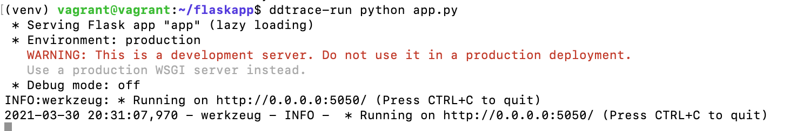

## Submission for Sales-Engineer

The report outlines the steps I took in setting up my demo environment with DataDog.

## Prerequisites - Setup the environment

You can utilize any OS/host that you would like to complete this exercise. I chose the recommended method of [setting up a Vagrant VM with Ubuntu OS](https://learn.hashicorp.com/tutorials/vagrant/getting-started-index?in=vagrant/getting-started). Following these steps you will want to:

1. You will first want to install Vagrant 
2. Then you should install virtualBox 

Now you can test out setting up your personal environment by running the below commands:

3. Initialise Vagrant
```
vagrant init hashicorp/bionic64
```

4. Start the VM
```
vagrant up
```

5. SSH to your Box and explore
```
vagrant ssh
```

6. If you wish, to stop your environment you run
```
vagrant down
```

## Install the DataDog Agent to your Environment

Choose the correct [Agent for your environment](https://app.datadoghq.eu/account/settings#agent) and run the install commands listed under that heading. For Ubuntu, I ran the Easy, one-step install command:
```
DD_AGENT_MAJOR_VERSION=7 DD_API_KEY=<API_KEY> DD_SITE="datadoghq.eu" bash -c "$(curl -L https://s3.amazonaws.com/dd-agent/scripts/install_script.sh)"
```

Note the [DD_API_KEY](https://app.datadoghq.eu/account/settings#api) variable above, this is what links the Agent to my account in the DataDog system and where to route my data.

At this point I can head over to the DataDog login and view my environment on some of the dashboards.


If you ever want to stop the Agent, run:
    ```
    sudo systemctl stop datadog-agent
    ```

And to run it again run:
    ```
    sudo systemctl start datadog-agent
    ```

Other calls for your agent are outlined on the [agent commands](https://docs.datadoghq.com/agent/guide/agent-commands/?tab=agentv6v7#agent-status-and-information) page.

## Collecting Metrics:

#### Environment Tags

You can add environment tags by modifying the /etc/datadog-agent/datadog.yaml

Can be seen in the below image and they match the second image.


#### Install MySql integration

Followed the steps outlined [here](https://app.datadoghq.eu/account/settings#integrations/mysql) to setup my integration.

1. create a 'datadog' user and to verify it has been created.
2. Next grant this user ONLY the below correct permissions
```
mysql> GRANT REPLICATION CLIENT ON *.* TO 'datadog'@'localhost' WITH MAX_USER_CONNECTIONS 5;
Query OK, 0 rows affected, 1 warning (0.00 sec)
```
```
mysql> GRANT PROCESS ON *.* TO 'datadog'@'localhost';
Query OK, 0 rows affected (0.00 sec)
```
3. Set max user MAX_USER_CONNECTIONS
```
mysql> ALTER USER 'datadog'@'localhost' WITH MAX_USER_CONNECTIONS 5;
Query OK, 0 rows affected (0.00 sec)
```
4. You will also need to update  the below files to set up correct logging. Follow the steps outlined [here](https://app.datadoghq.eu/account/settings#integrations/mysql)  
/etc/datadog-agent/conf.d/mysql.d/conf.yaml,  
/etc/mysql/conf.d/mysqld_safe_syslog.cnf,  
/etc/mysql/my.cnf,  
/etc/logrotate.d/mysql-server

5. Update your datadog.yaml file for your agent:
```
logs_enabled: true
```
6. Restart your mysql service and also your DD agent
```
service mysql restart
sudo systemctl stop datadog-agent
sudo systemctl start datadog-agent
```

This can now be viewed on your DataDog UI as below:

Very easy setup.

#### Create custom metric

Created custom metric using files my_metric.py and my_metric.yaml. I was playing around with it and so the metric within that file is called eoins_metric which is displayed on the DDOG UI page and in the second screenshot below.


. This displayed random numbers between 0 and 1000.

I changed this to publish every 45 seconds by following the details on the [Custom Agent Check](https://docs.datadoghq.com/developers/write_agent_check/?tab=agentv6v7) page, updating the file
/etc/datadog-agent/conf.d/my_metric.d/my_metric.yaml and adding

```
init_config:

instances:
  - min_collection_interval: 45
```

## Visualizing Data

#### Timeboard

Following [this documentation](https://docs.datadoghq.com/dashboards/guide/timeboard-api-doc/?tab=python), I began creating a timeboard using the DataDog API.
```
vagrant@vagrant:~/api$ python timeb_ex.py
Traceback (most recent call last):
  File "timeb_ex.py", line 1, in <module>
    from datadog import initialize, api
ImportError: No module named datadog
```

Installed pip3 following [these instructions](https://linuxize.com/post/how-to-install-pip-on-ubuntu-18.04/). This was required to install the datadog library.

Next run:
```
vagrant@vagrant:~$ pip3 install datadog
vagrant@vagrant:~/api$ python3 timeb_ex.py
{'errors': ['Forbidden']}
vagrant@vagrant:~/api$ export DATADOG_HOST=https://api.datadoghq.eu
```

It took me too long to figure out the solution to the above issue. Then found the [authentication webpage](https://docs.datadoghq.com/api/latest/authentication/). DATADOG_HOST needed to be used to re-direct my API call to the EU site. Once this was done, my example timeboard was created. A [different page](https://docs.datadoghq.com/api/latest/dashboards/), the more up-to-date/not outdated page, only referenced the variable DD_SITE which did nothing to help and had me stumped.

```
vagrant@vagrant:~/api$ export DATADOG_HOST=https://api.datadoghq.eu
```

I then modified the create timeboard file to take in the value that my-metric uses in the Metrics page. The file I used to generate the Timeboard can be found in the script my_metric_API.py.

I created the third graph next which was the rollup function. The script used to update the timeboard using a PUT call is under the script rollup.py.

A screenshot of the two can be seen below 
To change the time window for the timeboard, you would change the time in the top right of the image. However, with the rollup being on a one hour time period per bar, this does not make sense to me, I have possibly misunderstood this question.

For the second graph creation, the mysql setup had stopped working on my VM and I did not have a chance to go back through it.

##### Anomaly Function
To answer the anomaly function question. This is simply highlighting points that appear to be irregular (examples: spikes in data usage or disk I/O) on your graph. You can choose what is irregular by setting the size of the standard deviation that should be seen as an anomaly. This function will also display a gray area, which is displaying what is expected within the standard deviations. I was able to see this by playing around with the add widgets in the UI.


## Monitoring Data

Created alerts for when my custom metric was averaging above 800, Warning alerts if it averaged over 500 in a 5 minute period and No data alerts if the system appeared down for a period over 10 minutes. Setup and a sample email is below.

NOTE:  
I had one issue with this in that I could not get the {{host.name}} tag to report correctly in the email, no matter what I tried. Added 'host' into the 'tags' section, ensured host was there when i clicked my host map, tried other {{host.*}} variations without luck.


And the email outputs look like the below.
Alert

Warning

No Data


##### Schedule Downtime

To schedule downtime, please see the two below images:


Email confirmation of the downtime periods below:


## Flask app Monitoring

I had to install flask on my new VM. To do this I followed the [instruction listed here](https://linuxize.com/post/how-to-install-flask-on-ubuntu-18-04/)

I then came to this [APM page](https://docs.datadoghq.com/tracing/setup_overview/setup/python/?tab=containers).

I copied the sample flask code from the README.md into app.py and ran the below commands:
```
pip install ddtrace
ddtrace-run python app.py
```



It hung there for a while so I tried:
```
DD_SERVICE=my_service1 DD_ENV=dev DD_LOGS_INJECTION=true ddtrace-run python app.py
```

I then tried uncommenting the
```
apm_config:
 - enabled: true
```
