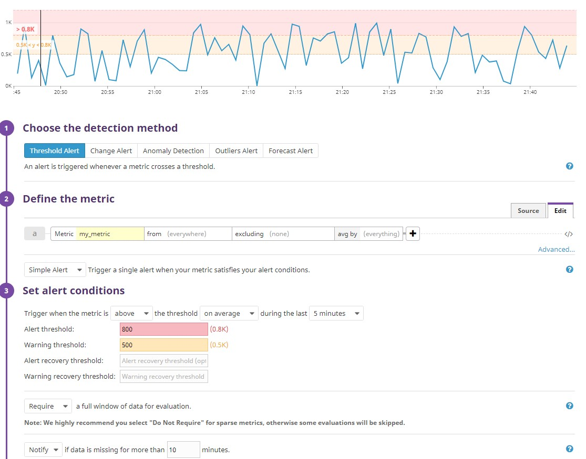
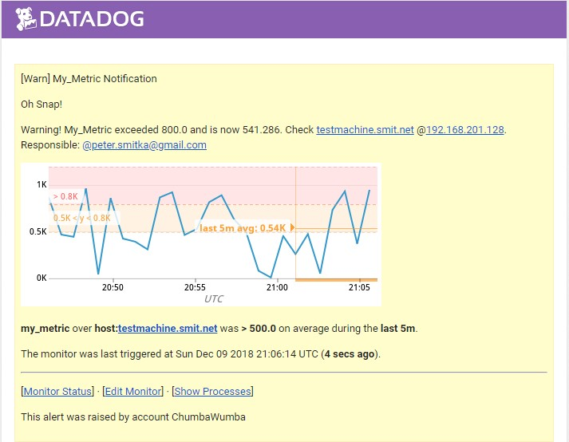
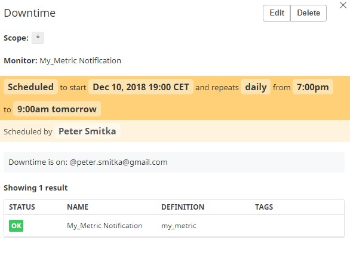
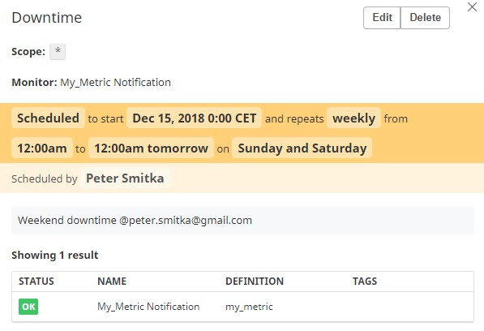
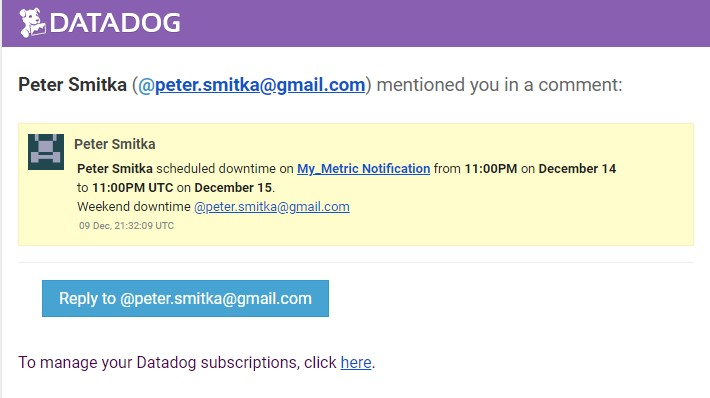
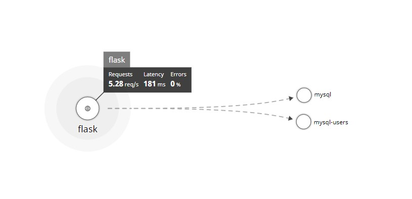
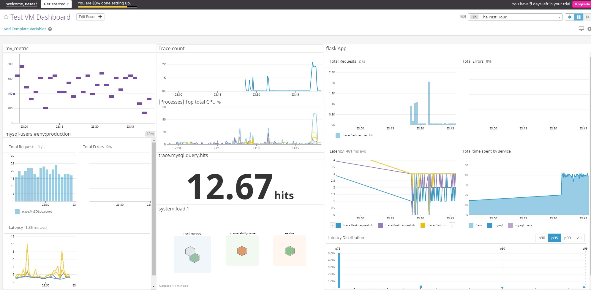

# DataDog Technical Excercise 

#### Applicant: 
#### Date: December 12 2018

## Environment setup

I have setup and tested several environments - in Azure and locally. In Azure it was a Ubuntu Linux host, a Kubernetes based container and a Windows 10 workstation. Localy it was an Ubuntu VM host. 

The **DD Hostmap** then looks like:


For the sake of this assignment all tasks are beign done on the **testmachine.smit.net** host which is the local VM.I have preconfigured the environment with all necessary packages - python, pip, bench tools etc.
To have reaosnable data and events sent to the DD collector, I simulated certain situation, like high CPU usage with **stress-ng --cpu 0 --perf** and generated traffic on the simple webapp which used a local DB hosted with a simple script like: **for i in `seq 1 1000`; do curl http://0.0.0.0:9999/<name_here>; done**. App has its own randomizer inbuilt. 

**Agent info:** 
```bash
smit@ubuntu:~$ sudo datadog-agent health
Agent health: PASS
=== 11 healthy components ===
ad-configpolling, ad-servicelistening, aggregator, collector-queue, dogstatsd-main, forwarder, healthcheck, metadata-agent_checks, metadata-host, metadata-resources, tagger
````
## Collecting Metrics:

1. Add tags in the Agent config file and show us a screenshot of your host and its tags on the Host Map page in Datadog.

Tags were added to the agent yaml file */etc/datadog-agent/datadog.yaml*  : 

**# Set the host's tags (optional)
tags: mysql, env:production, role:web**


2. Install a database on your machine (MongoDB, MySQL, or PostgreSQL) and then install the respective Datadog integration for that database.

Installed MySQL database on the machine and installed the DD integration. Agent status is:
```bash
smit@ubuntu:~$ sudo datadog-agent status
Getting the status from the agent.

mysql (1.4.0)
    -------------
        Instance ID: mysql:c834f329c922e54c [OK]
        Total Runs: 301
        Metric Samples: 61, Total: 18,360
        Events: 0, Total: 0
        Service Checks: 1, Total: 301
        Average Execution Time : 41ms
 ```
3. Create a custom Agent check that submits a metric named my_metric with a random value between 0 and 1000.
Custom monitoring agent has been created (online Doc has some inconsistency where files should be uploaded - checks.d or conf.d and also I had to manually install libraries for the AgentCheck class definition - worked fine after)

Two files were created:

- mycheck.yaml [config data]
- mycheck.py [data feeder]

```python
from random import randint
# the following try/except block will make the custom check compatible with any Agent version
try:
    # first, try to import the base class from old versions of the Agent...
    from checks import AgentCheck
except ImportError:
    # ...if the above failed, the check is running in Agent version 6 or later
    from datadog_checks.checks import AgentCheck

# content of the special variable __version__ will be shown in the Agent status page
__version__ = "1.0.0"


class HelloCheck(AgentCheck):
    def check(self, instance):
        randnum = randint(0, 1000)
        self.gauge('my_metric', randnum)
```


After check with **sudo datadog-agent check mycheck** that the check works, restarted the agent to start sending data.
```bash
    mycheck (1.0.0)
    ---------------
        Instance ID: mycheck:5ba864f3937b5bad [OK]
        Total Runs: 8
        Metric Samples: 1, Total: 4
        Events: 0, Total: 0
        Service Checks: 0, Total: 0
        Average Execution Time : 0s
```

Online View:


4. Change your check's collection interval so that it only submits the metric once every 45 seconds.
Modiefied **mycheck.yaml**

```yaml
init_config:

instances:
 - min_collection_interval: 45
```
Note: Technically this does not mean it's always going to be exactly 45 seconds - it depends on load and volume of metrics. 

5. Bonus Question Can you change the collection interval without modifying the Python check file you created?

By modifying the check's yaml file - no need to edit python script as per above. 

## Visualizing Data
1. Utilize the Datadog API to create a Timeboard that contains:
- Your custom metric scoped over your host.
- Any metric from the Integration on your Database with the anomaly function applied.
- Your custom metric with the rollup function applied to sum up all the points for the past hour into one bucket

The timeboard was created using the start template located [here](https://docs.datadoghq.com/api/?lang=python#timeboards "DataDog Docs") 

**Unchanged Timeboard:**


The JSON structure was done with the help of a second timeboard created in the UI to speed things up. The JSON used in python needed some clean-up (remove null values, autoscale ...)

The python script is located [here](https://github.com/smitius/hiring-engineers/blob/master/timeboard.py "Timeboard")

2. Once this is created, access the Dashboard from your Dashboard List in the UI:
- Set the Timeboard's timeframe to the past 5 minutes
- Take a snapshot of this graph and use the @ notation to send it to yourself.

The 5 minute timeboard view was created by a manual selection in a graph with the help of the "counter" on the bottom of the page.It is easier when the scale is set to L or XL. 
**Updated timeboard snapshot:**


**Snapshot shared:**


Note: The snapshot is of a single graph/metric/widget - not the entire timeboard

3. Bonus Question: What is the Anomaly graph displaying?
The anomaly algorithm takes previous the data stream and trains a model function for future prediction. The grey overlay then represents the expected values based on this function. If the data recieved deviate from the trained function predictive span, it is highlighted in red or orther color as an anomaly. The deviation is then also taken as an input for the predictor. The more data the more precise the analysis. I have used basic anomaly detection with simple but efficient algorithm, but there are several other options available.   

## Monitoring Data
1. Create a new Metric Monitor that watches the average of your custom metric (my_metric) and will alert if it’s above the following values over the past 5 minutes:

- Warning threshold of 500
- Alerting threshold of 800
- And also ensure that it will notify you if there is No Data for this query over the past 10m.
**Warning Query: avg(last_5m):avg:my_metric{host:testmachine.smit.net} > 800**


2. Configure the monitor’s message so that it will:

- Send you an email whenever the monitor triggers.
- Create different messages based on whether the monitor is in an Alert, Warning, or No Data state.
- Include the metric value that caused the monitor to trigger and host ip when the Monitor triggers an Alert state.


3. When this monitor sends you an email notification, take a screenshot of the email that it sends you.


4. Bonus Question: Since this monitor is going to alert pretty often, you don’t want to be alerted when you are out of the office. Set up two scheduled downtimes for this monitor:

- One that silences it from 7pm to 9am daily on M-F,

**Note: left it over the whole week including weeked (can be modified when weekly is selected but the next rule will override)**
- And one that silences it all day on Sat-Sun

- Make sure that your email is notified when you schedule the downtime and take a screenshot of that notification.

**Note: The time in email is UTC - I'm other time zone so that's why it shows differently - in the settings it's ok. Also - because at the time of writing this was weeked and after 7pm I can only set the start date in the future. Also, the weekend downtime was assumed to be recurring event.**

## Collecting APM Data
1. Given the following Flask app (or any Python/Ruby/Go app of your choice) instrument this using Datadog’s APM solution.

App has been instrumented both for Flask and MySQL with patch_all procedure of ddtrace. There are several other options commented out in the code of the app.


2. Bonus Question: What is the difference between a Service and a Resource?

- **Service** - A service is a set of processes that execute the same job or function. The sample app consist of two services, a webapp service and a mysql database service.

- **Resource** -  Resource is a particular action within a service. For this simple web application it is an URL, such as /<name>/ and for the SQL DB it is a query itself, such as "INSERT INTO example ( id, name ) VALUES ( null, '" + name + "');"

3. Provide a link and a screenshot of a Dashboard with both APM and Infrastructure Metrics
A dashboard has been created for the VM host showing a mix of APM and infrastructure metrics:


4. Include your fully instrumented app in your submission
App code is located [here](https://github.com/smitius/hiring-engineers/blob/master/apmapp.py "APM App")
