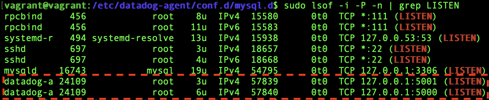
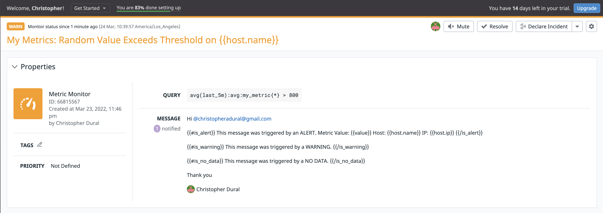

# Datadog Solutions Engineer Exercises
[]() []() []()  []()

In this document, I will go through the steps I've taken to solve the exercises proposed by the [Datadog Repo](https://github.com/DataDog/hiring-engineers/tree/solutions-engineer).

# Candidate
* **[Paulo Borges](https://www.linkedin.com/in/pborges1/)** - **Submitted: June 12th, 2020** - [pborges7@icloud.com](https://github.com/pborgesEdgeX)

# Prerequisites - Setup the environment
Let me begin by walking through my environment setup:
  - Environment configuration:
  
    With the use of [Vagrant 2.2.7](https://releases.hashicorp.com/vagrant/2.2.9/vagrant_2.2.9_x86_64.dmg), I spun up a fresh Ubuntu Linux VM (Ubuntu 18.04.3 LTS) by executing the following instructions from my host OS (macOS Catalina 10.15.4):
    ```sh
    # Create Development directory 
    $ mkdir Datadog
    $ cd Datadog
    # Initialize Vagrant Configuration File & startup
    $ vagrant init hashicorp/bionic64
    $ vagrant up
    # SSH into Vagrant Machine
    $ vagrant ssh
    ```
    
    Once I successfully ssh into the VM, I can now check the OS details with the following instruction:
    
    ```sh
    $ cat /etc/os-release 
    ```
    
    
    After signing up at [Datadog website](https://www.datadoghq.com/), it's time to set up the Agent. Next, I headed over the [getting started page](https://docs.datadoghq.com/getting_started/agent/), where I selected the Ubuntu OS, and as a next step, it provided me an instruction to run the agent with an API KEY. In my case, I ran the following command:
    ```sh
    $ DD_AGENT_MAJOR_VERSION=7 DD_API_KEY=eaf00c6b9ae75a5e5638b22c5cd37929 bash -c "$(curl -L https://raw.githubusercontent.com/DataDog/datadog-agent/master/cmd/agent/install_script.sh)"
    ```
    Once this step is successful, I concluded the initial environment setup.

# Collecting Metrics

In the previous step, I showed how to set up the agent. It's always a good idea to verify that in fact, the agent is running. By logging into the console, and selecting on the left menu ['Infrastructure' --> 'Host Map'](https://app.datadoghq.com/infrastructure/map?fillby=avg%3Acpuutilization&sizeby=avg%3Anometric&groupby=availability-zone&nameby=name&nometrichosts=false&tvMode=false&nogrouphosts=true&palette=green_to_orange&paletteflip=false&node_type=host), I could see that my host is being read properly:


Next, it's time to add tags to my machine. From the VM, I located the 'datadog.yaml.example' file which contains the configuration parameters that run the agent. Using an editor (In my case, vim - [vim cheat sheet if needed here](https://www.keycdn.com/blog/vim-commands)), I proceeded by uncommenting and adding the following parameters:
| Key | Value | Function|
| ------ | ------ |------ |
| hostname | paulovigrantmachine | Forced hostname name
| environment | dev: 1.0| Tag to clarify stage environment
| name| pauloborgesmachine | Tag to name machine
| env | paulotest | environment name where agent is running

Once I closed the file, and renamed: 'datadog.yaml', I restarted the agent by stopping the agent:
```sh
$ sudo datadog-agent stop
```
And restarting the process by running:
```sh
$ sudo datadog-agent run
```
Just to make sure, I  also verified the processes are up and running well:
```sh
$ sudo lsof -i -P -n | grep LISTEN
```


As a result, now I can go back to the [console](https://app.datadoghq.com/infrastructure/map?fillby=avg%3Acpuutilization&sizeby=avg%3Anometric&groupby=availability-zone&nameby=name&nometrichosts=false&tvMode=false&nogrouphosts=true&palette=green_to_orange&paletteflip=false&node_type=host), and verify all the tags are now being properly tracked:


## Installing MySQL on Ubuntu:
I now move on to install a relational database (MySQL 14.14) on this setup by executing the following:

```bash
# Upgrade packages
$ sudo apt-get update
# Install MySQL Server
$ sudo apt-get install mysql-server
# Initialize MySQL service
$ sudo systemctl start mysql
```
To verify MySQL is properly running, I ran:

```sh
$ sudo lsof -i -P -n | grep LISTEN
```
And I was able to confirm the MySQL process running properly:


## Integrating MySQL to Datadog

Datadog provides great [instructions](https://docs.datadoghq.com/integrations/mysql/) on integrating to MySQL. First, let's open a new tab and run a MySQL shell:

```bash
$ sudo /usr/bin/mysql -u root -p
# Once the password is prompted, I hit 'Enter'. Now, I am in the SQL prompt:
mysql> 
```

As instructed by Datadog, I followed the steps:

```sql
# For MySQL 8.0+, create a new user:
mysql> CREATE USER 'datadog'@'localhost' IDENTIFIED WITH mysql_native_password by 'hellodogs';

# Grant replication on client:
mysql> ALTER USER 'datadog'@'localhost' WITH MAX_USER_CONNECTIONS 5;

# Grant permissions to performance_schema:
mysql> GRANT SELECT ON performance_schema.* TO 'datadog'@'localhost';

```

In order to verify, everything went well:

```sql
$ mysql -u datadog --password='hellodogs' -e "show status" | \
grep Uptime && echo -e "\033[0;32mMySQL user - OK\033[0m" || \
echo -e "\033[0;31mCannot connect to MySQL\033[0m"
```


```sql
$ mysql -u datadog --password='hellodogs' -e "show slave status" && \
echo -e "\033[0;32mMySQL grant - OK\033[0m" || \
echo -e "\033[0;31mMissing REPLICATION CLIENT grant\033[0m"
```


Now, it's time to configure the YAML file. Switch tabs back to the VM shell, and navigate to:
```sh
$ cd /etc/datadog-agent/conf.d/mysql.d
```

Using VIM, I created a conf.yaml file with the following parameters:

```yaml
init_config:

instances:
- server: 127.0.0.1
  user: datadog
  pass: "hellodogs" # from the CREATE USER step earlier
  port: 3306 # e.g. 3306
  options:
    replication: false
    galera_cluster: true
    extra_status_metrics: true
    extra_innodb_metrics: true
    extra_performance_metrics: true
    schema_size_metrics: false
    disable_innodb_metrics: false
```

After saving and closing the file, I restarted the agent by running the same steps as previously described. Once the agent is up and running, I can log back to the [console](https://app.datadoghq.com/infrastructure/map?fillby=avg%3Acpuutilization&sizeby=avg%3Anometric&groupby=availability-zone&nameby=name&nometrichosts=false&tvMode=false&nogrouphosts=true&palette=green_to_orange&paletteflip=false&node_type=host) and check the MySQL service is running under the host map:


## Custom Agent Check

For this task, I am now building a Python-based custom metric script which will submit a metric named: 'my_metric' with a random number between  (including) 0 and 1000. To get started, I navigated to:

```sh
$ cd /etc/datadog-agent/checks.d
```
Where I created my python script 'custom_check.py' that first ensures it picks the correct version of the AgentCheck depending on its versioning and then the method 'CustomCheck' that properly generates a custom metric ('my_metric') with an Int between 0 and 1000:

```python
# Version Check
try:
    from datadog_checks.base import AgentCheck
except ImportError:
    from checks import AgentCheck

from random import randint
from checks import AgentCheck

# content of the special variable __version__ will be shown in the Agent status page
__version__ = "1.0.0"


class CustomCheck(AgentCheck):
    def check(self, instance):
        self.gauge('my_metric', randint(0,1000), tags=['name:custom_metric'])
```
Note: By default, the check method is set to 15s, which is the default for the other integrations of the agent.

Now, I navigate to:
```sh
$ cd /etc/datadog-agent/conf.d
```
Where I create a 'YAML' file with the **EXACT** same name as the python script. So in my case, I created '**custom_check**.yaml':

```yaml
init_config:

instances:
  [{}]
```

I restarted the agent, and once in the console I navigated to ['metrics'--> 'summary'](https://app.datadoghq.com/metric/summary) where I could verify my custom metric was successfully created:


## Changing Custom Metric Interval

As mentioned before, the default interval is set to 15, and now I want to change it 45s. This means the collector will try to run the method 'check' every 45s. According to the [documentation](https://docs.datadoghq.com/developers/write_agent_check/?tab=agentv6v7), the best way of performing such change (without changing the python script) is editing my 'custom_check.yaml' to the following:

```yaml
init_config:

instances:
  - min_collection_interval: 45
```

Once I restart the agent, I can verify the change by looking at the agent log:


# Visualizing the Data
In this part of the project, I am now focused on developing visualization of my metrics starting by creating a Timeboard that contains:

  - Custom metric ('my_metric') over your host.
  - MySQL CPU Performance metric with the anomaly function applied.
  - My custom metric with the rollup function applied to sum up all the points for the past hour into one bucket.

In my local machine, I wrote a python script that talks to the Datadog API and create a Timeboard:

```python
from datadog import initialize, api
import os

"""
    Goal: Script interfaces with Datadog API (v2) to create a Timeboard. If successful, the
    the timeboard is visible from the datadog console under the Timeboard UI.

    ...

    Metrics
    ----------
    1. Custom Metric: 'my_metric'
    
    2. MySQL CPU Time(per sec): 'mysql.performance.user_time' w/ Anomaly function applied
    
    3. Custom Metric: 'my_metric' with rollup applied for the past hour

"""
# Set ENV Variables
os.environ['API_KEY'] = 'eaf00c6b9ae75a5e5638b22c5cd37929'
os.environ['APP_KEY'] = 'ee2c77b0494900cc9a72a102fe2c8e15d1d56c0f'

# Set Constants
HOST = 'paulovigrantmachine'
VERSION = '5.0'
ROLLUP_TIME = str(60 * 60)

options = {
    'api_key': os.environ.get('API_KEY'),
    'app_key': os.environ.get('APP_KEY')
}

initialize(**options)

title = "Paulo's Timeboard v" + VERSION
description = "Timeboard that displays MySQL and Custom Metrics."
graphs = [
    {
        "definition": {
            "events": [],
            "requests": [
                {"q": "my_metric{host:" + HOST + "}"}
            ],
            "viz": "timeseries"
        },
        "title": "[Custom Metric] 'my_metric'"
    },
    {
        "definition": {
            "events": [],
            "requests": [
                {"q": "anomalies(avg:mysql.performance.user_time{host:" + HOST + "}, 'basic', 3)"}
            ],
            "viz": "timeseries"
        },
        "title": "[MySQL] CPU Time (per sec)"
    },
    {
        "definition": {
            "events": [],
            "requests": [
                {"q": "my_metric{host:" + HOST + "}.rollup(sum, " + ROLLUP_TIME + ")"}
            ],
            "viz": "query_value"
        },
        "title": "[Custom_Metric] 'my_metric' Rollup for the past hour"
    }
]

template_variables = [{
    'name': 'paulovigrantmachine',
    'prefix': 'host',
    'default': 'paulovigrantmachine'
}]

read_only = True

api.Timeboard.create(title=title,
                     description=description,
                     graphs=graphs,
                     template_variables=template_variables,
                     read_only=read_only)
```

Once I logged into the console, and navigated to ['Dashboard' -> 'Dashboard List ' -> 'Paulo's Timeboard v5.0'](https://app.datadoghq.com/dashboard/edk-8j2-ewn/paulos-timeboard-v50?from_ts=1592010059785&to_ts=1592013659785&live=true), I could verify the timeboard was created successfully:


As a next step, I decided to pick the '[Custom Metric] my_metric' graph to zoom in a 5 min window, take a snapshot and annotate to myself using @Paulo Borges which submitted the graph to my email inbox:


## So... What is the anomaly graph displaying?
The anomaly graph identifies when a metric, in my scenario 'mysql.performance.user_time' is behaving differently than it has in the past. This is feature is incredibly helpful as when I am measuring the Percentage of CPU time spent in user space by MySQL, I can diagnose any spikes in activity either caused by increased # of connections, abnormal writes, or any activity that drives the CPU to behave outside the baseline potentially causing major disruption on the response times to the client or increased network costs.


# Monitoring Data

In the next phase of this project, I am now dealing with monitors where I can set alerts for scenarios I would like to monitor. To meet the following requirements:

- Create a new Metric Monitor that watches the average of your custom metric (my_metric) and will alert if it’s above the following values over the past 5 minutes:
- Warning threshold of 500
- Alerting threshold of 800
- And also ensure that it will notify you if there is No Data for this query over the past 10m.
- Message:
-- Send you an email whenever the monitor triggers.
-- Create different messages based on whether the monitor is in an Alert, Warning, or No Data state.
-- Include the metric value that caused the monitor to trigger and host ip when the   Monitor triggers an Alert state.

I navigated on the console through ['Monitor'--> 'New Monitor' --> 'Metric'](https://app.datadoghq.com/monitors#create/metric). In that page, I can configure settings to meet the requirements above as seen in this screenshot:





Once the alarm goes off, it automatically sends an e-mail to my account. Let me illustrate an example where my custom metric 'my_metric' was above 500 and below 800 for over 5 min, which automatically triggered a warning email:


## What if I am Outside Business Hours or... Enjoying my weekend?

There may be a situation where I don't want to receive alerts as I am outside business hours or over the weekends. For this specific case, I can set up scheduled downtimes.

For the case of being outside business hours, I can configure the downtime with the following settings:


For the case of being the weekend, I can configure the downtime as:


Whenever the scheduled downtime kicks in, I can configure to receive an email notification with a custom message such as this:


# Collect APM Data

When I started this part of the project, I began experimenting in my current Ubuntu 18.04 VM. Unfortunately, it turns out the ddtrace-run command is not available for such a version. As an alternative, I created an Ubuntu Xenial VM using the same process as described at the top of this document. Once I was able to successfully ssh into the machine, I made sure the APM was enabled by default (for v7 it should be) and confirmed the trace-agent was working great in the /var/log/datadog/trace-agent.log. Then, I followed these instructions:

```sh
#Install Flask & DDTrace
sudo apt-get install python-pip
pip install flask
pip install ddtrace

# Export APM Service
export DD_SERVICE=apm
```

Utilizing the provided Python script:
```python
from flask import Flask
import logging
import sys

# Have flask use stdout as the logger
main_logger = logging.getLogger()
main_logger.setLevel(logging.DEBUG)
c = logging.StreamHandler(sys.stdout)
formatter = logging.Formatter('%(asctime)s - %(name)s - %(levelname)s - %(message)s')
c.setFormatter(formatter)
main_logger.addHandler(c)

app = Flask(__name__)

@app.route('/')
def api_entry():
    return 'Entrypoint to the Application'

@app.route('/api/apm')
def apm_endpoint():
    return 'Getting APM Started'

@app.route('/api/trace')
def trace_endpoint():
    return 'Posting Traces'

if __name__ == '__main__':
    app.run(host='0.0.0.0', port='5050')
```

I ran the script with the following instruction:

```bash
ddtrace-run python apm.py
```

Producing the following output:


For testing, on a different tab, I curl the following requests:


Producing the following server responses:


More interestingly, now I can select [APM --> Trace](https://app.datadoghq.com/apm/traces?from_ts=1592031169473&index=apm-search&live=true&query=env%3Anone&spanID&to_ts=1592032069473&trace&traceID), I can track all requests:


I can now even dig in more specifically on how the request slices in a very granular temporal view, as well as resources, utilized:


I can also have a holistic view of the Service:


## Distinguishing Service vs Resource

A Service is a combination of tasks or processes that are performing operations under the same application orchestrated under the same top-level process. In our case, examples of services can be the MySQL DB or the Flask App.

A resource is a much granular interpretation of service, where we are looking at a very specific task being run under a service. The request and response of the Flask API could be considered a resource. 

# Final Session
 **Datadog has been used in a lot of creative ways in the past. We’ve written some blog posts about using Datadog to monitor the NYC Subway System, Pokemon Go, and even office restroom availability!
Is there anything creative you would use Datadog for?**

In Brazil, there is a governmental and strategic focus on the oil & gas industries. More interestingly, Brazil pioneered key technologies for petroleum extraction from deep water. R&D investments began in 1961 and have accelerated dramatically since the discovery of the pre-salt, deep-lying oil underneath an extremely thick layer of salt.

As a result, Petrobras, one of the largest oil & gas government companies deployed hundreds of water-based petroleum extraction bases situated miles and miles into the ocean and far away from the shore. With the real-time monitoring technology of Datadog, it's very possible to track different sensor data on the health of the heavy petroleum extraction equipment, combining enough data to do maintenance predictability, and also track inventory of resources (such as clean water, food, and basic need kits) for remote workers located in the remote base (sometimes they stay 2 or 3 weeks living in the platform)

### Resources

This project used the following documentation:

* [Datadog Docs](https://docs.datadoghq.com/) 
* [Datadog App](https://app.datadoghq.com/)

### More Environment Details

Host Machine
| Item | Details |
| ------ | ------ |
| OS | 10.15.4 (19E287) |
| Processor | 2.6 GHz Quad-Core Intel Core i7 |
| Memory | 16 GB 2133 MHz LPDDR3 |

VM 1
| Item | Details |
| ------ | ------ |
| OS | GNU/Linux (kernel:  4.15.0-58-generic) |
| vCPU | 1  |
| Memory | 1 GB |

VM 1
| Item | Details |
| ------ | ------ |
| OS | GNU/Linux (kernel:  4.4.0-178-generic) |
| vCPU | 2  |
| Memory | 1 GB |


[//]: # (These are reference links used in the body of this note and get stripped out when the markdown processor does its job. There is no need to format nicely because it shouldn't be seen. Thanks SO - http://stackoverflow.com/questions/4823468/store-comments-in-markdown-syntax)


   [dill]: <https://github.com/joemccann/dillinger>
   [git-repo-url]: <https://github.com/joemccann/dillinger.git>
   [john gruber]: <http://daringfireball.net>
   [df1]: <http://daringfireball.net/projects/markdown/>
   [markdown-it]: <https://github.com/markdown-it/markdown-it>
   [Ace Editor]: <http://ace.ajax.org>
   [node.js]: <http://nodejs.org>
   [Twitter Bootstrap]: <http://twitter.github.com/bootstrap/>
   [jQuery]: <http://jquery.com>
   [@tjholowaychuk]: <http://twitter.com/tjholowaychuk>
   [express]: <http://expressjs.com>
   [AngularJS]: <http://angularjs.org>
   [Gulp]: <http://gulpjs.com>

   [PlDb]: <https://github.com/joemccann/dillinger/tree/master/plugins/dropbox/README.md>
   [PlGh]: <https://github.com/joemccann/dillinger/tree/master/plugins/github/README.md>
   [PlGd]: <https://github.com/joemccann/dillinger/tree/master/plugins/googledrive/README.md>
   [PlOd]: <https://github.com/joemccann/dillinger/tree/master/plugins/onedrive/README.md>
   [PlMe]: <https://github.com/joemccann/dillinger/tree/master/plugins/medium/README.md>
   [PlGa]: <https://github.com/RahulHP/dillinger/blob/master/plugins/googleanalytics/README.md>
