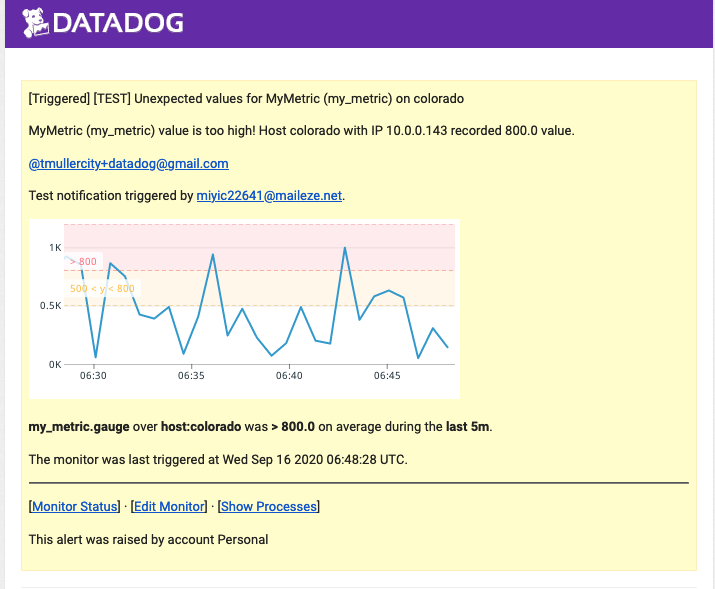

Link to my [Datadog dashboard](https://app.datadoghq.com/event/stream?tags_execution=and&show_private=true&per_page=30&aggregate_up=true&use_date_happened=false&display_timeline=true&from_ts=1469728800000&priority=normal&live=true&is_zoomed=false&status=all&to_ts=1470333600000&is_auto=false&incident=true&only_discussed=false&no_user=false&page=0&bucket_size=10800000)

**Question 1: In your own words, what is the agent?** 

The agent is a program that runs on your hosts and collects system data that you want Datadog to monitor. The agent is highly customizable and can gather, track and notify you of any kind of infrastructure event or trend that is useful to your business. 

**Add tags in the Agent config file and show us a screenshot of your host and its tags on the Host Map page in Datadog**

**Question 2: What is the difference between a timeboard and a screenboard?**

A timeboard is designed with monitoring in mind. A user can customize a timeboard by adding graph wigets to display any data they need. The widgets will always display in the same grid layout and all of the graphs are time-synchronized. Timeboards are useful for examining correlations and troubleshooting your system. 

A screenboard is designed for presentation, it has a custom layout that can include custom images and text elements, as well as all of the graph tools normally provided by the Datadog Agent. The graphs displayed in a screenboard can be from any mix of times. 

**Take a snapshot of your `test.support.random` graph and draw a box around a section that shows it going above 0.90. Make sure this snapshot is sent to your email by using the @notification**

**Create a multi-alert by host that notifies you when your check goes above 0.9 at least once during the last five minutes** 

**This monitor should alert you within 15 minutes. So when it does, take a screenshot of the email that it sends you**

**Since this monitor is going to alert pretty often, you don't want to be alerted when you are out of the office. Set up a scheduled downtime for this monitor that silences it from 7pm to 9am daily**

