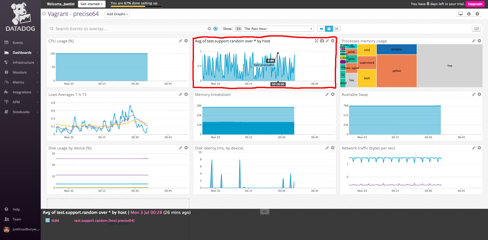

## Answers

### Level 0 (optional) - Setup an Ubuntu VM
> This was particular fun and challenging for me, because I have not used virtual machines before.  I now love having a sandbox to test out different technologies, and if I don't need it anymore, I can just delete the box!  My challenge was being able to set permissions to write to the root level.  Through this I rediscovered the use of `sudo su` and utilizing nano to edit files inline, without an IDE.

### Level 1 - Collecting your Data

- [x] Sign up for Datadog (use "Datadog Recruiting Candidate" in the "Company" field), get the Agent reporting metrics from your local machine.
- [x] Bonus question: In your own words, what is the Agent?
> The agent is a small application that gathers system information, and send it to the Datadog servers for analysis.  It has three parts:  The collector, dogstatsd, and the forwarder.  The collector gathers the system information metrics, dogstatsd receives info from an application, and the forwarder sends it all to Datadog.

- [x] Add tags in the Agent config file and show us a screenshot of your host and its tags on the Host Map page in Datadog.

- [x] Install a database on your machine (MongoDB, MySQL, or PostgreSQL) and then install the respective Datadog integration for that database.

- [x] Write a custom Agent check that samples a random value. Call this new metric: `test.support.random`

```
from checks import AgentCheck
import random

class TestSupportRandomCheck(AgentCheck):
        def check(self, instance):
                self.gauge('test.support.random', random.random())
```

### Level 2 - Visualizing your Data

- [x] Since your database integration is reporting now, clone your database integration dashboard and add additional database metrics to it as well as your `test.support.random` metric from the custom Agent check.
- [x] Bonus question: What is the difference between a timeboard and a screenboard?
> A timeboard shows basic metrics from a machine over synchronized time.  A screenboard is a customized timeboard that can be customized with metrics from different integrations and applications.

- [x] Take a snapshot of your `test.support.random` graph and draw a box around a section that shows it going above 0.90. Make sure this snapshot is sent to your email by using the @notification



### Level 3 - Alerting on your Data

Since you've already caught your test metric going above 0.90 once, you don't want to have to continually watch this dashboard to be alerted when it goes above 0.90 again.  So let's make life easier by creating a monitor.  
- [x] Set up a monitor on this metric that alerts you when it goes above 0.90 at least once during the last 5 minutes

- [x] Bonus points:  Make it a multi-alert by host so that you won't have to recreate it if your infrastructure scales up.  

- [x] Give it a descriptive monitor name and message (it might be worth it to include the link to your previously created dashboard in the message).  Make sure that the monitor will notify you via email.
- [x] This monitor should alert you within 15 minutes. So when it does, take a screenshot of the email that it sends you.

- [x] Bonus: Since this monitor is going to alert pretty often, you don't want to be alerted when you are out of the office. Set up a scheduled downtime for this monitor that silences it from 7pm to 9am daily. Make sure that your email is notified when you schedule the downtime and take a screenshot of that notification.

