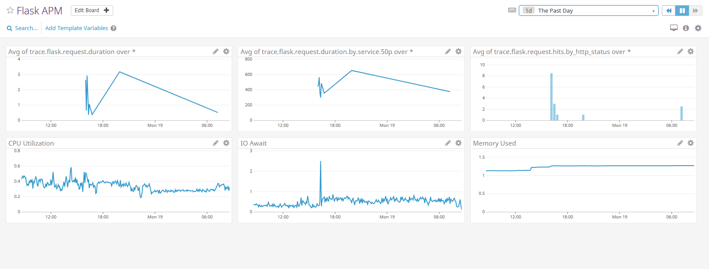

## Collecting Metrics:

When installing the agent, ensure the following ports are not being used by other processes or the agent will not start.

Inbound:

    5000/tcp: port for the go_expvar server
    5001/tcp: port on which the IPC api listens
    5002/tcp: port for the Agent browser GUI to be served
    8125/udp: dogstatsd. Unless dogstatsd_non_local_traffic is set to true. This port is available on localhost:
    8126/tcp: port for the APM Receiver


**Add tags in the Agent config file and show us a screenshot of your host and its tags on the Host Map page in Datadog.**

Tags can be used to organize and filter devices within Datadog. To add tags, you have to add the following lines to the datadog.yaml file located in the /etc/datadog-agent directory. Tags can be key value pairs like in this example or a list of of tags.

<a href="tags_yaml.PNG" title="The view from our roofdeck">
</a>

**Install a database on your machine (MongoDB, MySQL, or PostgreSQL) and then install the respective Datadog integration for that database.**

You first need to create a datadog user with replication rights in your MySQL server
```
sudo mysql -e "CREATE USER 'datadog'@'localhost' IDENTIFIED BY 'LkWJbXrK60r4<mr545qkevCS';"
sudo mysql -e "GRANT REPLICATION CLIENT ON *.* TO 'datadog'@'localhost' WITH MAX_USER_CONNECTIONS 5;"
```
If you'd like to get the full metrics catalog please also grant the following privileges:
```
sudo mysql -e "GRANT PROCESS ON *.* TO 'datadog'@'localhost';"
sudo mysql -e "GRANT SELECT ON performance_schema.* TO 'datadog'@'localhost';"
mysql -u datadog --password='LkWJbXrK60r4<mr545qkevCS' -e "show status" | \
grep Uptime && echo -e "\033[0;32mMySQL user - OK\033[0m" || \
echo -e "\033[0;31mCannot connect to MySQL\033[0m"
mysql -u datadog --password='LkWJbXrK60r4<mr545qkevCS' -e "show slave status" && \
echo -e "\033[0;32mMySQL grant - OK\033[0m" || \
echo -e "\033[0;31mMissing REPLICATION CLIENT grant\033[0m"
```
If you have also granted additional privileges, verify them with:
```
mysql -u datadog --password='LkWJbXrK60r4<mr545qkevCS' -e "SELECT * FROM performance_schema.threads" && \
echo -e "\033[0;32mMySQL SELECT grant - OK\033[0m" || \
echo -e "\033[0;31mMissing SELECT grant\033[0m"
mysql -u datadog --password='LkWJbXrK60r4<mr545qkevCS' -e "SELECT * FROM INFORMATION_SCHEMA.PROCESSLIST" && \
echo -e "\033[0;32mMySQL PROCESS grant - OK\033[0m" || \
echo -e "\033[0;31mMissing PROCESS grant\033[0m"
```
You then need to configure the Agent to connect to MySQL by creating a yaml file in the /etc/datadog-agent/conf.d/mysql.d directory with server and user credentials to access the MySQL database.

```
[root@wordpress mysql.d]# pwd
/etc/datadog-agent/conf.d/mysql.d
[root@wordpress mysql.d]# cat conf.yaml
init_config:

instances:

    - server: 127.0.0.1
      user: datadog
      pass: 'DePp!PeImjh5pgcm9Rfdo6Lg' # from the CREATE USER step earlier
      port: 3306 # e.g. 3306
      options:
          replication: 0
          galera_cluster: 1
          extra_status_metrics: true
          extra_innodb_metrics: true
          extra_performance_metrics: true
          schema_size_metrics: false
          disable_innodb_metrics: false
```


**Create a custom Agent check that submits a metric named my_metric with a random value between 0 and 1000.**

You first have to create two files. The python file which executes the check, and the yaml file that calls the python file. The files must have the same name with the respective file extension. In this example, both files are named checkvalue. Place the yaml file in the /etc/datadog-agent/conf.d directory or a sub directory within this directory with the same name as the check. Place the python custom check file in /etc/datadog-agent/check.d
```
[root@wordpress checks.d]# cat checkvalue.py

from checks import AgentCheck
from random import *

class HelloCheck(AgentCheck):
  def check(self, instance):
    value = randint(1, 1000)
    print value
    self.gauge('my_metric', value)
```
**Change your check's collection interval so that it only submits the metric once every 45 seconds.**

```
[root@wordpress checkvalue.d]# cat checkvalue.yaml
init_config:

instances:
   - min_collection_interval: 45
```

* **Bonus Question** Can you change the collection interval without modifying the Python check file you created?

    Collection interval is controlled by the yaml configuration file and not the Python check file.

## Visualizing Data:

**Utilize the Datadog API to create a Timeboard that contains:**

* Your custom metric scoped over your host.
* Any metric from the Integration on your Database with the anomaly function applied.
* Your custom metric with the rollup function applied to sum up all the points for the past hour into one bucket

The following python file creates a timeboard dashboard with 4 graphs; system.mem.free, mysql.performance.user_time, my_metric, and my_metric summed over an hour intervals.

```
[root@wordpress bin]# cat ~/timeboard.py
from datadog import initialize, api

options = {
    'api_key': '998f056dac677bfb7e86a19a64ffb435',
    'app_key': '8d48aae92a271e70b9a281aa1e497a26c2d1a894'
}

initialize(**options)

title = "Toms Wordpress Timeboard"
description = "Time board for technical exercise"
graphs = [
{
    "definition": {
        "events": [],
        "requests": [
            {"q": "avg:system.mem.free{*}"}
        ],
        "viz": "timeseries"
    },
    "title": "Average Memory Free"
},

{
    "definition": {
        "events": [],
        "requests": [
            {"q": "anomalies(avg:mysql.performance.user_time{*}, 'basic', 2)"}
        ],
        "viz": "timeseries"
    },
    "title": "MySQL CPU Time"
},

{
    "definition": {
        "events": [],
        "requests": [
            {"q": "avg:my_metric{*}"}
        ],
        "viz": "timeseries"
    },
    "title": "Custom Metric"
},

{
    "definition": {
        "events": [],
        "requests": [
            {"q": "avg:my_metric{*}.rollup(sum, 3600)"}
        ],
        "viz": "timeseries"
    },
    "title": "Hourly Sum of Custom Metric"
}]


template_variables = [{
    "name": "wordpress",
    "prefix": "host",
    "default": "host:my-host"
}]

read_only = True
api.Timeboard.create(title=title,
                     description=description,
                     graphs=graphs,
                     template_variables=template_variables,
                     read_only=read_only)

```

The following is a screenshot of the timeboard created through the API with the script listed above.

<a href="timeboard_api.PNG" title="The view from our roofdeck">
</a>

**Once this is created, access the Dashboard from your Dashboard List in the UI:

* Set the Timeboard's timeframe to the past 5 minutes
* Take a snapshot of this graph and use the @ notation to send it to yourself.

<a href="anomaly_graph.PNG" title="The view from our roofdeck">
</a>


* **Bonus Question**: What is the Anomaly graph displaying?

The anomaly graph shows the value collected along with baseline range calculated by historical data. If the the collected value is outside the baseline, the graphline changes colors.

## Monitoring Data


**Create a new Metric Monitor that watches the average of your custom metric (my_metric) and will alert if it's above the following values over the past 5 minutes:**

* Warning threshold of 500
* Alerting threshold of 800
* And also ensure that it will notify you if there is No Data for this query over the past 10m.

<a href="alert_config.PNG" title="The view from our roofdeck">
</a>

**Please configure the monitor's message so that it will:**

* Send you an email whenever the monitor triggers.
* Create different messages based on whether the monitor is in an Alert, Warning, or No Data state.
* Include the metric value that caused the monitor to trigger and host ip when the Monitor triggers an Alert state.

<a href="alert_message_config.PNG" title="The view from our roofdeck">
</a>

* When this monitor sends you an email notification, take a screenshot of the email that it sends you.

<a href="alert_message.PNG" title="The view from our roofdeck">
</a>


* **Bonus Question**: Since this monitor is going to alert pretty often, you don’t want to be alerted when you are out of the office. Set up two scheduled downtimes for this monitor:

  **One that silences it from 7pm to 9am daily on M-F,**
  
  <a href="nightly_maintenance.PNG" title="The view from our roofdeck">
</a>
  
  **And one that silences it all day on Sat-Sun.**
  
  <a href="weekend_maintenance.PNG" title="The view from our roofdeck">
</a>
  
  **Make sure that your email is notified when you schedule the downtime and take a screenshot of that notification.**
  
  <a href="nightly_maintenance_email.PNG" title="The view from our roofdeck">
</a>
  
  <a href="weekend_maintenance_email.PNG" title="The view from our roofdeck">
</a>

## Collecting APM Data:

**Given the following Flask app (or any Python/Ruby/Go app of your choice) instrument this using Datadog's APM solution:**

Since Flask is python based, to instrument the python code for tracing, you simply have to prepend the python command line with the supplied wrapper script, ddtrace-run located in the /opt/datadog-agent/embedded/bin directory. 

```
 ./ddtrace-run python /opt/flaskr/flask_app.py
 
``` 
Alternatively, you can instrument flask application by adding the following lines to the beginning of your python script.

```from ddtrace import patch_all
patch_all()

```


Once you start the application, and load is placed on the application, the trace data will appear in Datadog.

**Provide a link and a screenshot of a Dashboard with both APM and Infrastructure Metrics.**

<a href="flask_apm_dashboard.PNG" title="The view from our roofdeck">
</a>


**Bonus Question**: What is the difference between a Service and a Resource?

A "Service" is the name of a set of processes that work together to provide a feature set. For instance, a simple web application may consist of two services: a single webapp service and a single database service,

A "Resource" is a particular query to a service. For example, for a SQL database, a resource would be the SQL of the query itself like select * from user. 

A "Service" can have many resources 


## Final Question:

**Datadog has been used in a lot of creative ways in the past. We've written some blog posts about using Datadog to monitor the NYC Subway System, Pokemon Go, and even office restroom availability!**

**Is there anything creative you would use Datadog for?**

Datadog is an extensible monitoring platform that can collect data from any source and isn't limited to traditional IT resources to gain insights into critical business processes. Here are a few examples. 

- Query business applications for transaction counts to understand when customers are using the system and if current infrastructure has enough capacity to handle seasonal demands. 

- Monitor IOT devices such as people traffic sensors in retail locations to gain insight on how many customers are in a store and how it translates to sales data like from the previous example.   

- Monitor exchange markets for data such currency exchange rates including Bitcoin to see how exchange rates are impacting foreign sales of services and goods. 
