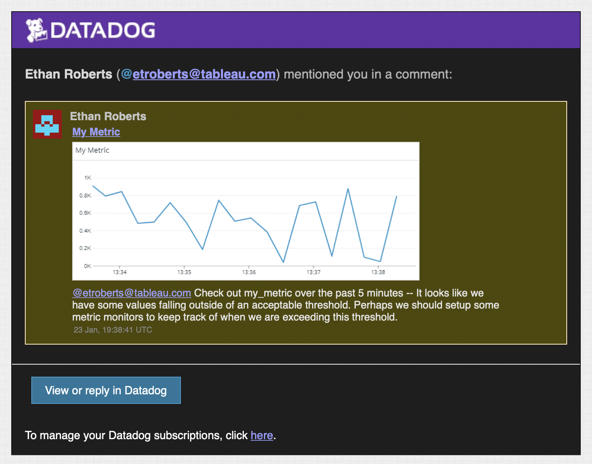
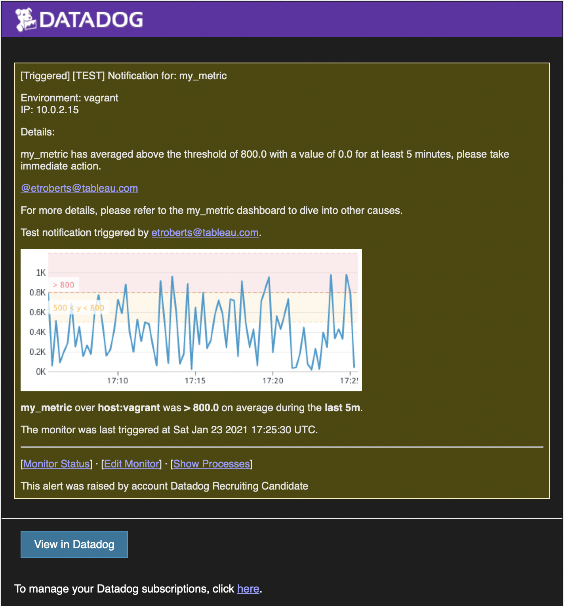
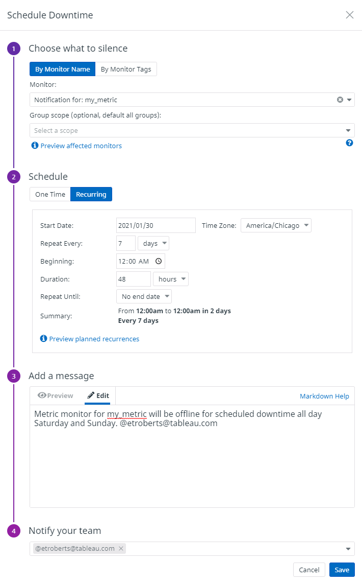
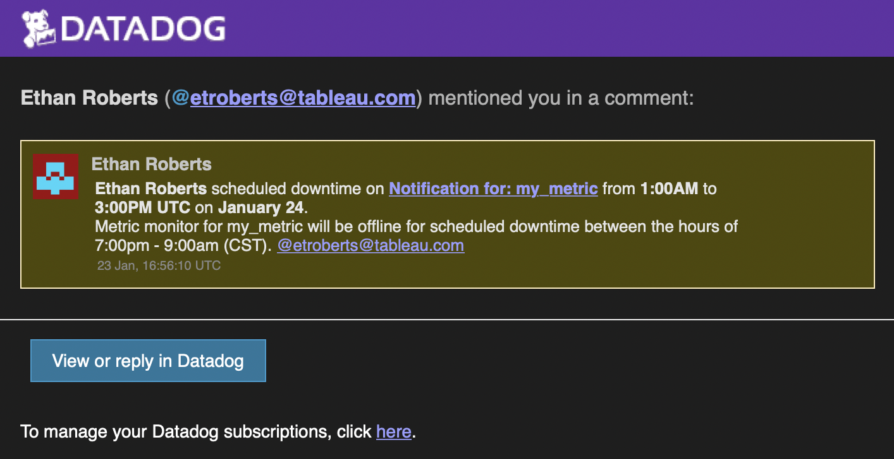

# DataDog Solutions Engineering Technical Exercise

## Foreword

I wanted to provide a brief foreword about my experience with this process and share how excited I am from working through this challenge.  I felt that this challenge had an excellent breadth, and it pushed me to learn a few new things while also getting to experience some of the remarkable depth that DataDog has to offer.  

***

## Prerequisites - Setup the environment

For my agent, I opted to configure the recommended Linux VM using Vagrant.  The machine is running Ubuntu-18.04 and is hosted on my desktop.  Once spun up, I followed the one-step installation instructions [here](https://app.datadoghq.com/account/settings#agent/ubuntu) to install the agent.

Finally, I validated the installation was successful and that the agent was running by using the following agent command:

    $ sudo datadog-agent status

***

## Collecting Metrics

### **Add tags in the Agent config file and show us a screenshot of your host and its tags on the Host Map page in Datadog.**

To add tags, I modified  the `datadog.yaml` configuration file at `/etc/datadog-agent` to include tags for `envirionment` and for `project`. In the `@params tags` section, I included the following:

    tags:
        - environment:sandbox
        - project:se_hiring_example

I then saved the file, waited a few minutes for the environment to update, and navigated to Infrastructure > Hostmap to see the following:

### **Install a database on your machine (MongoDB, MySQL, or PostgreSQL) and then install the respective Datadog integration for that database.**

For the database, I opted to install PostgreSQL and then proceeded to follow the instructions under Integrations > PostgreSQL found [here](https://app.datadoghq.com/account/settings#integrations/postgres). This required creating a datadog user with grants for `pg_montior` and `SELECT ON pg_stat_database` as per:

    > create user datadog with password 'dogspeed';
      grant pg_monitor to datadog;
      grant SELECT ON pg_stat_database to datadog;

I then verified the permissions by running:

    $ psql -h localhost -U datadog postgres -c \
    	"select * from pg_stat_database LIMIT(1);" \
    	&& echo -e "\e[0;32mPostgres connection - OK\e[0m" \
    	|| echo -e "\e[0;31mCannot connect to Postgres\e[0m"

Lastly, I enabled metric collection by creating `/etc/datadog-agent/conf.d/postgres.d/conf.yaml` as follows:

    init_config:

    instances:
        - server: localhost
          port: 5432
          username: datadog
          password: dogspeed

Once completed, I restarted my agent to apply the new configuration and began collecting metrics.  I was then able to view the newly available metrics found under Metrics > Explorer as seen below:

### **Create a custom Agent check that submits a metric named my_metric with a random value between 0 and 1000.**

To create a custom agent check, I followed the article [Writing a Custom Agent Check](https://docs.datadoghq.com/developers/write_agent_check/?tab=agentv6v7) and modified the example provided.

In the folder `/etc/datadog-agent/checks.d/` I created a custom check `custom_my_metric.py` with the following:

    import random                                                                                                                                                
    try:
        from datadog_checks.base import AgentCheck
    except ImportError:
        from checks import AgentCheck

    __version__ = "1.0.0"

    class MyMetricCheck(AgentCheck):
        def check(self, instance):
        # Since we are generating a single random variable, gauge is used for submitting one value                      
        self.gauge('my_metric', random.random()*1000, tags=['metric_submission_type:gauge','env:sandbox', 'project:se_hiring_example'])   

 I noticed in another example provided by the article [Metric Submission: Custom Agent Check](https://docs.datadoghq.com/developers/metrics/agent_metrics_submission/?tab=count) that the tags `env` and `metric_submission_type` were included, so I was sure to add those along with the `project` tag from my previous tagging example to provide more meaningful metadata across this exercise.

 In the folder `/etc/datadog-agent/conf.d/` I created the configuration for the my custom check in `custom_my_metric.yaml` with the following:

    init_config:

    instances: [{}]

Once completed, I restarted the agent and validated that I saw `my_metric` reporting under Metrics > Explorer as seen below:

### **Change your check's collection interval so that it only submits the metric once every 45 seconds.**

To change the `min_collection_interval` so that it only submits every 45 seconds, I followed the instructions found in the previously linked article **Writing a Custom Agent Check** by modifying our config file found at `/etc/datadog-agent/conf.d/custom_my_metric.yaml` to be the following:

    init_config:

    instances:
        - min_collection_inerval: 45

### **Bonus Question: Can you change the collection interval without modifying the Python check file you created?**

Yes, I opted to set the `min_collection_interval` in the configuration file instead of in the python check file.

***

## Visualizing Data

### **Utilize the Datadog API to create a Timeboard**

As a note, I initially searched for a Timeboard API and noticed in the documentation found [here](https://docs.datadoghq.com/dashboards/guide/timeboard-api-doc/?tab=python) that this endpoint was outdated and followed the instructions to instead use the Dashboard endpoint as part of the Datadog API found [here](https://docs.datadoghq.com/api/latest/dashboards/).

To accomplish the tasks in both parts of this exercise, I used the script I wrote found under [`\code\create_dashboard.py`]()

As per the Dashboard endpoint docs linked above, I first went about acquiring my API Key, and my App Key found under Integrations > APIs so that I could define them under the `options` object in my script. I then created a simple script from the code example provided in the docs as a shell for me to define visualizations for the next three sections.

### **Show your custom metric scoped over your host.**

For starters, I learned that all dashboards are made up of widgets, which are individual charts.  There are various types of widgets as documented [here](https://docs.datadoghq.com/dashboards/widgets/) which can present metrics in a variety of visualization types in a dashboard.

For the first widget scoped over `my_metric`, I chose a `timeseries` widget as the data provided by the custom check sends a single data-point every 45 seconds.  To do so, I defined my widget with the following JSON schema:

    {
    'definition': {
        'type': 'timeseries',
        'requests': [
            # q provides the basic query for a particular metric following the schema <METRIC>{HOST:<HOST>}
            # in this case, since we have multiple agents present, this is scoped over the host:vagrant
            {'q': 'my_metric{host:vagrant}'}
        ],
        'title': 'My Metric'
        }
    }

> As a note: I scoped the query to `{host:vagrant}` since I had experimented in previous sections with configuring the agent on my local desktop.  Although not strictly necessary, I did this for all subsequent sections for readability and consistency.  

To create this widget, the object was included in the `widgets` list, which I submitted through the method `api.Dashboard.create()` along with the following parameters:

    title = 'SE Hiring Example Dashboard'
    description = 'A dashboard used to illustrate the Dashboard endpoint in the Datadog API.'
    is_read_only = False
    layout_type = 'ordered'

### **Show any metric from the Integration on your Database with the anomaly function applied.**

Since my PostgreSQL database wasn't in production and many of the metrics either reported no data or a single value, I opted to randomly select the metric `postgresql.max_connections` and followed the documentation found under the [Algorithms](https://docs.datadoghq.com/dashboards/functions/algorithms/) article for the `anomalies()` function.  I again chose the `timeseries` widget for this as I wanted to produce the anomaly banding over time.  The schema for this widget is as follows:

    {
        'definition': {
        'type': 'timeseries',
        'requests': [
            # anomalies() function w/ params METRIC_NAME{*}, '<ALGORITHM>', <BOUNDS>
            # in this case we are performing an anomaly analysis over our postgresql.max_connections metric 
            # with the basic algorithm and a deviation of 3
            {'q': "anomalies(postgresql.max_connections{host:vagrant}, 'basic', 3)"}
        ],
        'title': 'Max Connections Anomalies'
        }
    }

### **Show your custom metric with the rollup function applied to sum up all the points for the past hour into one bucket**

To apply a rollup function, I followed the documentation initially on [Arithmetic Functions](https://docs.datadoghq.com/dashboards/functions/arithmetic/) which led me to the specific docs for the [Rollup Function](https://docs.datadoghq.com/dashboards/functions/rollup/).  This time, since we were just producing a final rollup number, I opted to use the [`query_value`](https://docs.datadoghq.com/dashboards/widgets/query_value/) widget to present the data for the past hour.  The schema for this widget is as follows:

    {
        'definition': {
        'type': 'query_value',
        'requests': [
            # the rollup() function is appended to the end of our query with parameters <METHOD>, <TIME>
            # in this case, we are performing a sum over the time period of 3600 seconds (1 hour)
            {'q': 'my_metric{host:vagrant}.rollup(sum, 3600)'}
        ],
        'title': 'My Metric'
        }
    }

After performing sub-steps 1-3, the [final dashboard](https://p.datadoghq.com/sb/7my7we8zuethfnx9-db6234b107a2374c39d85644a3344e69) I produced looks like this:

> **Note:** In addition to my script `dashboard.py` found in `/hiring-engineers/code`, there is a script `clear_dashboards.py`, which I used as a convenience when testing a variety of dashboard widgets. 

### **Once this is created, access the Dashboard from your Dashboard List in the UI and perform the following:**

### **Set the Timeboard's timeframe to the past 5 minutes**

In the top-right of my dashboard, I selected the timeframe and changed it to "Past 5 Minutes" to produce the following: 

> Note: since the `query_value` widget is set to a 1-hour roll-up, no data is present since there isn't a 1-hour roll-up window present for a 5-minute window.

### **Take a snapshot of this graph and use the @ notation to send it to yourself.**

I opted to take a snapshot of the My Metric widget showing `my_metric` graphed over a time-series since I could not take a snapshot of the full dashboard, and it shared a more interesting set of data than the other widgets.  I optionally could have created a URL for the dashboard and shared it with my user account by navigating to the Dashboard Settings > Configure Sharing and selected "Only specified people'' with my user account specified.  

Below are screenshots of me making the snapshot and the email I received with the snapshot of the data:

**Creation:**

**Receiving:**

**Bonus Question: What is the Anomaly graph displaying?**

The anomaly graph in my dashboard shows actual values against a band of values considered “normal” relative to a standard deviation of 3.  Anything outside of that band would be regarded as an anomaly. As per the docs, I am using the basic algorithm, which performs a simple lagging rolling quartile computation with a small window of the data. As a note, this algorithm works perfectly fine for this simple example since the data likely would never be anomalous in this environment.  However, the Agile or Robust algorithms might be preferable in production as they consider level shifts, long term anomalies, and seasonal trends in the data.

***

## Monitoring Data

### **Create a new Metric Monitor that watches the average of your custom metric (my_metric) and will alert if it’s above the following values over the past 5 minutes:**

- **Warning threshold of 500**
- **Alerting threshold of 800**
- **And also ensure that it will notify you if there is No Data for this query over the past 10m**

Monitors are easy to configure using the UI.  To do so, I navigated to Monitors > New Monitors and selected the option for a Metrics Monitor. Below is a screenshot of the configuration I used to achieve the needed requirements:

### **Please configure the monitor’s message so that it will do the following:**
- **Send you an email whenever the monitor triggers.**
- **Create different messages based on whether the monitor is in an Alert, Warning, or No Data state**  
- **Include the metric value that caused the monitor to trigger and host IP when the Monitor triggers an Alert state.**
- **When this monitor sends you an email notification, take a screenshot of the email that it sends you.**

To accomplish the conditional notifications based upon the value of `my_metric` over the 5-minute window, I followed the [Notifications](https://docs.datadoghq.com/monitors/notifications) docs and produced the following message with conditional formatting:

    Environment: {{host.name}}
    IP: {{host.ip}}

    Details:

    {{#is_alert}}
    my_metric has averaged above the threshold of {{threshold}} with a value of {{value}} for at least 5 minutes, please take immediate action.
    {{/is_alert}} 

    {{#is_warning}}
    my_metric has averaged above the threshold of {{warn_threshold}} with a value of {{value}} for at least 5 minutes, please review to ensure optimal performance.
    {{/is_warning}} 

    {{#is_no_data}}
    my_metric has not reported data in the past 10 minutes.  Please check if the service is still online.
    {{/is_no_data}} 

    For more details, please refer to the my_metric dashboard to dive into other causes.

     @etroberts@tableau.com

As a result, the monitor produces the following three conditional alert states:

1. **Alert threshold:**

2. **Warning threshold:**

3. **No data threshold:**

### **Bonus Question: Since this monitor will alert pretty often, you don’t want to be alerted when you are out of the office. Set up two scheduled downtimes for this monitor:**
- **One that silences it from 7 pm to 9 am daily on M-F**
- **And one that silences it all day on Sat-Sun.**

I navigated to Monitors > Manage Downtime in the UI to schedule downtime and selected the option to "Schedule Downtime."  I then configured the first set of downtime with the following:

For the second window of downtime, I similarly created another schedule with the following configuration:

Lastly, here are some screenshots of the alerts I configured to notify myself with:

**Weeknight downtime**

**Weekend downtime**

***

## Collecting APM Data

For this section, the aim is to implement the [Datadog APM solution](https://docs.datadoghq.com/tracing/) to instrument the provided flask app.  Since this is written in Python, I followed the recommended [python quickstart guide](https://app.datadoghq.com/apm/docs?architecture=host-based&language=python) that was recommended by the [APM docs](https://docs.datadoghq.com/tracing/setup_overview/setup/python/?tab=containers).  I prepared my environment for the Flask app by installing Flask and creating `flask-app.py` with the provided code.

The first thing I did to instrument my app was to install ddtrace:

    $pip install ddtrace

I then used the provided configuration snippet generator to produce the following command to start my app:

    $ DD_SERVICE="flask-app" DD_ENV="sandbox" DD_LOGS_INJECTION=true DD_TRACE_SAMPLE_RATE="1" DD_PROFILING_ENABLED=true ddtrace-run python flask-app.py

Since this provides only the basics for APM instrumentation, I opted to dig into some of the suggested further reading for [Python Runtime Metrics](https://docs.datadoghq.com/tracing/runtime_metrics/python/) and modified my startup command to include the following:

    DD_RUNTIME_METRICS_ENABLED=true

This change enabled me to access a more comprehensive set of system-level metrics for my application’s run-time performance.

After starting my application and validating that I was indeed getting metrics like `runtime.python.cpu.percent`, I continued to dive deeper into the possibilities of instrumentation and stumbled across an article covering [Python Custom Instrumentation](https://docs.datadoghq.com/tracing/setup_overview/custom_instrumentation/python/?tab=decorator) which enabled me to define traces for specific endpoints of my flask app like `/api/apm` and `/api/trace`.  I did so by declaring the following in `flasky-app.py`:

    @app.route('/api/apm')
    @tracer.wrap('flask-request', service='flask-app', resource='APM', span_type='web')
    def apm_endpoint():
        return 'Getting APM Started'

    @app.route('/api/trace')
    @tracer.wrap('flask-request', service='flask-app', resource='TRACE', span_type='web')
    def trace_endpoint():
        return 'Posting Traces'

Now that I have instrumented my application for system-level and endpoint-level traces, I was able to pull together a dashboard of APM and Infrastructure metrics as seen [here](https://p.datadoghq.com/sb/7my7we8zuethfnx9-c3c64a55e5c789c6542a6fa97fdc34c8) or below:

***

## Final Question

**Datadog has been used in a lot of creative ways in the past. We’ve written some blog posts about using Datadog to monitor the NYC Subway System, Pokemon Go, and even office restroom availability!**

**Is there anything creative you would use Datadog for?**

As an SE at Tableau, I wrote a custom Node.js application which embedded an SE time-tracking dashboard and enabled the end user to quickly and conveniently create a Salesforce record for logging their customer-facing time with meeting details, notes, stakeholders, etc.  This application quickly grew in popularity amongst the SEs and is currently deployed to over 800 people globally. 

 While this app has certainly served its purpose, it is architected around 3 different APIs, its own custom internal API service, and a data visualization element.  It would be very helpful to intrument it with Datadog for continuous monitoring and detailed traces for when things go wrong.  As it stands today, I am only made aware of downtime or unexpected behavior from interacting with end users over Slack.  Even with this level of reporting, I only get as much information about what is wrong as the end user provides (oftentimes getting little to no system-level details).  Not only would Datadog's platform help me keep a pulse on the status of the system and its various components, it would enable me to dive into specific end-user issues at a system level quickly and easily to identify the problem. Additionally, I could enable my end users with real time updates on service availability and performance to reduce the amount of messages I receive overall.

