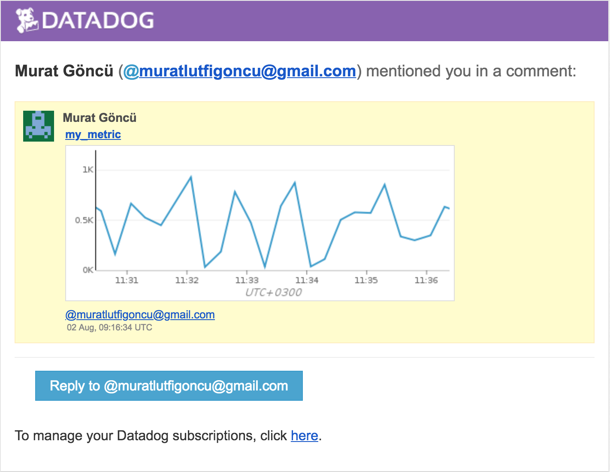
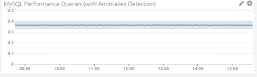
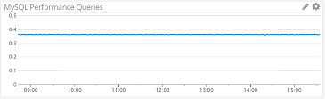
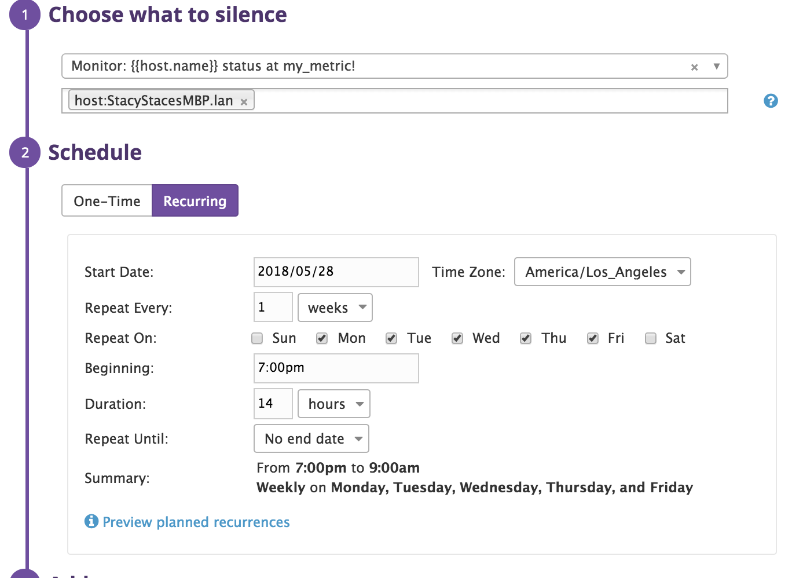

# Datadog Solutions Engineer Technical Exercise for Henry Doan

# What is Datadog?

Your servers, your clouds, your metrics, your apps, your team. Together.

- With turn-key integrations, seamlessly aggregate metrics and events 
across the full devops stack 
- Monitor, troubleshoot, and optimize application performance
- Build real-time interactive dashboards
- Give visibility to system events and metrics across teams	
- Get alerted on critical issues
- Instrument your apps with performance monitoring, write new integrations
	
Learn More: [https://www.datadoghq.com/](https://www.datadoghq.com/) 

# Create a Virtual Machine

You can utilize any OS/host that you would like. Click [here](https://www.vagrantup.com/intro/getting-started/) 
for instructions to create an Ubuntu 12.04 VM using Vagrant with VirtualBox. 

- To connect to the VM from your local machine, type `vagrant ssh`
- To exit the VM, type `exit`

Optionally, you can change the hostname within the VM from the default 
`precise64`. This can be useful in distinguishing your VMs in Datadog if you 
create more than one for testing.  Be sure to run `vagrant init hashicorp/precise64` 
from different directories on your local machine for each VM so you can 
confidently `vagrant destroy` individual VMs without impacting the others.

To change the hostname with the VM:

- Run `sudo hostname <new_hostname>`.  
- Change hostname values found in `/etc/hosts/` and `/etc/hostname`

### Installing the Datadog Agent

From the Datadog UI, navigate to Integrations > Agent 
- or go here: https://app.datadoghq.com/account/settings#agent


Select your operating system and Agent installation instructions will be provided:


# Collecting Data

### Adding Tags for a Host

To add tags for a host, update the Agent config file `/etc/dd-agent/datadog.conf`:

```
### Set the host's tags (optional)
tags: env:prd, category:tech, owner:hvd
```

*Tags for example host #1:*

<br><br>
*Different tags for example host #2* 


### Setup Datadog Integration for MySQL

Follow instructions [here](https://www.digitalocean.com/community/tutorials/how-to-install-mysql-on-ubuntu-14-04)
to install MySQL on Ubuntu.  Afterwards, confirm MySQL instance is running:

```
$ service mysql status
mysql start/running, process 809
$
```

In Datadog UI, navigate to [Integrations](https://app.datadoghq.com/account/settings#integrations)
and search for "MySQL".  Click "Install", then follow instructions under
"Configuration" tab.  

Once complete, MySQL metrics will be available in Datadog.  Navigate to
[Metrics Summary](https://app.datadoghq.com/metric/summary) and search 
for "mysql" to see newly available metrics:


### Configure a Custom Agent Check

Follow instructions [here](https://docs.datadoghq.com/agent/agent_checks/) 
to create a custom Agent check.

Here's an example of a custom Agent check (`/etc/dd-agent/checks.d/my_check.py`, 
GitHub link [here](https://github.com/henrydoan/hiring-engineers/blob/master/my_check.py))
that submits a metric named `hvd.my_metric` with a random value between 
0 and 1000:

```python
from random import *
from checks import AgentCheck

class RandomNum(AgentCheck):
    def check(self, instance):
        random_num = randint(1, 1000)    # Pick a random number between 1 and 1000.
        self.gauge('hvd.my_metric', random_num, tags=['my_metric'])

if __name__ == '__main__':
    check, instances = HTTPCheck.from_yaml('/etc/dd-agent/conf.d/my_check.yaml')
    check.check(instance)
    print 'Metrics: %s' % (check.get_metrics())
```
Here's the corresponding yaml file (`/etc/dd-agent/conf.d/my_check.yaml`, GitHub
link [here](https://github.com/henrydoan/hiring-engineers/blob/master/my_check.yaml)):

```yaml
init_config:
      min_collection_interval: 45
instances:
      [{}]
```

### Bonus Question

> Can you change the collection interval without modifying 
the Python check file you created?

> **Answer:** Yes, simply set a `min_collection_interval` value in the associated 
yaml file for your check file.

```yaml
init_config:
      min_collection_interval: 45
...
```

# Visualizing Data

### TimeBoards 

["Henry's Specialty Timeboard"](https://app.datadoghq.com/dash/563327/henrys-specialty-timeboard?live=false&page=0&is_auto=false&from_ts=1518450156022&to_ts=1518474891505&tile_size=m&tv_mode=true)
displays: 
- `hvd.my_metric` custom metric scoped over the host it's configured on
- `hvd.my_metric` with the rollup function applied
- `mysql.performance.queries` metric with anomalies function applied


### Customize Views in Code

The TimeBoard above was created via a [custom script](https://github.com/henrydoan/hiring-engineers/blob/master/hvdTimeboard.py)
leveraging the Datadog API (more details [here](https://docs.datadoghq.com/api/?lang=python#create-a-timeboard)). 

```python
from datadog import initialize, api

options = {
    'api_key': 'd81b4c03c052be98c0b368cf8606ba68',
    'app_key': '67f28e01e42e14f2273b8cfaca23ea88921574d5'
}

initialize(**options)

title = "Henry's Specialty Timeboard"
description = "Timeboard for Henry Doan's recruiting candidate exercise"
graphs = [{
	"definition": {
		"viz": "timeseries",
		"requests": [
       		  {
               		"q": "avg:hvd.my_metric{host:precise64}",
               		"type": "line",
               		"style": {
                       		"palette": "dog_classic",
                       		"type": "solid",
                       		"width": "normal"
               		},
               		"conditional_formats": [],
               		"aggregator": "avg"
       		  }
        	],
   	},
    	"title": "hvd.my_metric Value (Random Number 1-1000)"
},
{
   	"definition": {
  		"viz": "timeseries",
  		"requests": [
    		  {
      			"q": "avg:hvd.my_metric{host:precise64}.rollup(sum, 3600)",
      			"type": "line",
      			"style": {
        			"palette": "dog_classic",
        			"type": "solid",
        		"width": "normal"
      		  	},
      		"conditional_formats": [],
      		"aggregator": "avg"
    		  }
  		],
	},
	"title": "Sum of hvd.my_metric Over 1 Hour"
},
{
        "definition": {
                "viz": "timeseries",
                "requests": [
                  {
			"q": "anomalies(avg:mysql.performance.queries{host:precise64}, 'adaptive', 2)",
                        "type": "line",
                        "style": {
                                "palette": "dog_classic",
                                "type": "solid",
                        	"width": "normal"
                        },
                "conditional_formats": [],
                "aggregator": "avg"
                  }
                ],
        },
        "title": "MySQL Performance Queries (with Anomalies Detection)"
}]

read_only = True
api.Timeboard.create(title=title,
                     description=description,
                     graphs=graphs,
                     read_only=read_only)
```

### On-Demand Time Range Selection

To specify a time range you're interested in, simply click-and-drag
that section of the graph:


The TimeBoard's time range will automatically update with the custom 
time range:  


### Snapshots & Annotations

To create an annotation, click the "Snapshot" icon...


...then annotate away:



Here's the email notification the user would receive:


### Bonus Question

> What is the Anomaly graph displaying?

> **Answer:** The metric value over time with a highlighted area 
indicating expected value range. Values outside of the "bounds" would 
be considered an anomaly. 

*with anomalies function applied:*


*without anomalies function:*



# Monitoring Data

### Metric Monitor

In this example, we create a new Metric Monitor that watches the average 
of the custom metric `hvd.my_metric` and will alert if it's above the 
following values over the past 5 minutes: 

- Warning threshold of 500
- Alerting threshold of 800


Configure the monitor to notify if there is No Data for this query over 
the past 10 minutes: 


### Metric Monitor's Notification Message:

Let's configure the monitor's message to:

- <span style="color:green">Send email</span> whenever the monitor triggers.
- <span style="color:blue">Create different messages</span> based on whether 
the monitor is in an Alert, Warning, or No Data state. 
- <span style="color:orange">Include the metric</span> that caused the monitor 
to trigger <span style="color:orange">and host ip</span> when the monitor 
triggers an Alert state. 


Here's an email notification from the metric monitor:


### Bonus Question

> Since this monitor is going to alert pretty often, you don't want to 
be alerted when you are out of the office. Set up two scheduled 
downtimes for this monitor. 

>- One that silences it from 7pm to 9am daily on M-F
>- One that silences it all day on Sat-Sun

To create new downtime schedules, navigate to Monitors > Manage Downtime:
- or go here: https://app.datadoghq.com/monitors#/downtime


Click "Schedule Downtime", then configure downtime as desired:




*Downtime schedule #1:*


*Downtime schedule #2:*


>- Make sure that your email is notified when you schedule the downtime 
and take a screenshot of that notification. 

*Downtime schedule email notifications:*


# Collecting APM Data

Datadog’s integrated APM tool eliminates the traditional separation 
between infrastructure and application performance monitoring. This not 
only provides greater visibility, but also allows you to see the 
relationship between application code and the underlying infrastructure. 

Curious? Follow instructions [here](http://pypi.datadoghq.com/trace/docs/#module-ddtrace.contrib.flask)
to instrument a Flask application with trace middleware.

Given a sample Flask app, here's the end result with trace middleware 
instrumentation added:

```python
from flask import Flask
import logging
import sys

from ddtrace import tracer
from ddtrace.contrib.flask import TraceMiddleware

# Have flask use stdout as the logger
main_logger = logging.getLogger()
main_logger.setLevel(logging.DEBUG)
c = logging.StreamHandler(sys.stdout)
formatter = logging.Formatter('%(asctime)s - %(name)s - %(levelname)s - %(message)s')
c.setFormatter(formatter)
main_logger.addHandler(c)

app = Flask(__name__)

# instrumenting DD APM for Flask
traced_app = TraceMiddleware(app, tracer, service="testFlaskApp", distributed_tracing=False)

@app.route('/')
def api_entry():
    return 'Entrypoint to the Application'

@app.route('/api/apm')
def apm_endpoint():
    return 'Getting APM Started'

@app.route('/api/trace')
def trace_endpoint():
    return 'Posting Traces'

if __name__ == '__main__':
    app.run()
```
> sample Flask app "end result" GitHub [link](https://github.com/henrydoan/hiring-engineers/blob/master/testFlaskApp.py)

> sample Flask app "original" GitHub [link](https://github.com/henrydoan/hiring-engineers/blob/master/testFlaskApp_original.py)


The ["testFlaskApp Dashboard"](https://app.datadoghq.com/dash/563672/testflaskapp-dashboard?live=false&page=0&is_auto=false&from_ts=1518132562248&to_ts=1518133561609&tile_size=m&tv_mode=true) 
includes both APM and Infrastructure metrics:


### Bonus Question

> What is the difference between a Service and a Resource?

> **Answer:** A "Service" is the name of a set of processes that work 
together to provide a feature set. A "Resource" is a particular query to 
a service. 


# Final Question

> Datadog has been used in a lot of creative ways in the past. We’ve 
written some blog posts about using Datadog to monitor the NYC Subway 
System, Pokemon Go, and even office restroom availability! 

> Is there anything creative you would use Datadog for?

I'm a devoted record collector/vinyl junkie and my favorite activity is 
listening to music. 


For my creative project, I created custom Datadog metrics that represent 
my favorite artists' global popularity. Using the web API from 
[last.fm](https://www.last.fm/api), I retreive each artist's "listeners" 
and "playcount" data, sending them in as custom metrics.

My `artistPopularityMetricLastFM.py` script executes from a cron job that runs every 5 minutes:

```
$ crontab -l
*/5 * * * * /usr/local/bin/python3 /home/vagrant/artistPopularityMetricLastFM.py >/dev/null 2>&1
$
```

Here's the code (GitHub [link](https://github.com/henrydoan/hiring-engineers/blob/master/artistPopularityMetricLastFM.py)):

```python
import json 
import requests

from datetime import datetime,timedelta
from datadog import initialize, api

# initialize datadog api connection parameters
options = {
    'api_key' : 'd81b4c03c052be98c0b368cf8606ba68',
    'app_key' : '122313caaf83fb325fa1aa0482f2ab9d9d3e6125'
}
initialize(**options)

# send metrics to Datadog
def ddPost(mymetric,myvalue,mytags,ts):
    api.Metric.send(metric=mymetric, points=(ts/1000, myvalue), tags=mytags)

# get current epoch timestamp
def getEpoch():
    end_time = datetime.now()
    end_time = end_time - timedelta(seconds=end_time.second,microseconds=end_time.microsecond)
    tdelta = timedelta(seconds=60)
    start_time = end_time - tdelta
    start_epoch = int(start_time.strftime('%s')) * 1000
    end_epoch = int(end_time.strftime('%s')) * 1000
    return(start_epoch, end_epoch)

# Datadog API key
API_KEY = "0108d1afcd40db5dbe8e71f528c18c58"

# last.fm API 
api_root = "http://ws.audioscrobbler.com/2.0/"
api_artist_getInfo = "?method=artist.getinfo"
api_format = "&format=json"
api_key = "&api_key=" + API_KEY

artists = [
	'Anderson%20.Paak',
	'Bill%20Evans',
	'Bruno%20Mars',
	'Cyhi%20the%20Prynce',
	'Jay-Z',
	'John%20Coltrane',
	'Kanye%20West',
	'Kendrick%20Lamar',
	'Miles%20Davis',
	'Nina%20Simone',
	'Thelonious%20Monk'
]

# loop through list of artists
for a in artists:
	# build web API URL per artist
	url = api_root + api_artist_getInfo + api_key + api_format + '&artist=' + a
	#print (url)

	r = requests.get(url) 
	try:
		r.raise_for_status()
	except requests.exceptions.HTTPError as e:
		# status was non-200
		print ("Error: " + str(e))
		break

	data = json.loads(r.content)

	if data is not None and 'artist' in data:

		# get artist's name
		artist_name = data['artist']['name']
		print ("artist name: " + artist_name)

		# get artist's playcount
		artist_playcount = data['artist']['stats']['playcount']
		print ("playcount: " + artist_playcount)

		# get artist's listeners count:
		artist_listeners = data['artist']['stats']['listeners']
		print ("listeners: " + artist_listeners)

		# send data to Datadog

		# get current epoch timestamp
		interval = getEpoch()
		start_time = interval[0]
		end_time = interval[1]

		# tag metric with artist's name 
		ddtags = "artist:" + artist_name

		ddmetric="hvd.listeners"
		ddPost(ddmetric, artist_listeners, ddtags, start_time)

		ddmetric="hvd.playcount"
		ddPost(ddmetric, artist_playcount, ddtags, start_time)
	else:
		print ("Warning: data object is empty, not sending metrics to Datadog")
```

I was then able to create a TimeBoard [("last.fm Artist Popularity Dashboard")](https://app.datadoghq.com/dash/564940/lastfm-artist-popularity-dashboard?live=true&page=0&is_auto=false&from_ts=1518453184243&to_ts=1518467584243&tile_size=m&tv_mode=true)
that shows each artists' current popularity data as well as change over 
time: 


Highlights of this project specific to Datadog features include:
- Sending metrics via Datadog API instead of custom Agent check (https://docs.datadoghq.com/api/?lang=python#post-time-series-points)
- Utilizing a Top List visualization
- Defining new custom metrics (`hvd.listeners` and `hvd.playcount`)
- Allowing Datadog to automatically handle tag values that include 
spaces (artist names) 
- Using Timeshift function in combination with metric formula 
functionality (calculate the delta in popularity metrics over 
time). 


  
>Note: I was under the impression that last.fm popularity data would 
change frequently, thus generate "exciting" graphs. Unfortunately, I 
discovered over the course of this short project that last.fm only 
refreshes data semi-weekly. Thus the data is fairly static over many 
days. 


 


