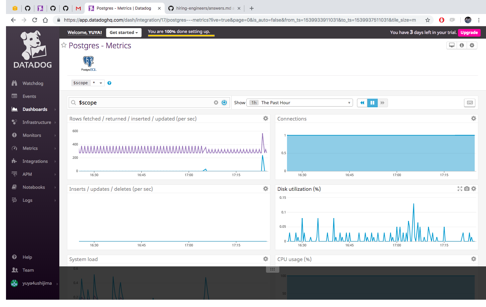
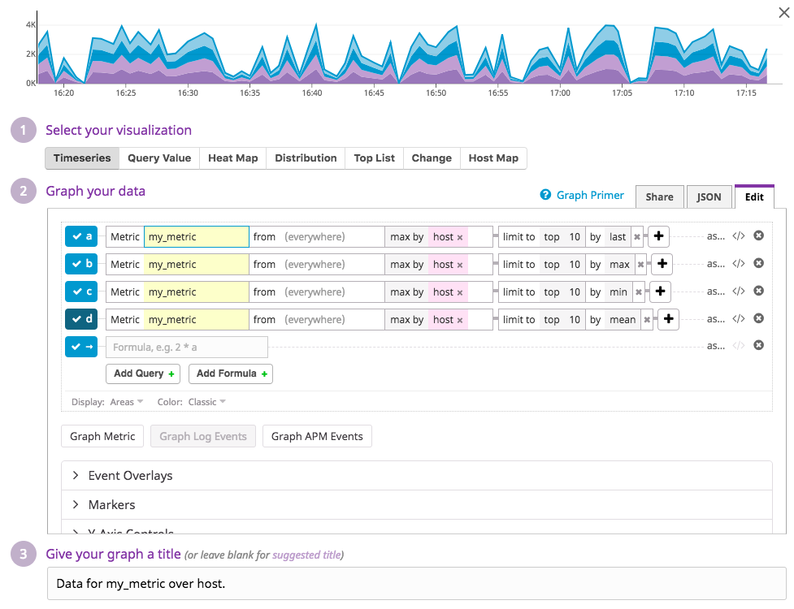

# Answer for Recuiting Challenge
I took the docker-containerized approach to complete the Challenge.  
You can reproduce the environment by docker-compose with a deploy script.  

```DD_API_KEY="<DatadogAPIKEY>" YOUR_LOCAL_IP="<LOCAL_HOST_IP>" sh deploy_local.sh```  

The [deploy_local.sh](deploy_local.sh) launches four containers (web, app, db, and datadog-agent), which work with all the configs mentioned in the answer.  

After launching, access http://localhost to see the app working.   
  ** Containers cannot cooperate when`YOUR_LOCAL_IP` = 127.0.0.1, so it shuold be your real private IP like 192.168.0.5 or 10.4.167.168.  
  ** Docker host ip for APM is configured as 172.17.0.1. Export `Docker_Default_GW` if needed.  

---
# 1. Collecting Metrics
### Tags in the Agent config file and a screenshot of the Host Map page.
* [x] Agent cofing file: [datadog.yaml](datadog/datadog.yaml)  
```yaml
tags:
  - project:testweb
  - env:dev
```  
* [x]  Screenshots (Host Map)  
    

### Datadog Agent integration for postgresql.

* [x] Agent config file: [postgres.d/conf.yaml](datadog/conf.d/postgres.d/conf.yaml)  
```yaml
init_config:

instances:
  - host: ${DB_HOST}
    port: 5432
    username: postgres
    password: Test1Pass
    dbname: testweb
    tags:
      - project:testweb
      - role:db
      - env:dev
```  
* [x] Postgresql integration on the Integration Page  
    
  


### A custom Agent check with a random value between 0 and 1000.

* [x] Agent check python: [test_check.py](datadog/checks.d/test_check.py)  
```python
__version__ = "1.0.0"

from checks import AgentCheck
import random
class HelloCheck(AgentCheck):
    def check(self, instance):
        some_num = random.randint(0,1001) #Return random integers from low (inclusive) to high (exclusive)
        self.gauge('my_metric', some_num, tags=['test_check'])
```

### Configure Agent check's interval to 45 seconds without modifying the Python check file
* [x] Agent check config : [test_check.yaml](datadog/conf.d/test_check.yaml)  
```yaml
init_config:

instances:
  - min_collection_interval: 45
```
* [x] Screenshots  
    

---
# 2. Visualizing Data:
###  To create a Timeboard that contains:
* [x] My custom metric scoped over host.  
  ```json
  { "definition": {
        "events": [],
        "requests": [
            {"q": "top(max:my_metric{host:i-0ee8948d804858200} by {host}, 10, 'last', 'desc'), top(max:my_metric{host:i-0ee8948d804858200} by {host}, 10, 'max', 'desc'), top(max:my_metric{host:i-0ee8948d804858200} by {host}, 10, 'min', 'desc'), top(max:my_metric{host:i-0ee8948d804858200} by {host}, 10, 'mean', 'desc')"}
        ],
        "viz": "timeseries"
    },
    "title": "Data for my_metric over host."
  }
  ```  
    

* [x] The metric from the Integration on Database with the anomaly function applied.  
  ```json
  { "definition": { 
        "events": [],
        "requests": [
            {"q": "anomalies(avg:postgresql.buffer_hit{role:db}, 'basic', 2)"}
        ],
        "viz": "timeseries"
    },
    "title": "Avg of postgresql.buffer_hit w/ anomaly function applied"
  }
  ```  
    

* [x] My custom metric with the rollup function applied to sum up all the points for the past hour into one bucket  
  ```json
  { "definition": {
        "events": [],
        "requests": [
            {"q": "avg:my_metric{*}.rollup(sum, 3600)"}
        ],
        "viz": "timeseries"
    },
    "title": "Rollup of my_metric for past hour"
  }
  ```  
    
  
* [x] The whole script to create the Timeboard  
  [create_my_custom_timeboard,py](datadog/scripts/create_my_custom_timeboard.py) 

### Dashboard screenshots
* [x] Set the Timeboard's timeframe to the past 5 minutes  
    

* [x] A snapshot of the graph  that mentions myself.  
    

* [x] What is the Anomaly graph displaying? (Bonus)  
  ```text
  The anomaly graph displays two kinds of values; "natural" and "abnormal."
  "Natural" values fall within the usual range based on the culmitive data flow.
  "Abnormal" values are judged as warning because it doesn't fit in the routine data flow.
  In my case above, the anomaly graph displays when the postgres buffer hit is extremly high or low.
  ```  
---
# 3. Monitoring Data
### Metric Monitor settings for my custom metric.
* [x] "Warning" with threshold of 500 over the past 5 minutes.  
    
* [x] "Alert" with threshold of 800 over the past 5 minutes.  
    
* [x] Notify myself if there is No Data over the past 10 minutes.  
    

### Metric Monitor message for my custom metric.

* [x] Send you an email whenever the monitor triggers.  
    
  
* [x] Create different messages depending on the monitor status.  
    

* [x] The metric value and the host ip in the Alert message.  
    

* [x] A screenshot of the email notification.  
    
    
    

###  Two scheduled downtimes for this monitor: (Bonus)
* [x] One that silences it from 7pm to 9am daily on M-F.  
    
* [x] The other that silences it all day on Sat-Sun.  
    
* [x] A screenshot of the email notification.   
    

---
# 4. Collecting APM Data:
### My application settings for APM
```python
#Your code here
```
```python
#Your code here
```
### Fully instrumented application 
  [Application](app)  
  [Dockerfile](Dockerfile)  
  [docker-compose](docker-compose.yml)  

### Difference between a Service and a Resource (Bonus)
```text

```
### A screenshot of a Dashboard with both APM and Infrastructure Metrics.
    

---
# 5. Final Question:
### Is there anything creative you would use Datadog for?
```text
#Your Sentence here
```
  [full_text](screenshots/5-answer.txt)  

---
# Extra. Various Integrations:
I have implemented the following integrations for the extra work.  
* [x] AWS  
    
* [x] Nginx  
    
* [x] Slack  
    
* [x] Jira  
    
* [x] Docker  
    


Happy when you could vote Yes for me.
