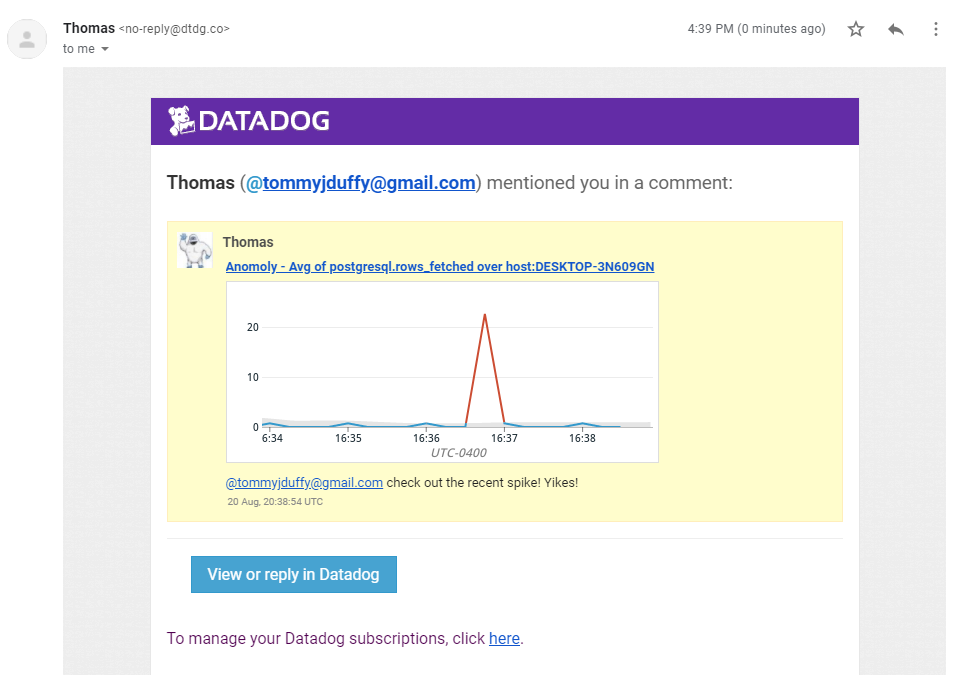
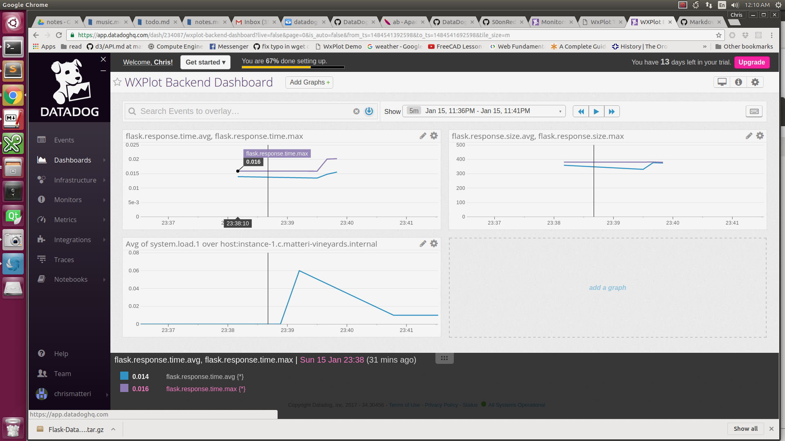

# Support Engineer Hiring Challenge
Author: Chris Matteri

**If you aren't using a Markdown previewer, please view answers.pdf**

**In your own words, what is the Agent?**

The Agent is an application that runs on a host that is being monitored. It collects data from the system, and typically also from various applications and services. The Agent transmits the data, which consists of metrics and events, to Datadog's servers to be archived, processed, and displayed.

## Host Map
My host is a [Cloud 9](https://c9.io) Workspace, which is a Docker container.


## Random Agent check
Creating a custom Agent check required two files, random.py and random.yaml, which were placed in /etc/dd-agent/checks.d/ and /etc/dd-agent/conf.d/, respectively. A gauge was the most appropriate metric type for sampling a random signal at a fixed sample rate.

```python
# random.py
import random
from checks import AgentCheck

class RandomCheck(AgentCheck):
    def check(self, instance):
        self.gauge('test.support.random', random.random())
```

```yaml
# random.yaml
init_config:

instances:
    [{}]
```

## Postgres/Random Metric Dashboard

[Postgres dashboard with random data metric](https://app.datadoghq.com/dash/234086/postgres-overview-with-random-data)


**What is the difference between a timeboard and a screenboard?**

Timeboards have a rigid grid structure, and all of their graphs show the same interval of time. This makes them useful for viewing the relationship of many metrics in a certain time period. Screenboards are more flexible. Graphs on a screenboard can have different sizes and timespans. Screenboards can also show event streams, images, and even custom HTML. They allow a variety of heterogenous information to be viewed immediately in a single location.

I emailed myself this snapshot with an @ notification:


## High Random Value Monitor
I received an email when my high value monitor was triggered:

I also received an email when I scheduled downtime:


## Instrumenting a Flask App with Dogstatsd
To learn more about Datadog, I decided to instrument a web app I created. I wanted to know how much time the backend required to process requests. A Flask extension already exists (flask-datadog) that records these metrics and sends them to dogstatsd, so doing this should have been trivial. However, there was an error in its example usage ([I opened an issue and it was fixed](https://github.com/50onRed/flask-datadog/issues/10)), that made it send data to a non-existent host. Due to the lack of acknowledgements in the UDP statsd protocol, using a nonexistent host didn't cause any errors, so I had a fun time figuring out what was wrong!

[WXPlot backend dashboard](https://app.datadoghq.com/dash/234087/wxplot-backend-dashboard)
