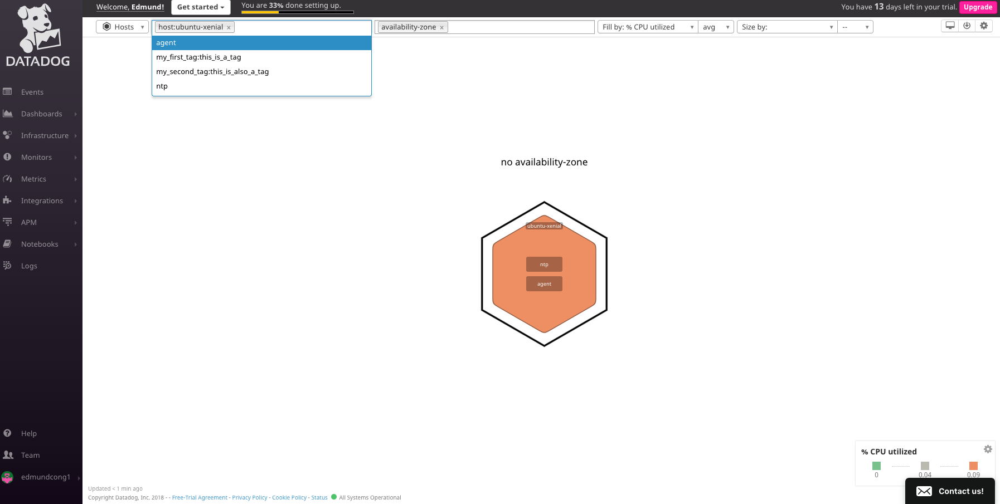

# Answers.md

Alright Reader buckle in because you're about to bear witness to my magnum opus AND learn how to use DataDog. If I've done my job right then by the end of this you'll find yourself a *big dog* at DataDog. Let's dive right into this

##1. Prerequisites 

###1.2 Setting up VirtualBox and Vagrant

Before we delve into using DataDog we're going to need to set up a fresh virtual machine environment. This guide will be using Vagrant with Ubuntu `v.16.04`. If you've got a different virtual machine installed congratulations you've tripped at the first hurdle. Anyway, battling on:

1. Download VirtualBox for [OS X hosts](https://www.virtualbox.org/wiki/Downloads)
2. Install the .dmg
3. Follower the installer
4. Download Vagrant for [macOS](https://www.vagrantup.com/downloads.html)
5. Follower the installer
6. Open up your terminal
7. run `vagrant -v` 

8. We can now create a new Vagrant environment for Ubuntu 16.04. Run the follower: `vagrant init ubuntu/xenial64`
9. Let's try starting our vagrant environment: `vagrant up`

Congratulations! You have a working virtual machine. Try ssh'ing into it with `vagrant ssh`. Alternative you can destroy it with `vagrant destroy`. The remainder of this guide will take place within the Vagrant environment so go ahead and make sure you've run `vagrant ssh`!

###1.3 DataDog sign up

1. Head over to [DataDog to sign up](https://app.datadoghq.com/signup)
2. Enter *Datadog Recruiting Candidate* in the *Company* field
3. Once you arrive at the *Agent Setup* page, click *Ubuntu*
4. Follow the instructions on the page
5. The DataDog Agent report will take around a minute or two to complete so while that's toiling away maybe go make yourself a cup of- oh cool okay it's done.
6. Click Finish
7. We can make our life easier down the line by sorting our group permissions now. Let's create a new group:`sudo groupadd ddGroup`
8. Now let's add our vagrant user and dd-agent to it: run `sudo usermod -a -G ddGroup ubuntu` and `sudo usermod -a -G ddGroup dd-agent`
9. Finally let's see the permissions for our datadog-agent directory. Run `sudo chgrp -R ddGroup /etc/datadog-agent/` to change the group ownership to our new group, and then run `sudo chmod -R 770 /etc/datadog-agent/` to only allow users within our group to read,write, and execute it

##2. Collecting Metrics 
###2.1 Tags

A *tag* enables for finer granularity of your metrics. For instance you could group the CPUs of all your hosts across different regions, and then filter by that region.

1. Let's add some tags to our DataDog config file. Our DataDog confile file can be found at `/etc/datadog.yaml`
2. Open that file up with your editor of choice (vim, VS Code, Sublime, nano, Microsoft Word, etc)
3. Navigate to line 43 and add some tags Caveat: For the `datadog.yaml` config file only an inline dictionary with list of values is valid.
4. Restart your agent to apply the changes: `sudo service datadog-agent restart`
5. If the agent doesn't start up automatically then run `datadog-agent run`
5. Navigate to [the datadog portal](https://app.datadoghq.com/)
6. Click on the third dropdown on the navbar, then click host map
7. Your tags and host should now be visible, however if they're not then give the agent a few minutes to deliver the new payload to Datadog: 
 
###2.2 Installing our Database (Postgres)

1. Let's refresh our package list: `sudo apt-get update`
2. Now for the main event: `sudo apt-get install postgresql postgresql-contrib`
3. Let's try switching over to our postgres account: `sudo -i -u postgres`
4. If you run `psql -V` and you get your Postgres version number out -- that's great it worked! However you may get this nasty error (and odds are you will if you're following along via a vagrant ssh) 
5. To fix this hit Cmd+D to return to the `Ubuntu` user in your shell
6. Using your editor of choice edit `~/.bashrc`
7. Add the lines `export LC_CTYPE=en_US.UTF-8` and `export LC_ALL=en_US.UTF-8`
8. save and close
9. Execute your `.bashrc` by running `source ~/.bashrc` (otherwise it won't 'refresh' until your next shell instance)

###2.3 Installing PostgreSQL intergration on DataDog
1. Head back over to the DataDog portal
2. Click on the jigsaw on the navbar
3. Enter *Postgres* in the searchbar
4. Click on the *Postgres* tile and go to the *Configuration* tab
5. Scroll to the bottom and click *Install Integration*
6. Enter your postgres database: `psql postgres`
7. Copy the sql command (including the password) into your postgres server
8. exit your postgres server and return to the terminal. Enter: `psql -h localhost -U datadog postgres -c "select * from pg_stat_database LIMIT(1);" && \
echo -e "\e[0;32mPostgres connection - OK\e[0m" || \
echo -e "\e[0;31mCannot connect to Postgres\e[0m"`
9. If prompted for a password then enter the one from the previous sql command
10. Create a new file in `/etc/datadog-agent/conf.d/postgres.d` called `postgres.yaml`.
11. Paste in the config text in point 2 of the Postgres integration section.
12. Restart your datadog agent.
13. Verify that the integration has been completed by running `datadog-agent status` and scrolling to the postgres section. Alternatively just run `datadog-agent status | grep postgres`. It should say `instance ID: postgres:<some id> [OK]`.

###2.4 Creating a custom Agent check

Creating an *Agent* allows for the collection of metrics from custom application or unique systems. 

1. Confirm you have python3 installed: `python3 --version`. It should be installed by default but otherwise just install it with `sudo apt install python3`
2. We need 2 files for DataDog Agent checks. These are a config (.yaml) file and our python script (.py). Let's create both of them now for our `my_metric` agent check.
3. `touch /etc/datadog-agent/conf.d/my_metric.yaml`
4. `touch /etc/datadog-agent/checks.d/my_metric.py`

Our YAML file needs to contain two sections: an `init_config` section and an `instances` section. The `init_config` section allows for global configuration options which can be access within `my_metric.py`. The `instances` section lists the instances which the check will run against.

###2.4.1 my_metric.yaml
1. Let's start off our first check by passing in some very simple information to our yaml file.  

###2.4.2 my_metric.py
1. We'll create a pretty barebones check file to start off. All our check will do is send a random value between 0 and 1000 every 45 seconds.
2. Copy the follow values into your `my_metric.py`   . Our first line will import `AgentCheck` from the `checks` module, our second will import the `random` function which will use later on. We then simply define a class (`my_metric`) which our AgentCheck module is passed into. Our `check` function is what is called by DataDog, and our `self.gauge(...)` is used  to send a gauge metric with name `my_metric` and a random value between 1 and 1000 (inclusive) :).
3. Let's test our new check! Restart the agent and run `sudo -u dd-agent -- datadog-agent check my_metric` and you should see output similar to below:   
4. Start your agent back up if it's off and head over to your Datadog portal. On the sidebar go to *Metrics* > *Explorer* > and type *my_metric* into the *graph* searchbar. You should now see our metric graph moving at 15 second intervals between 1 and 1000.  
5. Look let's just cut straight to it here. You're a beginniner. 15 seconds might be a little bit *too* fast for you and hey that's fine. Let's slow it down to a lazy 45 second interval. 
6. Edit the `conf.d/my_metric.yaml` file and add `min_collection_interval: 45` to it  
7. Restart your client and voilà!  