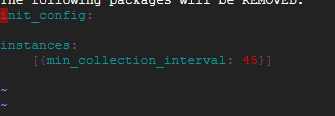

# Hiring-Engineers(Solution Engineer)

## Environment:

 I used **Google Cloud** to create two virtual machines. One has **windows Server 2016** operating system and other has **Ubuntu 16.04 LTS**

## 1.Collecting Metrics:

### Question 1:  Add tags in the Agent config file and show us a screenshot of your host and its tags on the Host Map page in Datadog.

I have used two VM's.

For the windows machine, i have done the following : 

 Updated the *datadog.yaml* file in *C:\ProgramData\Datadog* folder with the following tags
 1. ddWindowsMachine
 2. env:GoogleCloudVM

 > 

 For the Ubuntu machine, i have done the following :
updated the *datadog.yaml* file in */etc/datadog-agent* with the following tags
1. ddUbuntuMachine
 2. env:GoogleCloudVM
> 

**In the browser under Host map, the tags were reflecting after i restarted agent.**

> 

Note: i created two VM's so that i can actually see the use of tag's. 

So, i tried to group hosts on google cloud and it was really helpful. below is the screenshot of the same

## Question 2 : Install a database on your machine (MongoDB, MySQL, or PostgreSQL) and then install the respective Datadog integration for that database.

I have  installed mongoDB on windows and postgresql on Ubuntu and integrated both.

**MongoDB:**

Result of *agent status* for mongoDB : 

Success message on Integration of mongoDB in browser:

**Postgresql**

Result of *agent status* for postgresql

Success message on integration of postgresql in browser

## Question 3 : Create a custom Agent check that submits a metric named my_metric with a random value between 0 and 1000.

I used ubuntu machine to do this.
I created a *my_metric.yaml* file in */etc/datadog-agent/conf.d* with text as shown in  below image

created a *my_metric.py* file in */etc/datadog-agent/checks.d* with code as shown in below image

When i ran `sudo -u dd-agent -- datadog-agent check my_metric`  i got the following output

I checked the same in my dashboard and its as shown below

So, custom metric is being recorded.

## Question 4: Change your check's collection interval so that it only submits the metric once every 45 seconds.

I updated my_metrics.py file  as shown below 

The following was the output when i ran `sudo -u dd-agent -- datadog-agent check my_metric`

As seen in the above image, it took 45 seconds pause. so, Success!

## Bonus Question : Can you change the collection interval without modifying the Python check file you created?

Yes, by modifying my_metrics.yaml file to as shown below, i was able to add interval without modifying python check file

# Visualizing Data:

## Question : Utilize the Datadog API to create a Timeboard that contains:

* Your custom metric scoped over your host.
 * Your custom metric with the rollup function applied to sum up all the points for the past hour into one bucket

Timeboard of my_metric in the browser

* Any metric from the Integration on your Database with the anomaly function applied.
* 

Timeboard of mongoDB in browser:

## Question : Once this is created, access the Dashboard from your Dashboard List in the UI:

* Set the Timeboard's timeframe to the past 5 minutes
For Custom timeboard

For mongoDB timeboard:

* Take a snapshot of this graph and use the @ notation to send it to yourself.

For custom metric:

for mongo metric:

* **Bonus Question**: What is the Anomaly graph displaying?

I have refered [THIS](https://docs.datadoghq.com/monitors/monitor_types/anomaly/) to understand the concept. According to the documentation, the data that do not fit the norm based on different algorithms are marked as anomaly. 

## Monitoring Data

### Question : Create a new Metric Monitor that watches the average of your custom metric (my_metric) and will alert if it’s above the following values over the past 5 minutes:

* Warning threshold of 500
* Alerting threshold of 800
* And also ensure that it will notify you if there is No Data for this query over the past 10m.

The following image shows above three settings

### Question : Please configure the monitor’s message so that it will:

* Send you an email whenever the monitor triggers.
* Create different messages based on whether the monitor is in an Alert, Warning, or No Data state.
* Include the metric value that caused the monitor to trigger and host ip when the Monitor triggers an Alert state.

The following image shows above three settings:

* Monitoring email notification Screenshots:

Warning mail:

Recovered from warning-  Email: 

### Bonus Qustion: Since this monitor is going to alert pretty often, you don’t want to be alerted when you are out of the office. Set up two scheduled downtimes for this monitor:

* One that silences it from 7pm to 9am daily on M-F,
* Make sure that your email is notified when you schedule the downtime and take a screenshot of that notification.

Mail- Screenshot

* And one that silences it all day on Sat-Sun.
* Make sure that your email is notified when you schedule the downtime and take a screenshot of that notification.

Mail- Screenshot

# Collecting APM Data:

I used provided Flask App. The dashboard generated for this section has number of requests and the durations.

flask_code.py

**Dashboard of APM**

link to dashboard: https://app.datadoghq.com/apm/service/flask/flask.request?start=1529263046666&end=1529277446666&env=none&paused=false

### Bonus Question: What is the difference between a Service and a Resource?

A service is a set of processes that caries out a functionality. where as resource is the point of action for a service. for example, rest service could be a flask application running and this is a service. A JSON response is the resource.

# Final Question: Is there anything creative you would use Datadog for?

I think datadog will be extremely helpful where everything needs to be tracked. i think, this can be extremely useful, if its paired with AI,computer vision. Lets say, we have a AI system that does object detection. So, the dashboard will be showings number of objects detected(Could be used to monitor traffic). Number of Human's or animals. Number of trucks, and so on. 