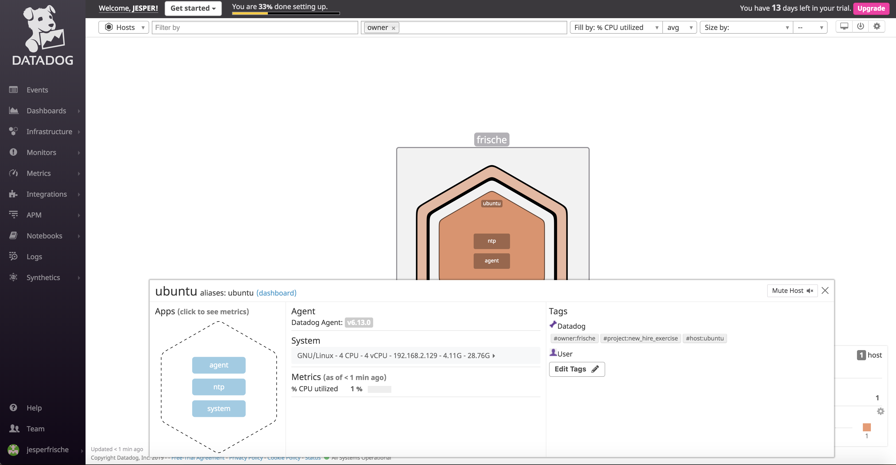

# Prerequisites - Setup the environment #

I started a Ubuntu 18.04 instance on AWS.

I then installed the Datadog agent with the following command:

DD_API_KEY=<MY_API_KEY> bash -c "$(curl -L https://raw.githubusercontent.com/DataDog/datadog-agent/master/cmd/agent/install_script.sh)"

Screenshot of agent YAML file and host map on Datadog UI:

Screenshot of host map in Datadog UI:

