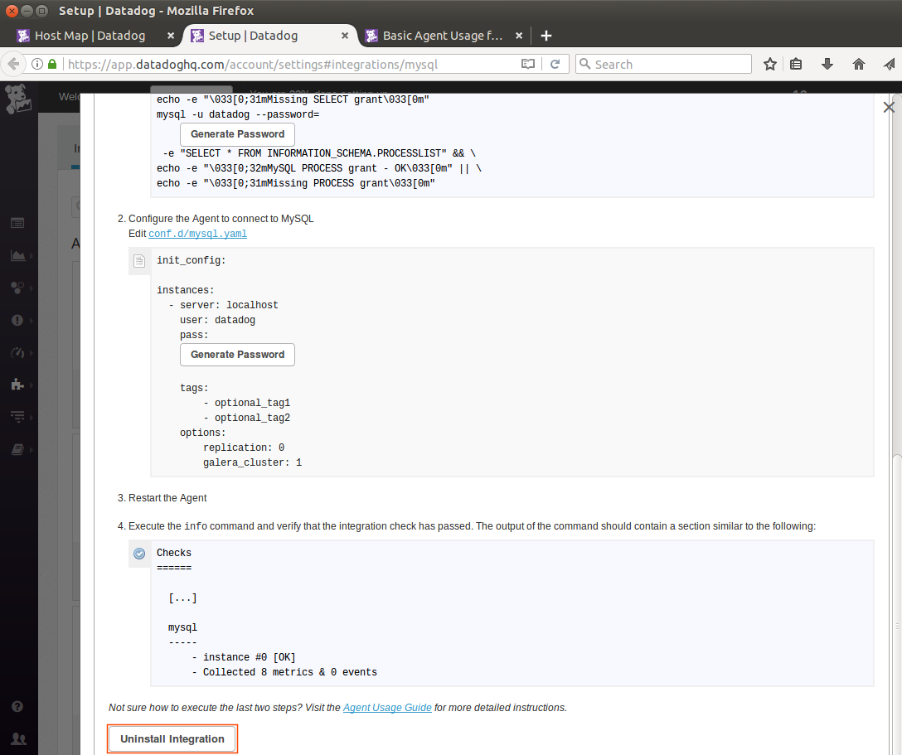

Sean Yu - Support Engineer

## Level 1 - Collecting your Data
### Sign up for Datadog (use "Datadog Recruiting Candidate" in the "Company" field), get the Agent reporting metrics from your local machine.
To signup for a trial account with Datadog, navigate to the datadog [website](www.datadoghq.com).

And click on the "GET STARTED FREE" button.

Fill up the form. Don't forget to key in Datadog Recruiting Candidate" in the "Company" field.

After clicking the "Sign up" button, you will be greeted by a page with a short survey.
You can fill up the form or just skip it.

We are now in the page for us to setup the Datadog Agent.
Since our host machine is using Ubuntu 12.04, 
lets click on Ubuntu on the left hand navigation bar.


Open a terminal and execute the code.

The Datadog Agent installation is pretty quick and will show quite a long text showing the installation progress.

    
After finishing all that action in the Terminal, lets go back to our web browser and click the "Finish" button.

On the next page, we should be able to see that our Ubuntu host is now sending data to our Datadog account in the cloud.

*Useful Links*
  * [Agent Status and Information](https://help.datadoghq.com/hc/en-us/articles/203764635-Agent-Status-and-Information)  
  * [Start/Stop/Restart the Datadog Agent](https://help.datadoghq.com/hc/en-us/articles/203764515-Start-Stop-Restart-the-Datadog-Agent)

2. Bonus question: In your own words, what is the Agent?
>An agent is an application which runs in the background, and performs different kinds of tasks. In the case of our newly installed Datadog Agent, it collects and sends metrics about our Ubuntu installation to Datadog's servers.

3. Add tags in the Agent config file and show us a screenshot of your host and its tags on the Host Map page in Datadog.  
> Let us now add tags to our host so it can be easily be identified in our Datadog Dashboard. We first need to locate the Agent configuration file in our Ubuntu installation.
In Linux, the Agent configuration file is located at **/etc/dd-agent/datadog.conf**.  
You will need to open the configuration file with sudo, using your preferred text editor.  
The snippet below opens the Agent configuration file, with sudo privileges, using the text editor gedit.    
```
sudo gedit /etc/dd-agent/datadog.conf
```

Look for the line which has the text "Set the host's tags (optional)", and below that line add your tags in key:value pairs.
Try adding the line below on the datadog.conf file.

>**tags: os:ubuntu1404, country:aus**


After adding the line and saving the file, go to Host Map page in your Datadog account.
To see the new tags that we just added.


If you were not able to see the tags we added to datadog.conf,  double check if the syntax is correct. 
Please see the rules for tag naming [here](https://help.datadoghq.com/hc/en-us/articles/204312749-Getting-started-with-tags).
Lastly, try restarting the Datadog agent by running the code below in the terminal:

```
sudo /etc/init.d/datadog-agent restart
```
*Useful links* 
* [Where is the configuration file for the Agent?](https://help.datadoghq.com/hc/en-us/articles/203037169-Where-is-the-configuration-file-for-the-Agent-)  
* [Getting Started with Tags](https://help.datadoghq.com/hc/en-us/articles/204312749-Getting-started-with-tags)
4. Install a database on your machine (MongoDB, MySQL, or PostgreSQL) and then install the respective Datadog integration for that database.  
>Run the code below in the terminal to install MySQL Server. 
It will prompt us to continue or not with the installation.
We of course choose yes.
```
sudo apt-get update
sudo apt-get install mysql-server-5.5
```


The installation process will ask for a password for the MySQL root account.
Key in a new password for MySQL.
   

After the installation process, we should see our Terminal displaying **mysqld** started as a process in our Ubuntu host.
  

To make sure the installation was successful, run this command line snippet to test.
```
sudo netstat -tap | grep mysql
```
You should see something like the pic below:


To install the Datadog MySQL Agent, we first need to grant the Datadog Agent replication rights from our newly installed MySQL Server.
From the Terminal, login to MySql using the code below. It should prompt you for your MySQL password
```
mysql -u root -p
```
Let us run this code snippet, while replacing <UNIQUEPASSWORD> with your own password:
```SQL
CREATE USER 'datadog'@'localhost' IDENTIFIED BY '<UNIQUEPASSWORD>';
GRANT REPLICATION CLIENT ON *.* TO 'datadog'@'localhost' WITH MAX_USER_CONNECTIONS 5;
```
Exit MySQL's command prompt by running the command quit:
```
quit
```
To verify if the creation of the new user was a success, let us run this command in the Terminal:
```
mysql -u datadog --password=<UNIQUEPASSWORD> -e "show status" | \
grep Uptime && echo -e "\033[0;32mMySQL user - OK\033[0m" || \
echo -e "\033[0;31mCannot connect to MySQL\033[0m"
mysql -u datadog --password=<UNIQUEPASSWORD> -e "show slave status" && \
echo -e "\033[0;32mMySQL grant - OK\033[0m" || \
echo -e "\033[0;31mMissing REPLICATION CLIENT grant\033[0m"
```
That was a lot of commands in succession. Your terminal should look something similar to this:  


Now, we need to setup our Datadog Agent to connect to MySQL.
We need to open and edit the **mysql.yaml** file. In Ubuntu, we can find this file in **/etc/dd-agent/conf.d**. The **conf.d** folder has example templates for most of the integration that Datadog provides.
We could just copy the **mysql.yaml.example** file and edit that file. Lets run this in the terminal. The code below used gedit as a text editor. You can use your text editor of choice.
```
sudo cp /etc/dd-agent/conf.d/mysql.yaml.example /etc/dd-agent/conf.d/mysql.yaml
sudo gedit /etc/dd-agent/conf.d/mysql.yaml
```
Your **mysql.yaml** file would originally look like this:


The Important part of the configuration is the snippet below:
```
init_config:

instances:
  - server: localhost
    user: datadog
    pass: <UNIQUEPASSWORD>

    tags:
        - optional_tag1
        - optional_tag2
    options:
        replication: 0
        galera_cluster: 1
        disable_innodb_metrics: 1
```
_We disabled  innodb metrics , because it does not work on MySQL 5.5_

The finished **mysql.yaml** file should look like something like this:


YAML files require the use of spaces instead of tabs. So please take care to use spaces, else the Agent will not be able to parse the information correctly.
After saving the **mysql.yaml** file, lets restart the Datadog Agent for the changes to get picked up.
Let's Run the code snippet below:
```
sudo /etc/init.d/datadog-agent restart
```
After restarting the Agent, lets verify that our configuration passed the integration check.
Lets run the Datadog Agent command called info.
```
sudo /etc/init.d/datadog-agent info
```
After running the info command we should see something like this:


After verifying that our MySQL integration is correct, open your browser and go to the [Datadog MySQL Integration](https://app.datadoghq.com/account/settings#integrations/mysql) page and click on the "Install Integration" button.


We should see that the "Install Integation" button will change from Blue to White, once the installation is done.


After successfully installing the MySQL Integration from the Datadog website, go to your Datadog Dashboard and we should see the "MySQL - Overview" in the Integration Dashboards section.


**Useful Links**
  * Step by step [instructions](http://dbadiaries.com/how-to-install-mysql-5-5-on-ubuntu-server-12-04-lts) on how to install MySQL 5 on Ubuntu 12.04.   
  * [MySQL Installer Downloads](https://dev.mysql.com/downloads/mysql/)  
  * [MySQL Datadog Integration](http://docs.datadoghq.com/integrations/mysql/)
5. Write a custom Agent check that samples a random value. Call this new metric: `test.support.random`
>We need to create 2 files to get this going. A check file, which is a python script and a YAML configuration file. The file name of both files must match.

Lets start with the python check file. Create a new python script called randomcheck.py
```
sudo gedit /etc/dd-agent/check.d/randomcheck.py
```
Here is the content of the python script:
```python
import random
from checks import AgentCheck
class randomCheck(AgentCheck):
    def check(self, instance):
        self.gauge('test.support.random', random.random())
```


Up next is the randomcheck.yaml file:
```
sudo gedit /etc/dd-agent/conf.d/randomcheck.yaml
```
The content of the yaml file:
```
init_config:

instances:
    [{}]
```


After creating both files, lets restart the Datadog Agent for the changes to take effect.
```
sudo /etc/init.d/datadog-agent restart
```
We should be able to see our newly created Check in the Dashboard.


**Useful links**
  * [Agent Checks](http://docs.datadoghq.com/guides/agent_checks/)
