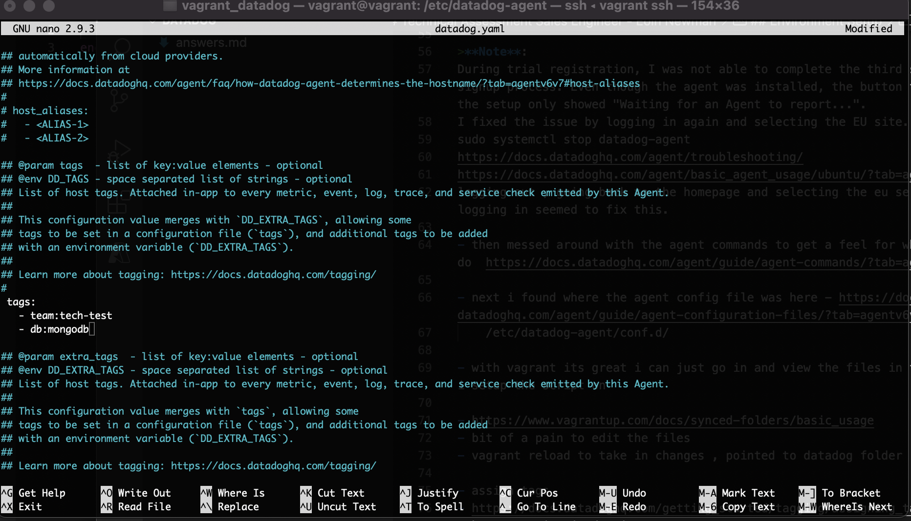
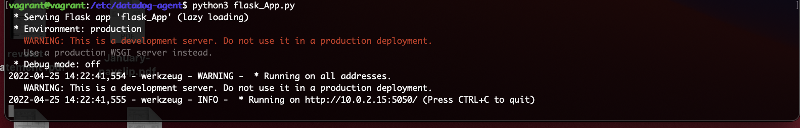

# Technical Assessment Sales Engineer - Eoin Newman
April 2022
Dublin, Ireland

## Content
- [Setup](#setup)
  - Vagrant Setup
  - Installing Datadog Agent

- [Collecting metrics](#collecting-metrics)
  - Add Tags
  - Install MongoDB
  - Custom Agent Check
  - Collection Interval
  - Bonus Question

- [Visualizing Data](#visualizing-data)
  - Creating A Timeboard
  - Snapshot
  - Dependency Issues
  - Bonus Question

- [Monitoring Data](#monitoring-data)
  - Creating a monitor
  - Monitor Message
  - Bonus Question

- [Collecting APM Data](#collecting-apm-data)
  - Flask App
  - Bonus Question

- [Final Question](#final-question)
  - Datadog Use Case


***

## Setup

### Vagrant Setup
I decided to spin up a fresh linux VM via Vagrant. I had not used Vagrant before to spin up a VM so i thought it would be a good learning experience to go with it. I made sure to use a min of v.16.04

I followed the intructions to setup vangard [here](https://learn.hashicorp.com/collections/vagrant/getting-started)

While i was setting up vangrant I encountered an issue with permissions on Mac , I had to enable permissions in my security and privacy settings to fix it.


### Installing Datadog Agent

Once i had Vagrant installed i signed up for the datadog trial [here]( https://www.datadoghq.com/)

I then followed the quick start guide and selected ubuntu.


I entered 'vagrant ssh' to login to my ubuntu VM and entered the command provided in the setup guide to install the datadog agent.

```
DD_AGENT_MAJOR_VERSION=7 DD_API_KEY=<DD-API-KEY> DD_SITE="datadoghq.eu" shell -c "$(curl -L https://s3.amazonaws.com/dd-agent/scripts/install_script.sh)"
```

I then ran the following command to check that it had run successfully

```
sudo service datadog-agent status
```


Everything seemed to be up and running fine. However, I could not click the button on the UI to finalize the setup , it just kept showing "Waiting for an Agent to report...". Logging out and logging back into the UI seemed to fix the issue for me.

***

## Collecting metrics

### Add Tags

I found where the agent config file was first `/etc/datadog-agent/datadog.yaml` , the [documentation](https://docs.datadoghq.com/agent/guide/agent-configuration-files/?tab=agentv6v7) helped.

I then added in the tags



I got an error when I added in the tags the first time. It's important to note yaml does not accept tabs, it must be spaces. Changing the tabs to spaces solved the problem.

I then checked the tags were added using the agent status


And i also checked the UI


[datadog.yaml file](code/datadog.yaml)

### Install MongoDB

For my database I went with MongoDB. First I had to install it on my VM.

```
sudo apt-get install -y mongodb
```

I then checked it was runnning correctly

```
sudo systemctl status mongodb
```

I then created a user. (important to use single quotes , double quotes caused errors)
```
db.createUser({user:'admin', pwd:'password', roles:[{role:'root', db:'admin'}]})
```

Now that mongo was setup on my VM I could continue with the datadog setup for it , following the guide [here](https://docs.datadoghq.com/integrations/mongo/?tab=standalone)

```
mongo 
use admin
db.auth('admin', 'password')
db.createUser({'user': 'datadog','pwd': 'password','roles': [{ role:'read', db: 'admin' },{ role: 'clusterMonitor', db: 'admin' },{ role: 'read', db: 'local' }]})
```

Following this i needed to edit the mongodb conf.yaml file `datadog-agent/conf.d/mongo.d/conf.yaml`

[mongodb conf.yaml file](code/mongo_conf.yaml)

```
init_config:

instances:
    ## @param hosts - list of strings - required
    ## Hosts to collect metrics from, as is appropriate for your deployment topology.
    ## E.g. for a standalone deployment, specify the hostname and port of the mongod instance.
    ## For replica sets or sharded clusters, see instructions in the sample conf.yaml.
    ## Only specify multiple hosts when connecting through mongos
    #
  - hosts:
      - localhost:27017

    ## @param username - string - optional
    ## The username to use for authentication.
    #
    username: datadog

    ## @param password - string - optional
    ## The password to use for authentication.
    #
    password: password

    ## @param database - string - optional
    ## The database to collect metrics from.
    #
    database: admin

    ## @param options - mapping - optional
    ## Connection options. For a complete list, see:
    ## https://docs.mongodb.com/manual/reference/connection-string/#connections-connection-options
    #
    options:
      authSource: admin
```

Then i reloaded the datadog agent and checked the datadog service status
```
sudo service datadog-agent restart
```


### Custom agent check

First i had a look at the documentation provided for custom agent checks , [here](https://docs.datadoghq.com/developers/write_agent_check/?tab=agentv6v7)

It mentions in the above doucmentation that the names of the configuration and check files must match and also to start the file names with 'custom_'

I created a file [custom_mycheck.yaml](code/custom_mycheck.yaml) in `/etc/datadog-agent/conf.d/`

```
instances:[{}]
```

Following this , i made [custom_mycheck.py](code/custom_mycheck.py) in `/etc/datadog/agent/checks.d/`

```
from datadog_checks.base import AgentCheck
import random

__version__ = "1.0.0"

class MyCheck(AgentCheck):
        def check(self,instance):
                self.gauge("test_metric", random.uniform(0,1000), tags=["team:techtest"])
```

Checking it all worked


### Collection Interval

To change the collection interval I edited the [custom_mycheck.yaml](code/custom_mycheck.yaml) file to make the change interval 45


and once again ran the below commmand to make sure it all worked

```
sudo -u dd-agent -- datadog-agent check custom_mycheck
```

### Bonus Question

- The python file does not need to be edited to change the interval to 45, I made the change through the yaml file as i mentinoed above

***

## Visualizing Data

### Creating A Dashboard

The timeboard endpoint is outdated. As stated in the docs [here](https://docs.datadoghq.com/dashboards/guide/timeboard-api-doc/?tab=python#pagetitle)

It was recommended to use the new dashboard endpoint instead , so this is the approach I took for the exercise.

First i  had to install the [datadog api client](https://docs.datadoghq.com/api/latest/?code-lang=python)

```
pip3 install datadog-api-client
```

It turned out pip wasn't install so i had to do that first

```
pip3 install datadog-api-client
```

Then i used the example python file found in the [dashboard documention](https://docs.datadoghq.com/api/latest/dashboards/) to create my timeseries Widget.

I named it [example_timeboard.py](code/example_timeboard.py)

Then i went to run the command in the guide and found out i would need an API key , so i went to created this on the UI.


```
DD_SITE="datadoghq.com" DD_API_KEY="6ee6d8c56cf3058a17d50ea34e21233a" DD_APP_KEY="f8bb625a62c0e480fa13af58413098ca096699c0" python3 "example_timeboard.py"
```

This caused the following issue 

```
datadog_api_client.v1.exceptions.ForbiddenException: (403) Reason: Forbidden
```

So i went into the documention to find out if i could test the api key to see if it was valid.
I found a sample request i could make [here](https://docs.datadoghq.com/api/latest/authentication/)
I used the example python script on the page

```
DD_SITE="datadoghq.com" DD_API_KEY="6ee6d8c56cf3058a17d50ea34e21233a" python3 "validate_api.py"
```

This still caused issues. I then noticed the '.com' in the command , I changed this to eu and the issue was fixed.

```
DD_SITE="datadoghq.eu" DD_API_KEY="6ee6d8c56cf3058a17d50ea34e21233a" DD_APP_KEY="f8bb625a62c0e480fa13af58413098ca096699c0" python3 "example_timeboard.py"
```

Once i knew this was all working and showing in the UI , i started to edit the [example_timeboard.py](code/example_timeboard.py) file

I found some useful information to create a query for the request in my script [here](https://docs.datadoghq.com/dashboards/querying/)

```
"query": "avg:test_metric{*}"
```

So going off the example code I assumed changing it slight to this would work

```
query = "avg:test_metric{*}"
```

However to query you need to use 'q' instead of query

```
q = "avg:test_metric{*}"
```


The next step was to add the [anomaly](https://docs.datadoghq.com/monitors/create/types/anomaly/#overview) function

I used an example from this page to create my function to look for anomalies for my test metric , because the metric is only newly created i went with using 'basic'. 

Your custom metric scoped over your host :

```
Widget(
    definition=TimeseriesWidgetDefinition(
        type=TimeseriesWidgetDefinitionType("timeseries"),
        title="Anomaly function for my test metric",
        requests=[
            TimeseriesWidgetRequest(
                q="anomalies(avg:test_metric{*}, 'basic', 3,)"
            )
        ],
    )
)
```

Any metric from the Integration on your Database with the anomaly function applied : 

```
anomalies(avg:mongodb.opcounters.commandps{*}, 'basic', 3)
```

```
Widget(
    definition=TimeseriesWidgetDefinition(
        type=TimeseriesWidgetDefinitionType("timeseries"),
        title="Anomaly Function for MongoDB",
        requests=[
            TimeseriesWidgetRequest(
                q="anomalies(mongodb.opcounters.commandps{*}, 'basic', 3)"
            )
        ],
    )
)
```

Finally i added a [rollup](https://docs.datadoghq.com/dashboards/functions/rollup/) function to sum up all the points for the past hour into one bucket.

Your custom metric with the rollup function applied to sum up all the points for the past hour into one bucket:

```
Widget(
    definition=TimeseriesWidgetDefinition(
        type=TimeseriesWidgetDefinitionType("timeseries"),
        title="Rollup Function",
        requests=[
            TimeseriesWidgetRequest(
                q="test_metric{*}.rollup(sum,3600)"
            )
        ],
    )
)
```

Final result of dashoboard in the UI


Setting the Timeboards timeframe to the past 5 minutes :


Taking a snapshot of the graph and sending it to myself using the @notation to send to @newmaneoin@gmail.com


Link to my dashboard - https://p.datadoghq.eu/sb/a1f9210e-c185-11ec-86eb-da7ad0900005-427a83ee77f7adb688084278fa46b426

### Bonus Question:

As mentioned in the Anomaly documention provided. Anomaly detection is an algorithmic feature that identifies when a metric is behaving differently than it has in the past, taking into account trends, seasonal day-of-week, and time-of-day patterns. It is well-suited for metrics with strong trends and recurring patterns that are hard to monitor with threshold-based alerting.

To find a metric with a strong trend for my database , i looked in the MongoDB dashboard. In here i found "mongodb.opcounters.commandps" , this checks Total number of commands per second issued to the database. It seemed like it had a strong and recurring trend so i used it for the anomaly detection question.

***

## Monitoring Data

### Creating a monitor

From the menu on the left in the UI i selected "Monitors" , then i selected "New Monitor".


I then selected metric which brought me to the page to create my metric monitor.

Here i entered the below configuration so it would alert me if its above the following values over the past 5 minutes :
- Warning threshold of 500
- Alerting threshold of 800
- And also ensure that it will notify you if there is No Data for this query over the past 10m.


### Monitor Message

I found documentation [here](https://docs.datadoghq.com/monitors/notify/) to help create the message.

```
@newmaneoin@gmail.com
 
{{#is_alert}}

**ALERT**

test_metric is equal to or above the alert threshold of 800

Current metric value is : {{value}}

Host ip : {{host.name}} - {{host.ip}}
 
{{/is_alert}}

{{#is_warning}}

**WARNING**

test_metric is equal to or above the warning threshold of 500

Current metric value is : {{value}}

Host ip : {{host.name}} - {{host.ip}}

{{/is_warning}}

{{#is_no_data}}

**NO DATA**

No data has been received for more than 10 minutes.

Current metric value is : {{value}}

Host ip : {{host.name}} - {{host.ip}}

{{/is_no_data}}
```


Example Screenshot of email notification for an warning : 


### Bonus Question

To add in downtime I went to the Monitors page , selected the Manage Downtimes tab and selected "Schedule Downtime"


One that silences it from 7pm to 9am daily on M-F (I used the RRULE for this one): 


And one that silences it all day on Sat-Sun :


Email Notification : 


***

## Collecting APM Data

### Flask App

I first had a read through the documenation found [here](https://docs.datadoghq.com/tracing/)

Then i followed the instructions on tracing python applications [here](https://docs.datadoghq.com/tracing/setup_overview/setup/python/?tab=containers)

I created the [flask_app.py](code/flask_app.py) file from the code provided.

Following this i edited the [datadog.yaml](code/datadog.yaml) file to be configured for APM.
In the documentation it mentions that by default the apm is enabled , however it is commented out.

```
apm_config:
enabled:true
reciever_port: 8126
```

Then i had to install ddtrace

```
pip3 install --upgrade pip
pip3 install ddtrace
pip3 install flask
```

Then I ran the [flask_app.py](code/flask_app.py) file I had created



I found the below command in [ddtrace documentation](https://ddtrace.readthedocs.io/en/stable/installation_quickstart.html)

```
DD_SERVICE="APM_test" DD_ENV="flask_app" DD_VERSION=0.1 ddtrace-run python3 flask_App.py
```

I then made some requests it using

```
curl http://0.0.0.0:5050/
curl http://0.0.0.0:5050/api/apm
curl http://0.0.0.0:5050/api/trace
curl http://0.0.0.0:5050/api/wrong
```

Then it showed it up the UI


Here is a [link](https://p.datadoghq.eu/sb/a1f9210e-c185-11ec-86eb-da7ad0900005-2cee2bac0e4fc380f7b54cdc14d5e50d) and screenshot of a dashboard with both APM and Infrastructure Metrics.

To create the dashboard shown below , I just exported the apm metric from the apm page to my new dashboard from the UI and copied the infrastrure metrics from my host dashboard to the new dashboard too.


***

## Final Question

### Datadog Use Case

Only today I was having issues with my brodband , this seems to be a trend at the minute in my area. Given datadogs great capabilities in looking at large amounts of data , it would be useful for my brodband provider to utilise datadog to analysize data in areas where the service has gone done. Looking at data on users currently using service, their location and time of incidents to try and spot anomalies and avoid issues in the future.


