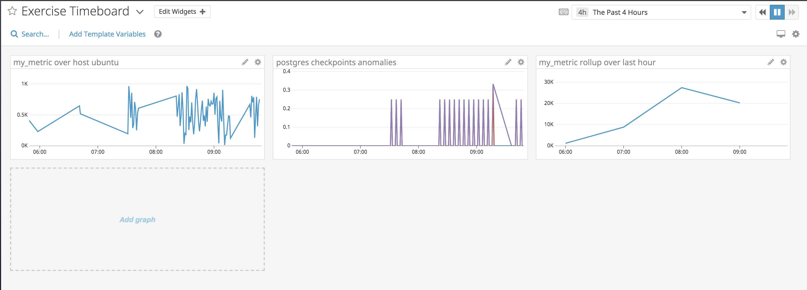
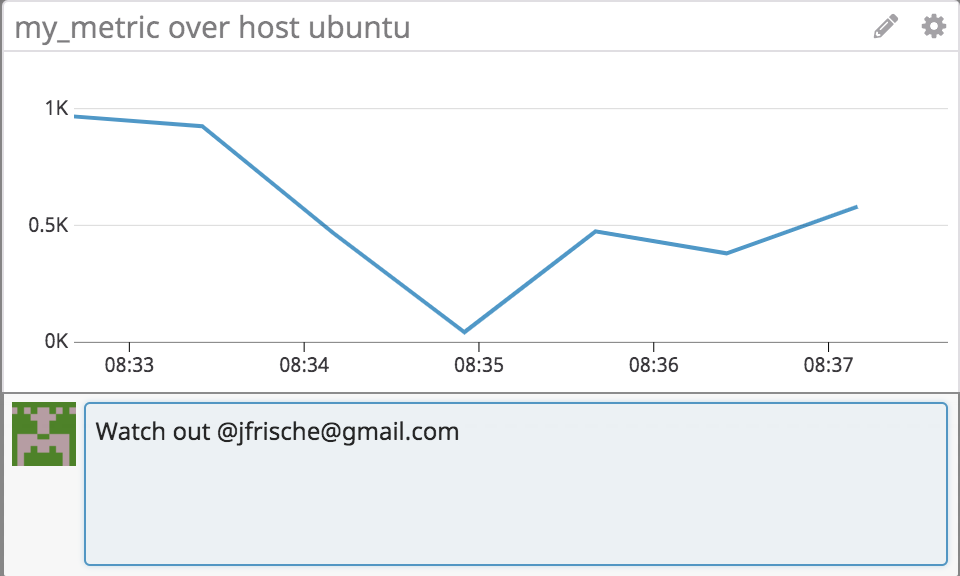
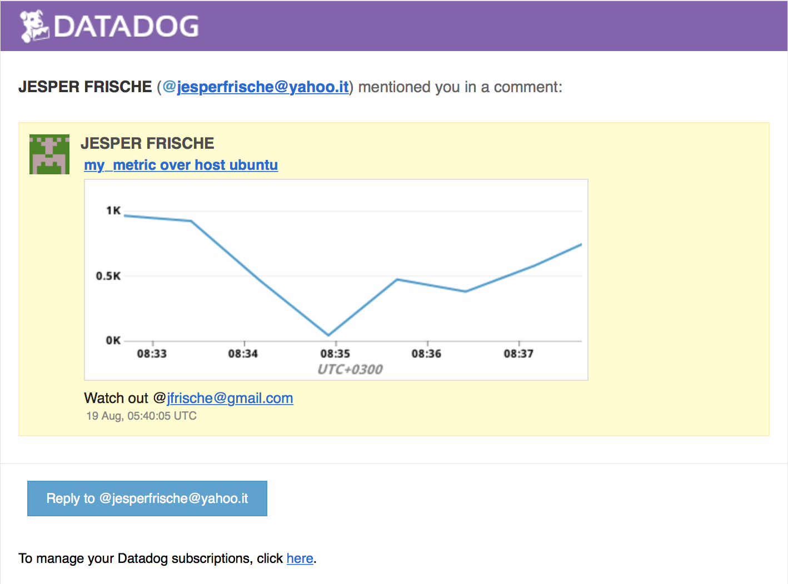

# Prerequisites - Setup the environment

I started a Ubuntu 18.04 server on AWS.

I then installed the Datadog agent on this Ubuntu server with the command:

DD_API_KEY=<MY_API_KEY> bash -c "$(curl -L https://raw.githubusercontent.com/DataDog/datadog-agent/master/cmd/agent/install_script.sh)"

 
 

# Collecting Metrics

## Add tags in the Agent config file and show us a screenshot of your host and its tags on the Host Map page in Datadog

I added some example tags to the /etc/datadog-agernt/datadog.yaml file and restarted agent

Screenshot of agent YAML file and host map on Datadog UI:

Screenshot of host map in Datadog UI:

 
 

## Install a database on your machine (MongoDB, MySQL, or PostgreSQL) and then install the respective Datadog integration for that database.

I installed postgres on the Ubuntu server.

In Postgres I configured a new user 'datadog' using instructions provided for Postgres.

  - create user datadog with password '<PASSWORD>';
  - grant pg_monitor to datadog;
  
I then configured the '/etc/datadog-agent/conf.d/postgres.d/onf.yaml file with the corresponding connection info

  - host: localhost
  - port: 5432
  - username: datadog
  - password: datadog
  - dbname: postgres

I restarted the datado agent and now webt to Datadog UI to see the metrics

Screenshot of Postgres metrics in Datadog UI Metrics Explorer:

 
 

## Create a custom Agent check that submits a metric named my_metric with a random value between 0 and 1000

I followed the instructions in "https://docs.datadoghq.com/developers/write_agent_check/?tab=agentv6"

First I created a Python script: /etc/datadog-agent/checks.d/my_metric.py

    import random
    from checks import AgentCheck
    class my_metric_class(AgentCheck):
          def check(self, instance):
              self.gauge('my_metric', random.randint(1,1000))
          
          
and a yaml file: /etc/datadog-agent/conf.d/my_metric.yaml

    init_config:

    instances:
      [{}]

Then I restarted the agent.

Screenshot of my_metric in Datadog UI Metrics Explorer: 

 
 

## Change your check's collection interval so that it only submits the metric once every 45 seconds

I edited the yaml file: /etc/datadog-agent/conf.d/my_metric.yaml

    init_config:

    instances:
      - min_collection_interval: 45

Then I restarted the agent.

I can now see that the metric interval went to 45 seconds

 
 

## Bonus Question Can you change the collection interval without modifying the Python check file you created?

Yes, this is possible by ediuting the yaml file in the conf.d directory like in the example above.

 
 

# Visualizing Data

I installed the Datadog Python package which contains the Datadog API:

    sudo apt-get install python
    sudo apt-get install python-pip
    pip install datadog

Then I created a standalone Python script (as below). 

It uses the Datadog API to create the custom dashboard in the Datadog UI. The dashboard contains three time graphs

- my_metric over ubuntu host
- Anomalies of the metric "postgresql.bgwriter.checkpoints_timed"
- my-metric rolled up to single hourly values

I also created a new APP key for this purpose.

Python script:

###
    from datadog import initialize, api

    options = {
            'api_key': '******',
            'app_key': '******'
        }

    initialize(**options)

    title = 'Exercise Timeboard'

    widgets = [{
        'definition': {
            'type': 'timeseries',
            'requests': [
              {'q': 'avg:my_metric{host:ubuntu}'}
            ],
            'title': 'my_metric over host ubuntu'
        }
    },{
        'definition': {
            'type': 'timeseries',
            'requests': [
              {'q': 'anomalies(avg:postgresql.bgwriter.checkpoints_timed{host:ubuntu},"basic",2)'}
            ],
            'title': 'postgres checkpoints anomalies'
        }
    },{
        'definition': {
            'type': 'timeseries',
            'requests': [
              {'q': 'sum:my_metric{host:ubuntu}.rollup(sum,3600)'}
            ],
            'title': 'my_metric rollup over last hour'
        }
    }]

    layout_type = 'ordered'

    description = 'An example timeboard for technical exercise.'

    api.Dashboard.create(title=title,
                         widgets=widgets,
                         layout_type=layout_type,
                         description=description)

###

Screenshot of custom dashboard:

I then set the time interval to 5 minutes and took a snapshot sending it to myself via @ annotation

Screenshot of custom dashboard snapshot with @ annotation:

Screenshot of snapshot received via mail:

 
 

## Bonus Question: What is the Anomaly graph displaying?

The anomaly graph displays occurences of the "postgresql.bgwriter.checkpoints_timed" metric values that are 2 standard deviations (configured) above the ordinary value

 
 
