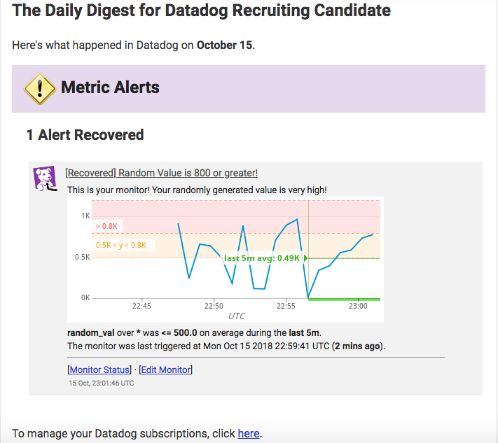

This is Michael Hawley's submission for a Sales Engineer role. I decided for the sake of originality to make an abridged tutorial, to help outline the steps I took for this challenge and present it in a way that a potential end user could follow easily.

## Setting Up Your Environment

While you can use any environment really, the recommended option is use a virtual machine, linux-based. To learn a new tool for my own personal experience, I used Vagrant with an Ubuntu OS. It's highly recommended that you're on 16.04 or later to avoid any dependency issues with package management.

Follow the [Vagrant Getting Started](https://www.vagrantup.com/intro/getting-started/index.html) guides to set up the virtual machine. The [Xenial64](https://app.vagrantup.com/ubuntu/boxes/xenial64) box is the used for this guide so instead of `vagrant init hashicorp/precise64`, use `vagrant init ubuntu/xenial64`.

To install the necessary packages, copy [bootstrap.sh](./bootstrap.sh).

In your Vagrantfile, add the line: `config.vm.provision :shell, path: "bootstrap.sh"` to provision the machine with the packages you'll need for this exercise.

Start the machine with `vagrant up --provision`, and access the CLI with `vagrant ssh`.

## Collecting Metrics

### Adding Tags

Within `/etc/datadog-agent/datadog.yaml`, under tags, specify what the machine is going to be tagged under for quick access on the Datadog platform. Likewise, multiple machines, like kubernetes clusters, can be grouped together under the same tags if they are running similar processes or working for the same service.

```
tags:
    - dd-tag:se-tag
    - env:sandbox
    - role:database
```

Start the Datadog agent with `sudo datadog-agent service start` and view the [tagged machine](./tags.png), in the hostmap.

Learn more about tagging [here](https://docs.datadoghq.com/tagging/)!

### Creating an Agent Check

In the `/etc/datadog-agent` directory are two folders `checks.d` and `conf.d`.

The `checks.d` folder is for creating a custom metric to be sent from the Datadog Agent to the platform. Addition information on the Agent library can be found [here](https://docs.datadoghq.com/developers/agent_checks/?tab=agentv6).

Let's create a random metric! Add the following Python script to `checks.d`:

```
from checks import AgentCheck
import random

class RandomValCheck(AgentCheck):
    def check(self, instance):
        self.gauge('random_val', random.randrange(1, 1000))
```

In `conf.d`, we set the properties of our Agent Check, like the collection interval, through a YAML file, instead of modifying the Python script directly.

```
init_config:

instances:
    - min_collection_interval: 45
```

__NOTE:__ Make sure the name of the files you create in the `checks.d` and `conf.d` are the same. Example: `my_metric.py` and `my_metric.yaml`.

Next we'll see how it looks in Datadog!

## Visualizing Data

With Datadog's public API we can send our custom metric, collected based on the interval we created in `conf.d`, to the platform for data visualization.

To make the POST call to Datadog, you'll first need you API key and app key, both of which can be found under the __APIs__ tab in the  __Integrations__ menu of Datadog.

```
from datadog import initialize, api

options = {
    'api_key': 'MY_API_KEY',
    'app_key': 'MY_APP_KEY'
}

initialize(**options)

title = "Timeboard - Random Value Metric"
description = "An informative timeboard."
graphs = [{
    "definition": {
        "events": [],
        "requests": [
            {"q": "avg:random_val{*}"}
        ],
        "viz": "timeseries"
    },
    "title": "Avg. Random Value"
    },
    {
        "definition": {
            "events": [],
            "requests": [
                {"q": "anomalies(avg:postgresql.percent_usage_connections{*}, 'basic', 2)"}
            ],
            "viz": "timeseries",
         },
         "title": "Avg. DB Connection Usage"
    },
    {
    "definition": {
        "events": [],
        "requests": [
            {"q": "avg:random_val{*}.rollup(sum, 3600)"}
        ],
        "viz": "timeseries",
     },
     "title": "Rollup Avg. Random Val"
}]
```

Once the script has been successfully ran, the new Timeboard can be viewed under the Dashboards list.

To set the scope your Timeboard there are a few options, you can view large periods of time, i.e. the last hour, last 4 hours, last day. If you want to create a smaller scope, like the last 5 minutes for example, you can change the parameters in the URL itself. These parameters are `from_ts` and `to_ts` and create an offset of 5 minutes in milliseconds, which is 300000 ms.

.

You can also tag your team members using the `@USERNAME` syntax to send them an email notification.


### Anomaly Graph

The anomaly function we see in the above Python script create a monitor to analyze a range of metrics (calculated by a 'basic' algorithm in the example) and alert users when a value is detected outside of that range, indicating an anomaly.

Here is a sample anomaly of a DB connection with the alert highlighted in red.


## Monitoring Data

Now that there's metrics coming in and we've seen there are ways to check for anomalies in the data, it's time to get notices when your application is behaving out of normal parameters.

Create a new [monitor](https://app.datadoghq.com/monitors#/create).

Select your metric. In this example, the chosen metric is the random value check generated from our agent. View the graph and choose your metric.


Set your [alert condition and threshold]. When the metric goes over a certain limit over a period of time, an email alert will be sent out. This threshold can also be sent as a warning as well, outside of the tolerance but not an immediate concern.


Lastly, set the body of your alert message and the recipients.


When the Monitor is alerted, it will notify you and your team by email.


#### Monitor Downtime

Not everyone wants to take work home with them, therefore it's important to manage when alerts are being sent.

Any of your alerts can be silenced, scheduled, and given a message notifying users when downtime is beginning.


And emails look like the following:


## Collecting APM Data

For Getting Started with setting up the APM, review the documentation found [here](https://docs.datadoghq.com/tracing/setup/).

The documentation found on:
http://pypi.datadoghq.com/trace/docs/web_integrations.html
has great information on the libraries required to instrument your application down to the resource layer. Given that information a sample Flask app will look something like the following:

```
from flask import Flask
import time
import blinker as _
import logging
import sys
from ddtrace import tracer
from ddtrace.contrib.flask import TraceMiddleware

# Have flask use stdout as the logger
main_logger = logging.getLogger()
main_logger.setLevel(logging.DEBUG)
c = logging.StreamHandler(sys.stdout)
formatter = logging.Formatter('%(asctime)s - %(name)s - %(levelname)s - %(message)s')
c.setFormatter(formatter)
main_logger.addHandler(c)

app = Flask(__name__)
traced_app = TraceMiddleware(app, tracer, service="my-flask-app", distributed_tracing=False)

@app.route('/')
def api_entry():
        return 'Entrypoint to the Application'

@app.route('/api/apm')
def apm_endpoint():
        return 'Getting APM Started'

@app.route('/api/trace')
def trace_endpoint():
        return 'Posting Traces'

if __name__ == '__main__':
        app.run(host='10.0.2.15', port='5050')
```

__NOTE__: Keep in mind that when using Vagrant, make sure that your VM is able to communicate to the outside network, in the event of an error, try adding `config.vm.network :forwarded_port, guest: 5050, host: 5050` to your Vagrantfile.

Once activity has been detected, a trace list will posted to under the APM page for viewing.


You can also include your APM metrics into your Timeboards, to get an overall view of your application and infrastructure, like


Given this, our instrumented service can take many forms. Ultimately, a service is just a method of returning information, whether it's a web application, database, or API. The activity being monitored comes in the form of a user or application hitting our resource, one part of the overall service, i.e the `'/api/apm'` or `/api/trace` resource paths.

## Creative Uses for Datadog

In a busy city like Boston, it's often a challenge getting around. Having a car is useful but can be expensive in an already pricy city. I personally use public transportation to get most places I need to go, friend's houses, work, the grocery store, The issue with public transit is that apps for tracking buses and trains can be unreliable from time to time, which can be costly to people on the go in both time and money. I would use Datadog and geolocation services (like Google Maps APIs) to pinpoint bus locations, measure traffic, and get a much more accurate view into when buses will arrive. If there is a delay, a monitor can be setup and notifications can be sent out. There are a few application like this already, but most of them are for drivers, none are that reliable to public transit commuters.
