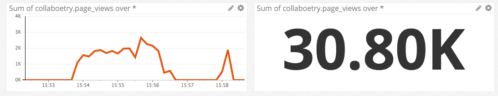

# Level 1
* Sign up for Datadog: done!
* Bonus question: what is the agent?
  * The agent is software that runs on your hosts, and collects events and metrics. It then delivers this data to Datadog so that you can use the information for performance and monitoring.
  * It's made up of three parts:
    1. the collector: this monitors your current machine for installed integrations, and tracks your system metrics (such as CPU and memory).
    2. dogstatsd: this is a StatsD backend server which you can use to send custom metrics from an application.
    3. the forwarder: this fetches the data from #'s 1 and 2, and then prepares said data for transfer to Datadog.
  * (P.S. I don't want to be *that* guy, but I noticed a typo in the first line under the first heading [here](http://docs.datadoghq.com/guides/basic_agent_usage/): "a" is missing before "piece of software".)
* Submit an event via the API:
  * I instrumented code for a MEAN stack app called [Loci](https://github.com/kwwalter/MemoryPalace), using the dogapi npm package):

  ```javascript
  var dogapi = require('dogapi');

  // dogapi configuration
  var options = {
    api_key: process.env.DD_API_KEY,
    app_key: process.env.DD_APP_KEY
  };

  dogapi.initialize(options);

  // dummy event submission via API

  var title = "It works!",
      text  = "Loci app successfully accessed through Heroku!",
      properties = {
        priority: "low",
        tags: ["loci", "heroku"],
        alert_type: "info"
      };

  dogapi.event.create(title, text, properties, function(err, res){
    if (err) {
      console.log("error posting dummy event to dogapi: ", err);
    } else {
      console.log("here's the response: ", res);
    }
  });
  ```

* Get an event to appear in your email inbox:
  

# Level 2
* Instrument a web app with dogstatsd (used a different app, [Collaboetry](https://github.com/kwwalter/Collaboetry), as well as the node-dogstatsd npm package):

  ```javascript
  var StatsD = require('node-dogstatsd').StatsD;

  // node-dogstatsd setup
  var dogstatsd = new StatsD();

  // increment
  router.get('/login', function(req, res){
    dogstatsd.increment('collaboetry.page_views');
    res.render('users/login');
  });
  ```

* While running a load test for a few minutes, visualize page views per second. Send a link to the graph.
  * Note: instead of using ab or tsung, I used an npm package called loadtest.
  * With loadtest, using this: `loadtest -c 100 -n 10000 http://localhost:3788/users/login`, and I executed the test a few times.
  * The last test I ran completed the 10000 requests in 46.79s, with the longest request taking 1123ms.
  
  * [Link to the graph](https://app.datadoghq.com/metric/explorer?live=false&page=0&is_auto=false&from_ts=1452531330055&to_ts=1452531938344&tile_size=l&exp_metric=collaboetry.page_views&exp_scope=&exp_agg=avg&exp_row_type=metric&exp_calc_as_rate=true)

* Create a histogram to see the latency; also give us the link to the graph
  * I did a couple of tests here:
    1. Load one poem/post: `collaboetry-1poem.latency`
      ```javascript
        router.get('/authors/:authorID/:poemID', function(req, res) {
          var start = Date.now();

          if (res.locals.userLoggedIn) {
            Poem.findOne( {
              _id: req.params.poemID
            }, function(err, foundPoem) {
              if (err) {
                console.log("Error finding individual poem with id: ", req.params.poemID);
              } else {
                console.log("found poem is: ", foundPoem);
                var latency = Date.now() - start;
                dogstatsd.histogram('collaboetry-1poem.latency', latency);
                dogstatsd.increment('collaboetry.page_views');

                res.render('poems/show', {
                  poem: foundPoem,
                  currentUser: req.session.currentUser
                });
              }
            });
          } else {
            res.redirect(302, '/');
          }
        });
      ```
      * [Link to the collaboetry-1poem graph](https://app.datadoghq.com/dash/integration/custom%3Acollaboetry_1poem?live=true&page=0&is_auto=false&from_ts=1452528204714&to_ts=1452531804714&tile_size=m)
    2. And a simpler example, for accessing and rendering the login page (in keeping with what I did for the load test): `collaboetry-login.latency`
      ```javascript
      router.get('/login', function(req, res){
        var start = Date.now();

        var latency = Date.now() - start;
        dogstatsd.histogram('collaboetry-login.latency', latency);
        dogstatsd.increment('collaboetry.page_views');

        res.render('users/login');
      });
      ```
      * [Link to the collaboetry-login graph](https://app.datadoghq.com/dash/integration/custom%3Acollaboetry_login?live=true&page=0&is_auto=false&from_ts=1452528176353&to_ts=1452531776353&tile_size=m)
* [Here's a dashboard I put together](https://app.datadoghq.com/dash/90969/collaboetry-latency--views?live=true&page=0&is_auto=false&from_ts=1452529467468&to_ts=1452533067468&tile_size=m)

# Level 3
* tag your metrics with `support` (one tag for all metrics). Building on the same example from Level 2, I've added the `support` tag to both `collaboetry-login.latency` and `collaboetry.page_views`, as well as `collaboetry-1poem.page_views`:
  ```javascript
  router.get('/login', function(req, res){
    var start = Date.now();

    var latency = Date.now() - start;
    dogstatsd.histogram('collaboetry-login.latency', latency, ['support']);
    dogstatsd.increment('collaboetry.page_views', ['support']);

    res.render('users/login');
  });
  ```
* tag your metrics per page
  * I went through and added page-specific metrics throughout my app, with tags such as:

  ```javascript
  dogstatsd.increment('collaboetry.page_views', ['support', 'page:root']);
  dogstatsd.increment('collaboetry.page_views', ['support', 'page:home']);
  dogstatsd.increment('collaboetry.page_views', ['support', 'page:404']);
  dogstatsd.increment('collaboetry.page_views', ['support', 'page:all-author-poems']);
  dogstatsd.increment('collaboetry.page_views', ['support', 'page:all-authors']);
  <etc.>
  ```
  You can see them all here:
  

* visualize the latency by page on a graph (using stacked areas, with one color per `page`)
  I updated the code to calculate the latency for each distinct route (and had 14 unique `page` tags), and this is the resultant graph:
  

  I also made a simple dashboard for this [here](https://app.datadoghq.com/dash/91007/collaboetry-latency-by-page?live=true&page=0&is_auto=false&from_ts=1452535878526&to_ts=1452539478526&tile_size=m).

# Level 4
* NOTE: because I had to be logged in to access particular pages, the numbers here are low because they're just the result of me clicking around in the app. If I do the load test, I'd just be bumping up the total page views on the login page.
* count the overall number of page views using dogstatsd counters
  

  You can see the results on [this dashboard](https://app.datadoghq.com/dash/90969/collaboetry-latency--views?live=false&page=0&is_auto=false&from_ts=1452524208016&to_ts=1452542317147&tile_size=m) as well.
* count the number of page views, split by page (hint: use tags), and visualize the results on a graph
  

  These results can be found on the [same dashboard](https://app.datadoghq.com/dash/90969/collaboetry-latency--views?live=false&page=0&is_auto=false&from_ts=1452524208016&to_ts=1452542317147&tile_size=m) as well.
* Bonus question: do you know why the graphs are very spiky?
  * I'm guessing that this has to do with how the data is being collected. The graphs in the previous two bullet points aren't really great examples, since, again, they're the result of my haphazard clicking through the app. However, if we were to look at an example from one of my load tests, like this:

    

  We can see here that it's a little more spiky, which is likely a result of the number of requests that the loadtest is sending per second, and the refresh rate for Datadog's agent. They're probably not going at the exact same rate, hence the jagged line graph.

# Level 5
Before starting out, I tried following along with the HTTP example [here](http://docs.datadoghq.com/guides/agent_checks/), but had some trouble with the `checks` module, which I can't seem to find. Forgive me if this is an easy solution, but I've never had any real experience with Python. I was able to install pip, and then install the `requests` module that's specified in line 2 of the `http.py` sample file. But, when I try to run `PYTHONPATH=. python checks.d/http.py` again, I get the following error:
```
Traceback (most recent call last):
  File "checks.d/http.py", line 4, in <module>
    from checks import AgentCheck
ImportError: No module named checks
```
Then, when I try to install the `checks` module that's apparently missing, I see the following:
```
Collecting checks
  Could not find a version that satisfies the requirement checks (from versions: )
No matching distribution found for checks
```
Again, maybe this is just something basic that I'm overlooking, but I thought I'd at least try to document some of the problems I had before I tried creating the test check for this exercise.

When I tried to run `sudo -u dd-agent dd-agent check http`, I got an error saying `sudo: unknown user: dd-agent`.

This exact same thing is happening when I try to run the basic `hello` example that's specified at the [same link](http://docs.datadoghq.com/guides/agent_checks/).

This could have to do with how my datadog-agent files are structured. I see a `checks.d` folder in the `/opt/datadog-agent/agent` directory, but there's no `conf.d` folder in here. When I tried to touch a new `.py` in the `checks.d` folder, I got a permission denied error. I can `sudo touch`, of course, but then I can't actually modify the file when I open it in Atom.

Instead, I worked within the `/opt/datadog-agent/etc/conf.d` and `/opt/datadog-agent/etc/checks.d` folders, and ran into the errors above, which leads me to believe that I'm not looking in the right place :)

Sorry for the long-winded question, but I just want to make sure I'm looking in the right location before I begin writing the test script for this exercise in Level 5. Even if I don't necessarily need to know this for the exercise, I'd kind of like to know just for my own edification.

* Write an agent check that samples a random value. Call this new metric: test.support.random
