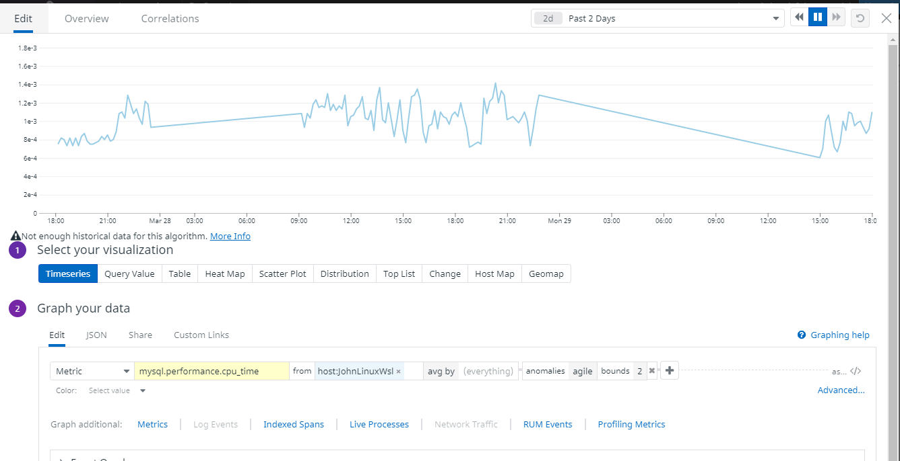

# Solutions Engineer

## Setting up the environment (Mac OS X)

Run the command below in your terminal in order to install datadog agent on your system. Replace `{YOUR API KEY GOES HERE}` with your api key.

```
DD_API_KEY={YOUR API KEY GOES HERE} bash -c "$(curl -L https://raw.githubusercontent.com/DataDog/datadog-agent/master/cmd/agent/install_mac_os.sh)"
```


Click [here](https://app.datadoghq.com/account/settings#agent/mac) for more details.

## Collecting Metrics

#### Add tags in the Agent config file and show us a screenshot of your host and its tags on the Host Map page in Datadog

In order to assign tags to your datadog Agent. follow the steps below:

1. Edit the file `~/.datadog-agent/datadog.yaml`, and add the following to it.
```
tags:
   - role:database
   - env:prod
```

After adding the lines above, your config file should look like this.

  

These lines add two tags to the Agent, `role:database` and `env:prod`.  

2. Restart the Agent.

3. Navigate to `https://app.datadoghq.com/infrastructure/map` in order to see your host map. Click one of your hosts to see more details about, i.e., running services, tags, etc.


#### Install a database on your machine (MongoDB, MySQL, or PostgreSQL) and then install the respective Datadog integration for that database.

1. Open your terminal and run the following command to install postgres.
```
brew install postgresql
```

2. After installing `postgres`, run the following commands to create a read-only user for `datadog` in the database.

```
create user datadog with password 'ZIIg1Upoe9x5KhLrhfRLjx66';
grant SELECT ON pg_stat_database to datadog;
```

```
psql -h localhost -U datadog postgres -c "select * from pg_stat_database LIMIT(1);" && \
echo -e "\e[0;32mPostgres connection - OK\e[0m" || \
echo -e "\e[0;31mCannot connect to Postgres\e[0m"
```

 When prompted for a password, enter:
`ZIIg1Upoe9x5KhLrhfRLjx66` or any other password you have picked.

3. Configure the Agent to connect to the PostgreSQL server.  
Edit `~/.datadog-agent/conf.d/postgres.d/conf.yaml` and add the lines below to it.

```
init_config:

instances:
   -   host: localhost
       port: 5432
       username: datadog
       password: ZIIg1Upoe9x5KhLrhfRLjx66
       tags:
            - postgresql
```

4. Restart the agent

5. Go to [datadog settings](https://app.datadoghq.com/account/settings) and install the postgres integration.


Click the button install and follow instructions.


After you installed the integration you will have access to it on the dashboard.


Click [here](https://app.datadoghq.com/account/settings#integrations/postgres) for more details.

#### Create a custom Agent check that submits a metric named my_metric with a random value between 0 and 1000.

You need to create a script file and a config file in order to create a custom metric and send it to datadog servers through the Agent.

1. Create
`~/.datadog-agent/checks.d/mymetric.py` and add the following code to it.

```
import random
from checks import AgentCheck

class RandomCheck(AgentCheck):
    def check(self, instance):
        self.gauge('my_metric', random.randint(0, 1000))
```


2. Create `~/.datadog-agent/conf.d/mymetric.yaml` and add the code below.
```
init_config:
instances:
    [{}]
```

3. Restart the Agent.


On your datadog dashboard, go to Metrics -> Explorer, and search for your custom metric.

The Agent is going to run in intervals of 15-20 seconds.

#### Change your check's collection interval so that it only submits the metric once every 45 seconds.

1. Edit the config file
`~/.datadog-agent/conf.d/mymetric.yaml` and change `the min_collection_interval` globally to the interval you want the agent to collect data.

```
init_config:
    min_collection_interval: 45
instances:
    [{}]
```
2. Restart the Agent.

#### Bonus Question Can you change the collection interval without modifying the Python check file you created?

Answer in the previous question. Collection interval was changed through config file.

## Visualizing Data

### Utilize the Datadog API to create a Timeboard that contains:

* Your custom metric scoped over your host.
* Any metric from the Integration on your Database with the anomaly function applied.
* Your custom metric with the rollup function applied to sum up all the points for the past hour into one bucket
* Please be sure, when submitting your hiring challenge, to include the script that you've used to create this Timeboard.

#### Steps to create a Timeboard

1. On Datadog dashboard: go to Dashboards -> New Dashboard
2. Enter the dashboard name and then click **New Timeboard**.
3. Drag the time series draggable icon on to the timecard in order to create a new graph.
4. Click on the JSON editor tab and paste the configuration below:
```
{
  "status": "done",
  "autoscale": true,
  "markers": [
    {
      "dim": "y",
      "type": "error dashed",
      "val": 0,
      "value": "y = 0"
    }
  ],
  "xaxis": {},
  "viz": "timeseries",
  "requests": [
    {
      "q": "avg:my_metric{host:pablo.nj}.rollup(sum, 60)",
      "type": "line",
      "style": {
        "palette": "dog_classic",
        "type": "solid",
        "width": "normal"
      },
      "conditional_formats": [],
      "aggregator": "avg"
    }
  ]
}
```

The image below displays the output of time series graph for my_metric.


#### Follow the steps described previously and paste the script below into the JSON editor tab in order to create an anomaly graph.
```
{
  "viz": "timeseries",
  "requests": [
    {
      "q": "anomalies(avg:postgresql.percent_usage_connections{host:pablo.nj}, 'basic', 2)",
      "type": "line",
      "style": {
        "palette": "dog_classic",
        "type": "solid",
        "width": "normal"
      },
      "conditional_formats": [],
      "aggregator": "avg"
    }
  ],
  "autoscale": true,
  "xaxis": {},
  "status": "done"
}
```
The image below displays the output of the anomaly graph.



Once this is created, access the Dashboard from your Dashboard List in the UI:

* Set the Timeboard's timeframe to the past 5 minutes
* Take a snapshot of this graph and use the @ notation to send it to yourself.

Bonus Question: What is the Anomaly graph displaying?

The Anomaly graph show when the metric behaved differently than it has in the past. We can easily spot two pikes in the graph above, that metric usually stays around 0.01, but in two distinct moments there were different behaviors caused by me, I opened several connections to the database so we could see something different in the graph.
This type of graph is well-suited for metrics that have a predicted behavior and similar pattern.


 Click [here](https://docs.datadoghq.com/monitors/monitor_types/anomaly/) to learn more about anomaly detection .


 ## Monitoring Data

 #### Create a new Metric Monitor that watches the average of your custom metric (my_metric) and will alert if it’s above the following values over the past 5 minutes:

Warning threshold of 500
Alerting threshold of 800
And also ensure that it will notify you if there is No Data for this query over the past 10m.

 1. On datadog dashboard, got to Monitors > New Monitor
 2. Select Metric.
 3. Select Threshold Alert to detect changes.
 4. You should define your metric as described below:
     - Metric = *my_check*
     - from = *host:pablo.nj*
     - Simple Alert
 5. Set alert conditions to the following:
     - Alert threshold = *800*
     - Warning threshold = *500*
     - *Notify* if data is missing for more than *10* minutes.
 6. In order to send e-mail with custom messagesSay what's happening :

 ```
 {{#is_alert}}
 <br/>Alert: Value has exceeded an average of 800 over the past 5 minutes.
 <br/>Value: {{value}}
 <br/>Host: {{host.name}}<br/>
 {{/is_alert}}
 <br/><br/>
 {{#is_warning}}
 <br/>Warning: Value has exceeded an average of 500 over the past 5 minutes.
 <br/>Value: {{value}}
 <br/>Host: {{host.ip}}
 <br/>{{/is_warning}}<br/><br/>
 {{#is_no_data}}<br/>
 Alert: No data over the past 10 minutes.<br/>
 Value: Unknown<br/>
 Host: {{host.name}}<br/>
 {{/is_no_data}}<br/><br/>
 Contact @pablo.rocha.moreira@flatironschool.com
```

 At the end, your config file should look like the code below.

```
{
  "name": "My Metric Monitor",
  "type": "metric alert",
  "query": "avg(last_5m):avg:my_metric{host:pablo.nj} > 800",
  "message": "{{#is_alert}}<br/>Alert: Value has exceeded an average of 800 over the past 5 minutes.<br/>Value: {{value}}<br/>Host: {{host.name}}<br/>{{/is_alert}}<br/><br/>{{#is_warning}}<br/>Warning: Value has exceeded an average of 500 over the past 5 minutes.<br/>Value: {{value}}<br/>Host: {{host.ip}}<br/>{{/is_warning}}<br/><br/>{{#is_no_data}}<br/>Alert: No data over the past 10 minutes.<br/>Value: Unknown<br/>Host: {{host.name}}<br/>{{/is_no_data}}<br/><br/>Contact @pablo.rocha.moreira@flatironschool.com",
  "tags": [],
  "options": {
  "notify_audit": false,
  "locked": false,
  "timeout_h": 0,
  "silenced": {
  "host:pablo.nj": 1539176400
  },
  "include_tags": false,
  "no_data_timeframe": 10,
  "new_host_delay": 300,
  "require_full_window": true,
  "notify_no_data": true,
  "renotify_interval": 0,
  "escalation_message": "",
  "thresholds": {
  "critical": 800,
  "warning": 500
  }
  }
}
```

*Requirement:* The monitor created with the script above sends different messages based on whether it is a warning, alert or if there is no data.


Warning


Alert


### Set up two scheduled downtimes for this monitor

1. Downtime that silences the monitor from 7pm to 9am daily on M-F  
  - On datadog dashboard go to Monitors > Manage Downtime.  
  - Click Schedule Downtime.    
  - Choose what to silence:
    - By monitor name
    - Monitor = <INSERT MONITOR NAME\>
    - Group scope = host:pablo.nj        
  - Specify the schedule:
    - Select Recurring
    - Start Date = 2018/10/09
    - Time Zone = America/New_York
    - Repeat Every = 1 days
    - Beginning = 07:00PM
    - Duration = 14 hours
    - Repeat Until = No end date
  - Add a message: (Create a custom message for your downtime)   

    ```Hello @pablo.rocha.moreira@flatironschool.com. This is your scheduled downtime. Just a heads up.```

2. Downtime during the whole Weekend  
  - On datadog dashboard go to Monitors > Manage Downtime.  
  - Choose what to silence:
     - By monitor name
     - Monitor = <INSERT MONITOR NAME>
     - Group scope = host:vagrant  
  - Specify a schedule:
     - Select Recurring
     - Start Date = 2018/10/13
     - Time Zone = America/New_York
     - Repeat Every = 1 weeks
     - Repeat On = Sun, Sat
     - Beginning = 12:00AM
     - Duration = 24 hours
     - Repeat Until = No end date
  - Add a message: (Create a custom message for your downtime)  


    ```Hello @pablo.rocha.moreira@flatironschool.com. This is your scheduled downtime. Just a heads up.```


Downtime on weekdays
<br/>
<br/>


Downtime on weekends


## Collecting APM Data

1. Install ddtrace and flask
    ```
    sudo pip install ddtrace
    sudo pip install flask
    ```
 2. Create your `app.py` file:
    ```
    from flask import Flask
    import logging
    import sys

    # Have flask use stdout as the logger
    main_logger = logging.getLogger()
    main_logger.setLevel(logging.DEBUG)
    c = logging.StreamHandler(sys.stdout)
    formatter = logging.Formatter('%(asctime)s - %(name)s - %(levelname)s - %(message)s')
    c.setFormatter(formatter)
    main_logger.addHandler(c)

    app = Flask(__name__)

    @app.route('/')
    def api_entry():
        return 'Entrypoint to the Application'

    @app.route('/api/apm')
    def apm_endpoint():
        return 'Getting APM Started'

    @app.route('/api/trace')
    def trace_endpoint():
        return 'Posting Traces'

    if __name__ == '__main__':
        app.run(host='0.0.0.0', port='5050')
    ```
    Check out [app.py](./app.py).

3. Add execution permission to your `app.py` file.
    ```
    $ chmod +x app.py
    ```
4. Download datadog Trace Agent for Mac OS

    [https://github.com/DataDog/datadog-trace-agent/releases/download/6.5.0/trace-agent-darwin-amd64-6.5.0](https://github.com/DataDog/datadog-trace-agent/releases/download/6.5.0/trace-agent-darwin-amd64-6.5.0)

 5. Start datadog trace agent before running your app: (execute the command below in the terminal)
    ```
    $ ./trace-agent-darwin-amd64-X.Y.Z -config /opt/datadog-agent/etc/datadog.yaml
    ```
 6. Now run the application using ddtrace:
    ```
    ddtrace-run python app.py
    ```
 7. Make calls to the API on the browser by accessing any of the three: (execute the commands below in the terminal)
     ```
     curl http://localhost:8080/
     curl http://localhost:8080/api/trace
     curl http://localhost:8080/api/apm
     ```

### Dashboard with both APM and Infrastructure Metrics


[Dashboard - APM and Infrastructure Metrics](https://p.datadoghq.com/sb/94e394671-c6a382157535c9b75e43d100a6efd1ea)

### What is the difference between a service and a resource
A *service* can be defined as a self-contained, independently developed, deployed, managed, and maintained software implementation supporting specific business-relevant functionality for an enterprise as a whole and is “integratable” by design. A “Service” is defined by a verb ( For example, “validate customer’s credit score”, which describes the business function it implements.)

A *resource* can be defined as a directly-accessible, independently-developed, deployed, managed and maintained software artifact supporting specific data. A resource is defined by a noun for example, “doctor’s appointment” that describes the data provided by the resource. A resource can also relateto other resources and provide a reference (link) to them. In effect, a resource is similar to an object[6], but with a predefined (CRUDish) interface semantic.

[More details](https://dotnetsoul.wordpress.com/2011/08/16/difference-between-services-and-resources-related-to-webservice-and-rest/)

### Final Question
Datadog has been used in a lot of creative ways in the past. We’ve written some blog posts about using Datadog to monitor the NYC Subway System, Pokemon Go, and even office restroom availability!

Is there anything creative you would use Datadog for?

Smart homes is a rich environment to use datadog. Datadog could be connected to the house and collect sensors data, i.e., doors and windows sensors. In this case I would be able to see if someone opened a door or a window. If someone enters my house I would be notified right away. I could use datadog to check how much food I have, if there is something not working properly in the smart home.
