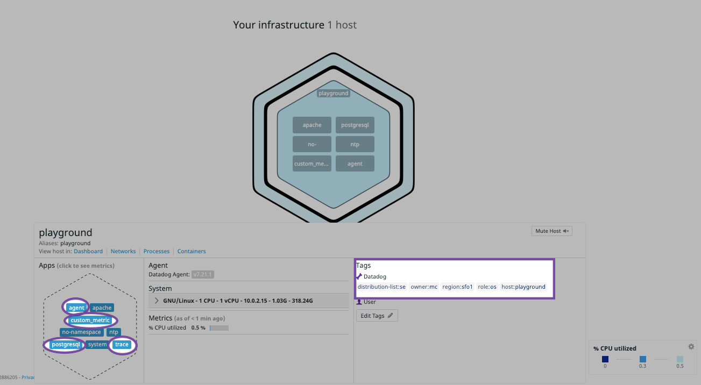

#### Steven's Preface/Comments
Candidate Name: Steven Chung
I already had Datadog Agent installed, so I opted to just use my personal computer; I can replicate on a Vagrant VM, so feel free to let me know.

### Level 1 - Collecting Your Data

##### Bonus question: In your own words, what is the Agent?

The Datadog Agent is a piece of software that runs on and monitors a given host.  In the context of this exercise, the host is Steven's Macbook, but it could easily be some node/service that is not someone's personal computer.

The Agent monitors the host to reliably gather metrics and events that may occur.  Datadog, as a whole, ingests said information and visualizes the information for a user to offer some actionable insight.

##### Add tags in the Agent config file and show us a screenshot of your host and its tags on the Host Map page in Datadog.

Datadog Config File
<p align="center">
  
</p>

Datadog Host Map
<p align="center">
  
</p>

##### Install a database on your machine (MongoDB, MySQL, or PostgreSQL) and then install the respective Datadog integration for that database.

Datadog Info Output
<p align="center">
  
</p>

##### Write a custom Agent check that samples a random value. Call this new metric: `test.support.random`

```python
from checks import AgentCheck
import random

class RandomCheck(AgentCheck):
    def check(self, instance):
        self.gauge('test.support.random', random.random())
```

### Level 2 - Visualizing Your Data

##### What is the difference between a timeboard and a screenboard?
All graphs on a timeboard are synced to the same time.  Thus, it's intended for inference and/or correlation tied to a given point in time; for example, an uptick in one metric may be associated with a similar relationship in another metric at the same point in time.

The screenboard does not have the same time scoping and is intended for a high-level overview.  Different pieces can have a different timeframe.
##### Clone of Dashboard with custom Agent Check

This denotes the custom dashboard (psql with the custom Agent check).  As instructed, there's also a snapshot and notification for a >0.90 value in `test.support.random`.
<p align="center">
  
</p>

[Link to Dashboard](https://app.datadoghq.com/dash/214605/supportassignment?live=true&page=0&is_auto=false&from_ts=1479686466904&to_ts=1479690066904&tile_size=m)

### Level 3 - Alerting on your Data
##### Bonus points:  Make it a multi-alert by host so that you won't have to recreate it if your infrastructure scales up.
Monitor should fulfill the above.
<p align="center">
  
</p>

##### Bonus: Since this monitor is going to alert pretty often, you don't want to be alerted when you are out of the office. Set up a scheduled downtime for this monitor that silences it from 7pm to 9am daily. Make sure that your email is notified when you schedule the downtime and take a screenshot of that notification.
Downtime should fulfill the above.
<p align="center">
  
</p>

##### This monitor should alert you within 15 minutes. So when it does, take a screenshot of the email that it sends you.
Notification e-mail warning me about a >0.90 value.
<p align="center">
  
</p>
