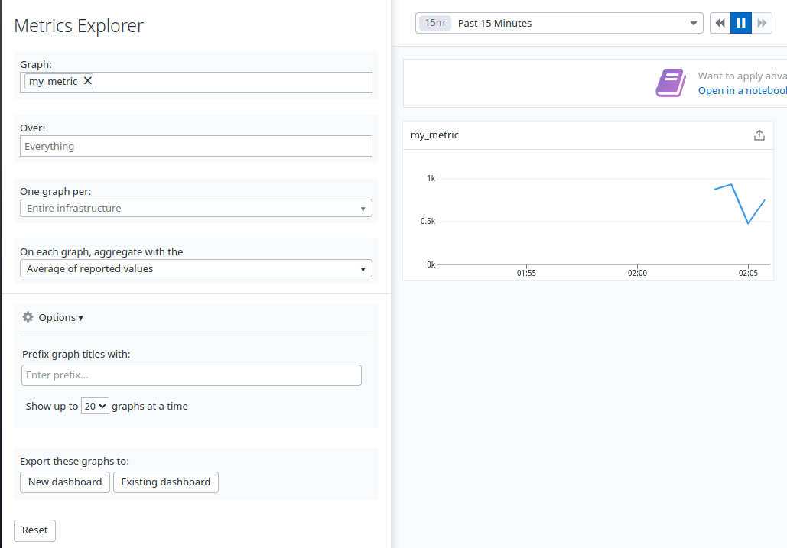
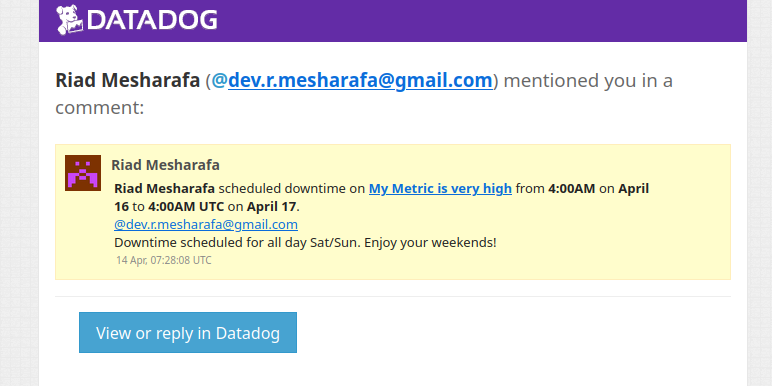
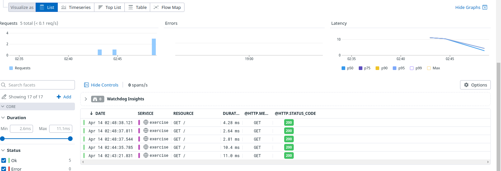

## Datadog Hiring Exercise - Commercial Sales Engineer
New York City, US
Riad Mesharafa
April, 2022

I appreciate the opportunity to complete this technical challenge, and I truly enjoyed the deep-dive into Datadog's data analytics tools.


## Setup the environment
For the purpose of this exercise, I decided to setup a virtual machine running the latest release of Ubuntu, 21.10 (Impish Indri) under Virtualbox.

After installing Ubuntu onto the virtual machine, we install then the datadog agent using the one-line install command found [here](https://app.datadoghq.com/account/settings#agent/ubuntu): `DD_AGENT_MAJOR_VERSION=7 DD_API_KEY=expunged DD_SITE="datadoghq.com" bash -c "$(curl -L https://s3.amazonaws.com/dd-agent/scripts/install_script.sh)"`
The output of `systemctl status datadog-agent` showed that the agent had been successfully installed and started up.

## Collecting Metrics
### Tags
I modified `/etc/datadog-agent/datadog.yml` to add some tags:
```
tags:
 - db:postgres
 - location:us_east
 - team:sales
```

On Ubuntu, the `systemctl restart datadog-agent` command can be used to restart the agent so that the config changes take effect. `datadog-agent status` can be used to check the current status of the agent, and we can now see that the tags have been properly configured.
```
  Hostnames
  =========
    hostname: ubuntuvm
    socket-fqdn: ubuntuvm
    socket-hostname: ubuntuvm
    host tags:
      db:postgres
      location:us_east
      team:sales
```
These changes are also reflected on the host map in Datadog.

### Database
For this exercise, I went with PostgreSQL. The [documentation](https://docs.datadoghq.com/integrations/postgres/) for the Postgres integration shows that the integration already comes with the agent. I used the commands from the documentation to configure PostgreSQL for use with Datadog.
`sudo -u postgres psql`
```
postgres=# create user datadog with password '<PASSWORD>';
CREATE ROLE
postgres=# grant pg_monitor to datadog;
GRANT ROLE
postgres=# grant SELECT ON pg_stat_database to datadog;
GRANT
postgres=# exit
```
To configure the agent I created `/etc/datadog-agent/conf.d/postgres.d/conf.yaml`
```
init_config:
instances:
  - host: localhost
    username: datadog
    password: '<PASSWORD>'
    collect_bloat_metrics: false
    disable_generic_tags: true

```
After a `systemctl restart datadog-agent` and `datadog-agent status`  the output displays that the PostgreSQL integration has been properly configured.
```
    postgres (12.1.1)
    -----------------
      Instance ID: postgres:8a9796c728545a2 [OK]
      Configuration Source: file:/etc/datadog-agent/conf.d/postgres.d/conf.yaml
      Total Runs: 3
      Metric Samples: Last Run: 14, Total: 42
      Events: Last Run: 0, Total: 0
      Service Checks: Last Run: 1, Total: 3
      Average Execution Time : 28ms
      Last Execution Date : 2022-04-14 06:02:33 UTC (1649916153000)
      Last Successful Execution Date : 2022-04-14 06:02:33 UTC (1649916153000)
      metadata:
        version.major: 13
        version.minor: 6
        version.patch: 0
        version.raw: 13.6 (Ubuntu 13.6-0ubuntu0.21.10.1)
        version.scheme: semver
```
### Custom agent check
The [docs](https://docs.datadoghq.com/developers/write_agent_check/?tab=agentv6v7) provide information on how to write custom checks for the Datadog agent.
First, create `conf.d/my_metric.yaml`:
```
instances: [{}]
```
Then, create the `checks.d/my_metric.py` file with the following contents, which are modified from the hello.py example in the documentation
```py
from checks import AgentCheck
from random import randint

class RandCheck(AgentCheck):
    def check(self, instance):
        self.gauge('my_metric', randint(0,1000))
```
Reload the config with `systemctl restart datadog-agent` and check the output of `datadog-agent check my_metric`, to make sure it's configured properly:
```
    my_metric (unversioned)
    -----------------------
      Instance ID: my_metric:5ba864f3937b5bad [OK]
      Configuration Source: file:/etc/datadog-agent/conf.d/my_metric.yaml
      Total Runs: 1
      Metric Samples: Last Run: 1, Total: 1
      Events: Last Run: 0, Total: 0
      Service Checks: Last Run: 0, Total: 0
      Average Execution Time : 2ms
      Last Execution Date : 2022-04-14 06:04:39 UTC (1649916279000)
      Last Successful Execution Date : 2022-04-14 06:04:39 UTC (1649916279000)
```
After a few moments, the graph for the my_metric metric becomes populated in Datadog's Metrics Explorer.

The collection interval for this check could be changed using the `min_collection_interval` option in the config file. The code below shows the new contents of `conf.d/my_metric.yaml`:
```yaml
instances:
  - min_collection_interval: 45
```
**Bonus Question**: Can you change the collection interval without modifying the Python check file you created?
**Answer**: As shown above, the collection interval can be modified without making any changes to the Python file in `checks.d`.
### Visualizing Data
According to the [datadog api docs](https://docs.datadoghq.com/api/latest/dashboards/), creating a Dashboard is done with an authenticated POST request. Authenticating for API requests requires an API key and an application key, which can be generated [here](https://app.datadoghq.com/organization-settings/api-keys) and [here](https://app.datadoghq.com/organization-settings/application-keys) respectively. I went with `curl` to create this timeboard using a one-shot script, as `curl` is robust and available for installation on virtually every Linux distribution, and already comes preinstalled on many distributions.
```python
#!/bin/sh
curl -X POST \
  https://api.datadoghq.com/api/v1/dashboard \
  -H 'Content-Type: application/json' \
  -H 'DD-API-KEY: expunged' \
  -H 'DD-APPLICATION-KEY: expunged' \
-d @- << EOF
{
    "title": "SE Technical Exercise Dashboard",
    "description": "",
    "widgets": [
        {
            "definition": {
                "title": "Time spent writing (PostgreSQL)",
                "time": {},
                "type": "timeseries",
                "requests": [
                    {
                        "q": "anomalies(avg:postgresql.bgwriter.write_time{host:ubuntuvm}.as_count(), 'basic', 2)",
                        "style": {
                            "palette": "dog_classic",
                            "line_type": "solid",
                            "line_width": "normal"
                        },
                        "display_type": "line"
                    }
                ]
            }
        },
        {
            "definition": {
                "title": "My Metric (Ubuntu VM)",
        "type": "timeseries",
                "requests": [
                    {
                        "q": "my_metric{host:ubuntuvm}",
                        "style": {
                            "palette": "dog_classic",
                            "line_type": "solid",
                            "line_width": "normal"
                        },
                        "display_type": "line"
                    }
                ]
            }
        },
        {
            "definition": {
                "title": "My Metric (Rolled Up)",
                "type": "timeseries",
                "requests": [
                    {
                        "q": "sum:my_metric{host:ubuntuvm}.rollup(sum, 3600)",
                        "style": {
                            "palette": "dog_classic",
                            "line_type": "solid",
                            "line_width": "normal"
                        },
                        "display_type": "line"
                    }
                ]
            }
        }
    ],
    "layout_type": "ordered"
}
EOF
```
Full dashboard:
https://p.datadoghq.com/sb/5a8d0c1a-bbb6-11ec-96a1-da7ad0900002-a73d9a1cf2eaf6a58234c7a8e88d7781


Snapshot taken of the graph:


**Bonus question**: What is the Anomaly graph displaying?
**Answer**: The graph displays data that is two standard deviations off from the expected value. These expected values are predicted using the `basic` algorithm.
[The documentation for anomolies()](https://docs.datadoghq.com/monitors/create/types/anomaly/) says that the basic algorithm uses a simple lagging rolling quantile computation to determine the range of expected values. This is used for metrics with no repeating seasonal pattern. This algorithm uses little data but has no knowledge of seasonal behaviors, or longer trends.
### Monitoring Data
For setting alerts, Datadog allows us to set different thresholds for when a warning should be triggered and for when an alert should be triggered. In addition, Datadog allows us to inject template variables into the contents of alert messages. We can use the templating system to send different messages to the team depending on the status of the monitor.


```
{{#is_alert}}
**ALERT**
Values of My Metric are past the alert threshold.
It reached {{value}} on {{host.ip}}.
{{/is_alert}}
{{#is_warning}}
**Warning**
Values of My Metric have triggered the warning threshold.
{{/is_warning}}
{{#is_no_data}}
**NO DATA** has been received for My Metric in the past ten minutes.
{{/is_no_data}} 
@all
```


**Bonus question**
Scheduling downtime is done with RRULEs/"recurrance rules" which describe a repeating pattern for events. Datadog also provides a UI for scheduling downtimes without having to manually write RRULEs.
(The notification emails sent with UTC timestamps, and the downtime is scheduled for 7P-9A EDT time)




### Tracing
Datadog's APM solution supports various languages, including Go, C++, Ruby, and Node.JS, and Python. In order to trace the provided Python script, the  `ddtrace` Python library can be used. The script also depends on `flask` web framework. Both of these libraries can be installed using `sudo apt install python3-pip` `pip3 install ddtrace flask`. After running the program with `DD_SERVICE="exercise" DD_ENV="prod" DD_LOGS_INJECTION=true ddtrace-run python3 exercise.py` the web UI now displays that Datadog's APM solution is working with instrumenting the Python program. `curl` requests were made to `localhost:5050` to simulate users making requests to the webserver.

The APM live search allows us to filter across traces in realtime. The List View lists requests that have been made to the application being instrumented, displaying the status code and path of each request. Each span that makes up a request made can be viewed through this UI, as well as insight on how many requests were being made at a specific time.



Dashboard: https://p.datadoghq.com/sb/5a8d0c1a-bbb6-11ec-96a1-da7ad0900002-cb0c4d4410bb7f10e1b9b5c73920ea18


**Bonus question:** What is the difference between a Service and a Resource?
**Answer:** In REST applications, what Flask is often used to create, a Resource is an object with an endpoint and a set of methods that may operate on a resource. A service is a collection of resources that have relationships with other resources in the service. Example: A service may provide access to user information as Resources, with a different endpoint representing different users, GET/PUT methods to retreive and modify user information, and the DELETE method to delete users.


**Final Question:** Is there anything creative you would use Datadog for?
**Answer:** :Datadog's realtime monitoring solution can help reduce and eliminate the downtime of manufacturing machine and engines.  Real-time sensors built within machines allow data driven monitoring and data could be sent to Datadog through the agent. In return, Datadog could use this information to automatically detect unexpected issues in real time or to predict anomalies ahead of time by using machine learning, and therefore minimize or eliminate downtime.
