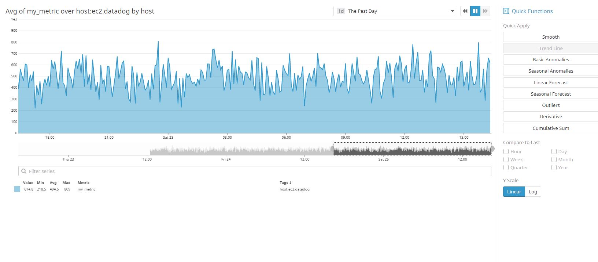

## Prerequisites - Setup the environment

I spun up a new Amazon Linux EC2 instance in AWS as my Datadog host for this exercise - this new host is ready to use within minutes of logging into the AWS dashboard and navigating to the EC2 service.  The following is a very useful link to the Datadog documentation and support pages: [Datadog docs](https://docs.datadoghq.com/) 

I then installed the Datadog agent on the EC2 instance according to the Datadog agent instructions here:

[agent installation](https://app.datadoghq.com/account/settings#agent/aws)

The agent can be very easily deployed using the command below which can be directly copied from the Datadog portal which even conveniently fills in your API key for you when you are logged into your account. 

``DD_API_KEY=xxxxxx bash -c "$(curl -L https://raw.githubusercontent.com/DataDog/datadog-agent/master/cmd/agent/install_script.sh)"
``

(actual API key removed from command for privacy reasons)

The agent started and reported back to the Datadog UI as can be seen in the screenshot below:


## Collecting Metrics:

* Add tags in the Agent config file and show us a screenshot of your host and its tags on the Host Map page in Datadog.

Instructions and an explanation of the function of tags can be found here: [Tags](https://docs.datadoghq.com/tagging/)

The Agent configuration file (datadog.yaml) can be used to set host tags which apply to all metrics, traces, and logs forwarded by the Datadog Agent.  I added the following atgs to my host:

1) ec2_linux_ami  (this tag indicates an EC2 instance and the OS)
2) env:prod       (tag indicates that the host is in production)
3) role:mysql     (tag indicates that this is also a MySQL host)

see screenshot of the definition of tags in the datadog.yaml file


See screenshot below (I also added the agent to a second EC2 host just to see what it looks like in the UI):


* Install a database on your machine (MongoDB, MySQL, or PostgreSQL) and then install the respective Datadog integration for that database.

I installed a MySQL database and created a test database as you can see from the screenshots below and the tag on my host - see below:

```
sudo yum install mysql-server
sudo service mysqld start
mysql -u root -p

CREATE DATABASE  Employee;
use Employee;
create table Info (EmpId INT, First_Name VARCHAR(20),Last_Name VARCHAR(20),Address VARCHAR(20),City VARCHAR(15), Department VARCHAR(10),Salary INT);
insert into Info values ( "1" , "Tom" , "Parker" , "WestStreet" , "Las Vegas" , "Accounts" , 1000 );

CREATE USER 'datadog'@'localhost' IDENTIFIED BY 'datadog';
GRANT REPLICATION CLIENT ON *.* TO 'datadog'@'localhost' WITH MAX_USER_CONNECTIONS 5;
GRANT PROCESS ON *.* TO 'datadog'@'localhost';
GRANT SELECT ON performance_schema.* TO 'datadog'@'localhost';

```


and then created the Datadog MySQL users and edited the conf & log files as per the integration instuctions


* Create a custom Agent check that submits a metric named my_metric with a random value between 0 and 1000.

See the screenshot of my_metric below:



see files in the code directory in this repo to show my configuration of this metric:

/etc/datadog-agent/conf.d/custom_my_metric.yaml

/etc/datadog-agent/checks.d/custom_my_metric.py

[custom_my_metric.yaml](code/custom_my_metric.yaml)

[custom_my_metric.py](code/custom_my_metric.py)

[link to live graph](https://app.datadoghq.com/graph/embed?from_ts=1558776583626&to_ts=1558862983626&token=f9edbc66ec0b32530e088dabe704c14fae0a807c5d15050e03a23844c31fd60b&height=500&width=1000&legend=true&tile_size=m&live=true)


* Change your check's collection interval so that it only submits the metric once every 45 seconds.

This is done in the yaml file: /etc/datadog-agent/conf.d/custom_my_metric.yaml

``min_collection_interval: 45
``

* **Bonus Question** Can you change the collection interval without modifying the Python check file you created?

Yes, change the YAML file instead of the python file as follows, for example, to change the collection interval to 50 seconds, do:

``min_collection_interval: 50
``

## Visualizing Data:

Utilize the Datadog API to create a Timeboard that contains:

* Your custom metric scoped over your host.
* Any metric from the Integration on your Database with the anomaly function applied.
* Your custom metric with the rollup function applied to sum up all the points for the past hour into one bucket

see script in the code section for my API call: [api_call.py](code/api_call.py)


Once this is created, access the Dashboard from your Dashboard List in the UI:

* Set the Timeboard's timeframe to the past 5 minutes

Timeboard can only be set to a minimum of the last 15 mins in the UI as far as I can tell?


* Take a snapshot of this graph and use the @ notation to send it to yourself.

See the screenshot of the email below:


* **Bonus Question**: What is the Anomaly graph displaying?

The anomaly graph is telling me that it doesn't have enough historical data yet for this algorithm.


## Monitoring Data

Since you’ve already caught your test metric going above 800 once, you don’t want to have to continually watch this dashboard to be alerted when it goes above 800 again. So let’s make life easier by creating a monitor.

Create a new Metric Monitor that watches the average of your custom metric (my_metric) and will alert if it’s above the following values over the past 5 minutes:

* Warning threshold of 500
* Alerting threshold of 800
* And also ensure that it will notify you if there is No Data for this query over the past 10m.

See the configuration of my monitor below:


Please configure the monitor’s message so that it will:

* Send you an email whenever the monitor triggers.
* Create different messages based on whether the monitor is in an Alert, Warning, or No Data state.
* Include the metric value that caused the monitor to trigger and host ip when the Monitor triggers an Alert state.
* When this monitor sends you an email notification, take a screenshot of the email that it sends you.

See the email screenshot below:


(note: the host IP is not displaying in the email even though I asked for it to be sent in the definition of the monitor - to be investigated later why not)


* **Bonus Question**: Since this monitor is going to alert pretty often, you don’t want to be alerted when you are out of the office. Set up two scheduled downtimes for this monitor:

  * One that silences it from 7pm to 9am daily on M-F,
  * And one that silences it all day on Sat-Sun.
  * Make sure that your email is notified when you schedule the downtime and take a screenshot of that notification.
  
email notification of scheduled downtime below:


and the downtime definitions below:


## Collecting APM Data:

I used the given Flask app in my exercise - see [apm_app.py](code/apm_app.py) in the code folder

I installed ddtrace and Flask and ran ddtrace using the commands below:

```
sudo pip install ddtrace
sudo pip install flask
ddtrace-run python apm_app.py
```

Using a browser, I generated some events by going to the web resources that the flask server presents.  Using the public IP of the EC2 instance as follows:


* **Bonus Question**: What is the difference between a Service and a Resource?

A service is a set of processes that have the same function like a wep application or a database.
A resource is, for example, an individual web page or a particular database query.


Provide a link and a screenshot of a Dashboard with both APM and Infrastructure Metrics.

Screenshot of Flask and infra metrics:


[link to live graph](https://app.datadoghq.com/graph/embed?token=66e6b3184efe1dffcec43b56d9bdbdd8f1f5744192a1aaa307120fc310e1958b&height=400&width=800&legend=true)


Please include your fully instrumented app in your submission, as well.

see my app here: [apm_app.py](code/apm_app.py)


## Final Question:

Datadog has been used in a lot of creative ways in the past. We’ve written some blog posts about using Datadog to monitor the NYC Subway System, Pokemon Go, and even office restroom availability!

Is there anything creative you would use Datadog for?


Yes, I would use Datadog to send alerts from Twitter streams/tweets every time my company name was mentioned on Twitter.  The Twitter stream could be accessed using the Twitter API and parsed for my company name and then sent on to Datadog using the Datadog API.  Using this, the company could monitor mentions of products and assess their popularity and/or any support issues.  A further refinement would be to assess the sentiment of the tweets and group them accordingly before sending them to Datadog.

You can find the starting point for the Twitter API here:
[Twitter API](https://developer.twitter.com/en/docs.html)
