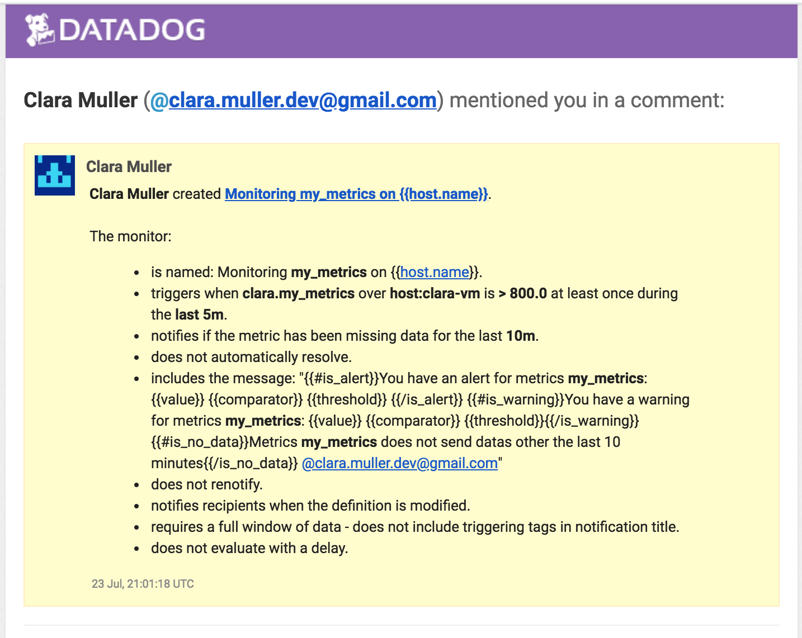

## Prerequisites - Setup the environment

* You can spin up a fresh linux VM via Vagrant or other tools so that you don’t run into any OS or dependency issues. Here are instructions for setting up a Vagrant Ubuntu VM. We strongly recommend using minimum v. 16.04 to avoid dependency issues.
* Then, sign up for Datadog (use “Datadog Recruiting Candidate” in the “Company” field), get the Agent reporting metrics from your local machine.

I choose to create a fresh Ubuntu VM to avoid conflict with my day to day coding environnement


I created a datadog account with my mail address `clara.muller.dev@gmail.com`

## Collecting Metrics:

#### Add tags in the Agent config file and show us a screenshot of your host and its tags on the Host Map page in Datadog.

From documentation [Tagging](https://docs.datadoghq.com/getting_started/tagging/)

* Add tag on your agent

```
% cat /etc/datadog-agent/conf.d/datadog.yaml
# Set the host's tags (optional)
tags: env:claravm, role:tobedefined
```

* See results on website


#### Install a database on your machine (MongoDB, MySQL, or PostgreSQL) and then install the respective Datadog integration for that database.

From documentation [MySQL](https://docs.datadoghq.com/integrations/mysql/)

* Create a User

```
mysql> CREATE USER 'datadog'@'localhost' IDENTIFIED BY '<UNIQUEPASSWORD>';
Query OK, 0 rows affected (0.00 sec)
```

* Check if creation went well

```
mysql -u datadog --password=<UNIQUEPASSWORD> -e "show status" | \
grep Uptime && echo -e "\033[0;32mMySQL user - OK\033[0m" || \
echo -e "\033[0;31mCannot connect to MySQL\033[0m"
mysql -u datadog --password=<UNIQUEPASSWORD> -e "show slave status" && \
echo -e "\033[0;32mMySQL grant - OK\033[0m" || \
echo -e "\033[0;31mMissing REPLICATION CLIENT grant\033[0m"
```


*  Add configuration for the agent

```
% cat /etc/datadog-agent/conf.d/mysql.d/conf.yaml
init_config:

instances:
    - server: 127.0.0.1
        user: datadog
        pass: 'iloveyou' # from the CREATE USER step earlier
        port: 3306 # e.g. 3306
        options:
            replication: 0
            galera_cluster: 1
            extra_status_metrics: true
            extra_innodb_metrics: true
            extra_performance_metrics: true
            schema_size_metrics: false
            disable_innodb_metrics: false
```


#### Create a custom Agent check that submits a metric named my_metric with a random value between 0 and 1000.

From documentation [Write an Agent Check](https://docs.datadoghq.com/developers/agent_checks/)

* Create your custom python agent

```
% cat /etc/datadog-agent/checks.d/clara.py
from checks import AgentCheck
import random

class ClaraCheck(AgentCheck):

def check(self, instance):
	self.gauge('clara.my_metrics',
           random.randint(0, 1000)
```

* Add config file for your agent

```
% cat /etc/datadog-agent/conf.d/clara.yaml
init_config:

instances:
[{}]
```

#### Change your check's collection interval so that it only submits the metric once every 45 seconds.
* **Bonus Question** Can you change the collection interval without modifying the Python check file you created?

```
% cat /etc/datadog-agent/conf.d/clara.yaml
init_config:

instances:
    - min_collection_interval: 45
```


## Visualizing Data:

Please be sure, when submitting your hiring challenge, to include the script that you've used to create this Timeboard.

Utilize the Datadog API to create a Timeboard that contains:

#### Your custom metric scoped over your host.

```
{
   "viz": "timeseries",
   "requests": [
      {
          "q": "avg:clara.my_metrics{host:clara-vm} by {host}",
          "type": "area",
          "style": {
              "palette": "dog_classic",
              "type": "solid",
              "width": "normal"
        },
        "conditional_formats": [],
        "aggregator": "avg"
      }
    ],
    "autoscale": true,
    "status": "done"
}
```

#### Any metric from the Integration on your Database with the anomaly function applied.

```
{
  "viz": "timeseries",
  "status": "done",
  "requests": [
    {
      "q": "anomalies(avg:mysql.net.connections{host:clara-vm}, 'basic', 2)",
      "type": "line",
      "style": {
        "palette": "dog_classic",
        "type": "solid",
        "width": "normal"
      },
      "conditional_formats": [],
      "aggregator": "avg"
    }
  ],
  "autoscale": true
}
```

#### Your custom metric with the rollup function applied to sum up all the points for the past hour into one bucket

```
{
  "viz": "query_value",
  "requests": [
    {
      "q": "avg:clara.my_metrics{host:clara-vm}.rollup(sum, 3600)",
      "type": "line",
      "style": {
        "palette": "dog_classic",
        "type": "solid",
        "width": "normal"
      },
      "conditional_formats": [],
      "aggregator": "avg"
    }
  ],
  "autoscale": true,
  "status": "done"
}
```


Once this is created, access the Dashboard from your Dashboard List in the UI:

* Set the Timeboard's timeframe to the past 5 minutes
* Take a snapshot of this graph and use the @ notation to send it to yourself.


* **Bonus Question**: What is the Anomaly graph displaying?


According to documentation, anomaly function is used to detect unexpected behaviour in monitoring.

## Monitoring Data

Since you’ve already caught your test metric going above 800 once, you don’t want to have to continually watch this dashboard to be alerted when it goes above 800 again. So let’s make life easier by creating a monitor.

Create a new Metric Monitor that watches the average of your custom metric (my_metric) and will alert if it’s above the following values over the past 5 minutes:

* Warning threshold of 500
* Alerting threshold of 800
* And also ensure that it will notify you if there is No Data for this query over the past 10m.

Please configure the monitor’s message so that it will:

* Send you an email whenever the monitor triggers.
* Create different messages based on whether the monitor is in an Alert, Warning, or No Data state.
* Include the metric value that caused the monitor to trigger and host ip when the Monitor triggers an Alert state.
* When this monitor sends you an email notification, take a screenshot of the email that it sends you.

```
{
	"name": "Monitoring **my_metrics** on {{host.name}}",
	"type": "metric alert",
	"query": "max(last_5m):avg:clara.my_metrics{host:clara-vm} > 800",
	"message": "{{#is_alert}}You have an alert for metrics **my_metrics**:  {{value}} {{comparator}} {{threshold}} {{/is_alert}} \n\n{{#is_warning}}You have a warning for metrics **my_metrics**:  {{value}} {{comparator}} {{threshold}}{{/is_warning}}\n\n{{#is_no_data}}Metrics **my_metrics** does not send datas other the last 10 minutes{{/is_no_data}}\n\n@clara.muller.dev@gmail.com",
	"tags": [],
	"options": {
		"timeout_h": 0,
		"notify_no_data": true,
		"no_data_timeframe": 10,
		"notify_audit": true,
		"require_full_window": true,
		"new_host_delay": 300,
		"include_tags": false,
		"escalation_message": "",
		"locked": false,
		"renotify_interval": "0",
		"thresholds": {
			"critical": 800,
			"warning": 500
		}
	}
}
```




* **Bonus Question**: Since this monitor is going to alert pretty often, you don’t want to be alerted when you are out of the office. Set up two scheduled downtimes for this monitor:

  * One that silences it from 7pm to 9am daily on M-F,
  * And one that silences it all day on Sat-Sun.
  * Make sure that your email is notified when you schedule the downtime and take a screenshot of that notification.


## Collecting APM Data:

#### Please include your fully instrumented app in your submission, as well.

With documentation [APM Setup](https://docs.datadoghq.com/tracing/setup/)

```python
from flask import Flask
import logging
import sys
from ddtrace import tracer

# Have flask use stdout as the logger
main_logger = logging.getLogger()
main_logger.setLevel(logging.DEBUG)
c = logging.StreamHandler(sys.stdout)
formatter = logging.Formatter('%(asctime)s - %(name)s - %(levelname)s - %(message)s')
c.setFormatter(formatter)
main_logger.addHandler(c)

app = Flask(__name__)

@app.route('/')
def api_entry():
    return 'Entrypoint to the Application'

@app.route('/api/apm')
def apm_endpoint():
    return 'Getting APM Started'

@app.route('/api/trace')
def trace_endpoint():
    with tracer.trace("web.request", service="my_service") as span:
        span.set_tag("clara-flask-app", "my_value")
    return 'Posting Traces'

if __name__ == '__main__':
    app.run(host='0.0.0.0', port='5050')
```

#### Provide a link and a screenshot of a Dashboard with both APM and Infrastructure Metrics.

I created this [Dashboard](https://app.datadoghq.com/dash/871300/apm-datas)


* **Bonus Question**: What is the difference between a Service and a Resource?

From documention [APM resource monotors](https://docs.datadoghq.com/tracing/getting_further/resource_monitor/)

> A service is a set of processes that do the same job</br>
> A resource is a particular action for a given service (typically an individual endpoint or query)

## Final Question:

Datadog has been used in a lot of creative ways in the past. We’ve written some blog posts about using Datadog to monitor the NYC Subway System, Pokemon Go, and even office restroom availability!

#### Is there anything creative you would use Datadog for?

I would monitoring how much tv show and/or movie I've dowloaded or watched to prevent spending all a weekend binge-watching it. ;)
