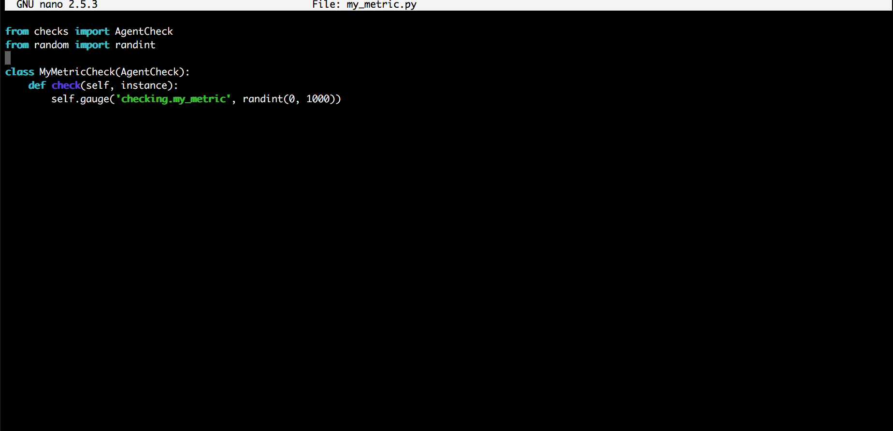

<!-- Your answers to the questions go here. -->

# Datadog Solutions Engineer Answers

## Introduction

Hey everybody (Hi Dr. Nick). Thanks for taking the time to go through my PR, please feel free to reach out if there's any information I can provide or any questions you may have.  I appreciate the opportunity to learn more about the Datadog team and thanks again for taking time out of your day to review my work.


### Prerequisites - Setup the environment

- 1a Vagrant + VirtualBox Setup: After installing Vagrant I spun up an Ubuntu 16 Linux VM [here](https://app.vagrantup.com/ubuntu/boxes/xenial64)  

- 1b I ssh'd into VM `vagrant ssh` and confirmed `v. 16.04` 

- 1c I signed up for Datadog and installed the Datadog Agent  successfully  ` DD_API_KEY=YOUR_API_KEY bash -c "$(curl -L https://raw.githubusercontent.com/DataDog/datadog-agent/master/cmd/agent/install_script.sh)"` 

- 1d I navigated to the [eventstream](https://app.datadoghq.com/event/stream) `https://app.datadoghq.com/event/stream` and confirmed Agent reporting from my local machine 


### Collecting Metrics

- 2a 2b Added two tags in the Agent config file `datadog.yaml` `example` and a key/value pair `env:prod`  

- 2c 2d restarted agent `sudo service datadog-agent restart` and confirmed via that tags added to agent yaml config file were accounted for on Host Map page  

- 2e 2f 2h 2i 2j 2k 2l I installed PostresSQL on my VM
  ```
    sudo apt-get update
    sudo apt-get install postgresql postgresql-contrib
  ```
  and then after confirming installation  I started postgres and followed [Datadog PostgreSQL integration and configuation instructions](https://app.datadoghq.com/account/settings#integrations/postgres)  and  and confirmed connection  and configured agent to connect to PostgreSQL server  and restarted the Agent  , checked the status `sudo datadog-agent status`  via CLI and the [relevant Dashboard](https://app.datadoghq.com/dash/integration/17/postgres---metrics) 

- 2m 2n 2o 2p I created a custom agent check named `my_metric` by adding both a .py file to the `checks.d` directory and also a `my_metric.d` subdirectory in the `conf.d` directory as well as a yaml config file `my_metric.yaml` .    The custom Agent check logs a random value btwn 0 and 1000 .

- 2q 2r 2s 2t Bonus: After confirming that my_metric custom agent check was being logged in the metrics dashboard !(2q)(./2q.png) I was able to change the the collection interval from the default 20seconds to 45 seconds by updating the yaml config file `min_collection_interval` key then restarting the agent and confirming the change in interval via the Dashboard    . I think this counts as changing the interval without changing the .py file. If I wanted to change it via the .py file via I suppose I could `time import` and invoke `time.sleep(_SOME_AMOUNT_OF_SECONDS)` or something hacky along those lines
