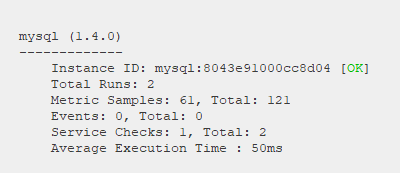

Your answers to the questions go here.

<h1>Collecting Metrics</h1>

I created a Ubuntu 18.04 VM on my local machine using Hyper-V.

<h2>Tags</h2>

I added two tags to the configuration file: datadog.yaml. 
<pre>location:dublin, purpose:hiring_test </pre>
Two files attached: configuration-file-tags.png & host-map-tags.png

<h2>Database</h2>

I installed MySQL and added the integration with the full metrics catalog.
After i checked the status of the agent using : 
<pre>  sudo datadog-agent status </pre>

I installed Apache and PhpMyAdmin in order to generate a few metrics and to be able to visualize it on the Mysql Overview Dashboard.

