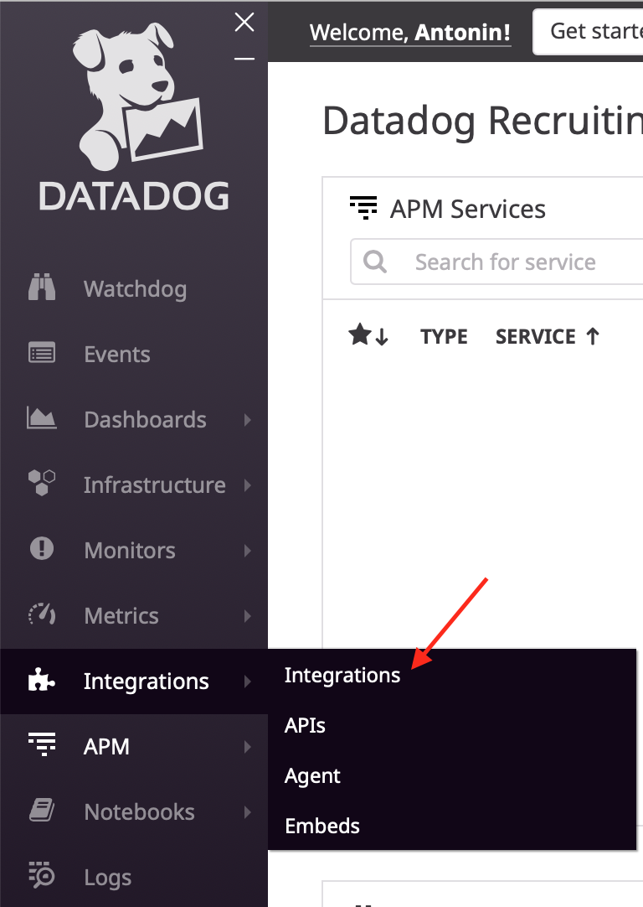
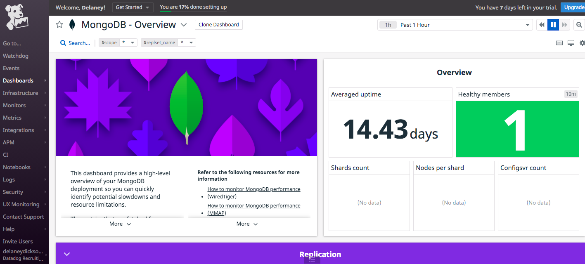
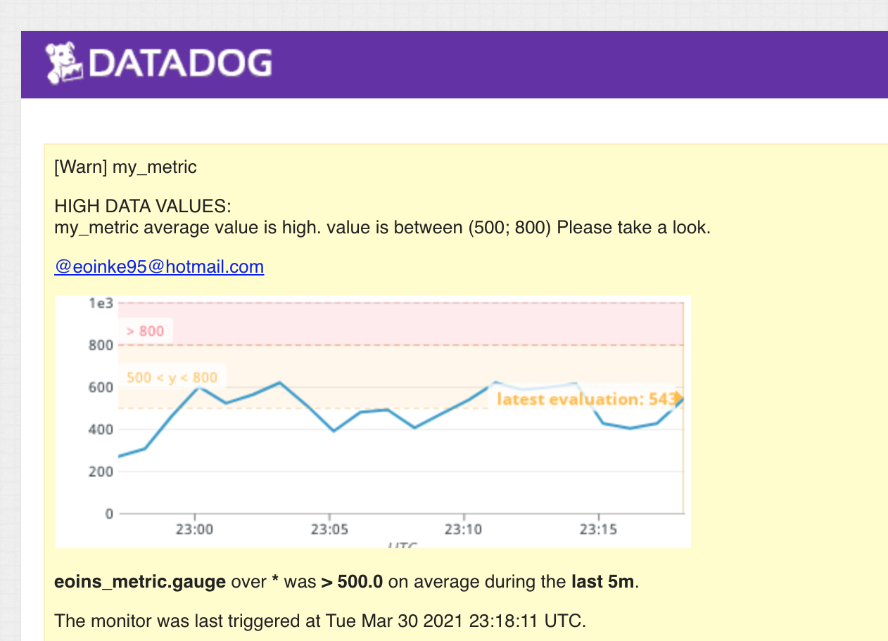
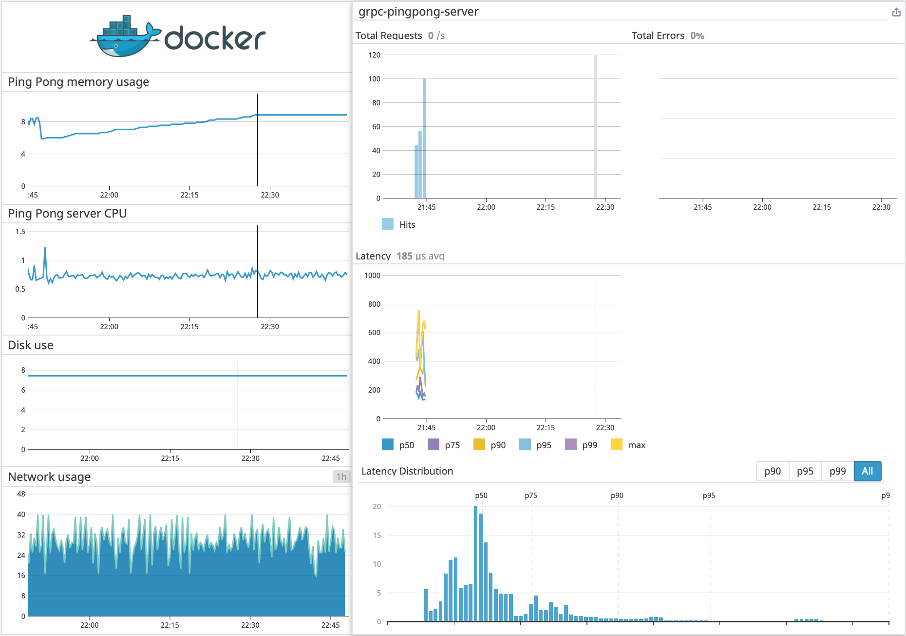

# Introduction

Hi, everyone. My name is Antonin Bruneau and in this exercise, I'll try to walk you through different features of the DataDog platform.

# Setup the environment

Before we get our hands on the tool, we need to set up a few things to get the exercise working.
All parts rely on Docker so you can use any OS that supports it. Please check [https://www.docker.com/get-started](https://www.docker.com/get-started)

You will need at least Docker version 17.12.0+ for this exercise.

I work on OSX, with Docker 19.03.8

You will also need a DataDog account you can request on the [DataDog home page](https://www.datadoghq.com)

# Collecting Metrics:
The first part of our exercise will be to deploy a DataDog agent to monitor our system.  
So let's create a few files and directory with the following structure:

```
_ docker
 |_ datadog
   |_ checks
   |_ conf
   |_ Dockerfile
 |_ env
   |_ datadog.env
 |_ docker-compose.yml
```

## DataDog agent

Let's start by the Dockerfile for the DataDog agent. We will start from the standard image and add a few files.

`docker/datadog/Dockerfile`:

```docker
FROM datadog/agent:7

COPY ./checks/* /etc/datadog-agent/checks.d/
COPY ./conf/* /etc/datadog-agent/conf.d/
```

To start the agent, we need an API Key. Go to your DataDog page to the APIs page:


And create a new key


We will store this key in an environment file along with some tags to identify our agent later.

`docker/env/datadog.env`:

```sh
DD_API_KEY=<your key>
DD_TAGS=owner:abruneau
```

Now that we have everything ready, we will configure our `docker-compose.yml` to run the agent:

```yaml
version: '3.5'

services: 
    datadog:
        build:
            context: ./datadog
            dockerfile: Dockerfile
        env_file: 
            - env/datadog.env
        volumes: 
            - /var/run/docker.sock:/var/run/docker.sock:ro
            - /proc/:/host/proc/:ro
            - /sys/fs/cgroup/:/host/sys/fs/cgroup:ro
```

After running `docker-compose up -d`, you should now be able to see your host in your DataDog app


## Adding MongoDB

To add some interest, we will add a Mongo database to our environment. DataDog will need a user to access the database. To do so, we will create a file `docker/mongo/datadog_setup.js`:

```js
db.createUser({
  "user":"datadog",
  "pwd": "hire_me",
  "roles" : [
    {role: 'read', db: 'admin' },
    {role: 'clusterMonitor', db: 'admin'},
    {role: 'read', db: 'local' }
  ]
})
```

Now we can add MongoDB to our `docker-compose.yml` file:

```yaml
version: '3.5'

services: 
    datadog:
        build:
            context: ./datadog
            dockerfile: Dockerfile
        env_file: 
            - env/datadog.env
        volumes: 
            - /var/run/docker.sock:/var/run/docker.sock:ro
            - /proc/:/host/proc/:ro
            - /sys/fs/cgroup/:/host/sys/fs/cgroup:ro

    mongo:
        image: mongo
        restart: always
        volumes: 
            - ./mongo/:/docker-entrypoint-initdb.d/
        environment:
            MONGO_INITDB_ROOT_USERNAME: root
            MONGO_INITDB_ROOT_PASSWORD: example
            MONGO_INITDB_DATABASE: admin
            DATADOG_USER_PASSWORD: hire_me
        labels: 
            com.datadoghq.ad.check_names: '["mongo"]'
            com.datadoghq.ad.init_configs: '[{}]'
            com.datadoghq.ad.instances: '[{"server": "mongodb://datadog:hire_me@%%host%%:%%port%%/admin", "replica_check": true, "additional_metrics": ["metrics.commands","tcmalloc","top","collection"]}]'
            com.datadoghq.ad.logs: '[{"source": "mongodb", "service": "mongo"}]'
```

We need to enable MongoDB integration. In your DataDog app, go to integration:



Search for MongoDB and enable it


If you run `docker-compose up -d` you should see a new MongoDB Dashboard in your app




## Creating a custom metric

Sometime, you might want to publish your metrics from a custom application.
We will simulate some data by creating a custom Agent that submits a metric with a random value between 0 and 1000. In the `docker/datadog/checks` directory, create a `custom_metric.py` file:

```py
import random

try:
    from datadog_checks.base import AgentCheck
except ImportError:
    from checks import AgentCheck

__version__ = "1.0.0"


# When everything started
random.seed( 2010 )

class CustomMetricCheck(AgentCheck):
    def check(self, instance):
        random_number = random.randint(0, 1000)
        self.gauge('my_metric', random_number, tags=['owner:abruneau', 'role:the_next_datadog_se'])
```

You also need to create a config file in the `docker/datadog/conf` directory, `custom_metric.yaml`. We will use this file to summits the metric once every 45 seconds.

```yaml
init_config:

instances:
  - min_collection_interval: 45
```

To get it working, you need to rebuild the Docker image and re-deploy it:

```sh
docker-compose build --no-cache datadog
docker-compose up -d
```


# Visualising Data:
Now that we have a custom metric publishing data, we will create a dashboard to visualize and monitor it, using the DataDog API.

The Dashboard will have:

* our metric scoped over our host
* our metric with the rollup function applied to sum up all the points for the past hour into one bucket.
* we will also include metrics from our MongoDB database, with an anomaly function on the number of queries per second.

They are many ways to leverage the DataDog API and you can find Curl, python and Ruby examples in the [API Reference](https://docs.datadoghq.com/api/?lang=bash#api-reference). But you have a large variety of language supported listed [here](https://docs.datadoghq.com/fr/developers/libraries/).

I'm a big fan of [Go](https://golang.org) so I'll use [zorkian/go-datadog-api](https://github.com/zorkian/go-datadog-api) library to build the dashboard. The code will be compiled and run in Docker so you don't need any extra dependency on your machine.

We need to create multiple elements starting with the graphs. Let start with the most basic one: our metric scoped over our host

```go
func customeMetricGraph() datadog.Graph {
	gd := &datadog.GraphDefinition{}
	gd.SetViz("timeseries")

	r := gd.Requests
	gd.Requests = append(r, datadog.GraphDefinitionRequest{
		Query:   datadog.String("avg:my_metric{*}"),
		Stacked: datadog.Bool(false),
	})

	return datadog.Graph{
		Title:      datadog.String("Custom Metric"),
		Definition: gd,
	}
}
```

This creates a `Graph` object with a visualization type of `timeseries` and a query that returns our metric.

For the Rollup graph, we will use the same base for our query and add the rollup function with an aggregation period of 1 hour (3600 seconds). We also change the visualization type for `query_value`

```go
func customMetricRollup() datadog.Graph {
	gd := &datadog.GraphDefinition{}
	gd.SetViz("query_value")

	r := gd.Requests
	gd.Requests = append(r, datadog.GraphDefinitionRequest{
		Query:   datadog.String("avg:my_metric{*}.rollup(sum, 3600)"),
		Stacked: datadog.Bool(false),
	})

	return datadog.Graph{
		Title:      datadog.String("My Metric sum of all points in the past hour"),
		Definition: gd,
	}

}
```

For the last graph, we will apply the `anomalies` function to MongoDB `mongodb.opcounters.queryps` metric with an alert if the values have been 
above the bounds for the last 15 minutes

```go
func databaseAnomalyGraph() datadog.Graph {
	gd := &datadog.GraphDefinition{}
	gd.SetViz("timeseries")

	r := gd.Requests
	gd.Requests = append(r, datadog.GraphDefinitionRequest{
		Query:   datadog.String("anomalies(avg:mongodb.opcounters.queryps{*}, 'basic', 2, direction='above', alert_window='last_15m', interval=60, count_default_zero='true')"),
		Stacked: datadog.Bool(false),
	})

	return datadog.Graph{
		Title:      datadog.String("Mongo Read requests per second"),
		Definition: gd,
	}
}
```

Finally, we group all those graphs in a dashboard:

```go
func getCustomDashboard(createGraph func() []datadog.Graph, createVar func() []datadog.TemplateVariable) *datadog.Dashboard {
	return &datadog.Dashboard{
		Title:             datadog.String("My custom Dashboard"),
		Description:       datadog.String("Dashboard created with Datadog API"),
		TemplateVariables: createVar(),
		Graphs:            createGraph(),
		ReadOnly:          datadog.Bool(true),
	}
}
```

The full code can be found in the [custom_dashboard](./custom_dashboard) directory.

To run the code, you will need the `api_key` you created before and an `application_key` 


Rename the `config.yml.example` to `config.yml` and put your keys in the file.  
To create the dashboard, run the following commands:

```sh
cd custom_dashboard
docker build -t custom_dashboard . 
docker container run --rm custom_dashboard 
```

You should now find a dashboard similar to this one in your dashboard list:


You can narrow the timeframe as you want and share the graph by using the `@` mention:


The anomaly graph on our Mongo database will highlight any sudden increase in the number of queries per second. This is very useful to adapt your infrastructure when needed or identify potential tread on your systems. You can also combine multiple metrics to search for correlations and pinpoint the source of this behavior.

# Monitoring Data

Now I propose to create some monitoring for our custom metric and will alert if it’s above the following values over the past 5 minutes:

* Warning threshold of 500
* Alerting threshold of 800
* And also ensure that it will notify you if there is No Data for this query over the past 10m.

When the monitoring is triggered, you will receive an email with a custom message based on the type of trigger and the metric value.


Since this monitor is going to alert pretty often, you don’t want to be alerted when you are out of the office. So we will set up two scheduled downtimes for this monitor:

* One that silences it from 7pm to 9am daily on M-F,
* And one that silences it all day on Sat-Sun.


Warning alert:


Week downtime:


Weekend downtime:


# Collecting APM Data:
Another feature from DataDog is to collect APM data from your application. Lots of language and frameworks are supported. As you already know, I am a big fan of [Go](https://golang.org), and instead of traditional REST API, I will show you how to instrument a [GRPC](https://grpc.github.io) server.

DataDog provides two libraries to help us: 

* [Tracer](https://godoc.org/gopkg.in/DataDog/dd-trace-go.v1/ddtrace/tracer): contains Datadog's core tracing client
* [GRPC](https://godoc.org/gopkg.in/DataDog/dd-trace-go.v1/contrib/google.golang.org/grpc): provide interceptors for your server or client

I created a simple Ping Pong server that can receive a Ping or a Pong request with a message, and returns a message. GRPC is based on [Protocol Buffers](https://developers.google.com/protocol-buffers/docs/reference/proto3-spec) and our look like this:

```proto
syntax = "proto3";

package proto;

service PingPong {
    rpc Ping (Request) returns (Response) {}
    rpc Pong (Request) returns (Response) {}
  }

message Request {
    string message = 1;
}

message Response {
    string message = 1;
}
```

In our server, we will import it, DataDog libraries, and additional packages

```go
import (
	"context"
	"log"
	"net"

	pb "github.com/abruneau/hiring-engineers/docker/server/proto"
	"github.com/ilyakaznacheev/cleanenv"
	"google.golang.org/grpc"
	grpctrace "gopkg.in/DataDog/dd-trace-go.v1/contrib/google.golang.org/grpc"
	"gopkg.in/DataDog/dd-trace-go.v1/ddtrace/tracer"
)
```

Our server will be as simple as possible and implement the Ping and Pong functions:

```go
type server struct{}

func (s *server) Ping(ctx context.Context, in *pb.Request) (*pb.Response, error) {
	log.Printf("Received Ping: %v", in.GetMessage())
	return &pb.Response{Message: "Pong " + in.GetMessage()}, nil
}

func (s *server) Pong(ctx context.Context, in *pb.Request) (*pb.Response, error) {
	log.Printf("Received Pong: %v", in.GetMessage())
	return &pb.Response{Message: "Ping " + in.GetMessage()}, nil
}
```

In our main function, we will start DataDog tracer and start our server with DataDog interceptors:

```go

func main() {
	tracer.Start()
	defer tracer.Stop()

	lis, err := net.Listen("tcp", ":"+cfg.Port)

	if err != nil {
		log.Fatalf("failed to listen: %v", err)
	}

	si := grpctrace.StreamServerInterceptor(grpctrace.WithServiceName("grpc-pingpong-server"))
	ui := grpctrace.UnaryServerInterceptor(grpctrace.WithServiceName("grpc-pingpong-server"))
	s := grpc.NewServer(grpc.StreamInterceptor(si), grpc.UnaryInterceptor(ui))

	pb.RegisterPingPongServer(s, &server{})
	if err := s.Serve(lis); err != nil {
		log.Fatalf("failed to serve: %v", err)
	}
}

```

The complete code with the `Dockerfile` can be found in [docker/ping-pong-app/server](./docker/ping-pong-app/server).

We need to enable APM in the agent by adding `DD_APM_ENABLED=true` in our `datatadog.env` file.

Finally, we add our app to our `docker-compose.yml` file:

```yaml
services:
    pingpong-server:
        build: 
            context: ./ping-pong-app/server
            dockerfile: Dockerfile
        depends_on:
                - datadog
        environment: 
            PORT: 50051
            DD_AGENT_HOST: datadog
        ports: 
            - 50051:50051
```

Once you run `docker-compose up -d` your server will be running.

You can generate some traffic using the client in the same folder as the server. Add the client to our `docker-compose.yml` file:

```yaml
services:
    pingpong-client:
        build: 
            context: ./ping-pong-app/client
            dockerfile: Dockerfile
        depends_on:
                - pingpong-server
        environment: 
            ADDRESS: pingpong-server:50051
            NB_REQUEST: 100
```

The first time, you will need to run `docker-compose up -d`. If you want to run it again, run `docker-compose start pingpong-client`

You can now build a dashboard that regroups APM data and container information like this one:

[Dashboard Link](https://p.datadoghq.com/sb/vgnjkdb8vfv1wax5-bd80c5e68a9d59c0b7faca3b33a98c2b)


### Question: What is the difference between a Service and a Resource?

A service is a group of processes that does a job. A Resource is a particular function of our service. For instance, our example consists of one service: the GRPC server, with two services: The Ping and Pong functions.

# Going further

You can be very creative with DataDog. In the current context, Covid-19 generates a heavy pressure on hospital and medical person. Equipment is also heavily solicited. Monitoring those systems, and making sure they are replaced in time becomes critical to prevent failure that would impact medical staff.

We could use DataDog to centralize those system metrics and measure battery health, CPU and memory levels, as well as response time with APM to anticipate failures.

Still in the healthcare space, many chronic diseases require patients to wear devices like insulin pumps. Those devices require maintenance, but they are also more and more connected. We could use DataDog to monitor the device heath and plan maintenance only when needed, depending on patient use. This could reduce failure or increase device lifetime by replacing it only when required instead of after a fixed period.
