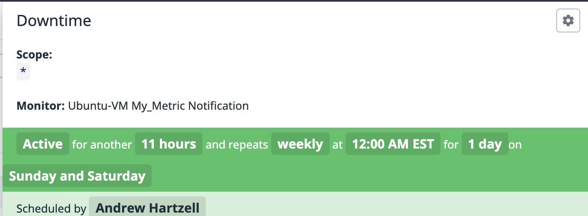

My name is Abdullah Khan and I am applying to be a solutions engineer at [Datadog](http://datadog.com) in NYC!

## The Exercise

Don’t forget to read the [References](https://github.com/DataDog/hiring-engineers/blob/solutions-engineer/README.md#references)

## Questions

Please provide screenshots and code snippets for all steps.

### Prerequisites - Setting up the environment

I am working on Ubuntu 18.04 LTS, and I have decided to use Vagrant and VirtualBox to spin up a VM.

Below are the steps I took.

1. Create a Vagrant environment using Ubuntu 16.04 as a base using the following command:

    `vagrant init ubuntu/xenial64`

2. I edited the `Vagrantfile` given to me and made the following changes:
    
    * Mount the current working directory to `/dtdg` in the VM.

    * Allocate 2048 MB of RAM and 2 CPUs to the VM.

    * Have Vagrant provision the VM by running shell commands to update and install packages.
      The VM reboots when updates and package installations have finished.

3. The VM is now running and I type `vagrant ssh` to log in.

Here is a screenshot of the partial result:


4. The next step I took was to sign up for Datadog and once logged in I was
    able to use the one step install script.

    `DD_API_KEY=KEY_GOES_HERE bash -c "$(curl -L https://raw.githubusercontent.com/DataDog/datadog-agent/master/cmd/agent/install_script.sh)"`

5. After the script runs I double-check to make sure the agent is in fact
    active with `systemctl status datadog-agent`.
    
    I get the folllowing output:

    

Now I can move onto collecting metrics on my instance.

### Collecting Metrics - Answer

#### Adding tags and setting up MongoDB configuration.

* Tags can be added in four ways according to the Datadog Docs on [Assigning Tags](https://docs.datadoghq.com/tagging/assigning_tags/).

    * Inherited from an integration
    
    * In the configuration

    * In the UI (host-level only)

    * Using the API (host-level only)

* Config files for Datadog can be found here: `/etc/datadog-agent/conf.d`

    * The main config file for the agent is `/etc/datadog-agent/datadog.yaml`
    and this is where I added my tags underneath the example for adding tags.

    * Below are the tags I added in `datadog.yaml`:

        `tags: env:test, role:database, vboxhost`
    
    Here are my host and tags in the Host Map view:

    

* I had MongoDB installed as part of my provisioning step. Now I check to make sure `mongod` is running:

    ```
    systemctl status mongod.service
    sudo systemctl enable mongod.service
    sudo systemctl start mongod.service
    systemctl status mongod.service
    ```

    Now that `mongod` is running I can follow the documentation on [installing the integration](https://docs.datadoghq.com/integrations/mongo/).

    1. I was able to create the Datadog user, and running the verification command received:
        `datadog user - OK`.
    
    2. I copied the default configuration given to me and used it for `conf.d/conf.yaml`, as read on the [integrations page for Mongo](https://docs.datadoghq.com/integrations/mongo/).

        The configuration I used can be found in `conf_files/mongo_conf.yaml` minus authentication credentials.

    3. I executed the following command `sudo datadog-agent status` which I found on the agent information [page](https://docs.datadoghq.com/agent/faq/agent-commands/?tab=agentv6#agent-information). This helped me make sure the YAML file had no errors.

    4. I finally clicked Install on the integration page.

    5. I then ran `sudo datadog-agent check mongo` to [check](https://docs.datadoghq.com/agent/basic_agent_usage/ubuntu/?tab=agentv6) that the integration installation was
        successful, and got the following partial output:

        ```
        =========
        Collector
        =========

            Running Checks
            ==============
            
                mongo (1.6.1)
                -------------
                    Instance ID: mongo:9114c3a27cadd32f [OK]
                    Total Runs: 1
                    Metric Samples: 336, Total: 336
                    Events: 0, Total: 0
                    Service Checks: 1, Total: 1
                    Average Execution Time : 32ms
        ```

        And here is what the MongoDB service looks like in the host map view on Datadog:

        

#### Writing a custom Agent Check

Following the developer documentation on [agent checks](https://docs.datadoghq.com/developers/agent_checks/?tab=agentv6#your-first-check), I found the following information:

* Checks live in `/etc/datadog-agent/checks.d/`.

* Checks need a corresponding configuration file, which lives in `/etc/datadog-agent/conf.d`.

* If I write `hello.py` as a check, then I have to name my configuration `hello.yaml`.

Please view the checks I wrote in `checks_files` and `conf_files` in my repository for the code.

Here is the output I get after running `sudo datadog-agent check hello` for the `hello` check:


Now I am ready to write `my_metric`, and the `.py` and `.yaml` files for it can be
found in `checks_files` and `conf_files` respectively.

I restarted the agent and checked the status with `sudo systemctl status datadog-agent`.

The check for `my_metric` is running:


I can also see it online in the UI:


When I take a look at the Host Map view, `my_metric` shows up, without a namespace.


When I view the graph of `my_metric` and compare it against the graph for `hello` I notice two things:

1. Just like the documentation says, if there is no **minimum collection interval** set,
then the metric will be collected at the same interval as the rest of the integrations on the
Agent, and the collector runs every 15-20 seconds.
Looking at the graph for `hello` shows that the data is being updated once every 20 seconds.

2. I have set `min_collection_interval` to 45 in `my_metric.yaml`. It is not being gathered every 20 seconds, but on the next collection when it has been 45 seconds or more since last collection.

    **Bonus Question** Can you change the collection interval without modifying the Python check file you created?

    My understanding is that there isn't a way to hard-code a collection interval in the Python check files you write. At least not in Agent v6 when I was reading the documentation.

    If you want to change the collection interval, you should do it via the configuration file in YAML.
    
    However, I do see that in the Metadata section of a given metric, when you click to edit the metadata, you can change the `statsd` interval, however I cannot find more info in the docs
    about this.

## Visualizing Data - Answer:

Please view [my script for creating the timeboard](timeboard_script/create_dashboard.py).

I used the documentation on [Graphing JSON](https://docs.datadoghq.com/graphing/graphing_json/#grammar)
as a guide for defining graphs.

Creating a sample Timeboard in the UI provides options for what you want to
display. In my case, I was interested in the mini doc that shows up as you
choose functions to apply, specifically the `anomalies` function:

```
anomalies

    algorithm: Methodology used to detect anomalies
    bounds: Relative width of the anomaly bounds

Compare expected values to observed values in order to highlight anomalies

    anomalies(avg:system.load.1{*}, 'robust', 2)
```

I can now apply this to the metric `mongodb.connections.totalcreated` for example.

Next is the `rollup` function:

```
rollup

    method: The rollup method
    period: The rollup period in seconds

Roll up the metric by the sum of values in the specified time period.

    system.load.1{*}.rollup(sum)
    system.load.1{*}.rollup(sum, 600)
```

Below are the graphs I have obtained after creating the dashboard and creating a snapshot, using 
the @ notation to send it to myself.

Here is a link to the snapshot of my [Timeboard](https://app.datadoghq.com/dash/946688/mymetric-mongodbconnectionstotalcreated?page=0&is_auto=false&from_ts=1539475592419&to_ts=1539475892419&tile_size=xl&tile_focus=374148042). Though you won't be able to view it if you aren't a member of my team.

my_metric scoped over the host, ubuntu-xenial:


Anomaly Graph of mongodb.connections.totalcreated:


Rollup of my_metric with the sum of the values in a time period of one hour:


This graph should show one point for the hour, but it is out of view in this snapshot.

**Bonus Question**: What is the Anomaly graph displaying?

The anomaly function returns the result of the query with an expected "normal range".

Since I am working in a vagrant VM, which has been mostly offline so far,
the number of total connections to my MongoDB instance has been low, until
now that I have left the VM running for a few hours. The number of connections
has been updating every time the Agent updates, since today the VM has been on
for a few hours, this is not normal, so much of the line being graphed is
shown in red as it rises above the expected range.

## Monitoring Data - Answer

I created a new Metric Monitor that watches the average of the custom metric (my_metric) and will alert if it’s above the following values over the past 5 minutes:

* Warning threshold of 500

    

* Alerting threshold of 800

    

* And also ensure that it will notify me if there is No Data for this query over the past 10m.

    

I have configured the monitor’s message so that it will:

* Send me an email whenever the monitor triggers.
* Create different messages based on whether the monitor is in an Alert, Warning, or No Data state.
* Include the metric value that caused the monitor to trigger and host ip when the Monitor triggers an Alert state.
* When this monitor sends me an email notification, take a screenshot of the email that it sends me.

    

* **Bonus Question**: Since this monitor is going to alert pretty often, you don’t want to be alerted when you are out of the office. Set up two scheduled downtimes for this monitor:

  * One that silences it from 7pm to 9am daily on M-F,
  * And one that silences it all day on Sat-Sun.
  * Make sure that your email is notified when you schedule the downtime and take a screenshot of that notification.

Here are the email notifications for

weeknight downtime:


weekend downtime:


## Collecting APM Data:

Given the following Flask app (or any Python/Ruby/Go app of your choice) instrument this using Datadog’s APM solution:

```python
from flask import Flask
import logging
import sys

# Have flask use stdout as the logger
main_logger = logging.getLogger()
main_logger.setLevel(logging.DEBUG)
c = logging.StreamHandler(sys.stdout)
formatter = logging.Formatter('%(asctime)s - %(name)s - %(levelname)s - %(message)s')
c.setFormatter(formatter)
main_logger.addHandler(c)

app = Flask(__name__)

@app.route('/')
def api_entry():
    return 'Entrypoint to the Application'

@app.route('/api/apm')
def apm_endpoint():
    return 'Getting APM Started'

@app.route('/api/trace')
def trace_endpoint():
    return 'Posting Traces'

if __name__ == '__main__':
    app.run(host='0.0.0.0', port='5050')
```

* **Note**: Using both ddtrace-run and manually inserting the Middleware has been known to cause issues. Please only use one or the other.

* **Bonus Question**: What is the difference between a Service and a Resource?

Provide a link and a screenshot of a Dashboard with both APM and Infrastructure Metrics.

Please include your fully instrumented app in your submission, as well.

## Final Question:

Datadog has been used in a lot of creative ways in the past. We’ve written some blog posts about using Datadog to monitor the NYC Subway System, Pokemon Go, and even office restroom availability!

Is there anything creative you would use Datadog for?

## Instructions

If you have a question, create an issue in this repository.

To submit your answers:

* Fork this repo.
* Answer the questions in answers.md
* Commit as much code as you need to support your answers.
* Submit a pull request.
* Don't forget to include links to your dashboard(s), even better links and screenshots. We recommend that you include your screenshots inline with your answers.

## References

### How to get started with Datadog

* [Datadog overview](https://docs.datadoghq.com/)
* [Guide to graphing in Datadog](https://docs.datadoghq.com/graphing/)
* [Guide to monitoring in Datadog](https://docs.datadoghq.com/monitors/)

### The Datadog Agent and Metrics

* [Guide to the Agent](https://docs.datadoghq.com/agent/)
* [Datadog Docker-image repo](https://hub.docker.com/r/datadog/docker-dd-agent/)
* [Writing an Agent check](https://docs.datadoghq.com/developers/agent_checks/)
* [Datadog API](https://docs.datadoghq.com/api/)

### APM

* [Datadog Tracing Docs](https://docs.datadoghq.com/tracing)
* [Flask Introduction](http://flask.pocoo.org/docs/0.12/quickstart/)

### Vagrant

* [Setting Up Vagrant](https://www.vagrantup.com/intro/getting-started/)

### Other questions:

* [Datadog Help Center](https://help.datadoghq.com/hc/en-us)
