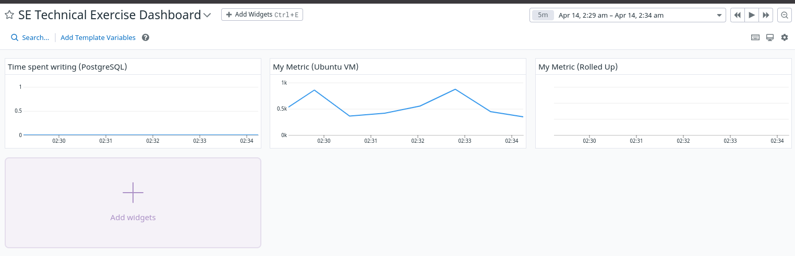
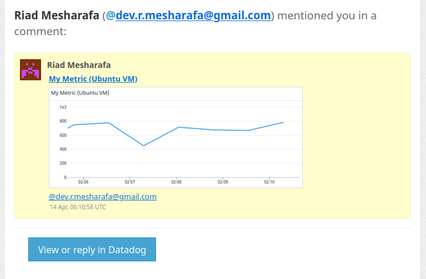
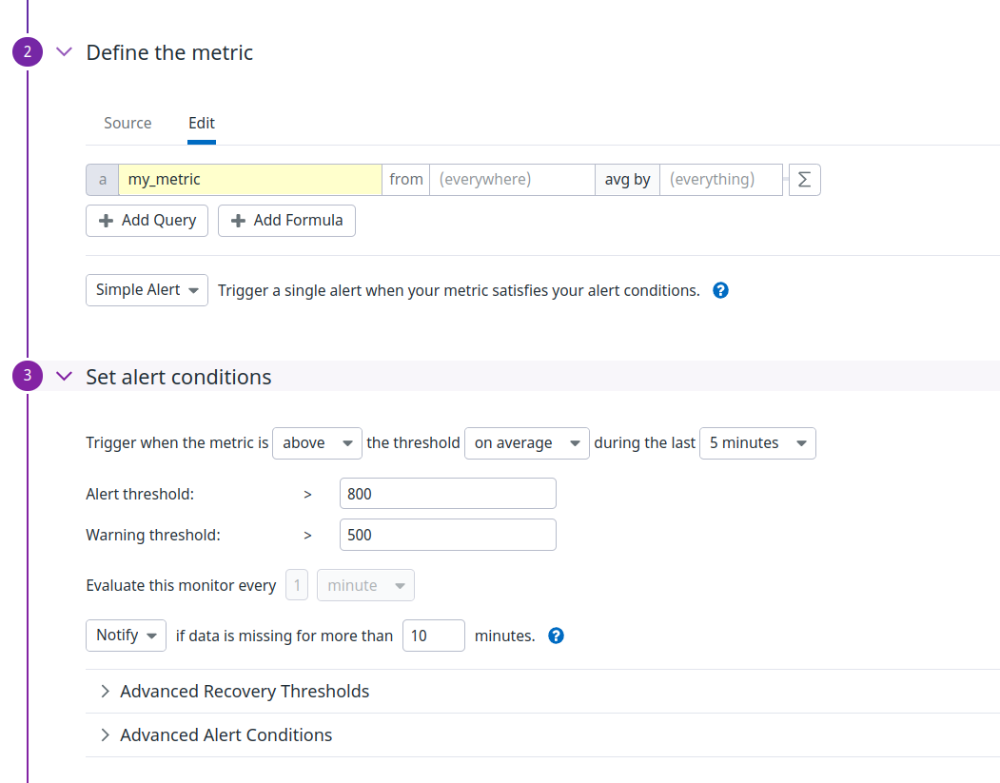
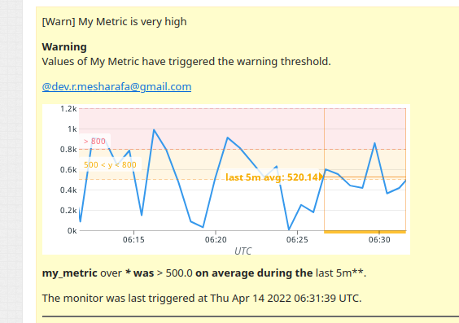
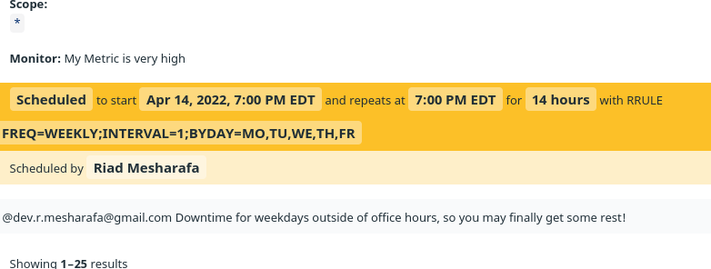
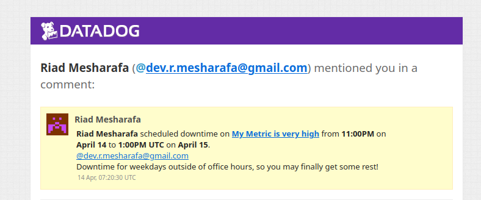
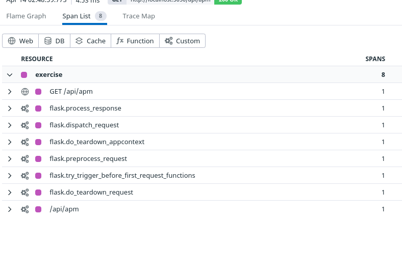

## Prerequisites - Setup the environment ###

To set up the environment I first needed to set up a VirtualBox on my machine:

I headed over to [this website](https://www.virtualbox.org/) and clicked on the blue button in the middle of the page that says Download VitualBox.

It redirected me to this [page](https://www.virtualbox.org/wiki/Downloads). Here I clicked the OS X host and it began to download a DMG file on my machine. 

I waited for the DMG file to finish downloading and this is what I saw on my screen:

As mentioned in the instructions

1. I double clicked on the brown box icon: VirtualBox installation window opened. 

2. Inside of Install Oracle VM VirtualBox, clicked continue and install. 

3. When the installation completed successfully clicked close.

Once the VitualBox was installed it was time to set up vagrant.

I went to this [page](https://www.vagrantup.com/downloads.html) and clicked on the MacOs version.

To get Vagrant up and running I typed in these command lines into the terminal:

$ vagrant init ubuntu/xenial64

$ vagrant up

$ vagrant ssh

Once everything was set up on my machine I signed up for Datadog's 14-day free trial.

Once signed into Datadog, I needed to set up the Agent. First, clicked on **Integrations** tab, then selected agent and clicked on Ubuntu since its the integration we will be using.
I used the command line given to install the Datadog Agent on the virtual machine.

### Collecting Metrics: ###

Tags are a way to distinguish between hosts. I first adapted the Agent configuration file. 

I set up datadog tags by editing datadog.yaml. It can be found \etc\datadog-agent\datadog.yaml

To edit the file I needed to run the command: sudo vi datadog.yaml

This only works if you're already in the directory that datadog.yaml is. Whereas sudo vi \etc\datadog-agent\datadog.yaml should work regardless of where you are.

Once inside the file, I uncommented and modified the tag section like so:

I then needed to restart my Agent using: sudo service datadog-agent restart.

It took me a couple of tries for it to appear on my Host Map but once it did this is what it looked like:

**Install a database on your VM**

I chose MySql. This [link](https://support.rackspace.com/how-to/installing-mysql-server-on-ubuntu/) has simple instructions on how to install MySQL.

The chain of commands I used are as follows:

$ sudo apt-get update

$ sudo apt-get install mysql-server

Once this is done I needed to install the respective Datadog integration for the database.

I found the instructions [here](https://app.datadoghq.com/account/settings#integrations/mysql).

I carefully followed the first two steps. 

1. Created a datadog user in the MySQL server by using the comand line provided.

2. Configured the Agent to connected to MySQL. I edited the yaml file inside of conf.d/mysql.yaml as instructed. 

Once I got to the third step and needed to restart the agent I found a helpful cheat sheet [here](https://docs.datadoghq.com/agent/faq/agent-commands/) which provides the commands needed to work with the Datadog agent.

I used:

$ sudo service datadog-agent restart

I then ran 

$ sudo datadog-agent status 

to make sure that my output contained MySql. 

### Create a custom Agent check ### 

The Agent runs on the host and it collects events and metrics for Datadog.

To create a custom Agent check I needed to create a python file inside of /etc/datadog-agent/checks.d. Kept it simple and named it hello.py. Inside hello.py I wrote a python script that provides an output with a random number 0 to 1000.

It looked like this: 

After that file was created and saved, I needed to create a yaml file with the same name as the python file inside the /etc/-agent/checks.d directory only this time it had to be inside of /etc/-agent/conf.d directory. Named it hello.yaml.

Inside the yaml file check’s collection interval needs to be modified so that the metric is only submitted once every 45 seconds. It should look something like this. 

**Can you change the collection interval without modifying the Python check file you created?**

Yes. You can set a min interval option in the custom metric check yaml file inside the conf.d directory. The name of the yaml file needs to match the name of your custom agent check python file in the checks.d directory. 

Ex: conf.d/smile.yaml and checks.d/smile.py

Once inside the yaml file, all that needs to be changed is the min_collection_interval. You need to set it to the amount of time you would like.

### Visualizing Data ###

I found the tools I needed to create a timeboard [here](https://docs.datadoghq.com/api/?lang=python#create-a-timeboard).

I created timeboard.py file inside the /etc/datadog-agent folder. 

On Datadog's website I clicked on the Integrations tab and selected APIs. On that page, I was able to find the api_key and app_key that I needed to create the script. 

I adapted the script provided by datadog to fit the needs of the timeboard.

1. I included the app and api key found on the website.

2. Customized the title and description.

3. Created three graphs with three different definitions that include 

 	- My custom metric (my_metric).

	- Any metric from the Integration on your Database with the anomaly function applied.

	- Your custom metric with the rollup function. A rollup function lets me control how many points are into a single point plotted on the graph.

4. The first definition needs to use my_metric scoped of the host. 

5. For the second definition, I wrote an anomaly algorithm. I found the initial documentation reference [here](https://docs.datadoghq.com/graphing/miscellaneous/functions/#algorithms). It provided an easy to understand overview. 

The anomaly function has two parameters, the first defines the algorithm being used and the second is called the bounds. 

I chose the rate of queries metric from this [list](https://docs.datadoghq.com/integrations/mysql/#metrics) after reading through the metrics options. It was the last one on the list. 

The bounds include the [anomaly detection algorithm](https://docs.datadoghq.com/monitors/monitor_types/anomaly/#anomaly-detection-algorithms) and the number of standard deviations from the origin. There are three anomaly detection algorithm that differs depending on if and how the metric repeats seasonally. I chose basic because it made the most sense considering that the outputs of my_metric are completely random.

6. I found the documentation I needed [here](https://docs.datadoghq.com/graphing/miscellaneous/functions/#rollup) to create a rollup function. It takes two parameters the method and time. The time is in seconds and we need the sum of an hour which is 3600. 

It should look something like this:

Setting the timeboard to show the time frame of the past 5 minutes is relatively simple. 

In the datadog homepage, I clicked on the dashboard tab and select dashboard list. Clicked on the timeboard most recently made. I hovered the cursor over the graph and selected the 5 minute time frame. 

This is what my 5-minute timeboard looks liked

I emailed myself with the @notation:

**What is the Anomaly graph displaying?**

The Anomaly graph detects data changes based on past expressions of the information. It predicts what the normal flow of the data should look like. The graph is staying constant on the y-axis. Therefore, there are no anomalies being detected.

### Monitoring Data ###

Data can be monitored from Datadog’s platform. Click on the **Monitors** tab and select **New Monitor**. 

I set mine up to alert me with a warning if the threshold is greater or equal to 500, an alert it hits the 800 thresholds and if no data is sent for 10 mins for my_metric.

 Here are screenshots of the interaction with the Datadog UI:

Then I set up the alerts. Depending on which monitor is triggered the message needs to be catered to it. {{#is_alert}}{{/is_alert}} for example will let me know if the data output is over 800. I included all three alerts, the warning and the scenario in which there is no data.

It looked like this:

This is what an over 500 email warning would look like.

### Setting Up DownTime ###

To set up the I selected **Monitors** and then clicked **Manage Downtime** 

The following images depict how I set up the downtime monitor for 7 pm to 9 am EST(11 pm to 1 pm UTC) as well as weekends.

The downtime email received I received looked:

### Collecting APM data ###

First, I needed to install [flask](http://flask.pocoo.org/docs/0.12/installation/#installation) and [ddtrace](http://pypi.datadoghq.com/trace/docs/#) onto our VM. 

Following Flask’s installation, I used the Flask app provided by the Datadog challenge. I created a python file and used ddtrace to start the python script and then hit the endpoints (ex. 0.0.0.0:5050/api/trace).

Once its all set up I was able to view APM.

Here is a [linkto my dashboard](https://app.datadoghq.com/dash/856222/training-timeboard-for-hiring-engineers-exercise?live=true&page=0&is_auto=false&from_ts=1531179455884&to_ts=1531265855884&tile_size=m) and a screenshot.

After exporting the graph to a timeboard this is what it looked like:

**What is the difference between a Service and a Resource?**

A service is a set of behaviors that are going to consistently perform the same task.  Services work together to provide a feature.

A resource is a specific behavior of a service. 

**Is there anything creative you would use Datadog for?**

An interesting way that I would use datadog would be as a habit tracker. Many of us have goals and habits that we would like to incorporate into our lives. A a good way for a new habit to stick is to incorporate the habit as seamlessly as possible. 

First thing I would track our circadian rhythms.

Create a scope that tracks when we are most active, most focused, most tired, most hungry, most likely to need to need to use the bathroom etc.

Then depending on the user’s schedule he/ she could incorporate his/ her habit when it is most appropriate.

For example, if the user would like to exercise more he would schedule a work out routine when his energy levels are at their peak.

If the user needs to learn new information he would schedule a study session when he is most focused.

Over time the user would be able to track is the incorporations of the new behaviors were successfully maintained. If not, adaptations can be made.

