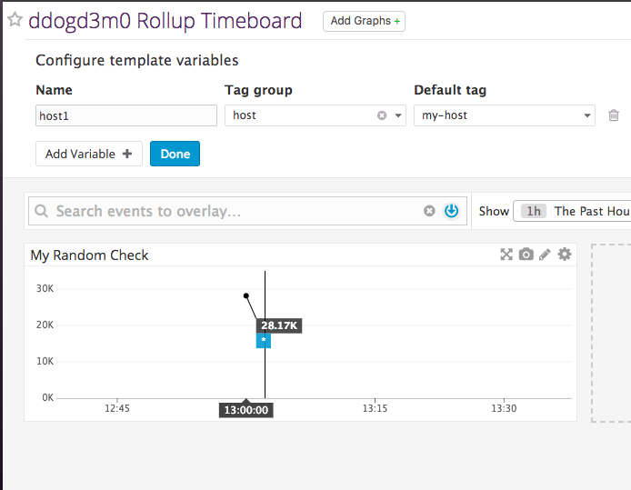
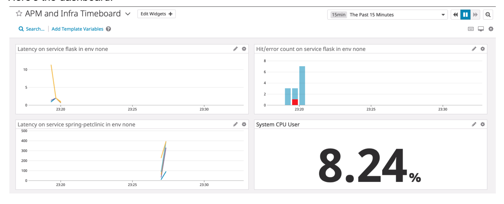

Prerequisites - Setup the environment
--  

1) Installed a containerized agent on an Ubunto EC2 host.  Later switched to the Ubuntu agent as the containerized agent
could not communicate with MySQL.

  

  

Collecting Metrics
--  

1) Installed AWS integration  

  

2) Add tags in the Agent config file and show us a screenshot of your host and its tags on the Host Map page in Datadog.  

  

3) Install a database on your machine (MongoDB, MySQL, or PostgreSQL) and then install the respective Datadog integration for that database.  

Complete  

4) Create a custom Agent check that submits a metric named my_metric with a random value between 0 and 1000.  

  

5) Change your check's collection interval so that it only submits the metric once every 45 seconds.

Added min_collection_interval: 45 to the instances section of conf.d/my_metric.yaml  

6) Bonus Question Can you change the collection interval without modifying the Python check file you created?  

Change the yaml file as noted in 5 above as that is the configuration that is passed to the check method.  

Visualizing Data
-   

Utilize the Datadog API to create a Timeboard that contains:  
  
1) Your custom metric scoped over your host.

Created by timeboard.py,  my_metric.py, and my_metric.yaml  

2) Any metric from the Integration on your Database with the anomaly function applied.

In mysql_timeboard.py    

  

  

  

3) Your custom metric with the rollup function applied to sum up all the points for the past hour into one bucket

In timeboard_rollup.py	  

4) Set the Timeboard's timeframe to the past 5 minutes  

  

5) Take a snapshot of this graph and use the @ notation to send it to yourself.  

6) Bonus Question: What is the Anomaly graph displaying?  

No changes

Monitoring Data  
-  

1) Since you’ve already caught your test metric going above 800 once, you don’t want to have to continually watch this dashboard to be alerted when it goes above 800 again. So let’s make life easier by creating a monitor.

Create a new Metric Monitor that watches the average of your custom metric (my_metric) and will alert if it’s above the following values over the past 5 minutes:

Warning threshold of 500
Alerting threshold of 800
And also ensure that it will notify you if there is No Data for this query over the past 10m.

2) Send you an email whenever the monitor triggers.

  
  
3) Create different messages based on whether the monitor is in an Alert, Warning, or No Data state.  

  

4) Include the metric value that caused the monitor to trigger and host ip when the Monitor triggers an Alert state.  

5) When this monitor sends you an email notification, take a screenshot of the email that it sends you.  

6) Bonus Question: Since this monitor is going to alert pretty often, you don’t want to be alerted when you are out of the office. Set up two scheduled downtimes for this monitor:

One that silences it from 7pm to 9am daily on M-F,
And one that silences it all day on Sat-Sun.
Make sure that your email is notified when you schedule the downtime and take a screenshot of that notification.  

  
  

  
  

7) Provide a link and a screenshot of a Dashboard with both APM and Infrastructure Metrics.  

App is sample_app.py  

8) Bonus Question: What is the difference between a Service and a Resource?  

From the Datadog documentation:

"A service is a set of processes that do the same job."  So, it could be a database or webapp service.  

"A Resource is a particular action for a service. For a web application: some examples might be a canonical URL, such as /user/home or a handler function like web.user.home (often referred to as “routes” in MVC frameworks).
For a SQL database: a resource is the query itself, such as SELECT * FROM users WHERE id = ?."

Final Question  
--    

Is there anything creative you would use Datadog for?  

In iteresting thought is to use it to monitor traffic flow on toll roads to increase / decrease price based on traffic loads.  

