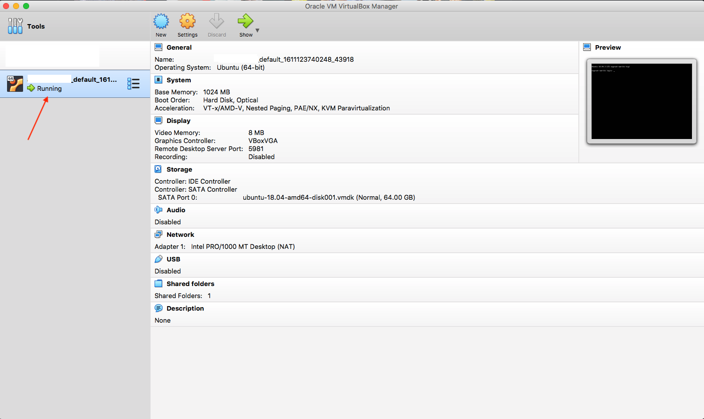
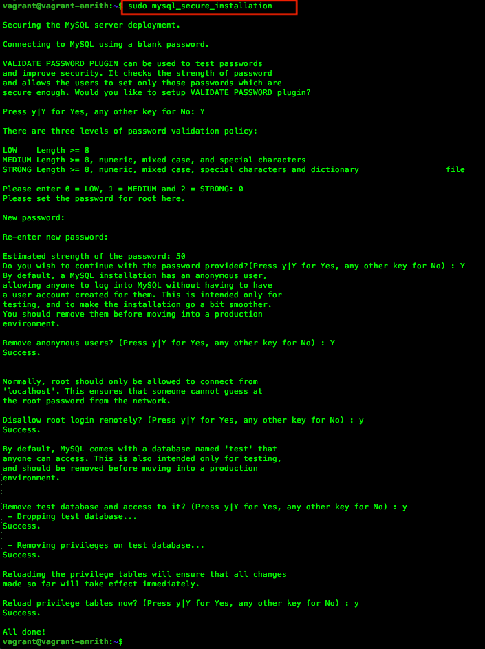
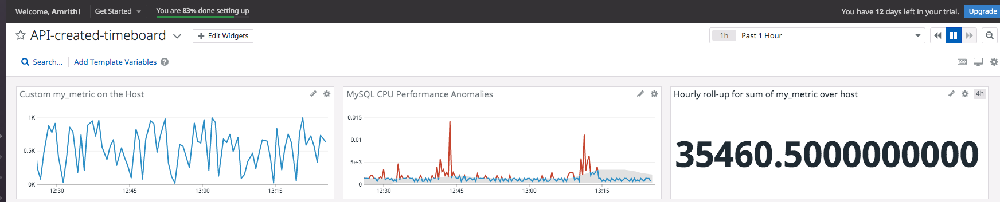
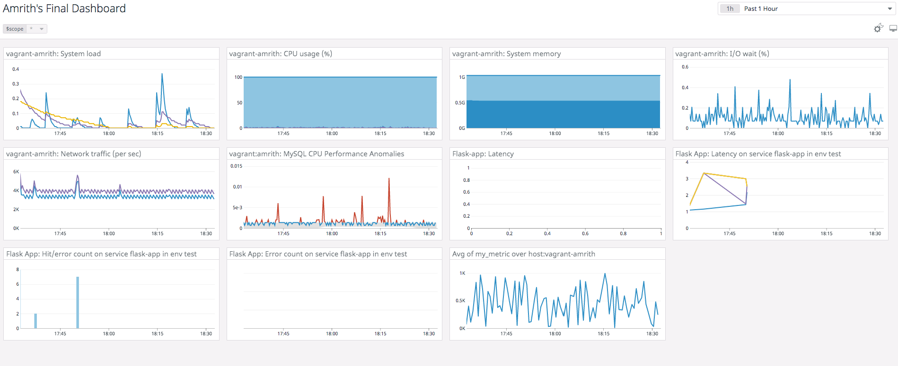
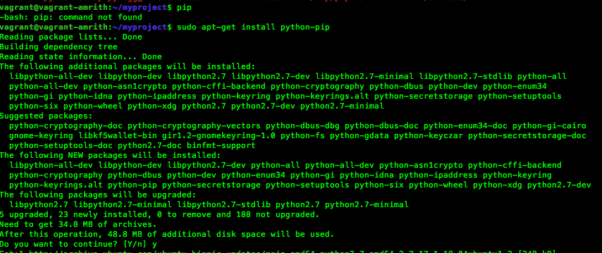

#  *Amrith's answers to the exercise*

> *Please Refresh the page if images do not load properly*

# Setting up the environment

Note: Although in this example, VirtualBox and Vagrant were used as test machines you could perform the steps mentioned below on cloud instances hosted on AWS, GCP or Azure or on a physically installed server or even a container.

## Installing Vagrant and VirtualBox on a local machine

### Install Vagrant:


Download the proper package for your operating system and architecture from [Vagrant Download page](https://www.vagrantup.com/downloads). Additional instructions on installation if needed are available [here](https://www.vagrantup.com/docs/installation)

Please note that Vagrant is not mandatory and it simply eases the way in which a VM is managed on your laptop.

### Install VirtualBox:

VirtualBox is a free and open source virtualisation software. We will use VirtualBox to run Ubuntu 18.04. The latest version is available in the [VirtualBox Download page](https://www.virtualbox.org/wiki/Downloads)


## Configuring Vagrant and verifying the OS

The following command initialises Vagrant on your local machine and downloads the configuration of Ubuntu 18.04 also known by its codename Bionic Beaver.
````
vagrant init hashicorp/bionic64
````


The location where you run vagrant is important as it places a vagrantfile that will have information of the image you are about to run.

### Launching the server

The following command would bring the server up. If this is the first time the command is run and if Vagrant cannot find the image it will attempt to find and install the OS on VirtualBox. This may take few minutes to complete. Screenshot below shows the output when you run ````vagrant run```` for the first time

````
vagrant up
````


In the background, Vagrant would have launched and configured the VM. Note the screenshot below of VirtualBox:


### Connecting to the server

Once Vagrant has brought up the server you will need to connect to it by performing a ````vagrant ssh````. This connects the server through Secure Socket Shell (SSH) using preconfigured keys managed by Vagrant.

The following command connects to the Ubuntu Bionic server that we just spun up:


````
vagrant ssh
````

Note this command as this will needed to connect to the Ubuntu machine in the future


### Verify the OS version by running the command

The below command in Ubuntu shows the release and codename
````
lsb_release -a
````


### Change the hostname for better identification

Changing the hostname is a good practice as it will help easily identify the host that we are working on.

The below screenshot confirms that the hostname was changed and is persistent which means rebooting the server would not change the hostname.


## Create a new Datadog account.

* Use your web browser and open https://www.datadoghq.com/ and follow the instructions to create a new account
* After signing up, your new Datadog home page will appear like below screenshot. Although you may not see any host reporting yet.
* Datadog provides a 14 day trial to evaluate the product. This should be ample amount of time to perform this excercise.


## Installing Datadog agent

### Agent Installation Instructions

Agent installations instructions are available in the following path:

> Datadog UI ⇨ Integrations ⇨ Agent ⇨ Ubuntu(choose this based on your OS)  ⇨ Copy the instruction that matches the most suitable option. In our case, we will be performing a new installation.

The command would look similar to below.

*Note: The API key will be associated to your account only and should not be shared.*

Copy and paste the command on the server and run it. You may have to enter your password if prompted.

````
DD_AGENT_MAJOR_VERSION=7 DD_API_KEY=███████████████████████████ DD_SITE="datadoghq.com" bash -c "$(curl -L https://s3.amazonaws.com/dd-agent/scripts/install_script.sh)"
````


### Verify the installation

The installation can be verified by checking the status of the Datadog service.

### Checking the status of the agent

````
sudo systemctl status datadog-agent
````


The agents will need to be restarted whenever there is a change to the any configuration.

Please note the following commands for Ubuntu which will be used to stop, start or restart the agent.

### Stopping the agent
````
sudo systemctl stop datadog-agent
````

### Starting the agent
````
sudo systemctl start datadog-agent
````

### Restarting the agent
````
sudo systemctl restart datadog-agent
````
Note: Please refer the [agent commands page](https://docs.datadoghq.com/agent/guide/agent-commands/?tab=agentv6v7) for the commands for other operating systems. Also, note that running ````sudo service datadog-agent start```` would also do the same job if the ````service```` wrapper is available.

## Confirming that the agent is reporting metrics:

Login to your Datadog account to verify that the agent is reporting metrics. This can be verified by any of the following options:

* Datadog event stream would indicate that the agent on the new host has been started. Datadog  ⇨ Events

* Datadog Infrastructure section would start reporting a new host. Datadog  ⇨ Infrastructure

* Checking the home page as well where you would notice a new host has started to report
* Further, the default dashboard would start reporting metrics in graphs as well.

# Collecting Metrics

## Updating tags

Change the tags in the datadog.yaml as per your requirement.

The ````datadog.yaml```` is located in ````/etc/datadog-agent```` directory in Ubuntu 18.04. The file location may vary depending on the platform. You can refer [this page](https://docs.datadoghq.com/agent/guide/agent-configuration-files/?tab=agentv6v7) for additional details
````
.
~
tags:
   - env:test
   - app:vagrant
   - owner:amrith
~
.
````


Verify that the tags are reporting in Datadog by navigating to
Infrastructure  ⇨ Host maps


## Installing a Database

We will be installing MySQL in this example. Follow the below instructions to install MySQL on Ubuntu

Updating the OS
````
sudo apt update
````

Installing MySQL
````
sudo apt install mysql-server
````


Enter the following commands and accept the defaults to configure the security settings of MySQL:
````
sudo mysql_secure_installation
````


Verify that the installation is successful by entering the mysql command followed by performing a SELECT statement:
````
$ sudo mysql

mysql> SELECT user,authentication_strig,plugin,host FROM mysql.user;

````
If you see a table listed as shown in the screenshot below, you can be assured that the installation was successful.


### Create a datadog user and providing privilges to collect metrics

Enter the following command in mysql to create a new user named 'datadog' with a password
````
CREATE user 'datadog'@'localhost' IDENTIFIED BY '████████';
````

Verify that the user was created by running the previously run SELECT user command.


The datadog agent needs a few privileges to collect metrics. Run the following commands to grant limited privileges only
````
mysql> GRANT REPLICATION CLIENT ON *.* TO 'datadog'@'localhost' WITH MAX_USER_CONNECTIONS 5;
Query OK, 0 rows affected, 1 warning (0.01 sec)

mysql>
mysql>
mysql> GRANT PROCESS ON *.* TO 'datadog'@'localhost';
Query OK, 0 rows affected (0.00 sec)

mysql>
mysql>
mysql> ALTER USER 'datadog'@'localhost' WITH MAX_USER_CONNECTIONS 5;
Query OK, 0 rows affected (0.00 sec)

````
Verify that metrics can be collected from the performance_schema database and grant additional privilege by running the GRANT command

````
mysql>
mysql> show databases like 'performance_schema';
+-------------------------------+
| Database (performance_schema) |
+-------------------------------+
| performance_schema            |
+-------------------------------+
1 row in set (0.00 sec)

mysql>
mysql>


mysql> GRANT SELECT ON performance_schema.* TO 'datadog'@'localhost';
Query OK, 0 rows affected (0.02 sec)

````

### Configuration to collect MySQL metrics

Edit the ````mysql.d/conf.yaml```` file, in the ````conf.d/```` folder at the root of your Agent’s configuration directory to start collecting your MySQL metrics and logs.

MySQL configuration for Datadog in our example is located in the following directory:
````
/etc/datadog-agent/conf.d/mysql.d
````
Modify the config file at these sections with the datadog username, password and other options as shown below:
````
~
instances:
  - host: localhost
    user: datadog
    pass: ███████
    port: 3306
~
.
~

    options:
      replication: false
      galera_cluster: true
      extra_status_metrics: true
      extra_innodb_metrics: true
      extra_performance_metrics: true
      schema_size_metrics: false
      disable_innodb_metrics: false
````
Note: localhost may be replaced with 127.0.0.1 if you face issues running the mysql check. Also if you need to extract the database performance from a remote DB server

Additional details can be refered from the [MySQL Integration page](https://docs.datadoghq.com/integrations/mysql/?tab=host)

Save the ````conf.yaml```` in the ````mysql.d```` directory and restart the datadog agent.

### Verifying the integration check

Confirm that the mysql check is running correctly by running this specific agent subcommand:
````
sudo datadog-agent check mysql
````
Notice there are no warnings when you run this command:


### Verifying the metrics in Datadog
Navigate to Datadog  ⇨ Dashboards  ⇨ All Dashboards  ⇨ MySQL - Overview which is a preset dashboard for MySQL. Verify if you can see MySQL metrics as shown below:


## Creating a Custom agent check

### Agent Check and config directory structure

The custom agent check would reside in a directory named ````checks.d```` while the corresponding configuration would reside in a directory in ````conf.d````

```
etc
|
└───
    datadog-agent
    |
    |───datadog.yaml
    |
    └───checks.d
    │   │   my_metric.py
    |   |
    └───conf.d
    │   │
    │   └───my_metric.d
    │       │   my_metric.yaml
    │   └───mysql.d
    │_______│   conf.yaml
```

Now that we understand where to place the files, lets create an agent check called ````my_metric.py```` in folder ````/etc/datadog-agent/checks.d/````

````my_metric.py:````

````
import random
    # first, try to import the base class from new versions of the Agent...
from datadog_checks.base import AgentCheck
    # content of the special variable __version__ will be shown in the Agent status page
__version__ = "1.0.0"

class MyCheck(AgentCheck):
    def check(self, instance):
        self.gauge('my_metric',random.randint(0,1000))
````

Lets update the configuration file ````my_metric.yaml```` which would reside in ````conf.d/my_metric.d/```` directory

````my_metric.yaml:````

````
init_config:

instances:
  - min_collection_interval: 45
````
Note: Leaving the configuration with no real information is acceptable but it would choose the default collection interval which is 15 seconds.

Restart the datadog-agent to use the latest configuration.

## Verify the agent check

Run the following command to verify if the agent is running normally:

````
sudo -u dd-agent -- datadog-agent check my_metric
````
or
````
sudo datadog-agent check my_metric
````

Notice that both the commands show the same output:

Output for ````sudo -u dd-agent -- datadog-agent check my_metric````


Output for ````sudo datadog-agent check my_metric````


## View the Dashboard

You can also view the my_metric values in a Dashboard. Here is a sample below:


### Bonus Question Can you change the collection interval without modifying the Python check file you created?

Yes. The collection interval can changed by changing the ````my_metric.yaml```` located in ````conf.d/my_metrid.d/```` folder

````
init_config:

instances:
  - min_collection_interval: 45
````
# Visualizing Data:

### Installing Postman

Datadog API can be used in variety of ways like writing a script or using commands like curl or wget.
In this example, Postman was used to execute the API.

After [downloading and installing postman](https://www.postman.com/downloads/), Import the Datadog collection into Postman by clicking the option to import [from this page](https://docs.datadoghq.com/getting_started/api/).

### Getting API and Application Keys

API and Applications keys are needed to authenticate against Datadog. This can be obtained from the following locations in the Datadog UI:

API Key:

> Integration ⇨ APIs  ⇨ API Keys
You can either create a new key or copy an existing key.

Application Key:

 > Team ⇨ Application Keys  ⇨
 Click on ````New Key```` to create a new application key.

 ### Creating the Dashboard using the API

 Follow instructions in the [Using Postman with Datadog APIs](https://docs.datadoghq.com/getting_started/api/) article to add the keys into the Postman environment.

 > Postman  ⇨ Collections  ⇨ Datadog API Collection  ⇨ Dashboards  ⇨  Create a new dashboard

 Update the POST URL to
 ````https://api.datadoghq.com/api/v1/dashboard````

 Update the Body to the following JSON document which includes the following

 * The custom metric (my_metric) scoped over the host.
 * MySQL CPU performance with the anomalies function applied
 * The custom metric (my_metric) applied to sum up all the points for the past hour into one bucket

````
{
    "title": "API-created-timeboard",
    "layout_type": "ordered",
    "notify_list": [],
    "widgets": [
        {
            "definition": {
                "type": "timeseries",
                "requests": [
                    {"q": "my_metric{host:vagrant-amrith}"}
                ],
                "title": "Custom my_metric on the Host",
                "title_align": "center"
            }
        },
        {
            "definition": {
                "type": "timeseries",
                "requests": [
                    {
                        "q": "anomalies(mysql.performance.cpu_time{host:vagrant-amrith}, 'basic', 3)"
                    }
                ],
                "title": "MySQL CPU Performance Anomalies",
                "title_align": "center"
            }
        },
        {
            "definition": {
                "type": "query_value",
                 "time": {
                    "live_span": "4h"
                },
                "requests": [
                    {
                        "q": "sum:my_metric{host:vagrant-amrith}.rollup(sum,3600)"
                    }
                ],
                "title": "Hourly roll-up for sum of my_metric over host ",
                "title_align": "center"


            }
        }
    ]
}
````
Hit the send button on Postman to perform a HTTP ````POST```` to the Datadog endpoint to execute the API


Ensure you receive a 200 OK to confirm that the POST was successfull.

### Access the Dashboard from the GUI:



### Setting the timeboards timeframe to the past 5 minutes


### Emailing the graph

Click the share icon, select the ````Send snapshot```` button and then enter the @ button and send it your intended recipient


Check the inbox if you have received the email:


## Bonus Question: What is the Anomaly graph displaying?

In addition to the actual metric plotted over the graph, the anomaly graph has a gray band that shows the expected behaviour of the metric based on the historical data.


Notice the above graph that shows the gray band which is the range the system expects the metric to stay within. The red spike is the anomaly detected based on historical data.

# Monitoring Data


## Task

Create a new Metric Monitor that watches the average of your custom metric (my_metric) and will alert if it’s above the following values over the past 5 minutes:

* Warning threshold of 500
* Alerting threshold of 800
* And also ensure that it will notify you if there is No Data for this query over the past 10m.

### Creating the monitor:

To create a monitor, head to Datadog UI  ⇨ Monitors  ⇨ Manage Monitors  ⇨ Click on 'New Monitor'  ⇨ Select 'Metric' as the monitor type

* Select 'Threshold Alert' under 'Choose the detection method'
* Define the metric:
    * Select 'my_metric' from the drop down menu and leave the other options un changed. Those options can be confined to or restricted to certain resources.
* Select alert conditions
    * Set the Alert threshold to 800
    * Set the Warning threshold to 500
* Select the option to 'Notify' if the data is missing for '10' minutes.
* Enter text that shows the alert title and subject. An example is shown below:
* Finally, select the recipient of the email.


Screenshot of the screen to create a new monitor:


### Configuring custom emails based on Alert, Warning or missing data:


### Message to be delivered in the notification


Notice the following aspects:
* Host IP is included in the body
* Custom messages has been incorporated depending on the alert condition: Alert, Warning or No Data


````
My Metric is high on {{host.ip}}
````

#### Details in the notification


````
{{#is_alert}}

Alert! My Metric is now {{value}} on host {{host.ip}} and thus has gone above defined {{threshold}} during the last 5 mins!

{{/is_alert}}

{{#is_warning}}

Warning! My metric is now {{value}} on host {{host.ip}} and thus has gone above defined {{threshold}} during the last 5 mins!

{{/is_warning}}

{{#is_no_data}}

No Data! My Metric has not sent any data yet. Are you sure the server is up and running?

{{/is_no_data}}

This message was sent by your friendly pup,

Datadog.

````

## Send you an email whenever the monitor triggers.


### Verify you are receiving the notification in your email:


### Task:

Bonus Question: Since this monitor is going to alert pretty often, you don’t want to be alerted when you are out of the office. Set up two scheduled downtimes for this monitor:

One that silences it from 7pm to 9am daily on M-F,
And one that silences it all day on Sat-Sun.
Make sure that your email is notified when you schedule the downtime and take a screenshot of that notification.

### Solution:

### Managing Downtime:

> Navigate to Monitors  ⇨  Manage Downtime  ⇨ Schedule Downtime.

* Choose the monitor that you want to silence
* Select the schedule (recurring in this case)
* Add a message as required
* Add the email details to notify when the downtime begins.

Below is a screenshot of the downtime set for 7pm to 9am daily on M-F


Below is a screenshot of the downtime set for the weekend:


# Collecting APM Data

Instrumenting the given application would require the following items to be completed from a high level:

* Install Flask
* Install any dependencies for Flask or to install Flask
* Install ddtrace - Datadog APM Client
* Configuring the Datadog agent for APM
* Adding the Datadog Tracing library to the code
* Access the application and performing some GET operations against the services hosted and also accessing non-existent services to report errors

## Installing Flask and ddtrace

Installing Flask and ddtrace are required to run the application and to have the Datadog APM client instrument the application.

> Installing these packages are explained in detail in the appendix section as sometimes the installation may have additional dependencies that needs to be met.

## Enabling APM in the Datadog agent

Use your favourite terminal editor and modify the following options to enable APM that would listen for trace traffic at localhost:8126

Restart the datadog agent and ensure the agent is running normally.


## Runnning the Application with ddtrace

To Instrument the application, prefix the python entry-point command with ddtrace-run and therefore the command would look similar to below.

## Tracing
Tracing is used to track the time spent by the application processing a request and the status of this request.

````
export DD_SERVICE=flask-app

ddtrace-run python flask-app.py
````


### Profiler:

Enabling Continuous profiler would help break down the CPU, memory and IO bottlenecks by method name, class and line number to identify and address end-user latency and infrastructure costs.

Enabling profiler can be done by running the following command for our given application

````
DD_PROFILING_ENABLED=true ddtrace-run python flask-app.py
````
Additional notes:

A flask App can be run by running the following commands as well. As explained earlier, the ddtrace-run command would have to be prefixed before the entry command. In the below case it will be ````ddtrace flask run````

````
export FLASK_APP=flask_app.py
export FLASK_ENV=development
flask run
````

### Accessing the services on the App

In another terminal or a web broswer try to perform some activity on the application by running the curl command which would perform few GET operations


## Viewing Services, Traces and Profiles

> Navigate to the UI and select APM  ⇨ Services

### Services
You should see the service running. In our case, it would be named as flask-app as shown the screenshot below:


Click the App to view requests per seconds, errors, latency and latency distribution as shown in the below screenshot:


### Traces

The ````GET```` requests made earlier including the 404 error will be available in the traces section


### Profiles

Click on profiles tab in the APM view to view the continous profiler


The app used for this exercise is the same that was provided in the question:

````
from flask import Flask
import logging
import sys

# Have flask use stdout as the logger
main_logger = logging.getLogger()
main_logger.setLevel(logging.DEBUG)
c = logging.StreamHandler(sys.stdout)
formatter = logging.Formatter('%(asctime)s - %(name)s - %(levelname)s - %(message)s')
c.setFormatter(formatter)
main_logger.addHandler(c)

app = Flask(__name__)

@app.route('/')
def api_entry():
    return 'Entrypoint to the Application'

@app.route('/api/apm')
def apm_endpoint():
    return 'Getting APM Started'

@app.route('/api/trace')
def trace_endpoint():
    return 'Posting Traces'

if __name__ == '__main__':
    app.run(host='0.0.0.0', port='5050')

````

Bonus Question: What is the difference between a Service and a Resource?

* Services: Services broadly are a representation of a function. It is the building block of microservice architecture. It groups together endpoints, queries, or jobs for the purposes of building an application

    E.g. The Flask application that was used in this excercise can be seen as a representation of a service.

* Resource: Resource is a particular action for a given service (typically an individual endpoint or query).

    E.g. The Flask application had resources that was a particular action like /api/apm and /api/trace which are the resources of the service


Link and a screenshot of a Dashboard with both APM and Infrastructure Metrics are shown below:

* Public URL of the Final Dashboard is available [here](https://p.datadoghq.com/sb/g55o5dmyhmz6xa1c-512575f2d971e8211c3589b18585ccd7)

* Dashboard that includes infrastructure metrics and application metrics. Please change the time scale to view metrics if it isn't available in real-time.


# Final Question

Question: Datadog has been used in a lot of creative ways in the past. We’ve written some blog posts about using Datadog to monitor the NYC Subway System, Pokemon Go, and even office restroom availability!

Is there anything creative you would use Datadog for?

Answer:
There are a lot of areas that I think Datadog can potentially be used for:

* Public Transport:
    * Datadog can provide metrics thats show 'Passenger traffic' at a station. This can be easily achived by sending the data of passengers who have touched-on/touched-off at a train station. Potential passengers can now use this data to predict if they would get a seat in the next train
    * Buses can collect similar data that would add or remove passengers who have onboarded or offboarded to show potential passengers if the next bus would have available seats or not.
* Retail:
    * Supermarkets(more affordably other retail outlets) can use RFID on their items instead of Barcode and using this they could track the supply/demand of products and manage inventory optimally and prevent running out of stock or potential wastage
* Finance:
    * Our financial spends through our monthly expenditure can speak a lot on how we save and spend money. This data when built on a graphs(repeated purchases in a month, highest expenses, lowest continuous expense etc ) can give insights on how to better manage financially.
* Health:
    * Patient wait times can be calculated and provided to users who are next inline
* ....and a lot!


# Appendix

## Installing pip

pip may not be available by default but can be easily installed by running the below  command
````
sudo apt-get install python-pip
````


## Installing Flask

Flask is not generally installed by default but can be easily installed by running the following command
````
pip install flask
````


## Troubleshooting:

## ddtrace missing modules

 In my installation, I faced issues installing ddtrace. This can be easily fixed by installing the missing modules reported by pip


Install the missing module using pip

````
vagrant@vagrant-amrith:~$ pip install Cython
Collecting Cython
  Downloading https://files.pythonhosted.org/packages/59/c1/0b69d125ab9819869cffff2f416158acf2684bdb4bf54eccf887717e2cbd/Cython-0.29.21-cp27-cp27mu-manylinux1_x86_64.whl (1.9MB)
    100% |████████████████████████████████| 1.9MB 479kB/s
Installing collected packages: Cython
Successfully installed Cython-0.29.21
vagrant@vagrant-amrith:~$
````

After the dependencies are met, install ddtrace:
````
pip install ddtrace
````

However, my installation of ddtrace was missing another module named configparer. I was able to fix this issue by installing configparser.
````
pip install configparser
````


# References:

[Vagrant - installation](https://www.vagrantup.com/docs/installation)

[VirtualBox - installation](https://www.virtualbox.org/manual/ch02.html#installation-mac)

[Datadog - Getting Started with the agent](https://docs.datadoghq.com/getting_started/agent/)

[Datadog - Agent configuration files](https://docs.datadoghq.com/agent/guide/agent-configuration-files/?tab=agentv6v7)

[Datadog - Writing a custom agent check](https://docs.datadoghq.com/developers/write_agent_check/?tab=agentv6v7)

[Datadog - MySQL integration](https://docs.datadoghq.com/integrations/mysql/?tab=host)

[Datadog - Using Postman with Datadog APIs](https://docs.datadoghq.com/getting_started/api/)


[Datadog - Tracing](https://docs.datadoghq.com/tracing/visualization/)

[Datadog - Continous profiling](https://docs.datadoghq.com/tracing/profiler/getting_started/?tab=python)
