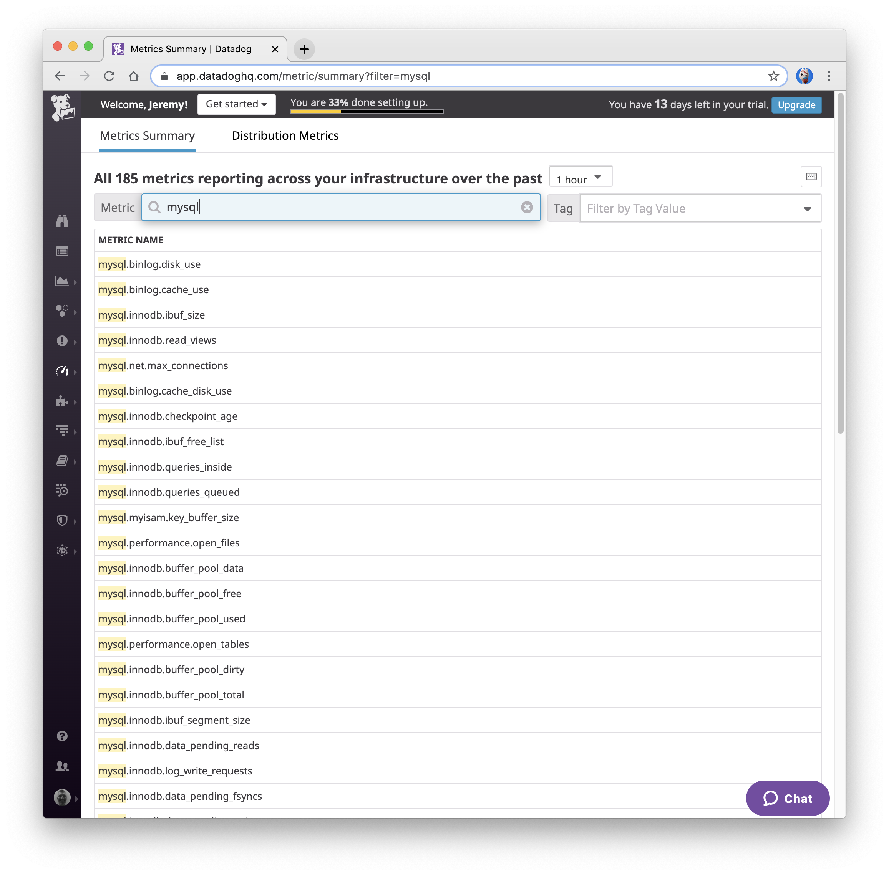
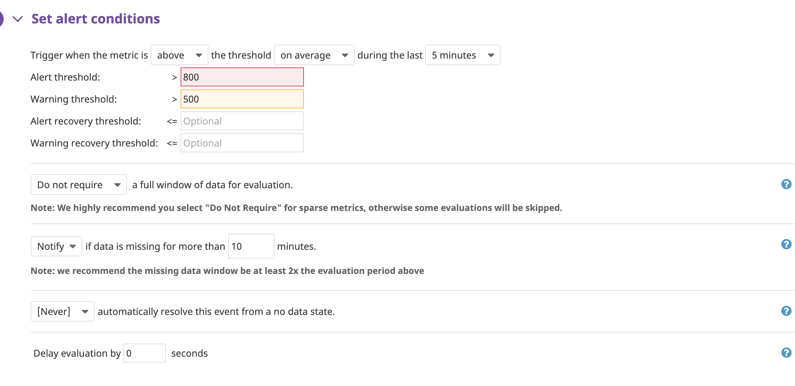

## Prerequisites - Setup the environment

This exercise uses [Docker](https://www.docker.com/) containers to allow you to run the code on any modern operating system. A container is a lightweight, stand-alone, executable package of a piece of software that includes everything needed to run it: code, runtime, system tools, system libraries, settings. Available for both Linux and Windows based apps, containerized software will always run the same, regardless of the environment.<sup id="a1">[1](#f1)</sup>

[Docker Compose](https://docs.docker.com/compose/) is a tool for defining and running multi-container Docker applications. The [docker-compose.yaml](docker-compose.yaml) file in this repo contains all the instructions and configuration for you to be able to see the results of the exercises, with one convenient command.

To see these results, in addition to [Docker for your platform](https://store.docker.com/search?type=edition&offering=community), you'll need a [DataDog account](https://app.datadoghq.com/signup). After creating credentials and answering a short questionnaire about your stack, you'll be brought to the Agent Setup screen. On this screen you won't need to download an agent, but you will need your personal API key. You should keep this key secret - if you need to revoke it due to accidental disclosure, there are [instructions for doing so](https://help.datadoghq.com/hc/en-us/articles/210267806-How-do-I-reset-my-Datadog-API-keys-).


In accordance with standard Docker (and [Twelve-Factor App](https://12factor.net/config)) best practices, configuration is passed to the Dockerized Datadog agent using environment variables. You can refer to the [documentation](https://github.com/DataDog/docker-dd-agent#environment-variables) for the full list of available options, but for now we just need to set up the `DD_API_KEY`.

Lets create an configuration file that will contain all the user and host specific configuration. For the purposes of this exercise we'll just make it an executable that you'll run to setup the environment. In your production system you should consult your container orchestration system's [documentation](https://kubernetes.io/docs/tasks/inject-data-application/define-environment-variable-container/).

```
echo 'export DD_API_KEY=0123456789abcdef' >> ./hiring-engineers.sh
chmod +x ./hiring-engineers.sh
source ./hiring-engineers.sh
```

Now you're ready to get the agent reporting metrics from your local machine! Simply run `docker-compose up`. Docker will download the Dockerized agent from Datadog and launch it. Once it launches, the Agent Setup screen will automatically update notifying you that the agent is reporting and you can continue to the next step


## Collecting Metrics

### Tags
Tags are a way of adding dimensions to metrics, so they can be sliced, diced, aggregated, and compared on the front end. Using tags enables you to observe aggregate performance across a number of hosts and (optionally) narrow the set further based on specific elements. In a nutshell, tagging is a method to scope aggregated data.<sup id="a2">[2](#f2)</sup>

Now lets stop the agent and configure some custom tags for your host.

1. Simply press `Ctrl-C` in the terminal where you ran Docker Compose earlier and Docker will tear down the containers.

2. Add the host tags environment variable to the environment configuration script we created earlier, and execute it again. (Note, the [documentation](https://github.com/DataDog/datadog-agent/tree/master/Dockerfiles/agent#global-options) is incorrect and states that the host tags variable, DD_TAGS, should be a space separated list - it should be a comma separated list):
```
echo 'export DD_TAGS="jstanton617, machinetype:macbookair"' >> ./hiring-engineers.sh
source ./hiring-engineers.sh
```
3. Restart the agent by running `docker-compose up`

4. Visit the [Infrastructure Host Map](https://app.datadoghq.com/infrastructure/map) and you should see your host as the single host configured so far. Click on it, and you will see that the tags we configured are being reported to Datadog


### Database Integrations

The docker-compose.yaml also includes the MySQL database server in order to demonstrate Datadog's extensive [library of more than 200 built-in integrations](https://docs.datadoghq.com/integrations/).

As the integrations aren't specific to the Dockerized Datadog agent, they use traditional YAML configuration files, rather than environment variables. The full list of options are documented in the [example](https://github.com/Datadog/integrations-core/blob/master/mysql/conf.yaml.example), but for our purposes we just need to configure credentials to allow the integration to connect to the MySQL container.

In production you'll want to create a unique user on your MySQL servers according to the [MySQL integration documentation](https://docs.datadoghq.com/integrations/mysql/), but for the purposes of this demo we'll just use the MySQL Docker container's built in ability to set the root password with an environment variable.

1. Again, press `Ctrl-C` in the terminal where you ran Docker Compose earlier to stop the agent.

2. Add the root password environment variable to the environment configuration script:
```
echo 'export MYSQL_ROOT_PASSWORD=password' >> ./hiring-engineers.sh
source ./hiring-engineers.sh
```
3. Edit the [MySQL integration configuration file](./datadog-agent/conf.d/mysql.yaml) to use the same password.

4. Restart the agent by running `docker-compose up`

5. Visit the [Metrics Summary](https://app.datadoghq.com/metric/summary?filter=mysql) page to verify that the Integration is reporting:



### Custom Metric Reporting and Monitoring

Sending your application’s custom metrics to Datadog lets you correlate what’s happening with your application, your users and your system.<sup id="a3">[3](#f3)</sup> Custom metrics generally refer to any metric that you send using statsd, DogStatsD, or through extensions made to the Datadog Agent.<sup id="a4">[4](#f4)</sup>

For this exercise we've defined a Python script that extends the Datadog agent.<sup id="a5">[5](#f5)</sup> It submits a metric named `my_metric` with a random value between 0 and 1000.

Custom checks of this type are kept in a folder [checks.d](./datadog-agent/checks.d), with a YAML configuration file with a corresponding name in the conf.d directory we explored earlier when configuring the MySQL integration.

While the configuration file is usually specific to your check, there is a global option  `min_collection_interval` setting can be added to the init_config section to help define how often the check should be run.<sup id="a6">[6](#f6)</sup> This allows you to change the collection interval without modifying the Python check file. Here it is set to 45 seconds.

To be alerted when your custom metric exceeds certain thresholds, you can [set up a Monitor on the metric](https://app.datadoghq.com/monitors#create/metric). Standard monitoring options such as static warning and error thresholds as well as the "No Data" condition are all supported, along with analytics such as absolute or percentage change, [advanced anomaly detection](https://docs.datadoghq.com/monitors/monitor_types/anomaly/) and [outlier detection](https://docs.datadoghq.com/monitors/monitor_types/outlier/). Alerting is covered extensively in the [documentation](https://docs.datadoghq.com/monitors/).


Delivering the notification can happen through multiple channels. Here is an example of a simple e-mail, but integrations with chat systems like [Slack](https://docs.datadoghq.com/integrations/slack/) or incident management systems such as [PagerDuty](https://www.pagerduty.com/docs/guides/datadog-integration-guide/) are also available. Alerts follow standard markdown syntax, extended with [variables and other conditional formatting](https://docs.datadoghq.com/monitors/notifications/).



Its also possible to schedule one-off or repeating downtime for an alert, for instance for planned maintenance, or a weekend:


## Citations

<sup id="a1">[1](#f1)</sup> https://www.docker.com/what-container [↩](#a1)

<sup id="a2">[2](#f2)</sup> https://docs.datadoghq.com/getting_started/tagging/ [↩](#a2)

<sup id="a3">[3](#f3)</sup> https://docs.datadoghq.com/developers/metrics/ [↩](#a3)

<sup id="a4">[4](#f4)</sup> https://docs.datadoghq.com/getting_started/custom_metrics/ [↩](#a4)

<sup id="a5">[5](#f5)</sup> https://docs.datadoghq.com/agent/agent_checks/ [↩](#a5)

<sup id="a6">[6](#f6)</sup> https://docs.datadoghq.com/agent/agent_checks/#configuration [↩](#a6)
