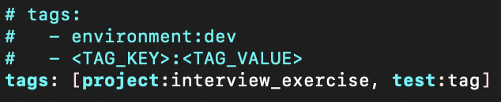

# Welcome to my Mid-Market Sales Engineer Technical Exercise
# I really enjoyed participating in this exercise, working through technical challenges, and learning more about the Datadog product suite!

# Prerequisites - Setup the Environment

In terms of OS/host, I chose to spin up a linux VM with Vagrant utilizing the provided instructions.
Then, I signed up for a Datadog trial using "Datadog Recruiting Candidate" in the "Company" field.
To collect the agent reporting metrics I used the one step easy install for Ubuntu:

```
DD_AGENT_MAJOR_VERSION=7 DD_API_KEY=bcd876470101c1a31c35d8b6ca8b82d4 DD_SITE="datadoghq.com" bash -c "$(curl -L https://s3.amazonaws.com/dd-agent/scripts/install_script.sh)"
```

# Collecting Metrics

I added tags in the agent config file `/etc/datadog-agent/datadog.yaml`,
but was not able to see them in the Datadog UI. I determined that I needed to restart the agent.
This article clarified the issue https://docs.datadoghq.com/getting_started/agent/ and after restarting with:

```
$ sudo service datadog-agent restart
```

I was able to see the tags in the UI! Below are images of the tags in the .yaml file as well as on the Host Map Page in Datadog:




Next, I installed a MySQL database on my Vagrant VM with:

```
sudo apt install mysql-server
```

And checked the installation was successful using:

```
sudo service mysql status

sudo ss -tap | grep mysql
```

Then, I worked to install the MySQL Datadog Integration by going through this guide step by step https://app.datadoghq.com/account/settings#integrations/mysql

After preparing MySQL by creating a db user for the Datadog agent & granting privileges, as well as configuring the check for an agent running on MyVagrant VM,
I viewed several errors for the integration in the Datadog UI.

First, I was shown this error message:

```
Datadog’s mysql integration is reporting:
•	Instance #initialization[ERROR]: {"Core Check Loader":"Check mysql not found in Catalog","JMX Check Loader":"check is not a jmx check, or unable to determine if it's so","Python Check Loader":"could not configure check instance for python check mysql: could not invoke 'mysql' python check constructor. New constructor API returned:\nTraceback (most recent call last):\n File \"/opt/datadog-agent/embedded/lib/python3.8/site-packages/datadog_checks/mysql/mysql.py\", line 77, in __init__\n self._config = MySQLConfig(self.instance)\n File \"/opt/datadog-agent/embedded/lib/python3.8/site-packages/datadog_checks/mysql/config.py\", line 15, in __init__\n self.port = int(instance.get('port', 0))\nValueError: invalid literal for int() with base 10: '\u003c3306\u003e'\nDeprecated constructor API returned:\n__init__() got an unexpected keyword argument 'agentConfig'"}
```

I went through each of the steps again to verify accuracy and found that I had mistakenly included a typo in the port number and had not edited the
mysql.d/conf.yaml to include the appropriate `<ERROR_LOG_FILE_PATH>` and `<SERVICE_NAME>`

However, after fixing these mistakes I was presented with a new error message:

```
Datadog’s mysql integration is reporting:
•	Instance #mysql:fbbcfd6e01243f3[WARNING]: Failed to fetch records from the perf schema 'events_statements_summary_by_digest' table.,Failed to fetch records from the perf schema 'events_statements_summary_by_digest' table.
```

I searched for a while on google for a solution to this problem but ultimately went back to the Datadog docs to look through this troubleshooting guide https://docs.datadoghq.com/logs/guide/log-collection-troubleshooting-guide/

I thought perhaps my error was related to "Permission issues tailing log files" listed in the troubleshooting guide.
After checking the agent status:

```
sudo datadog-agent status
```

I noticed that the datadog-agent user did not have read access to tail the log files.

I wish I had taken a screenshot of this at the time, but I didn't, so here is a photo of what the problem looked like as shown in the troubleshooting guide:


To add the missing permissions I used this guide https://docs.datadoghq.com/logs/guide/setting-file-permissions-for-rotating-logs/ and these commands:

```
getfacl /var/log/mysql

sudo setfacl -R -m u:dd-agent:rx /var/log/mysql
```

I restarted the agent and checked the agent status again, and the permissions issues appeared to be fixed (as shown in the screenshots below)


When checking the Datadog UI, the same integration warning was still being shown. After scouring the internet for far too long to no avail, I decided to use a workaround for this warning for the purposes of this interview. While 'extra_performance_metrics' by default is set to 'true' in the mysql.d/conf.yaml file,
I changed the value to 'false' with the commands in the screenshot below and the warning was resolved.


After these initial hurdles, the tech exercise ran much more smoothly - hooray!

To configure the custom Agent check I used this guide https://docs.datadoghq.com/metrics/agent_metrics_submission/?tab=count
The images below show the steps I took to create and edit the config file and my python code file called custom_my_metric.py, as well as the contents of the python file.


To change the collection interval I used this guide https://docs.datadoghq.com/developers/write_agent_check/?tab=agentv6v7 and edited the yaml file to include:

```
init_config:
instances:
  - min_collection_interval: 45
```

Lastly, I verified my metric was reporting to Datadog in the UI.

*BONUS Q* - I changed the collection interval by modifying the yaml file so this was already solved for.

# Visualizing Data

I started by doing some research into Datadog Dashboards and learned how users can create visualizations with drag and drop or through the Datadog API. (using this link https://docs.datadoghq.com/getting_started/dashboards/)

I decided to use Postman to configure my API calls and used this https://docs.datadoghq.com/getting_started/api/ for reference. I imported the Datadog collection into Postman and added my API Key and Datadog Application Key to the Datadog Authentication Postman Environment.

In terms of writing the JSON to create the appropriate visualizations, this article https://zero2datadog.readthedocs.io/en/latest/visualize.html#visualize-data-with-the-web-ui provided a lot of useful information. To pick a metric to apply the anomaly function to, I clicked on the host map and then MySQL, and looked through different options - ultimately choosing performance.cpu_time. The contents of my Postman JSON body looked like this:

```
{
  "title": "Jojo's Custom Metric Timeboard",
  "description": "A custom agent check configured to submit a metric named `my_metric` with a random value between 0 and 1000.",
  "layout_type": "ordered",
  "widgets": [
        {
          "definition": {
                "type": "timeseries",
                "requests": [
                  {
                        "q": "avg:my_metric{*}"
                  }
                ],
                "title": "My Custom Metric"
          }
        },
        {
          "definition": {
                "type": "timeseries",
                "requests": [
                  {
                        "q": "avg:my_metric{*}.rollup(sum, 3600)"

                  }
                ],
                "title": "My Custom Metric Hourly Rollup"
          }
        },
        {
          "definition": {
                "type": "timeseries",
                "requests": [
                  {
                        "q": "anomalies(avg:mysql.performance.cpu_time{*}, 'basic', 3)"

                  }
                ],
                "title": "MySQL Performance CPU Time Anomalies"
          }
        }

  ]

}

```

Link to my timeboard: https://p.datadoghq.com/sb/ad6af722-e37a-11eb-af8b-da7ad0900002-b298f3d27c29f5778b117605ee8c6e0c

I noticed that it was hard to see any data on the hourly rollup visualization without setting the timeboard to show at least the past 2 hours. This is because without at least 2 hours there is only one datapoint on the line graph.

I took a snapshot of My Custom Metric Graph for the past 5 Minutes and sent it to myself -- shown in the image below:


*BONUS Q*: The anomaly graph provides a visualization of average MySQL performance CPU time that is greater than three standard deviations from the norm.

# Monitoring Data

I used this article https://docs.datadoghq.com/monitors/notifications/?tab=is_alert as reference to configure the monitor messages. When first attempting to send the notification emails, I only entered my @ into the “Notify Your Team” section of the monitor creation page, but I realized this wasn’t working. I went back into the documentation and realized that the @ needs to be in between the conditional variable opening and closing statements - Once I had fixed this the email service functioned properly. I thought it was interesting that as you add email addresses in between these statements you are provided with warnings such as “In message: @ is used in is_warning but not in is_recovery. No recovery notification will be sent.”

After I started receiving emails, I noticed I was getting Warning and No Data conditions, but not Alerts. I looked through the monitor editor for a while, and realized this had to be because I had set the monitor to trigger when the metric was above 800 ON AVERAGE during the last 5 minutes. I wasn't sure if the instructions indicated to create monitors based on the average of all of the metrics collected over the past 5 minutes, or to create monitors based off of an occurrence of the metric (which is an average) collected over the past 5 minutes. However, once I changed the trigger to fire when the metric was above the threshold AT LEAST ONCE during the past 5 minutes, I immediately started receiving alert emails.

Below are screenshots of each of the different monitor email notifications.

Warning threshold of 500:


Alerting threshold of 800:
Note: The instructions noted to include the host ip in the message when the Monitor triggers an Alert state. By default my Vagrant box does not have an IP address, so this value was not populated in the email. However, I have an included an additional image below showing the code that would include it if the host did have an IP.


No data for past 10 min:


*BONUS*: Scheduled downtime 7pm to 9am daily on M-F:


*BONUS*: Schedule Downtime all day on Sat-Sun:
Note: As I was working on the monitoring section during the week (not the weekend),  I have also included a screenshot of what the downtime monitor looks like in the UI vs in an email.


# Collecting APM Data

I Used this guide to install flask on Ubuntu: https://linuxhint.com/ultimate-guide-to-install-flask-on-ubuntu/ which I determined was successful after running:

```
python -m flask --version
```

And received the expected results shown in the article. I then used this https://docs.datadoghq.com/tracing/setup_overview/setup/python/?tab=containers to understand how to trace python applications.

I encountered issues while attempting to install ddtrace. On my first attempt of

```
pip install ddtrace
```

I received the error message `"Command "python setup.py egg_info" failed with error code 1 in /tmp/pip-build-5a378f8u/ddtrace/"`

I googled this message and found that I likely needed to upgrade setuptools and install Cython, which I did with:

```
pip install --upgrade setuptools

pip install Cython
```

After this I was met with the following error: `"Failed building wheel for ddtrace"`

Looking back at the Datadog Tracing Python Apps article (linked above), I noticed the statement "This command requires pip version 18.0.0 or greater." I checked the version with:

```
pip --version
```

And received:

```
pip 9.0.1 from /home/vagrant/flask_app/venv/lib/python3.6/site-packages (python 3.6)
```

I upgraded pip

```
sudo -H pip3 install --upgrade pip
```

And then was able to successfully install ddtrace.

After solving for that pickle, I created a file called my_app.py in my flask_app directory in my virtual environment (venv), and inserted the contents of the flask app provided in the instructions:

```
Sudo touch my_app py
Sudo vi my_app.py
```

Application code for reference:

```
from flask import Flask
import logging
import sys

# Have flask use stdout as the logger
main_logger = logging.getLogger()
main_logger.setLevel(logging.DEBUG)
c = logging.StreamHandler(sys.stdout)
formatter = logging.Formatter('%(asctime)s - %(name)s - %(levelname)s - %(message)s')
c.setFormatter(formatter)
main_logger.addHandler(c)

app = Flask(__name__)

@app.route('/')
def api_entry():
    return 'Entrypoint to the Application'

@app.route('/api/apm')
def apm_endpoint():
    return 'Getting APM Started'

@app.route('/api/trace')
def trace_endpoint():
    return 'Posting Traces'

if __name__ == '__main__':
    app.run(host='0.0.0.0', port='5050')

```

To instrument this python app I ran:

```
DD_SERVICE="flask" DD_ENV="dev" DD_LOGS_INJECTION=true ddtrace-run python my_app.py
```

Instead of hitting the flask app endpoints one at a time manually, I created a programmatic solution.

I created another python file in my flask_app directory:

```
sudo touch my_app_test.py
```

Then, I used vi to insert the following script to hit each endpoint 100 times:

```
import requests

for x in range(100):
    r = requests.get('http://10.0.2.15:5050/')
    r = requests.get('http://10.0.2.15:5050/api/apm')
    r = requests.get('http://10.0.2.15:5050/api/trace')
```

While running ddtrace for my_app.py in one terminal window, I ran the my_app_test.py a few times in a second terminal window.
Meanwhile, I watched results appear on the APM services dashboard.

I created a dashboard including the Latency distribution and Latency graphs from the APM services dashboard, trace.flask.request.duration from the traces metrics, and Network Traffic from the system metrics.

Here is a screenshot of the state of the dashboard as I am creating this document:


You can find this dashboard here which I have set to show data for the past 1 week: https://p.datadoghq.com/sb/ad6af722-e37a-11eb-af8b-da7ad0900002-cbb38d7dfacc80b7d0e383096fe47434

# Final Question

Outside of work, one of my passions is snowboarding. While going on trips to different mountains over the winters, I've noticed that ski resorts often use somewhat archaic systems. This becomes an issue when you're high up on a mountain in the snow, because it can be difficult to retrieve information that you want. For ex: what ski lifts are currently running? I don't want to ski down to a lift that is closed and then be stuck at the bottom of a mountain with no way to get back up. Also, how busy is the lunch spot I want to go to? I don't want to waste a chunk of my day traversing to a restaurant that has long lines and no where to sit. This is where I think Datadog could come in and make information much more accessible in these types of remote locations. Datadog could collect metrics from ski lifts and restaurants and provide a dashboard for users on their phones that would allow them to see availability and guide their decision making while at the resort. Datadog monitors could be used to provide alerts, warnings, and notifications of closures. More so, Datadog could be used by the resort owners as well. For instance, to determine the functionality of ski lift and detect anomalies in performance. Additionally, it could allow resorts to understand popularity of different restaurants, and influence their techniques in dispersing traffic across the mountain. It is exciting to think about how many uses Datadog has, and how it will continue to expand its reach, providing necessary information to users maybe even in a remote town high up on a mountain in the snow.


I hope you enjoyed reading through my project! I look forward to hearing from you.
