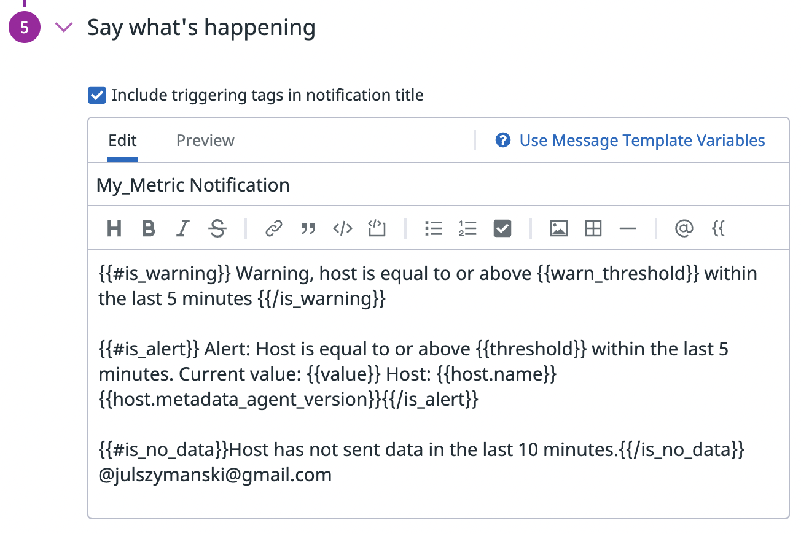
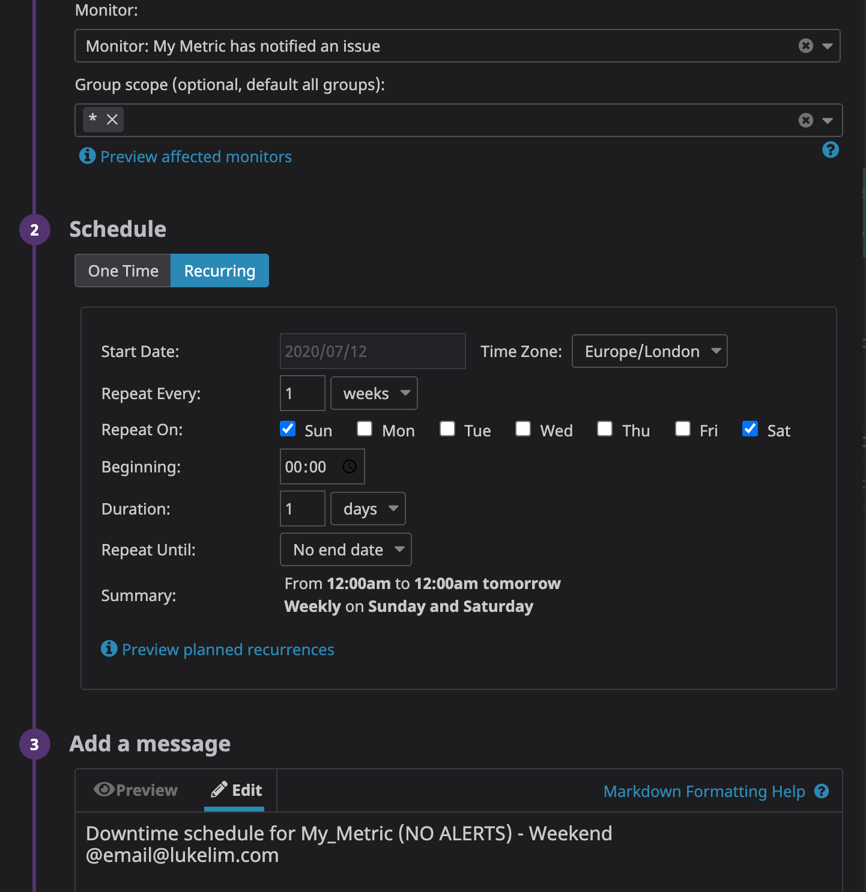
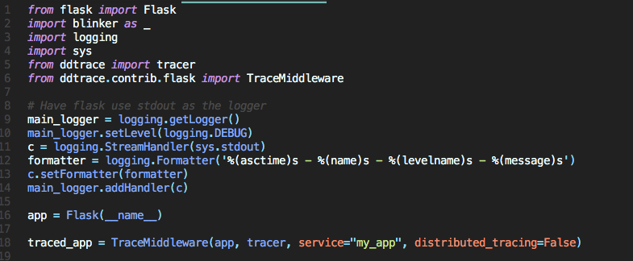

## Collecting Metrics:

* Add tags in the Agent config file and show us a screenshot of your host and its tags on the Host Map page in Datadog.

I created 3 tags in the datadog.conf file in the .datadog-agent folder, as seen here:

This created the tags that can now be viewed in the Host Map, shown here:

* Install a database on your machine (MongoDB, MySQL, or PostgreSQL) and then install the respective Datadog integration for that database.

I already had PostgreSQL installed on my machine, so it was just a matter of installing the Datadog integration.  I followed the instructions to add datadog as a User and give it the appropriate properties.  I then adjusted the code as instructed on the Postgres yaml file.  After doing a quick system check

I saw that it was properly installed on my Dashboard:

* Create a custom Agent check that submits a metric named my_metric with a random value between 0 and 1000.

I created 2 files in the .datadog-agent folder: randmetric.py and randmetric.yaml.  The yaml file is a config file, to be placed in the conf.d subfolder.  The python file contains the actual check, and thus goes in the checks.d subfolder.  Here is what the code looked like:

The python file inherits from AgentCheck, and to get the random value, I've imported from random as well.  In the yaml config file, for now I am just doing the bare minimum to get the check running.  Once it's running, here's what the metrics dashboard looks like:

As a default, it collects data every 20 seconds.

* Change your check's collection interval so that it only submits the metric once every 45 seconds.

By changing the minimum collection interval to 45, data will now only be submitted no more than every 45 seconds.  It is still dependent upon when the agent collects, however.

* **Bonus Question** Can you change the collection interval without modifying the Python check file you created?

Yes - this can be done by changing the default collection interval in the yaml file, as shown above.

## Visualizing Data:

Utilize the Datadog API to create a Timeboard that contains:

* Your custom metric scoped over your host.
* Any metric from the Integration on your Database with the anomaly function applied.
* Your custom metric with the rollup function applied to sum up all the points for the past hour into one bucket

I created this all as one Timeboard using 3 different graphs in a single API call.  The code for this is here:

The graph for my_metric is straight forward and has no constraints.  The metric from the PSQL integration is also ported in with little alteration.  I couldn't quite get the syntax for adding an anomaly at the point of Timeboard creation, so I added this manually on the Dashboard view in the UI.  Finally, I used the rollup function to create another graph of my_metric, for the period of one hour.  All 3 graphs can be seen on the [Timeboard](https://app.datadoghq.com/dash/405237/my-timeboard?live=true&page=0&is_auto=false&from_ts=1511214044479&to_ts=1511818844479&tile_size=m) here:

Once this is created, access the Dashboard from your Dashboard List in the UI:

* Set the Timeboard's timeframe to the past 5 minutes

To get to a 5 minute timeframe, I manually selected a 5 minute subsection on the graph itself.  This adjusted the whole timeboard to a 5 minute interval.

* Take a snapshot of this graph and use the @ notation to send it to yourself.

After adjusting this to 5 minutes, I sent myself a snapshot.  This now appears in my events, as seen here:

* **Bonus Question**: What is the Anomaly graph displaying?

It is basically highlighting deviations from the norm.  Based on past behavior, the algorithm expects the data to behave a certain way, within some bounds.  If it deviates too much from this, the graph is marked in red to indicate these periods of anomalies.  This will not show much for a small data sample, but over time seems to be an effective way of highlighting significant deviations in one's data.

## Monitoring Data

Since you’ve already caught your test metric going above 800 once, you don’t want to have to continually watch this dashboard to be alerted when it goes above 800 again. So let’s make life easier by creating a monitor.

Create a new Metric Monitor that watches the average of your custom metric (my_metric) and will alert if it’s above the following values over the past 5 minutes:

* Warning threshold of 500
* Alerting threshold of 800
* And also ensure that it will notify you if there is No Data for this query over the past 10m.

To create this monitor, I clicked Monitors, and then New Monitor on the sidebar of my UI. From here I chose to create a Metric monitor.  I set this up as per the instructions above, with these results:

Please configure the monitor’s message so that it will:

* Send you an email whenever the monitor triggers.
* Create different messages based on whether the monitor is in an Alert, Warning, or No Data state.
* Include the metric value that caused the monitor to trigger and host ip when the Monitor triggers an Alert state.
* When this monitor sends you an email notification, take a screenshot of the email that it sends you.

Using different variables in an if/else setup, I created messages that would be different depending on which alert was being recorded, as seen here:

And here is an email that was sent to me when the warning state was reached:

The IP does not appear to be displaying correctly, despite being templated exactly as stated in the templating dialogue box.

* **Bonus Question**: Since this monitor is going to alert pretty often, you don’t want to be alerted when you are out of the office. Set up two scheduled downtimes for this monitor:

    * One that silences it from 7pm to 9am daily on M-F,
    * And one that silences it all day on Sat-Sun.
    * Make sure that your email is notified when you schedule the downtime and take a screenshot of that notification.

These both can be setup by going to the Manage Downtime tab in the Monitors dashboard.  Here are what the monitors will look like in setup:

And once the downtime occurred, I received this email:

## Collecting APM Data:

    
* **Bonus Question**: What is the difference between a Service and a Resource?

A service is essentially a term used to encompass the source of one's data.  It could be an app or a database, and is the actual thing running when data is being collected.  A resource is then a piece of that service, in the form of a query.  This could be a route, a db query, or other similar events.  A service can have many resources, while a resource is specifically connected to a single service.

Provide a link and a screenshot of a Dashboard with both APM and Infrastructure Metrics.

Getting the APM setup and my app instrumented proved to be a bit difficult.  I decided to use the Flask app provided with these instructions.  After a very quick tutorial on Flask, I used the "flask run" command to get the app running.  This allowed me to access the app through http://127.0.0.1:5000 (aka localhost:5000).  The app worked fine, but I ran into trouble when trying to integrate the Datadog Tracer.

The first thing I did was to add the code "apm_enabled: true" to my datadog.conf file.  There were 2 options then on how to integrate the tracer.  One was to install the ddtrace package and run the app through there in order to instrument it.  To do this I first installed the package, using 'pip install ddtrace'.  I then ran the command 'ddtrace-run python my_app.py'.  This allowed the app to run, but there seemed to be some sort of blockage, as I kept getting the error 'ddtrace.writer - ERROR - cannot send services: [Errno 61] Connection refused'.  Kevin thought this might be a port issue, but after checking my firewall settings, I saw that all my ports were open.

I tried next to install the DD trace Middleware within the app, and then just run the app as normal.  I used the documentation [here](http://pypi.datadoghq.com/trace/docs/#) to determine what to include to get the Middleware running.  Here's what the code looked like after implementing:

Unfortunately I got the same error regarding the connection being refused.  I tried adding some additional code recommended by the documentation [here](https://docs.datadoghq.com/tracing/python/#example) but just got an additional error saying it was unable to send spans.  Thinking maybe it was the app, I tried cloning the Datadog Flask [example](https://github.com/DataDog/trace-examples/tree/master/python/flask), but just got the same errors again.

In summary, my best guess is that there is something off in either my local settings or my DD account settings.  There is something blocking write access; it could be a privacy thing or could be a configuration setup issue, or something else completely.  If given the time, some additional workarounds could be to retry this process using Ruby or Go; trying the whole process with an app written in a different framework than Flask; or even clearing all Datadog Agent and tracer material off my local machine and starting from scratch.

## Final Question:

Datadog has been used in a lot of creative ways in the past. We’ve written some blog posts about using Datadog to monitor the NYC Subway System, Pokemon Go, and even office restroom availability!

Is there anything creative you would use Datadog for?

Somewhat similar to the NYC subway monitor, you could potentially use Datadog for monitoring of driving conditions.  Pulling in data from sources like Google Maps, Apple Maps, and Waze, you might be able to create a heat map of traffic conditions.  This is sort of similar to what each service does individually, but aggregrating them together could potentially give you more accurate data.  As a real time feature, it's hard to say how useful this is, since future traffic is hard to predict, but it could be useful to pull on trends.  Say for instance you commute from the suburbs of NYC into the city everyday.  There are many routes to take, all with their share of problems and traffic jams.  However, if you could see if there are trends of traffic issues on certain roads on certain days, it might help you become a more efficient commuter.  I'm sure there are other 3rd party apps with user generated content, and integrating with more and more of these will just make the data more robust.