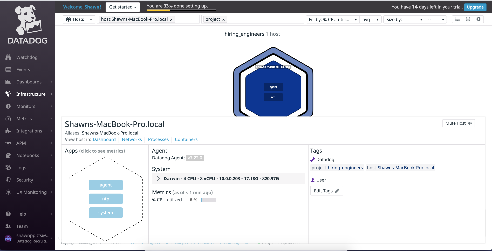
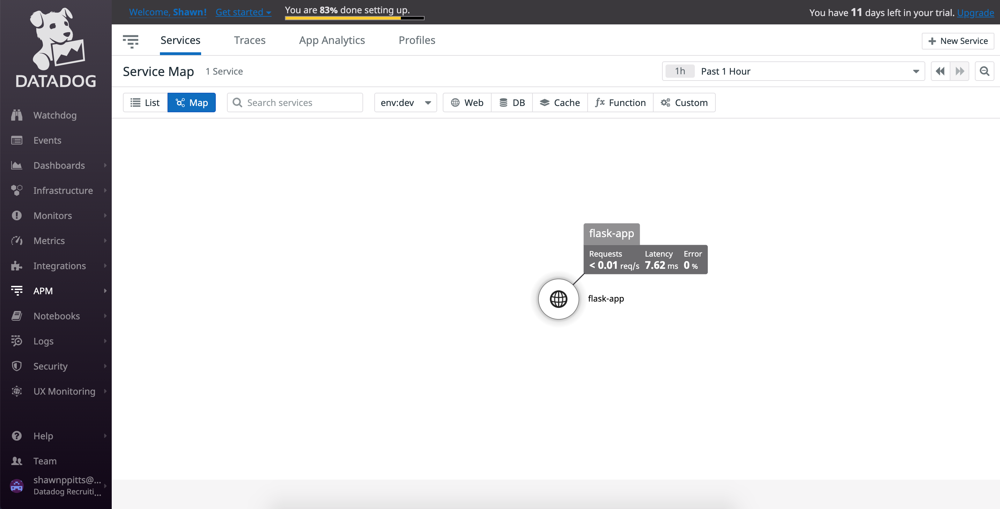

# Prerequisites - Setup the environment

I decided to spin up a linux VM using vagrant.

# Collecting Metrics:
* **Add tags in the Agent config file and show us a screenshot of your host and its tags on the Host Map page in Datadog.**
    
    _Documentation I referred to get started with tags. https://docs.datadoghq.com/getting_started/tagging/_    
    The steps below were used to add a tag to the Agent config file.
    1. [Methods for assigning Tags](http://google.com) states "The Agent configuration file (datadog.yaml) is used to set host tags which apply to all metrics, traces, and logs forwarded by the Datadog Agent." Based on this information, I went ahead and modified the datadog.yaml file which can be accessed using `vi ~/.datadog-agent/datadog.yaml`. 
    2. In datadog.yaml I added a tag of `project:hiring_engineers`. I used this host tag to filter by a common app/project
    3. The following screenshot displays the Host Map within Datadog filtering by the project tag set above.
       

    

* **Install a database on your machine (MongoDB, MySQL, or PostgreSQL) and then install the respective Datadog integration for that database.**
    
    _The following steps show how we can install the respective Datadog integration for MongoDB Atlas. Important note to make is that the Atlas integration for Datadog only supports cluster tiers M10+._

    1. In [MongoDB Atlas](https://docs.atlas.mongodb.com/getting-started/), create an account start a project, and create a cluster.
    2. Back inside of Datadog, click on the *Integrations > Integrations* tab found in the left hand navigation menu.
    
    3. In the Integrations tab, search for _MongoDB_ and click install.
    
    4. Next, visit the *Configuration* tab of the MongoDB integration modal and follow the steps provided. 
    5. Jump back into MongoDB Atlas and verify that datadog is configured. Your integrations tab should display the following.
    

* **Create a custom Agent check that submits a metric named my_metric with a random value between 0 and 1000.**

    _Documentation I referred to get started creating a Custom Agent Check can be found **[here](https://docs.datadoghq.com/developers/write_agent_check/?tab=agentv6v7#should-you-write-an-agent-check-or-an-integration)**._ 

    1. To get started writing a custom Agent check, create a new directory as a child of conf.d (ex: custom_agent_check.d)
    2. In the newly created directory, create a YAML file (ex: custom_agent_check.yaml)
    3. Change to the datadog agent root and jump into the checks.d directory.
    4. In the checks.d directory, create a check file (ex: custom_agent_check.py) with the following code snippet.
    ```python
    import random
    # the following try/except block will make the custom check compatible with any Agent version
    try:
        # first, try to import the base class from new versions of the Agent...
        from datadog_checks.base import AgentCheck
    except ImportError:
        # ...if the above failed, the check is running in Agent version < 6.6.0
        from checks import AgentCheck

    # content of the special variable __version__ will be shown in the Agent status page
    __version__ = "1.0.0"

    class My_Metric(AgentCheck):
        def check(self, instance):
            self.gauge('my_metric', random.randrange(0,1000), tags=['custom_agent_check:test_check'])
    ```

    To verify the check with macOS:
    1. Stop the agent using ```launchctl stop com.datadoghq.agent```
    2. Start the agent back up using ```launchctl start com.datadoghq.agent```
    3. Run ```datadog-agent status```. You should see the following results
    

* **Change your check's collection interval so that it only submits the metric once every 45 seconds.**
    
    * Modify the YAML file created in your Custom Agent check folder located in the conf.d directory. Include the following snippet
    ```yaml
        init_config:

        instances:
            - min_collection_interval: 45 
    ```
* **Bonus Question Can you change the collection interval without modifying the Python check file you created?**

    According to the Datadog documentation on "Writing a Custom Check", the collection interval can be set at the configuration level (YAML file) opposed to the Python script provided.

# Visualizing Data

**Utilize the Datadog API to create a Timeboard that contains:**

 **1. Your custom metric scoped over your host.**

 **2. Any metric from the Integration on your Database with the anomaly function applied.**

 **3. Your custom metric with the rollup function applied to sum up all the points for the past hour into one bucket**

* For more information on creating a Timeboard using the Datadog API, please see the documentation attached [here](https://docs.datadoghq.com/dashboards/guide/timeboard-api-doc/?tab=python)

    The steps listed below detail my implementation to complete the tasks listed above.
    
    First, lets set up our Timeboard. I created a python script (shown below). This code creates a Dashboard named Visualize Data Exercise and creates widgets that allow us to do the following
     - View the custom metric created in the collecting metrics section.
     - View the normalized CPU kernel space for mongodb processes.
     - View a rollup of our custom metric that summed up all the points over a 1 hour time span into a single bucket. the rollup function allows us to perform time aggregation.

     ```Python
    from datadog import initialize, api

    options = {
        'api_key': '<API_KEY>',
        'app_key': '<APP_KEY>'
    }

    initialize(**options)

    title = 'Visualize Data Exercise'

    widgets= [
    {
        "definition":{
            "type":"timeseries",
            "requests": [
                {
                    "q":"avg:my_metric{*}"
                }
            ],
            "title":"Average of my_metric"
        }
    },
    {
        "definition":{
            "type":"timeseries",
            "requests":[
                {

                    "q":"anomalies(mongodb.atlas.system.cpu.mongoprocess.norm.kernel,'basic',2)"
                }
            ],
            "title":"Anomalies Function"
        }
    },
    {
        "definition":{
            "type":"timeseries",
            "requests":[
                {
                    "q":"avg:my_metric{*}.rollup(sum,3600)"
                }
            ],
            "title":"Metric Rollup"
        }
    }]


    layout_type = 'ordered'
    description = 'A dashboard using the DataDog API'
    is_read_only = False
    notify_list = ['shawnppitts@gmail.com']


    api.Dashboard.create(title=title,
                        widgets=widgets,
                        layout_type=layout_type,
                        description=description,
                        is_read_only=is_read_only,
                        notify_list=notify_list)
    ```

    


         

Once this is created, access the Dashboard from your Dashboard List in the UI:

* Set the Timeboard's timeframe to the past 5 minutes
* Take a snapshot of this graph and use the @ notation to send it to yourself.

* **Bonus Question**: What is the Anomaly graph displaying?

    The anomoly function detects when a metric is behaving differently than it has in the past. More documentation on anomoly monitoring [here](https://docs.datadoghq.com/monitors/monitor_types/anomaly/#anomaly-detection-algorithms).


# Monitoring Data #

Since you’ve already caught your test metric going above 800 once, you don’t want to have to continually watch this dashboard to be alerted when it goes above 800 again. So let’s make life easier by creating a monitor.

Create a new Metric Monitor that watches the average of your custom metric (my_metric) and will alert if it’s above the following values over the past 5 minutes:

* **Warning threshold of 500**
* **Alerting threshold of 800**
* **And also ensure that it will notify you if there is No Data for this query over the past 10m.**
    
    1. To create a Metric Monitor that watches the average of our custom metric, Navigate to the _Monitors_ tab found in the left hand navigation menu.
    2. Click _New Monitor_ and select the Metric monitor type
        
    3. In Step 1. Choose the detection method, lets set this to be a _Change Alert_
        
    4. In Step 2. Define the Metric, we will want to select *my_metric* from our custom agent check
         
    5. In Step 3. Set Alert Conditions, we need to set our conditions in which we will be notified.
        

* **Send you an email whenever the monitor triggers.**    
* **Create different messages based on whether the monitor is in an Alert, Warning, or No Data state.**
* **Include the metric value that caused the monitor to trigger and host ip when the Monitor triggers an Alert state.**
* **When this monitor sends you an email notification, take a screenshot of the email that it sends you.**

    _The following steps are a continuation of the process listed above_

    6. In Step 4. Say whats happening, we need to create a message to meet the requirements listed above.
        
    7. Here is a screenshot of the email datadog sends me for an Alert based on the configuration.
        

* **Bonus Question**: Since this monitor is going to alert pretty often, you don’t want to be alerted when you are out of the office. Set up two scheduled downtimes for this monitor:

  * One that silences it from 7pm to 9am daily on M-F,
    
    To create this downtime monitor, navigate to the Monitors tab as mentioned above, and toggle _Manage Downtime_. From there you will be able to schedule a downtime monitor.
    

  * And one that silences it all day on Sat-Sun.

    
  * Make sure that your email is notified when you schedule the downtime and take a screenshot of that notification.


## Collecting APM Data:

Given the following Flask app (or any Python/Ruby/Go app of your choice) instrument this using Datadog’s APM solution:

```python
from flask import Flask
import logging
import sys
from ddtrace import tracer, config

config.flask['service_name'] = 'flask-app'

# Have flask use stdout as the logger
main_logger = logging.getLogger()
main_logger.setLevel(logging.DEBUG)
c = logging.StreamHandler(sys.stdout)
formatter = logging.Formatter('%(asctime)s - %(name)s - %(levelname)s - %(message)s')
c.setFormatter(formatter)
main_logger.addHandler(c)

app = Flask(__name__)

@tracer.wrap('flask-app.home', service='flask-entry')
@app.route('/')
def api_entry():
    return 'Entrypoint to the Application'

@tracer.wrap('flask-app.apm', service='flask-apm')
@app.route('/api/apm')
def apm_endpoint():
    return 'Getting APM Started'

@tracer.wrap('flask-app.trace', service='flask-trace')
@app.route('/api/trace')
def trace_endpoint():
    return 'Posting Traces'

if __name__ == '__main__':
    app.run(host='0.0.0.0', port='5050')
```

 By following the steps to [get started with APM](https://app.datadoghq.com/apm/install), I got the above application up and running.


**Bonus Question: What is the difference between a Service and a Resource?**

    A Service can be seen as a collection of resources such as api endpoints or database queries.

    A Resource can represent a specific part of a service such as an api endpoint or query.

    The two terms rely on eachother but the way I see it is you have a group of resources that make up a service.

**Provide a link and a screenshot of a Dashboard with both APM and Infrastructure Metrics.**

I created a dashboard with a service map as well as infrastructure metrics. https://p.datadoghq.com/sb/r40agyv44zd7xocm-f3954d51c5b94c0ca5c1ba1b7e8abcd1


**Please include your fully instrumented app in your submission, as well.**

## Final Question:

**Datadog has been used in a lot of creative ways in the past. We’ve written some blog posts about using Datadog to monitor the NYC Subway System, Pokemon Go, and even office restroom availability!**

**Is there anything creative you would use Datadog for?**

I would propose the MBTA uses datadog to monitor the real time updates to their application. There have been a few times I have missed the train because the application says it is 3 stops away and I find out Ive missed it by 5 minutes.

@MBTA
