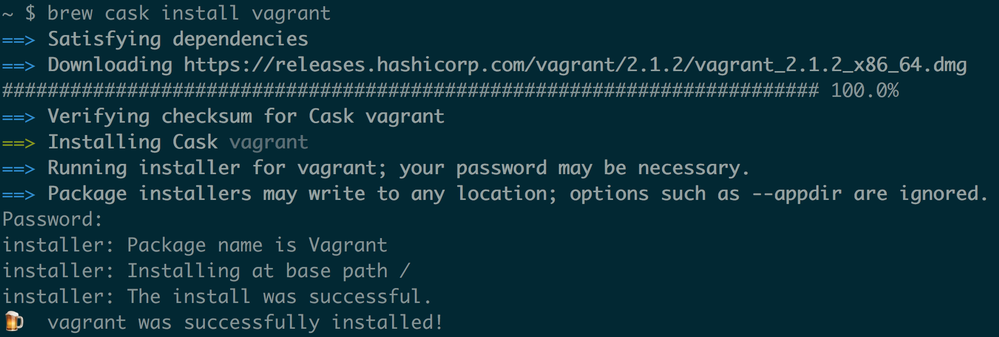
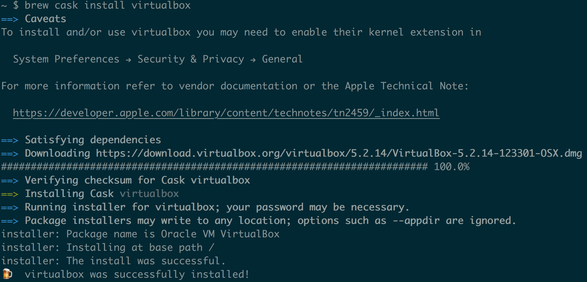
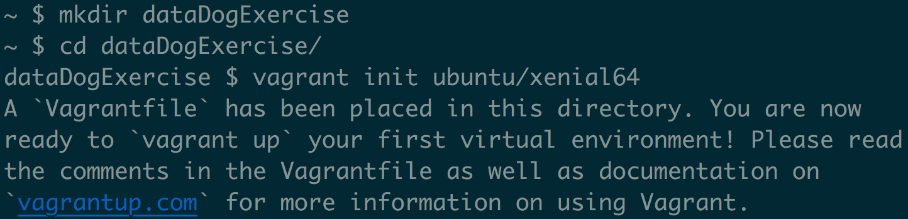
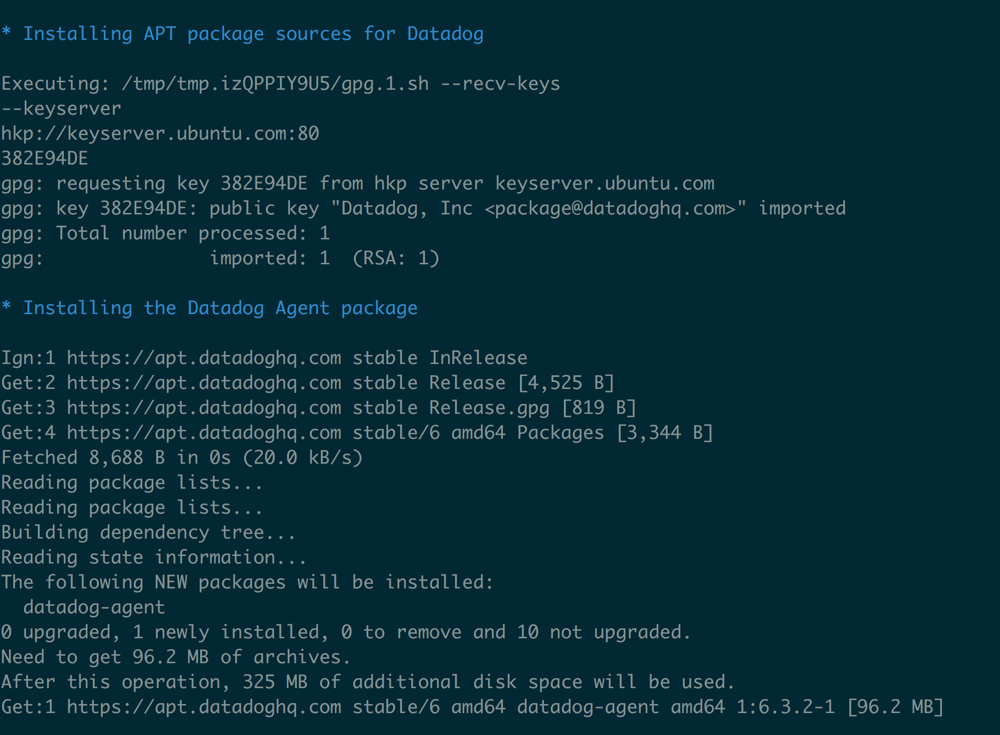
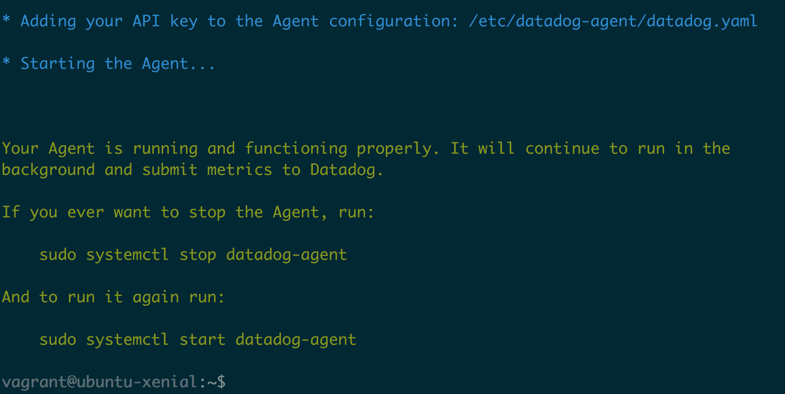
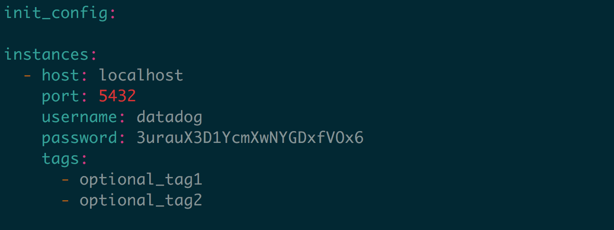
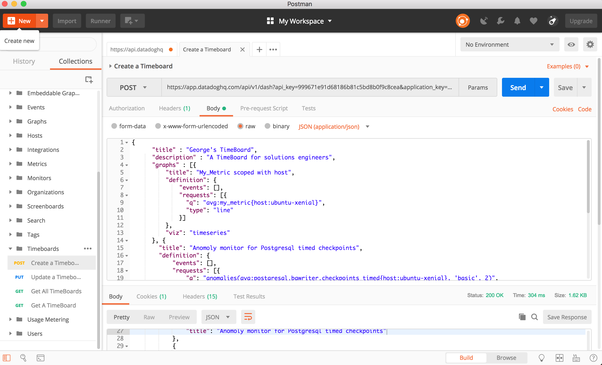
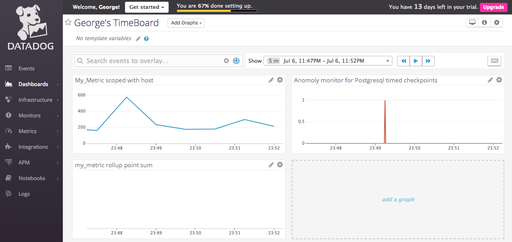
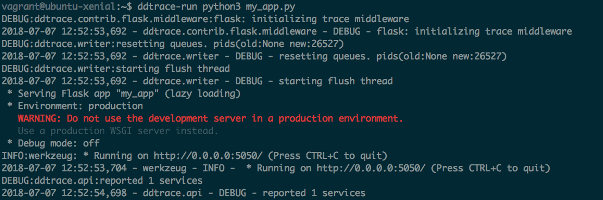
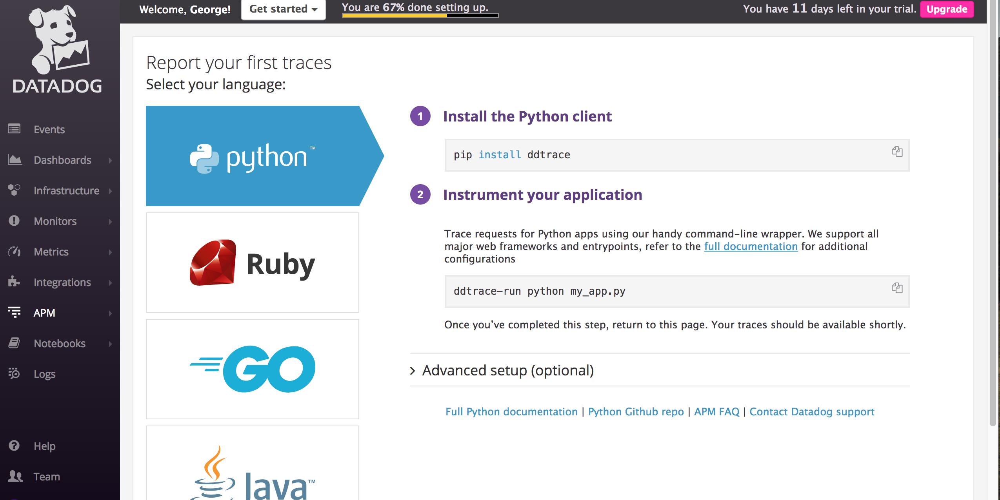

# Solutions Engineer Exercise- George Smith-Sweeper

## Prerequisites - Setup the environment

I chose to use Vagrant and Virtual-Box to complete these exercises. Since I’ve been using Homebrew as my package manager I chose to install Vagrant and Virtual-Box via the command-line.

The setup is as follows:

`brew cask install vagrant`


`brew cask install virtualbox`


Once these have been installed it’s time to spin up a fresh instance of Ubuntu. The first step is to create a new folder for the exercises `mkdir dataDogExercises` and the jump into that newly created folder `cd dataDogExercise`.

In order to avoid dependency issues I searched the [vagrant cloud](https://app.vagrantup.com/boxes/search) for a Ubuntu 16.04 LTS build (ubuntu/xenial64) and initialized my vagrant with this build. 

`vagrant init ubuntu/xenial64`.



Now that Vagrant has been initialized, running `vagrant up` will start the VM. 

Once the VM is up and running typing`vagrant ssh` into the command prompt logs you into the to the new Virtual Machine.

When done correctly, your prompt should now look similar to the one below:


After logging into the new virtual machine, you must sign up for Datagog in order to get access to my Datadog agent metrics, your API KEY, and Dashboard.


I suggest using copying the entire provided command, and pasting it into the prompt in your VM. Doing this will install Datadogs agent onto your VM, store your API_KEY, and provide access to the Datadog dashboard.




## Collecting Metrics:

I took some time to read the [tagging documentation](https://docs.datadoghq.com/getting_started/tagging/) and added my tags to the agent config file at `/etc/datadog-agent/datadog/yaml`.

[Tags inside the config file](images/Collecting_Metrics/TagsInConfig.png)

Initially the tags weren’t showing up in my Host Map, so I ran `sudo datadog-agent status` to check if my agent was running. It wasn’t.

[Agent not running](images/Collecting_Metrics/AgentNotRunning.png)

I then ran `sudo data dog-agent start` and checked again. The tags can now be viewed under the host map.

[Tags in host map](images/Collecting_Metrics/TagsInHostMap.png)

******Install database

I chose to install PostgreSQL as my data base since I had used it in the past. The install is handled by running the command `sudo apt-get install postgresql`.

[PostgreSQL install](images/Collecting_Metrics/PostgresInstall.png)

After installing postgres, it’s important to log in to the database in order to setup the data dog integration. `sudo -u postgres -i`.

Once logged in I simply followed the integration instructions from the data dog docs.

[Postgres Integration](images/Collecting_Metrics/Postgres Integration.png)

 I took the provided example at conf.yaml.example, and renamed it conf.yaml, so that I would have uneasily editable template to work with. (`sudo mv conf.yaml.example conf.yaml`).

This is my edited conf.yaml for this step:


******Create Custom Agent Check

I had to do some digging in order to setup my custom agent check, but the [documentation](https://docs.datadoghq.com/developers/agent_checks/) helped me immensely.

The first step is to create a check file inside of the checks.d folder.

“from inside the root directory”
`sudo touch /etc/datadog-agent/checks.d/firstCheck.py`

Next I created the Check inside of the `firstCheck.py` file, and imported the [random package](http://www.pythonforbeginners.com/random/how-to-use-the-random-module-in-python) in order to generate integers from 0-1000.

[CheckUsingRandom](images/Colleting_Metrics/CheckUsingRandom.png)

Finally, in order to set the interval at which the data was collected, I had to create a  `firstCheck.yaml` file  inside of the conf.d directory that contains the configurations.
`sudo touch /etc/datadog-agent/conf.d/firstCheck.yaml`


“my_metric” can now be viewed in the metrics explorer:


* **Bonus Question** Can you change the collection interval without modifying the Python check file you created?

  Yes! It’s possible to change the collection interval my setting the min_collection_interval in the checks Yaml file. (firstCheck.yaml).

## Visualizing Data:

I spent a while reading the [documentation](https://docs.datadoghq.com/api/?lang=python#create-a-timeboard) for using the DataDog API to setup timeboards, the [graphing documentation](https://docs.datadoghq.com/graphing/), and searching through the help forums before coming up with a way to make my timeboard.

I chose to use Postman when making my requests after reading this great article [Using Postman with DataDog API’s](https://help.datadoghq.com/hc/en-us/articles/115002182863-Using-Postman-With-Datadog-APIs).

Postman interface:


My request looks like this:

```JSON
{
  "title" : "George's TimeBoard",
    "description" : "A TimeBoard for solutions engineers",
    "graphs" : [{
        "title": "My_Metric scoped with host",
        "definition": {
            "events": [],
            "requests": [{
              "q": "avg:my_metric{host:ubuntu-xenial}",
              "type": "line"
            }]
        },
      "viz": "timeseries"
    }, {
        "title": "Anomoly monitor for Postgresql timed checkpoints",
        "definition": {
          "events": [],
          "requests": [{
            "q": "anomalies(avg:postgresql.bgwriter.checkpoints_timed{host:ubuntu-xenial}, 'basic', 2)",
            "type": "line"
          }]
        }
    }, {
        "title": "my_metric rollup point sum",
        "definition": {
          "events": [],
          "requests": [{
            "q": "avg:my_metric{host:ubuntu-xenial}.rollup(sum,3600)",
            "type": "line"
          }]
        }
      }],
    "read_only": "True"
}
```

The script version can be viewed at [Georges TimeBoard Script](scripts/time_board.py)

Once the TimeBoard had been created I went to the dash board, and set the timeframe for the past 5 minutes.


Next I took a snapshot of my graph and sent it to myself using @george.smsweeper@gmail.com


* **Bonus Question**: What is the Anomaly graph displaying?

My Anomaly graph is displaying a red spike that represents a deviation from an expected range of values. There isn’t much data coming in, and I’m using a basic algorithm, so it will be difficult to build up a long trend and present them in a cloud.

## Monitoring Data

Our custom metric routinely goes above 800, so we would like to create a monitor that automatically alerts us when this happens. I found the [Monitor Documentation](https://docs.datadoghq.com/monitors/) very helpful when creating my own monitor.

The first thing I did was select a monitor type to create:


Next I selected the monitor I would like the track:


The third step was to create a “Warning” threshold of 500, and “Alerting” threshold of 800 if my_metric exceeds these values in the past 5 minutes:


Next I configured the monitor to notify me if data was missing for more than to minutes:


Finally I added different messages for Alerts, Warnings and Missing data, and had the monitor notify me by email when a condition was met:

Setting messages:


Receiving emailed notification:


* **Bonus Question**

In order to complete the bonus requirements,I created two downtimes for the new monitor, and had them email me once they had been configured.

Silences monitor from 7pm to 9am daily on M-F:


Email confirmation:


Silences monitor on Saturday and Sunday:


Email confirmation:


## Collecting APM Data:

I first had to get pip so that I should install ddtrace.
`sudo apt install python3-pip`

I then installed ddtrace:
`pip3 install ddtrace`

Then installed Flask:
`pip3 install Flask`

Created a file to store the Flask app, and inserted the provided code:
`sudo touch my_app.py`


`my_app.py`

```python
from flask import Flask
import logging
import sys

# Have flask use stdout as the logger
main_logger = logging.getLogger()
main_logger.setLevel(logging.DEBUG)
c = logging.StreamHandler(sys.stdout)
formatter = logging.Formatter('%(asctime)s - %(name)s - %(levelname)s - %(message)s')
c.setFormatter(formatter)
main_logger.addHandler(c)

app = Flask(__name__)

@app.route('/')
def api_entry():
    return 'Entrypoint to the Application'

@app.route('/api/apm')
def apm_endpoint():
    return 'Getting APM Started'

@app.route('/api/trace')
def trace_endpoint():
    return 'Posting Traces'

if __name__ == '__main__':
    app.run(host='0.0.0.0', port='5050')
```

#### Running the trace

After the initial setup I ran the trace with `ddtrace-run python my_app.py` and received this message in my terminal:



It seems like the trace is reporting one service, but when I go to the APM UI, the process hasn't moved past the install stage:



* **Bonus Question**

What is the difference between a Service and a Resource?

I found this great article which I referenced for this answer. [Service vs Reference](https://help.datadoghq.com/hc/en-us/articles/115000702546-What-is-the-Difference-Between-Type-Service-Resource-and-Name-)

A service is **the name of a set of processes that work together to provide a feature set** while a resource is **A particular query to a service**.

Services help a user to distinguish from different processes, and more easily when instrumenting their application with DataDog.

Resources are the queries that a user constructs to interact with the services they've created. When using traces, a resource can be a path such as `/user/home`.

## Final Question:

**Is there anything creative that you would use DataDog for?**

I used to work in the snow-sports industry at a mountain resort, and one of the major issues each season was managing the snow depth at different parts of the mountain, and figuring out which snow guns to turn on in order to maintain an even level across all terrain.

I would set up metrics to keep track of the depth and temperatures of the slopes, and turn on the snow guns if the depth fell below a predefined threshold. Since snow guns consume a huge amount of water while covering the slopes with fresh snow, I would also use DataDog to monitor the local pond and ground water levels to prevent us from depleting the surrounding areas, and inflicting irreversible damage.
