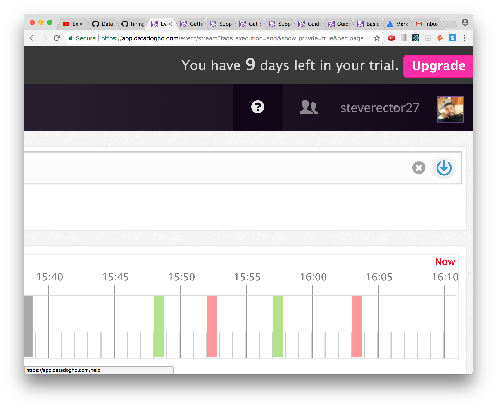
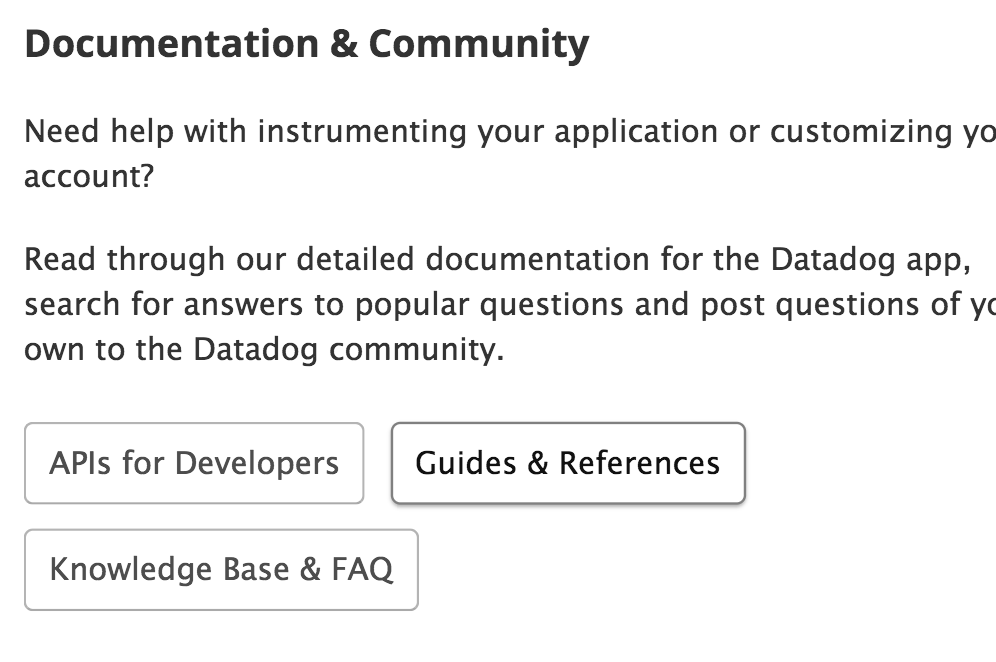
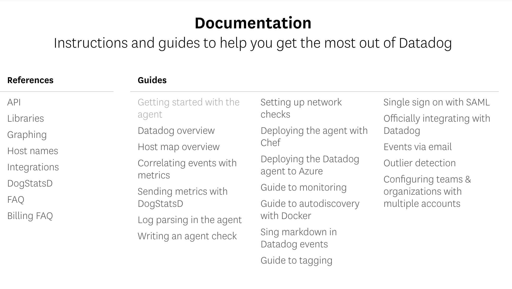
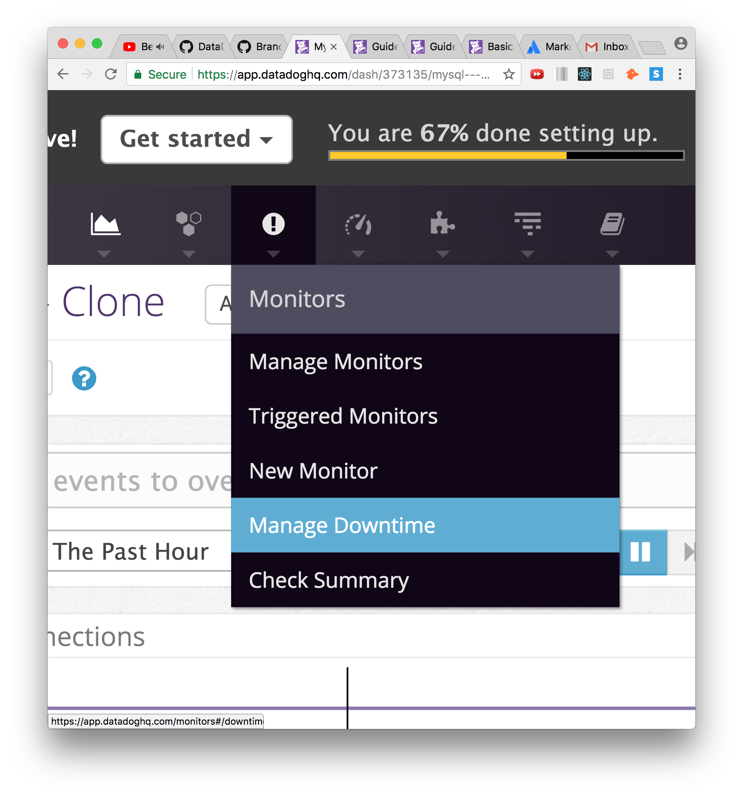
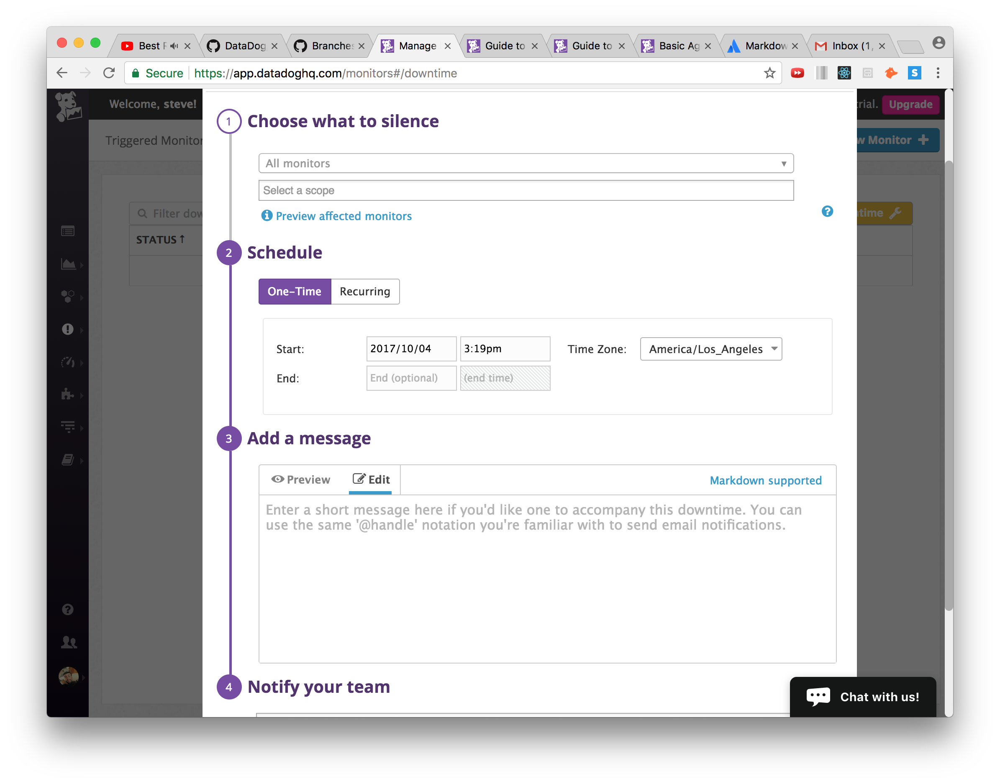
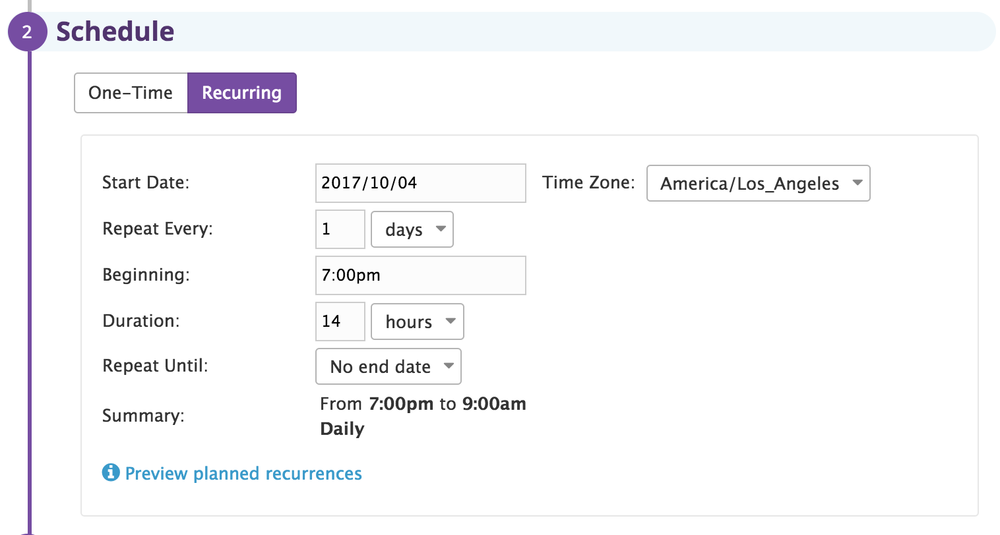
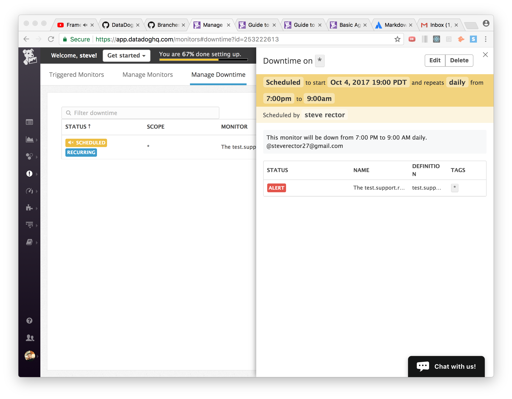
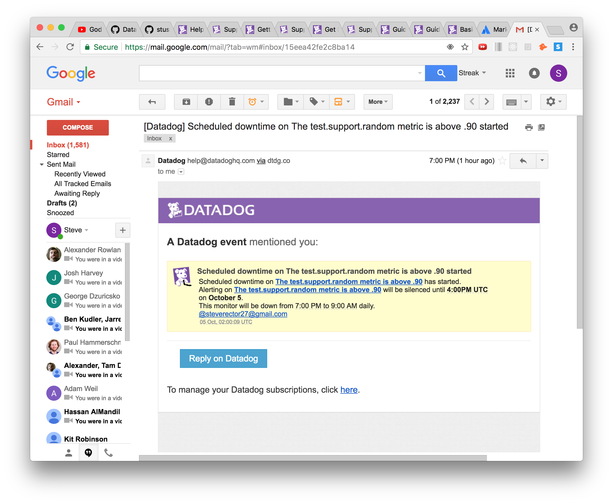

### Links 
  
1) Link to [host-dashboard](https://app.datadoghq.com/dash/host/348127436?live=true&page=0&is_auto=false&from_ts=1507153521073&to_ts=1507157121073&tile_size=m)

2) Link to [mySQL-clone-dashboard](https://app.datadoghq.com/dash/373135/mysql---clone?live=true&page=0&is_auto=false&from_ts=1507153698644&to_ts=1507157298644&tile_size=m)

* Screenshots of dashboards show up repeatedly throughout guide.

### Level 1: Collecting Your Data 
   1a) Sign Up for Datadog
   
   
   1b) Get the Agent Reporting Metrics From Local Machine
    
   * After signing up, we will be taken to a screen where we can begin to set up our first agent. Here, we can choose which type of Operating System we would like to run the agent on (in my case I installed Vagrant and VirtualBox, so therefore chose Ubuntu) 
      
    
   * After choosing our machine, we will be redirected to a page that shows how to set up the Agent. In Ubuntu's case it was as simple as copying the call provided on the page into my local VM environment. 
     

    

   * After running the call in your terminal, when it finishes we should see the following screens, the first in our terminal and the second on the datadog agent page itself. On the bottom of the Datadog page there will be an option to continue.
     

    

   * Finally, moving forward on the DataDog site will bring us to your Agent page and our first metrics, which look like this: 
     

  **BONUS** What is The Agent? 
    
  * The Agent is the software that collects data, events, and metrics and sends them to Datadog, so that we as the customer can use this data to better monitor the performance of one's applications, as well as use the information to find potential problematic areas in the codebase. There are three pieces to the Agent: 
    1. The *collector*, which runs checks according to whatever integrations you have and captures system metrics.
    2. *Dogstatd*, which is a backend server that you can send custom metrics to.
    3. The *forwarder*, which gets data from the two aforementioned components and queues it up to be sent to Datadog.

2) Tags and the Host Map (And Finding the Docs) 
  
  * The first thing we should do is head to the Datadog Docs. These can be found by first clicking on the question mark on the homepage:
     

  * On the page that pops up, select "Guides and References" under the "Documentation and Community" subheading:
      

  * Scroll down until we see the "Documentation" heading, then click on any of the topics located under the "Guides" subheading:
     

  * This will take us to the docs, and clicking "Guides" at the top or clicking the "Datadog Docs" title will give us a list of topics in the docs to search. The Datadog Docs home page should look something like this:
    

  * After selecting this, there is a scrollbar on the left where we can choose the type of system we are running on (For me it was Ubuntu). Select your OS and it will take us to a page with more information about Agent usage for each specific OS. Under "Configuration" on this page, there will be a specific path that shows us exactly where our Agent Config file is being held.
      
     
 
  * Now that we know where the file is, go back to the Datadog docs and select "Guide to Tagging" from the scrollbar on the left. This will take us to a page that looks like this:
     
    On this page there is a section titled "Assigning tags using the configuration files", which explains how to correctly create tags in the file we located above.
     

  * Now, in our terminal we will go to the directory in which our specific agent config file is located, open the file and simply add tags under the portion of the file that directs us to do so.
      
     After adding your tags, we will need to restart the agent to update the config files using the necessary command.

  * Now that our tags are set, we can go back to our datadog home page and click on this button to get to the HostMap:
      

  * After getting to the HostMap page, simply click on the host (big green thing in the center), and the tags should show up on the right under "Tags" (specifically under the subheading "Datadog Agent")
     

3) Database Integration (with MySql)

  * First, after deciding which database we would like to install (I chose MySQL), use the magic of Google to find an easy step-by-step process to install the database correctly. This will vary considerably depending on the OS in use.

  * After this, on our metrics home screen we will go to the puzzle-piece button at the top and select "integrations".
    

  * This will take us to a page with a list of a bunch of potential integrations. Select the one that matches the database you installed, and follow the instructions. The instructions will look similar to this: 
    

  * After following the instructions, restart your Agent and wait five minutes. Then, if successful, you should see something like this if we click on the integration again:
    

  * We can also run our OS versions of the Agent info command (check the agent guide in the docs), and it should return something like this:
    

4) Write a Custom Agent Check

  * First, we will want to go back to the Datadog Docs and select the "Writing an Agent Check Option" on the left scrollbar, which will take us to step-by-step instructions of writing one's first check.
    

  * In order to run a a custom check correctly, we must create two separate files
    1) a .yaml file in the etc/dd-agent/conf.d directory 
    2) a .py file in the etc/dd-agent/checks.d directory 
  
  * These files names MUST MATCH (test.yaml, test.py for example) or the process will not work.

  * For the yaml file and the purposes of this challenge, the config presented in the docs should be fine. In other situations the init will allow you to set config options that will run on every check of self.init_config.
    

  * For the py file, we need to first make sure that we are inheriting from the AgentCheck class, as well as importing the random module. Every custom check class should have a check method, inside of which we can use any of the built-in DogStatd methods (A list of the methods can be find on this Doc page, under "sending metrics"). For these purposes we want to use the gauge method, like so:
    

  * After these files are created and saved, we must restart the agent for them to take effect. If everything runs smoothly, we can then run our agent info request (seen in the Guide to the Agent portion of the docs), and see if our check is running:
    

  * We can also check our custom checks by calling them through the Agent (custom checks cannot be directly called from Python). In ubuntu, this done with:
    
    sudo -u dd-agent dd-agent check <CHECK_NAME>
  
  which should bring up a status similar to this:
    

### Level 2: Visualizing Your Data 

1) Clone the Database Integration Dashboard and Add Metrics 

  * Go back to our Datadog home page, and select the "dashboard list" option after clicking the Dashboard button, which looks like this:
    

  * On the page this leads us to, we will scroll down into "Integration Dashboards" and select the Database that we had decided to integrate previously (MySQL in my case).

  * From here we are going to want to click on the settings button on the top right, and then select "Clone Dashboard"
    

  * This will bring up a small box where we can rename the new dashboard. Do what makes sense to you and simply click Confirm to create the cloned dashboard, which can now be found under "Custom Dashboards" in the dashboard list.

 # Adding Metrics 

  * The first thing we will want to do is find the Graphing Primer. If we go to the datadog docs and search "graphing" in the search bar on the top left, the graphing primer should pop up as the first option. Select the option and we should now be at this page:
    

  * We should have a specific metric that we are interested in mind. The [summary](https://app.datadoghq.com/metric/summary) is a good place to see some potential metrics to choose from.

  * Using the primer as a guide, we can go back to our newly cloned dashboard and scroll down until we see an empty square that says "add a graph". Selecting this will bring up a set of graph options at the bottom to choose from. Choose whichever you think will be most helpful for you and drag your choice into the empty box. This should open up a page that looks like this:
    

  * From this page, we will search for the metric we wish to track and select "Add Metric". We can also filter and aggregate hosts through this, but for the purpose of this excercise it is not necessary. When we have added our metric(s), simply select "Save" at the bottom right of the screen. After saving, our new metric graph should show up at the bottom of our dashboard, named with the title you gave it: 
    

  * To add our custom check from the end of level 1, simply repeat the same process, and search for "test.support.random" as the desired metric. As long as the check was set up correctly previously, it should show up, and we can simply select the metric, name the graph, and viola:
    

  **BONUS** What is the difference between a timeboard and a screenboard?

  * A *timeboard* is used primarily for troubleshooting and correlation representation. They show time synchronized events, and a good example would be the database integration dashboard that we have.
    

  * A *screenboard* is used primarily for status boards and sharing data. You can mix widgets and timeframes, and there is a customizable drag and drop layout
    

2) Snapshot of Test above .90 

  * In order to complete this, we will want to return to our cloned database dashboard (see instructions above) and find our test.support.random graph that we had created in the previous step. On the display of this graph there is a camera button on the type right, that looks like this:
    

  * When we press this button, a dotted box and comment box will appear. We can edit the box to fit around what we are trying to snapshot. Edit the box so it fits around a part of the graph that goes above .90, and release the mouse. In the comment box, type @yourname (@steverector for example), which should be connected to your email, or @emailaddress. This notification should send an email to your corresponding email.
    

  * The event should also be sent to your homepage, looking like this:
    

### Level 3: Alerting On Your Data 

1) Set Up Monitor On Above .90

  * The first thing we want to do is head back to the Datadog docs and select "Guide to Monitors" from the left scroll bar. This will provide a helpful guide to the monitor creation process. The page looks like this:
    

  * Following this guide, we will first want to click on the "Monitor button" at the top of our Datadog homepage, and then select the "New Monitor" option:
    

  * This will take us to the page below, Where for the purposes of this challenge we will want to select the "Metric" option
    

  * On the screen that follows, we can now begin to setup your monitor. There are four types of alerts (threshold, change, anomoly, and outlier), and for this monitor's purpose we will want to select the "Threshold" option because it triggers whenever a metric crosses a threshold (exactly what we want).
    

  * After selecting the type of metric we want, we will define the metric by searching for and selecting our test.support.random metric that we had created previously. Here we can also create the monitor as either a "simple alert", which will trigger a single alert for the metric, or a "multi alert", which will trigger a separate alert for each tagged host that reports your metric. as the **BONUS** question asks, we will set this to a multi alert:
    

  * Now, we move on setting alert conditions. Here we have options to alert when a metric is above, below, etc, as well as options for the frequency to trigger the alert and how often we want the alert to be checked. For the challenges purposes, we will trigger when the metric is above, at least once, every five minutes (see screenshot below). Under these options in the red "Alert threshold" box is where we will want to set our alert to 0.90. Because we are using the "at least once" option and our data is sparse, it is also a good idea to "Do Not Require" a full window of data for evalutation to avoid skipping metrics. There is also a warning threshold option, as well as a few other options that for our purposes we should not need to mess with:
    

  **BONUS** answered above (look for **BONUS**)

2) Descriptive Monitor Name and Message, and Notification 

  * We will now move on to part 4 on this page ("Say What's Happening") Where we can give our monitor a descriptive name and message to send out. Here, we will give our monitor a descriptive title, as well as a message. The message will typically have a step-by-step solution, but for our purposes something more simple should be fine. If you use @email_address in the message, it will notify any non-datadog users of the alert. It is also a good idea to link to your dashboard in these messages (the message section accepts markdown, so it is quite simple to do so). The message should look something like this after clicking on the preview icon (eyeball on top right):
    

  * On part 5 ("Notify your Team"), we can make sure that everyone we want to be notified is there. We can potentially add names in the first box, but for our case we will want to just make sure that our name is there. There are a couple other options underneath as well, that should not be necessary for us to change. After finishing this section, simply click "save" at the bottom right and our monitor should be set up and ready to go!
    

  * We can make sure our monitor is up by going back to our datadog home, where there should be a new event listed describing the monitor that we just created:
    

3) Email Alert 

  * Below is a screenshot of the alert email that I recieved:
    

  **BONUS** Setup Downtime From 7pm to 9am Daily

  * First, we will want to go back and select the monitors button again and this time select "Manage Downtime":
    

  * Now, we will want to click on the yellow "Schedule Downtime" button at the top right, which will bring up a page that looks like this:
    

  * On this page, under "Choose What to Silence" select and search for the monitor we wish to silence (in our case the test.support.random monitor). We will also scope the silence here, for our purposes we can select the "\*" (which stands for all), to setup the downtime on all monitors:
    

  * After this, under "Schedule", we will do a few things. The first is setting the Schedule as "Recurring", because we want this downtime to be a daily thing. Underneath this, we will want to set the start day as the current day, as well as make sure it is located in the correct timezone. Then, will set it to repeat every 1 day (aka daily), have the downtime begin at 7:00 PM, and last for 14 hours (so that it ends at 9 AM). The section should look something like this filled out:
    

  * Finally, we will create a message under "Message" that will notify any team members of the downtime of the monitor. The Notifcation process works the same way as the message in the Set Up Monitor Section under Level 3 of this guide.
  After finishing the message, click "Save" at the bottom right and the downtime should be set.
    

  * If done correctly, the schedule should now show up in in the "Manage Downtime" page like looking like this:
     

  * Here is the email of the downtime notification:
     

