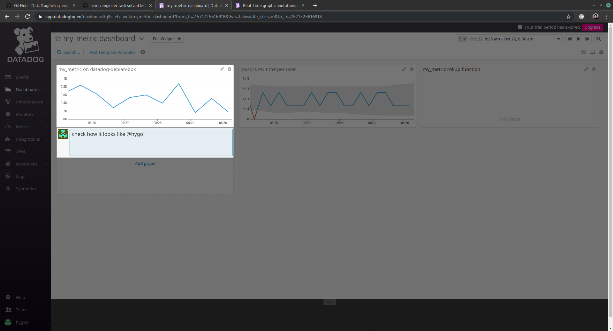

# Prerequisites - Setup the environment

My approach was to spin up a Debian 10 Linux Server running on a Public Cloud Provider

The DataDog Agent installed with the following command:

```
$ DD_API_KEY=<MY_API_KEY> DD_SITE="datadoghq.eu" bash -c "$(curl -L https://raw.githubusercontent.com/DataDog/datadog-agent/master/cmd/agent/install_script.sh)"
```

# Collecting Metrics:

**Add tags in the Agent config file and show us a screenshot of your host and its tags on the Host Map page in Datadog.**

I added the following tags on the /etc/datadog-agent/datadog.yaml file:

```
tags:
   - env_test:testing_datadog_tags
   - test:succeeded
```


**Install a database on your machine (MongoDB, MySQL, or PostgreSQL) and then install the respective Datadog integration for that database.**

I installed Mysql Database and took the following steps for datadog integration collects metrics:

1) Added datadog user on Mysql Database with right privileges;

```sql
CREATE USER 'datadog'@'localhost' IDENTIFIED BY '<DATADOG_MYSQL_PASS>';
GRANT PROCESS ON *.* TO 'datadog'@'localhost';
ALTER USER 'datadog'@'localhost' WITH MAX_USER_CONNECTIONS 5;
GRANT SELECT ON performance_schema.* TO 'datadog'@'localhost';
```

2) create the datadog-agent/conf.d/mysql.d/conf.yaml as follow to get metrics collected:

```yaml
init_config:

instances:
  - server: 127.0.0.1
    user: datadog
    pass: '<DATADOG_MYSQL_PASS>' 
    port: 3306 
    options:
        replication: 0
        galera_cluster: true
        extra_status_metrics: true
        extra_innodb_metrics: true
        extra_performance_metrics: true
        schema_size_metrics: false
        disable_innodb_metrics: false
```

3) Restart the datadog Agent;

4) Install datadog mysql integration on the datadog dashboard.

 


**Create a custom Agent check that submits a metric named my_metric with a random value between 0 and 1000.**

For that I wrote the datadog-agent/checks.d/custom_check.py script with the following code:

```python
from datadog_checks.checks import AgentCheck
from random import randint

class Check(AgentCheck):
    def check(self, instance):
        self.gauge('my_metric', randint(0,1000))
```

And the following datadog-agent/conf.d/custom_check.yaml file:

```yaml
init_config:

instances:
  - min_collection_interval: 30
```


**Change your check's collection interval so that it only submits the metric once every 45 seconds.**

For that I just changed the `min_collection_interval` on datadog-agent/conf.d/custom_check.yaml to the following:

```yaml
init_config:

instances:
  - min_collection_interval: 45
```


**Bonus Question Can you change the collection interval without modifying the Python check file you created?**

Yes, just changing the parameter `min_collection_interval` to the desired value on the custom_check.yaml file without modifying the python check script.


# Visualizing Data:

**Utilize the Datadog API to create a Timeboard that contains:

Your custom metric scoped over your host.
Any metric from the Integration on your Database with the anomaly function applied.
Your custom metric with the rollup function applied to sum up all the points for the past hour into one bucket
Please be sure, when submitting your hiring challenge, to include the script that you've used to create this Timeboard.**

Below, the python script I wrote for using the Datadog API for creating the requested Timeboard:

```python
from datadog import initialize, api

options = {
    'api_key': '566d9fdc17db68dbf7fe45c583e87ab0',
    'app_key': '210918174a206a326464ab8a04a620e387e21d41',
    'api_host': 'https://api.datadoghq.eu'
}

initialize(**options)

title = 'my_metric dashboard'
description = 'Testing adding a new dashboard for my_metric using datadog API.'
layout_type = 'ordered'

widgets = [{
    'definition': {
        'type': 'timeseries',
        'requests': [
            {'q': 'avg:my_metric{host:datadog-debian-box}'}
        ],
        'title': 'my_metric on datadog-debian-box'
    }
},
    {
    'definition': {
        'type': 'timeseries',
        'requests': [
            {'q': "anomalies(avg:mysql.performance.user_time{host:datadog-debian-box}, 'basic', 3)"}
        ],
        'title': 'Mysql CPU time per user'
    }
},
    {
    'definition': {
        'type': 'query_value',
        'requests': [
            {'q': 'my_metric{host:datadog-debian-box}.rollup(sum, 3600)'}
        ],
        'title': 'my_metric rollup function'
    }
}]

api.Dashboard.create(title=title,widgets=widgets,description=description,layout_type=layout_type)
```


**Once this is created, access the Dashboard from your Dashboard List in the UI:

Set the Timeboard's timeframe to the past 5 minutes
Take a snapshot of this graph and use the @ notation to send it to yourself.**

Please check the screenshot below which shows I'm sending the 5 minutes graph to myself using the datadog dashboard:



**Bonus Question: What is the Anomaly graph displaying?**

On the graph I've created the Anomaly function will show any deviation on Mysql CPU usage per user, based on previous collected metrics. This could be a good graph for identify possible sql queries using too much resource or having a different behaviour than expected.

The blue line shows the regular cpu time per user and the red line possible anomalies.


# Monitoring Data

**Since you’ve already caught your test metric going above 800 once, you don’t want to have to continually watch this dashboard to be alerted when it goes above 800 again. So let’s make life easier by creating a monitor.

Create a new Metric Monitor that watches the average of your custom metric (mymetric) and will alert if it’s above the following values over the past 5 minutes:

Warning threshold of 500
Alerting threshold of 800
And also ensure that it will notify you if there is No Data for this query over the past 10m.**

Please check the screenshots below with the metric monitor in place:


**Please configure the monitor’s message so that it will:
Send you an email whenever the monitor triggers.
Create different messages based on whether the monitor is in an Alert, Warning, or No Data state.
Include the metric value that caused the monitor to trigger and host ip when the Monitor triggers an Alert state.
When this monitor sends you an email notification, take a screenshot of the email that it sends you.**

I've changed the `Say what's happening` session on the datadog dashboard Monitors with the following content:

```
my_metric message notification

@all 
{{#is_alert}}my_metric is now critical over value {{value}} on host {{host}}{{/is_alert}}
{{#is_warning}}my_metric is now warn over value {{value}} on host {{host}}{{/is_warning}}  
{{#is_no_data}}my_metric no data received{{/is_no_data}} 
```

Please also check the screenshot for this metric monitor:


**Bonus Question: Since this monitor is going to alert pretty often, you don’t want to be alerted when you are out of the office. Set up two scheduled downtimes for this monitor:

One that silences it from 7pm to 9am daily on M-F,
And one that silences it all day on Sat-Sun.
Make sure that your email is notified when you schedule the downtime and take a screenshot of that notification.**

I've scheduleded two downtime  under 'Monitors'/'Manage Downtime' for my_metrics monitoring. Please check the screenshots below:


# Collecting APM Data:

**Given the following Flask app (or any Python/Ruby/Go app of your choice) instrument this using Datadog’s APM solution:**

```python
from flask import Flask
import logging
import sys

# Have flask use stdout as the logger
main_logger = logging.getLogger()
main_logger.setLevel(logging.DEBUG)
c = logging.StreamHandler(sys.stdout)
formatter = logging.Formatter('%(asctime)s - %(name)s - %(levelname)s - %(message)s')
c.setFormatter(formatter)
main_logger.addHandler(c)

app = Flask(__name__)

@app.route('/')
def api_entry():
    return 'Entrypoint to the Application'

@app.route('/api/apm')
def apm_endpoint():
    return 'Getting APM Started'

@app.route('/api/trace')
def trace_endpoint():
    return 'Posting Traces'

if __name__ == '__main__':
    app.run(host='0.0.0.0', port='5050')
```

**Provide a link and a screenshot of a Dashboard with both APM and Infrastructure Metrics.
Please include your fully instrumented app in your submission, as well.**


Firstly, I did install the `ddtrace` package using pip3:
```bash
pip3 install ddtrace
```

then I run the SAME flask application with the same code as above as following:

```bash
ddtrace-run python3 flask_app.py
```

Check below the Datadog Dashboard Screenshot using an APM metric `datadog.trace_agent.cpu_percent` and Infrastructure metrics `system.cpu.user` and `system.load.norm.1` together:


**Bonus Question: What is the difference between a Service and a Resource?**

For a DataDog point of view a Service is a set of processes that executes/perform the same job, like a Database or the Flask web application we run on the previous example. 

A Resource is a subset of a service that executes some particular action, like a SQL query or some API endpoint for that  same Flask web application. 


# Final Question:

**Datadog has been used in a lot of creative ways in the past. We’ve written some blog posts about using Datadog to monitor the NYC Subway System, Pokemon Go, and even office restroom availability!

Is there anything creative you would use Datadog for?**


I was very surprised while running DataDog APM and Kubernetes integration for a LAMP stack responsible for hosting more than 10.000 e-commerce websites. 

It's impressive the deep level of observability which we achieved using DataDog. Suddenly, we could visualize and monitoring our solution based on our own custom metrics and easily identify poor performance behaviour on our application. Plus, it's easy and fast to start collecting metrics and creating great dashboards, even for more complex microservices architectures.
