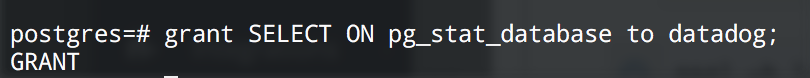

# Datadog Hiring Challenege - Support Engineer
### *Completed by Justin Arieus M. Dizon*

## Level 1 - Collecting Your Data

To begin this challenge, I first initiated a Vagrant environment, as suggested, to prevent OS or dependency issues.

I then followed the steps initiating an Agent.
.

**BONUS QUESTION:** *In your own words, what is the Agent?*

The Agent is a program that runs in the background; collecting metrics and event-data on your hosts and giving that information back to Datadog to be presented to you.

The next step was to configure my `~/.datadog-agent/datadog.conf` file to create tags and set the `hostname` to my local machine.

After this, I was able to see my tags when viewing my Host Map.

Since I've previously installed PostgreSQL on my machine, I decided to use the corresponding integration with Datadog.

I followed the docs to integrate PostgreSQL with Datadog; I first created a user named `datadog`.

Second, I `GRANT` the proper access to `datadog`.

Third, I configured the Agent to connect to PostgreSQL with a new file, `.datadog-agent/conf.d/postgres.yaml`.

Lastly, I verified that everything was properly connected.

Next up, was writing a custom Agent Check called `test.support.random`. I read through the docs, created two new files, `.datadog-agent/checks.d/randomvalue.py`  and its corresponding configuration file, `.datadog-agent/cond.d/randomvalue.yaml`.

## Level 2 - Visualizing Your Data

Since I had just finished created my custom Agent Check, `test.support.random`, it was now time to see it in action! I cloned my Datadog dashboard and added a new Timeseries graph.

**NOTE:** *I had used the* `randint()` *method from the* `random` *Python library when I first created the Agent Check. I configured the method to output a random value between 0 and 100, that is why the initial values are so high. I later adjusted* `test.support.random` *to use the* `random()` *method with no arguments to produce results within the desired range.*

**BONUS QUESTION:** *What is the difference between a timeboard and a screenboard?*

From reading through the docs, a timeboard is a dashboard where all the graphs are processing data within the same time period. Screenboards, on the other hand, can be configured differently and give more in-depth information. It also seems that timeboards are great for troubleshooting problem areas whereas screenboards are better for presenting the bigger picture of your infrastructure/metrics.

After reconfiguring `test.support.random` to output values within the desired range, I was able to take a screenshot and `@notify` that event to my email.

## Level 3 - Alerting Your Data

Now, it was time to write a monitor on `test.support.random` to automatically email me when we would get a value that is greater than 0.90 at least once, within a 5 minute interval.

It was really exciting to receive the first email notification!

After receiving a few more emails, I understood why Downtime is an important feature. I set up a Downtime period to silence the notifications between 1900 hours and 0900 hours daily.

It was also exciting to later receive the two emails notifying me that Downtime has started and ended at the set times.

