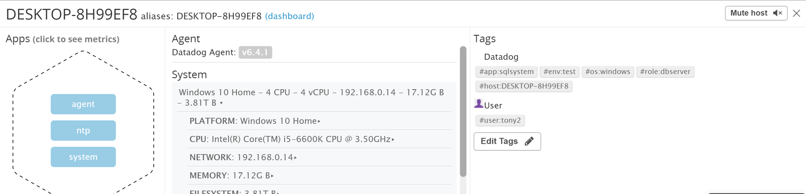
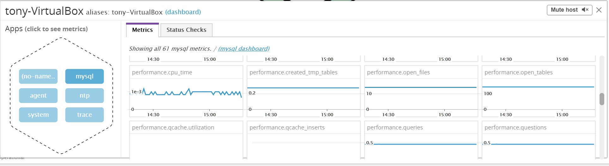
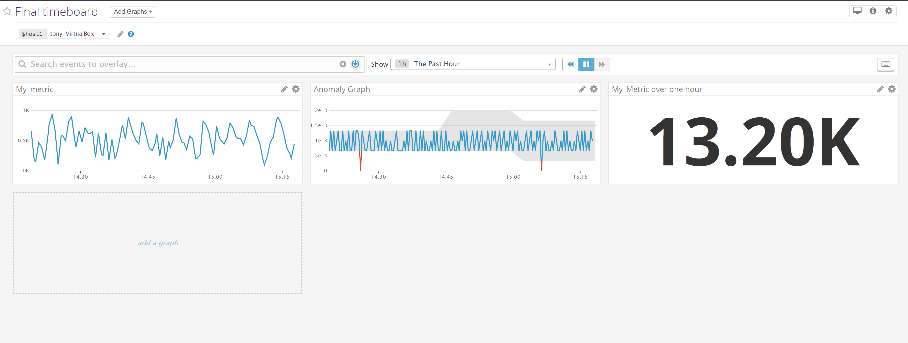
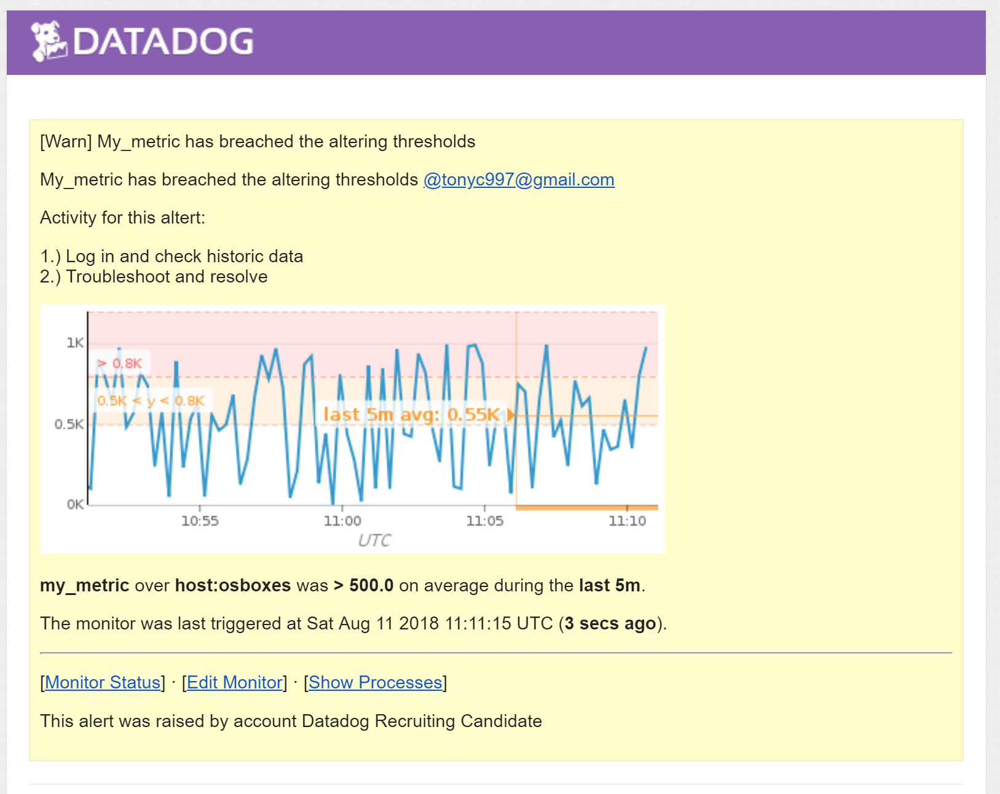
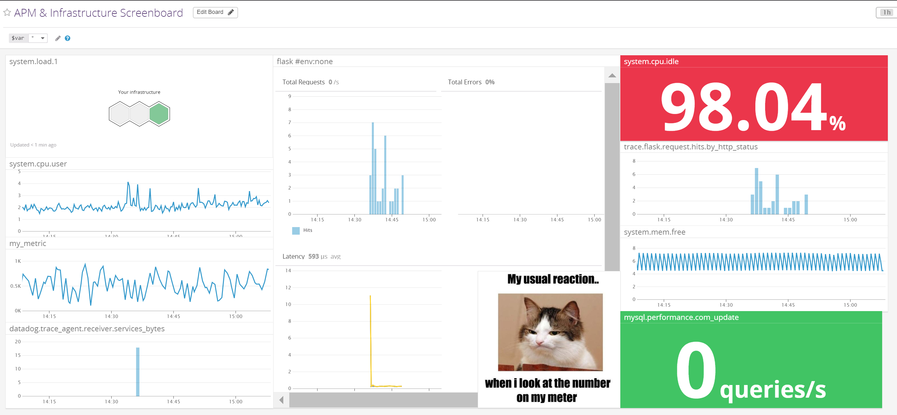

# Datadog Solution Engineer Exercise

## Introduction & setup	

A new Datadog account can be created [here](https://www.datadoghq.com/) by clicking 'Get started for free'. You will be greeted with the below screen to fill in your information.

<p align="center">

</p>

As part of this exercise I wanted to install the Datadog Agent on a few different systems to
see how easy the agents were to install and understand the breadth of the deployment options.

Installing agents is simple. By navigating to the `Integrations > Agents` page you are greeted with the below screen

<p align="center">

</p>

You are then presented with instructions on installing specific agents.

<p align="center">

</p>

The result is a number of hosts reporting back within minutes of creating an account.

<p align="center">

</p>

## Collecting Metrics:

**Add tags in the Agent Config File and show us a screenshot of your host and its tags on the Host Map page in Datadog**

The Agent config file can be found in a number of locations depending on the Operating System. [This link](https://docs.datadoghq.com/agent/faq/agent-configuration-files/) will show you the directories while [this link](https://docs.datadoghq.com/tagging/assigning_tags/) will walk you through how to create tags.

In Windows you can navigate to the relevant folder and edit the `datadog.yaml` file. The following syntax was used to create host tags -

`tags: app:sqlsystem , env:test, os:windows, role:dbserver`

The result is that, after an agent restart, tags will show up as seen below. Please note - it may take 5-10 minutes before the tags show up.

<p align="center">

</p>

<p align="center">

</p>

Tags are one of the most important aspects of any Application Monitoring in your environment as they allow you to aggregate and find metrics quickly. The [Tagging best practices](https://docs.datadoghq.com/tagging/) should be followed and integrated right at the start of your deployment.

**Install a database on your machine (MondoDB, MySQl, or PostgresSQL) and then install the respective Datadog integration for that database**

I chose to Install MySQL on both Windows and Ubuntu. Using Windows you can download the installers and on Ubuntu you can run `sudo apt-get install mysql-server`.

I did notice some differences with the commands when setting the agent access in MySQL. For example, when installing the Windows the agent and giving the required permissions for reporting

`GRANT REPLICATION CLIENT ON *.* TO ‘datadog’@’localhost’ WITH MAX_USER_CONNECTIONS 5;`

This threw an error in the SQL Syntax on Windows....but not Ubuntu. On Windows I entered the following command

`GRANT REPLICATION CLIENT ONj *.* TO ‘datadog’@’localhost’;`

I then researched how to edit the user permissions after the user has been created and used the below command -

`ALTER USER ‘datadog’@’localhost’ WITH MAX_USER_CONNECTIONS 5;`

MySQL on Ubuntu status

<p align="center">

</p>

MySQL on Windows status

<p align="center">

</p>

The below images show that the agent is installed and that hosts are reporting MySQL metrics and status on two different hosts.

<p align="center">

</p>

<p align="center">

</p>

<p align="center">

</p>

**Create a custom Agent check that submits a metric named my_metric with a random value between 0 and 1000**

While the Datadog Agent is comprehensive and supplies most desired metrics as standard there will be occasions when users will need a custom Agent checks. More detail about custom Agent Checks can be found [here](https://docs.datadoghq.com/developers/agent_checks/) - they provide a way for users to collect metrics from unique systems or create non-standard checks.

The following `my_metric.py` script was added to the `checks.d` folder on Ubuntu. 

```
from random import randint
from checks import AgentCheck

class my_metric(AgentCheck):
    def check(self, instance):
        self.gauge('my_metric', randint(0,1000))
```

Note: A config file is also required for your agent. This should be in the same folder as the check and have the same name. This is a `.yaml` file.

```
init_config:

instances:
    [{}]
```

**Change your check’s collection interval so that it only submits the metric once every 45 seconds**

Information about changing the collection intervals can be found [here](https://docs.datadoghq.com/developers/agent_checks/#configuration).

This was achieved by editing the `my_metric.yaml` file. This is the config file which is required in addition to the agent above.

```
init_config:
    key1: my_metric

instances:
    - min_collection_interval: 45

```

**Bonus question: can you change the collection interval without modifying the Python check file you have created**

Yes, as above, you can achieve this by editing the `my_metric.yaml` file and the `my_metric.py` file therefore does not need to be modified. 

## Visualizing Data:

**Utilize the Datadog API to create a Timeboard that contains:**
-  **Your custom metric scoped over your host**
-  **Any metric from the Integration on your Database with the anomaly function applied**
-  **Your custom metric with the rollup function applied to sum up all the points for the past hour into one bucket**

The Datadog [API Guide](https://docs.datadoghq.com/api/?lang=python#timeboards) will guide users through creating their own Timeboard using the API.

First you will need to create an API key and Application Key by going into `Integrations > APIs` in the GUI.

The below image shows three metrics reporting into a Dashboard from which I have called via the API.

<p align="center">

</p>

Below is the Python code used to create the above Dashboard.

```
from datadog import initialize, api

options = {
    'api_key': 'redacted',
    'app_key': 'redacted'
}

initialize(**options)

title = "Final timeboard"
description = "An informative timeboard."
a_graph = {
    "definition": {
        "events": [],
        "requests": [
            {"q": "my_metric{*}"}
        ],
        "viz": "timeseries"
    },
    "title": "My_metric"
}

anomaly_graph = {
   "title": "Anomaly Graph",
  "definition": {
        "events": [],
        "requests": [
           {"q": "anomalies(avg:mysql.performance.cpu_time{*}.as_count(), 'basic', 2)"}
        ],
        "viz": "timeseries"
    }
}

rollup_graph = {
    "title": "My_Metric over one hour",
    "definition": {
        "events": [],
        "requests": [
             {"q": "avg:my_metric{*}.rollup(sum, 3600)"}
        ],
        "viz": "query_value"
   }
	
}

graphs      = []

graphs.append(a_graph)
graphs.append(anomaly_graph)
graphs.append(rollup_graph)


template_variables = [{
    "name": "host1",
    "prefix": "host",
    "default": "host:tony-VirtualBox"
}]

read_only = True
print(api.Timeboard.create(title=title,
                     description=description,
                     graphs=graphs,
                     template_variables=template_variables,
                     read_only=read_only))
```

-  **Set the Timeboard's timeframe to the past 5 minutes**

Note: the Timeboard's timeframe can be set by clicking and dragging the mouse over the desired period of time.

-  **Take a snapshot of this graph and use the @ notation to send it to yourself.**

This is a useful way to collaborate and quickly share information with other users. 

<p align="center">

</p>

-  **Bonus Question: What is the Anomaly graph displaying?**

Anomaly graphs allow you to view when a metric is behaving differently than in the past. More information can be read about them [here](https://docs.datadoghq.com/monitors/monitor_types/anomaly/).

My anomaly graph is focused on the CPU utilisation of the MySQL database. I used basic logging as there is no repeating seasonal pattern and it is set to show up to two deviations (bounds) from the normal behaviour.

## Visualizing Data:

**Create a new Metric Monitor that watches the average of your custom metric (my_metric) and will alert if it’s above the following values over the past 5 minutes:**

-  **Warning threshold of 500**
-  **Alerting threshold of 800**
-  **And also ensure that it will notify you if there is No Data for this query over the past 10m.**

**Please configure the monitor’s message so that it will:**

-  **Send you an email whenever the monitor triggers.**

-  **Include the metric value that caused the monitor to trigger and host ip when the Monitor triggers an Alert state.**

-  **When this monitor sends you an email notification, take a screenshot of the email that it sends you.**

-  **Create different messages based on whether the monitor is in an Alert, Warning, or No Data state.**

Metric monitors allow you to be notified upon an event trigger. This could be high CPU utilisation or data not received for a period of time. Multiple monitors can be set for a metric depending on the event that has occurred. 

More information about Metric Monitors can be found [here](https://docs.datadoghq.com/monitors/monitor_types/metric/)

<p align="center">


Below is my Metric Monitor syntax for my alerts

```
{{#is_alert}}
My_metric has breached the altering thresholds.

Activity for this alert:

1.) Log in and check historic data
2.) Troubleshoot and resolve
{{/is_alert}}
{{#is_warning}}
My_metric has breached the warning thresholds

Activity for this alert:

1.) Just keep an eye on this one, see if it's trending higher
{{/is_warning}}
{{#is_no_data}}
My_metric has stopped reporting - no data received for 10 minutes.

Activity for this alert:

1.) Investigate & resolve
{{/is_no_data}}
```

-  **Bonus Question: Since this monitor is going to alert pretty often, you don’t want to be alerted when you are out of the office.**
-  **Set up two scheduled downtimes for this monitor:**
-  **One that silences it from 7pm to 9am daily on M-F,**
-  **And one that silences it all day on Sat-Sun.**
-  **Make sure that your email is notified when you schedule the downtime and take a screenshot of that notification.**

Scheduling downtimes in monitoring is useful if, for example, you have a regular maintenance window. More can be read about Downtimes at this [link](https://docs.datadoghq.com/monitors/downtimes/).

Downtimes can be set by navigating `Monitors > Manage Downtime` in the GUI. There you will see a list of the current downtimes. I have one set for the evenings and another set for weekends.

<p align="center">

</p>

At any time you can go into a Downtime item and edit it.

<p align="center">

</p>

<p align="center">

</p>

<p align="center">

</p>

## Collecting APM Data:

The APM functionality provides you with insight into the performance of an application with automatically generated dashboards. These range from monitoring key metrics, such as request volume and latency, to detailed traces of individual requests-side by side with your logs and infrastructure monitoring. 

More information about Datadog APM can be found [here](https://docs.datadoghq.com/tracing/).

After some trial and error around ddtrace, middleware and changing IP addresses I was able to get the app to function. I utilised ddtrace and modified the IP address to the localhost - `127.0.0.1`.

```
from flask import Flask
import logging
import sys

# Have flask use stdout as the logger
main_logger = logging.getLogger()
main_logger.setLevel(logging.DEBUG)
c = logging.StreamHandler(sys.stdout)
formatter = logging.Formatter('%(asctime)s - %(name)s - %(levelname)s - %(message)s')
c.setFormatter(formatter)
main_logger.addHandler(c)

app = Flask(__name__)

@app.route('/')
def api_entry():
    return 'Entrypoint to the Application'

@app.route('/api/apm')
def apm_endpoint():
    return 'Getting APM Started'

@app.route('/api/trace')
def trace_endpoint():
    return 'Posting Traces'

if __name__ == '__main__':
   app.run(host='127.0.0.1', port='5050')
```
<p align="center">

</p>

In the image below we see that the APM screen has enabled itself and metrics have begun to come through.

<p align="center">

</p>

-  **Bonus Question: What is the difference between a Service and a Resource?**

A Service is a set of processes that work together. For example, an application may have a number of processes such as database and wget.

A Resource is a particular query to a service. For example, in MySQL a resource would be the query itself.

A more detailed explanation can be found [here](https://help.datadoghq.com/hc/en-us/articles/115000702546-What-is-the-Difference-Between-Type-Service-Resource-and-Name-).

-  **Provide a link and a screenshot of a Dashboard with both APM and Infrastructure Metrics.**

Below shows my dashboard with metrics from the APM and Infrastructure. This is an example of how application performance metrics can be combined with infrastructure metrics on a single dashboard.

<p align="center">

</p>

[Dashboard Link](https://p.datadoghq.com/sb/8b6fab7b0-5cac89fc6e5bd8d0d88fc0f74d9ffc7f )

Links to your dashboard can be created by clicking the cog in the top right hand corner of the Dashboard.

- **Please include your fully instrumented app in your submission, as well.**

Noted - will be included.

## Final Question
**Datadog has been used in a lot of creative ways in the past. We’ve written some blog posts about using Datadog to monitor the NYC Subway System, Pokemon Go, and even office restroom availability!**

**Is there anything creative you would use Datadog for?**

I'm a big believer that data is an asset. Take Fitbits as an example - they have given us insight into our steps, heart rate, sleep pattern, weight and body fat (with the scales). We lap up this information because the data is collected and presented to us in a meaningful way and this trend will continue.

From a business perspective we now see ‘Big Data’ and ‘Data lakes’. Companies have so much data that they turn to Artificial Intelligence and Machine Learning to get value out of it. As this happens they're going to say 'more data please'.

**'Boris Bike' Monitoring**
-  These are the London bicycles that are for rent. 
-  There are (in my opinion) ongoing issues with regards distribution and predicting use.
-  It would be great to have an agent running somewhere on the bikes so they know the location while being used and can better predict needs while the bikes are in flight rather than relying on end points.
- Given the density of London a Bluetooth Mesh could be used and with some machine learning applied distribution of bikes could be better predicted and handled.

**The digital gym**
-  It would be nice to get detailed stats on gym sessions - from actual amount of weight lifted to exact amount rowed or whatever the activity.
-  Add in a camera such a Amazon DeepLens to check for posture and flag anomalies to your dashboard. 
-  Correlate this with usual data such as footsteps, sleep and other items and this would be an amazing dashboard which could be shared with personal trainers.

**Cloud costs**
-  An obvious suggestion and likely on the roadmap. While Datadog are partnered with CloudCheckr and many of the cloud providers have their own tools for spotting cost savings it would be great to have a single dashboard to show total cost savings across all providers or simply areas to look at if a cost checking exercise is being carried out.
-  For example, if you notice an EC2 instance is consistently running at 40% without any deviations a smaller instance could be suggested.
