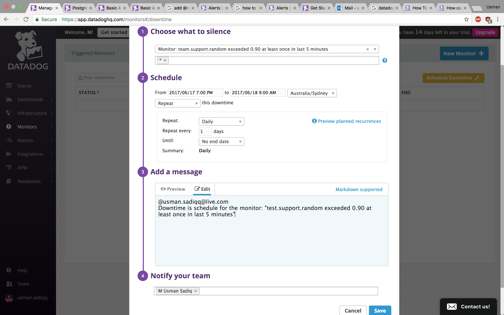
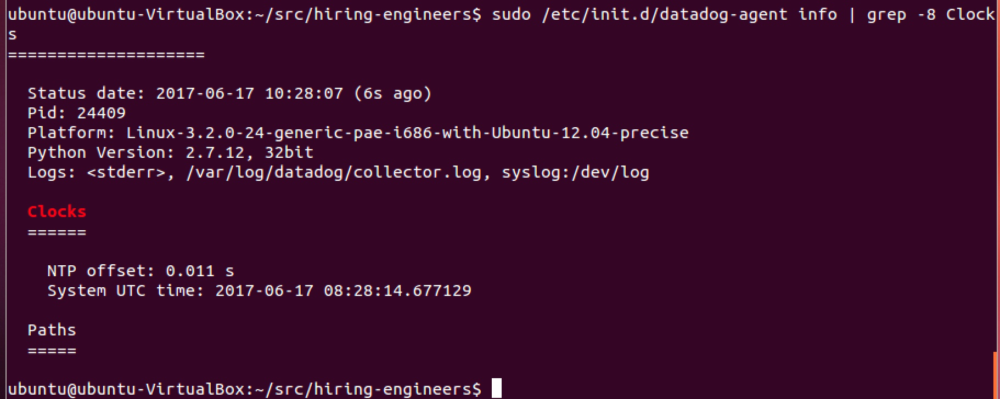

Name : M Usman Sadiq

Task : Support Engineer Challenge

Date : 17 June 2017

******************
Level 0
******************

- A fresh Ubuntu 12.04 VM was created using a Virtual Box image

Git was installed using apt-get, and the hiring-engineers repo was cloned.

sudo apt-get install git

git clone https://github.com/DataDog/hiring-engineers.git

- A branch of the repo was created in which changes would be made.

git checkout -b Usman-Sadiq-Support-Engineer

******************
Level 1
******************

- On the Datadog signup page, the required information was entered to create an account.

Upon creation, the instructions for setting up reporting from an Ubuntu machine were followed.

This involved:

1. Setting up apt so that it can download through https:

sudo apt-get update

sudo apt-get install apt-transport-https

2. Setting up the Datadog deb repo and importing the apt key

sudo sh -c "echo 'deb https://apt.datadoghq.com/ stable main' > /etc/apt/sources.list.d/datadog.list"

sudo apt-key adv --keyserver keyserver.ubuntu.com --recv-keys C7A7DA52

3. Installing the datadog agent.

sudo apt-get update

sudo apt-get install datadog-agent

4. Make a copy of the example config file, to include the api key.

sudo sh -c "sed 's/api_key:.*/api_key: d02e2594a57424009d9ead7daac26c6b/' /etc/dd-agent/datadog.conf.example > 
/etc/dd-agent/datadog.conf"

5. Start the datadog agent.

sudo /etc/init.d/datadog-agent start

At this point, we can wait a few minutes so that the Agent starts reporting metrics from our local Ubuntu machine. 
When this happens, the 'Finish' button will appear. You should be able to click Metrics, Explorer, and see some 
metrics such as system CPU and memory, already being received.

- Bonus: In your own words, what is the Agent?

The Datadog Agent is a software that should be run on the hosts to be monitored. It is responsible for collecting 
events and metrics, and sending them to DataDog so that they can be used for monitoring, reporting, alerting, etc. 
It handles system metrics, checks for integrations, as well as any custom metrics. Data is queued up to be sent, 
which minimises impact on applications running on the host. Statistical calculations, such as the mean and median, 
are also calculated for some metrics.

- To add tags, edit the config file, /etc/dd-agent/datadog.conf to add the desired tags (see images 004), for example:

Save the file, and restart the datadog agent.

sudo /etc/init.d/datadog-agent stop

sudo /etc/init.d/datadog-agent start

In the left pane of the Datadog portal, click Infrastructure and choose the Host Map. Click on your host, and you 
will see the tags that were added, matching the config file.

- PostgreSQL was installed using apt-get  (see images 005).

sudo apt-get install postgresql postgresql-contrib

Then, switch to postgres user, and access postgres prompt.

sudo -i -u postgres

psql

The PostgreSQL integration was then installed by following the instructions found by choosing PostgreSQL from the 
list of possible integrations.

The steps involved:

1. Create a read-only datadog user with access to the postgres database. Replace the password with the desired password.

create user datadog with password 'hoiGWlaccXjXKRBlC5rsAwcX';

grant SELECT ON pg_stat_database to datadog;

To quit the postgres prompt:

\q

The success of this can be verified using:

psql -h localhost -U datadog postgres -c "select * from pg_stat_database LIMIT(1);"   && echo -e "\e[0;32mPostgres 
connection - OK\e[0m" || \ ||  echo -e "\e[0;31mCannot connect to Postgres\e[0m"

Enter the password when prompted, and if successful, you should see a green OK message.

2. Configure the datadog agent to connect to the PostgreSQL database by creating a file /etc/dd-agent/conf.d/postgred.yaml 
containing this information:

Tags are optional, and the password should be consistent with the datadog user's password set previously.

3. Restart the datadog agent.

sudo /etc/init.d/datadog-agent stop

sudo /etc/init.d/datadog-agent start

4. Now, if you check info using this command, you should see postgres in the list of integration checks:

sudo /etc/init.d/datadog-agent info

- To write a custom agent, a config file, as well as a matching checks file is needed. The names of these files should match
(see images 006). For example, create the file /etc/dd-agent/checks.d/randomcheck.py containing a random value sampler:

Then, create the corresponding config file /etc/dd-agent/conf.d/randomcheck.yaml containing:

Restart the datadog agent.

sudo /etc/init.d/datadog-agent stop

sudo /etc/init.d/datadog-agent start

Now, if you check info using this command, you should see randomcheck in the list of integration checks:

sudo /etc/init.d/datadog-agent info

If you go to the Metrics Explorer in the datadog portal, you will also see that test.support.random metrics are being received  (see image 006-4).

******************
Level 2
******************

- The integration dashboard can be found by looking in the Dashboard List. In this case, it is named 'Postgres - Overview' 

Click into the dashboard, and in the top right, there will be an option to clone the dashboard. Give it a name, such as 
'Postgres_Custom_Dashboard'

In the cloned dashboard, additional metrics is added by clicking the dashed-line box at the bottom of the dashboard to 
'add a graph'.

A query value showing the average system.cpu.iowait was added, as well as a timeseries graph of our custom metric, 
test.support.random
(see images 007)

Link to dashboard: https://app.datadoghq.com/dash/304718/postgrescustomdashboard?live=true&page=0&is_auto=false&from_ts=1497753892638&to_ts=1497757492638&tile_size=m

- Bonus: What is the difference between a timeboard and a screenboard?

Timeboards and screenboards are both types of dashboards, which can be created and customised.

Timeboards are composed of graphs, which are always scoped to the same time frame. They appear in a grid form, which is 
useful for troubleshooting and correlation. For example, you can see, for a particular time, the values of multiple metrics. 
Each graph is an individual component which can be shared individually.

Screenboards are composed of drag and drop widgets, which are more flexible in that each widget can have a different time 
frame. They are more useful for high-level overviews of systems than detailed troubleshooting. Unlike timeboards, screenboards 
can be shared live as a whole, and as a read-only object.

- First, for ease of seeing the 0.9 threshold, a dashed red line at 0.9 was added by editing the test.support.random graph, 
and adding the marker line

A snapshot of the test.support.random graph was then created by clicking the camera icon in the top right corner of the graph. 
Upon clicking, a portion of the graph can be 'boxed' by clicking and dragging the mouse over the desired region. 

In the comment box below, @ mentions is used to trigger notification emails with a custom message, and a snapshot of the graph. 
For example, I have mentioned myself, and added a descriptive comment to the graph.

The notification appears as an Event in the Events page, as well as an email sent (see images 008).

******************
Level 3
******************

- A monitor can be created by finding the test.support.random graph in the dashboard, and choosing the Create Monitor option. 

Detailed conditions for when alerts should be triggered can be set. For example, I set the alert threshold to 0.9, to trigger 
when the threshold was reached at least once in the last 5 minutes (see images 010).

- Bonus: To make a multialert, click the dropdown and choose MultiAlert instead of the standard SingleAlert. When MultiAlert 
is selected, there is the option of alerting separately, such as for each host, which means that additional monitors do not 
need to be added as applications scale.

- The monitor was given a descriptive name 'test.random.support exceeded 0.90 at least once in the last 5 minutes'

In the monitor message, I mentioned myself so that I would receive email notifications. I also included a description of the 
event that caused the trigger, as well as a link to the relevant dashboard for troubleshooting. In real practice, teams 
could put messages like troubleshooting advice, or who to best contact for help.

- A screenshot of the email received is included.

- To set up downtime, click the Monitors tab in the left, and choose Manage Downtime.

Here, you can click New Monitor to set up a once-off downtime, or a recurring downtime for alerts. 
You can also put a comment that states downtime has been scheduled, and notify yourself or the team. 
In this instance, a daily recurring downtime from 7pm to 9am, with notifications to myself and a descriptive message, was set up.

The downtime appears in the list of scheduled downtimes in the portal.

This is the email that is sent.

*****************
Further Notes
*****************

If NTP is not in sync, there may be undesired behaviours.

Check ntp.in_sync is ok here: https://app.datadoghq.com/check/summary 
The image below is of healthy state.

Another way to check ntp is using info, and looking for the NTP offset value. If it is critical, it will be red. 
The image below is of acceptable value.

sudo /etc/init.d/datadog-agent info

If ntp offset is not ok, you may need to sync your ntp (see images 011).

First, make sure openssl is updated:

sudo apt-get update openssl

Then sync your ntp:

sudo service ntp stop

sudo ntp-date -s time.nist.gov

sudo service ntp start

