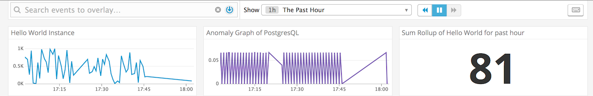
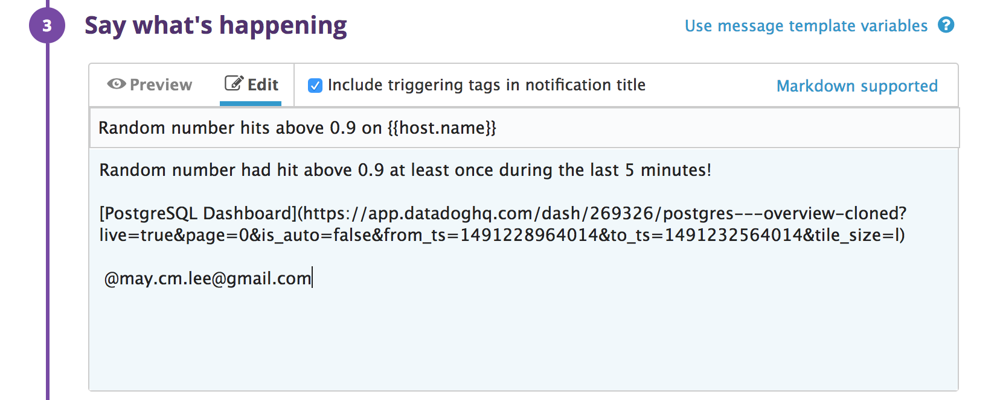

Your answers to the questions go here.

## Level 0 (optional) - Setup an Ubuntu VM
### While it is not required, we recommend that you spin up a fresh linux VM via Vagrant or other tools so that you don't run into any OS or dependency issues.

I decided to use [Vagrant](https://www.vagrantup.com/intro/getting-started/index.html) to run a linux VM as I've never used Vagrant before and it looked interesting. As suggested on Vagrant's website, I first downloaded and installed [VirtualBox](https://www.virtualbox.org/wiki/VirtualBox) on my Mac OS. I downloaded the VirtualBox installation file for OSX [here](https://www.virtualbox.org/wiki/Downloads). Ran the downloaded installation file and followed the steps to install the program.

VirtualBox is a cross-platform virtualization in that it can be installed on any Intel/AMD-bsed computer and run multiple VMs on the computer. VirtualBox is built into Vagrant but Vagrant can work with other providers (eg. VMWare, AWS, etc..) 

Once VirtualBox was installed, I [downloaded](https://www.vagrantup.com/downloads.html) Vagrant for Mac OSX, ran the installation file and followed the step-by-step instructions. When the installation was complete, I got Vagrant up and running by entering the following commands in my terminal:

`$ vagrant init hashicorp/precise64`

`$ vagrant up`

This tells Vagrant to start up a Ubuntu 12.04 LTS virtual machine in VirtualBox.

To ssh into the Ubuntu VM, I used the command:

`$ vagrant ssh`

And then got the Ubuntu VM prompt:

`vagrant@precise64~$`

To log out of the Ubuntu VM, just type: `exit`

## Level 1 - Collecting your Data
### Sign up for Datadog (use "Datadog Recruiting Candidate" in the "Company" field), get the Agent reporting metrics from your local machine.

I signed up for Datadog at [https://app.datadoghq.com/signup](https://app.datadoghq.com/signup) with the following information:

Email: may.cm.lee@gmail.com

Full Name: May Lee

Company: Datadog Recruiting Candidate

Then I used the one-step install to setup the Agent for an Ubuntu OS. I entered into my Ubuntu VM terminal the one-step install command. 


After, the installation was done, I knew the Agent was successfully setup because I saw this message on my Agent page: "Your first Datadog Agent is reporting. Congrats!"

**Bonus question: In your own words, what is the Agent?**

The Agent receives, tracks and displays specific data about your machines. It allows you to monitor the ongoing status of your machines and can alert you of any potential problems, allow you to investigate problems and optimize your resources. Your machines can be assigned different tags so that you can group and view them by those tags.

The Agent runs checks on your machine to get data on its state but it can also run checks on the integrations that you have added as well. For example, integrating a database can allow you to track and see the amount of activity occurring on your database. 

## Add tags in the Agent config file and show us a screenshot of your host and its tags on the Host Map page in Datadog.

To assign tags in the Agent config file, I opened up the configuration file (datadog.conf) located here: 

`/etc/dd-agent/datadog.conf`

The tags I want to add are: firsttag, env:test

After opening the config file, I found the commented out section that says "Set the host's tags.” Underneath there is an example of how to set tags. I added my tags after the example.

So it looks like this:

```
# Set the host's tags (optional)
# tags: mytag, env:prod, role:database
tags: firsttag, eng:test
```

After changing the config file the Agent needs to be restarted to reload the config file. This is the command to restart the Agent in the Ubuntu VM terminal:

`sudo /etc/init.d/datadog-agent restart`

Screenshot of the Host Map page with my host and its new tags:


## Install a database on your machine (MongoDB, MySQL, or PostgreSQL) and then install the respective Datadog integration for that database.

I chose to install PostgresSQL on my Ubuntu VM because I'm most familar with that database. Since PostgreSQL 9.4 was not on Ubuntu 12.04 I had to add the PostgreSQL apt repository onto my Ubuntu machine before I could install it. I followed the instructions on this [website](https://tecadmin.net/install-postgresql-server-on-ubuntu/#) and was able to successfully add the repository and install PostgreSQL on my Ubuntu VM.

The website instructions left me logged into my PostgreSQL server and database as user “postgres”, which was automatically created during the installation.


From there I followed the instructions the Agent gives on how to add the Datadog PostgreSQL integration.  To find the integration instructions and install the integration:

Click on the Integrations icon on the menu bar. The menu bar is either located at the top or left-side of the Agent webpage, where it is located depends on the width of your browser.


Once you click on the Integrations icon, you'll see a page with all the different integrations that Datadog supports.

Find and click on the PostgreSQL tile.

The PostgreSQL Integration page will pop up. 

Click on the “Configurations” tab for instructions on how to setup your machine for the integration.

I then followed the step-by-step instructions on setting up the integration.


After following those instructions and then clicking on the "Install" button at the end, the Agent installs the integration. 

Once the installation is complete, the Postgres tile now appears under "Installed" on the Integrations page.

To exit out of the PostgreSQL database, use the command: `\q`

To log out of the PostgreSQL server, use the command: `exit` 

And you'll be back at the Ubuntu VM prompt.

```
postgres=# \q
postgres@precise64:~$ exit
logout
vagrant@precise64:~$ 
```

## Write a custom Agent check that samples a random value. Call this new metric: test.support.random

To write a custom Agent check that samples a random value, I had to create two files: 

1) the custom check python script file
2) the custom check’s corresponding configuration file

The custom check python file will be located:
`/etc/dd-agent/checks.d/`

And the corresponding configuration file will be located:
`/etc/dd-agent/conf.d/`

The names for the check and the config file must be the same. So I named my files:

`test.support.random.py`

`test.support.random.yaml`

Since I just want to send a random number as a metric, the configuration file was simple. 

test.support.random.yaml:

```
init_config:

instances:
      [{}]
```

For the custom check script, I used the method `self.count(...)` that is part of the AgentCheck class. The first argument for the method is the name of the check.  The second argument is the value of the check, which will be a random number generated using Python's random module.

test.support.random.py:

```
import random
from checks import AgentCheck

class TestSupportRandom(AgentCheck):
   def check(self, instance):
       self.count(‘test.support.random’, random.random())
```

More information about the Agent Check Interface can be found [here](http://docs.datadoghq.com/guides/agent_checks/#interface).

Once the files have been saved, restart the Agent to reload the new config file. So, once again, enter in the Ubuntu VM terminal:

`sudo /etc/init.d/datadog-agent restart`

To make sure that test.support.random is passing Datadog’s checks, enter in the terminal:

`sudo /etc/init.d/datadog-agent info`

If the check passes you should see:


## Level 2 - Visualizing your Data

### Since your database integration is reporting now, clone your database integration dashboard and add additional database metrics to it as well as your test.support.random metric from the custom Agent check.

To clone the database integration dashboard:

From the menu bar, click on the Dashboard icon and select "Dashboard List". 


A page with all of your Dashboards will come up.

Under "Integration Dashboards", select the dashboard, "Postgres - Overview". This will open up the "Postgres - Overview" dashboard.

On the "Postgres - Overview" dashboard page, click on the gear on the upper right corner. 


Select “Clone Dashboard” and it will create a clone of the dashboard.

Screenshot of my cloned Postgres dashboard:


[Link to my cloned Postgres dashboard.](https://app.datadoghq.com/dash/269326/postgres---overview-cloned?live=false&page=0&is_auto=false&from_ts=1491253657221&to_ts=1491253957221&tile_size=m)

To add additional database metrics, scroll down to the bottom of the graphs on your dashboard and click on “add a graph”. A selection of widgets will pop up at the bottom. The widgets are the different ways you can choose to display your metric.


Select the widget you want and drag it to where you want it to be placed.

I selected the Timeseries because I wanted to see the metric over a period of time.

When you drop the widget icon to where you want it, another window pops up asking for information about the metric:


In the “Get” box I chose the metric I wanted to display, test.support.random. I left everything else with its default settings.

Then clicked the “Save” button. 

Here is my test.support.random graph:


**Bonus question: What is the difference between a timeboard and a screenboard?**

A timeboard displays your machine's metrics in a straightforward easy-to-view layout. The layout is set and cannot be changed. This is best for data analysis.



[Link to this Timeboard.](https://app.datadoghq.com/dash/269353/mays-timeboard-31-mar-2017-1539?live=true&page=0&is_auto=false&from_ts=1491313075894&to_ts=1491327475894&tile_size=m)

A screenboard gives you the flexibility of organizing the layout of your metrics as how you'd like to present them. It also gives you the option of adding notes, text and photos. This is best for sharing and collaborating with others.


[Link to this Screenboard.](https://app.datadoghq.com/screen/171703/mays-screenboard-31-mar-2017-1629)

### Take a snapshot of your test.support.random graph and draw a box around a section that shows it going above 0.90. Make sure this snapshot is sent to your email by using the @notification

To take a snapshot of the graph and draw a box around a section: 


Click on the camera at the upper right corner of the graph.

A pencil icon will appear as your cursor. Use the pencil icon to draw the box around the section you want.

Write in any comments in the comments box. 

Add @notification (I added my email: @may.cm.lee@gmail.com) in the comments box to send the snapshot to who you'd like.

Here is a snapshot of my time.support.random metric. The dotted black box is where the random number goes above the threshold, 0.90, as indicated by the dotted red line.


## Level 3 - Alerting on your Data

### Set up a monitor on this metric that alerts you when it goes above 0.90 at least once during the last 5 minutes

### Bonus points: Make it a multi-alert by host so that you won't have to recreate it if your infrastructure scales up.

### Give it a descriptive monitor name and message (it might be worth it to include the link to your previously created dashboard in the message). Make sure that the monitor will notify you via email.

One way to create a monitor is to first click on the gear at the upper right corner of the metric you want to monitor. 

Then select “Create Monitor” and the “New Monitor/Metric” page will come up asking for more information.


Alternatively, you can go to the "Monitor" icon on the menu bar and select "New Monitor". Then select "Metric" as the type of monitor you want and the "New Monitor/Metric" page will come up.

_**New Monitor: Define Metric**_

In the "Get" box, select the “test.support.random” metric if it hasn't already been selected.

The default for the alert triggered is a “Single Alert”. To choose “Multi-Alert” click on the arrow for the drop down menu and select “Multi-Alert”. I entered “host” for the group as requested in the bonus question.


_**New Monitor: Set Alert Conditions**_

I set the alert conditions so that the monitor alerts me when the random number goes **above 0.9 at least once during the last 5 minutes**.

I left the rest of the section at its default values.


_**New Monitor: Say What’s Happening**_

I gave the monitor the name: Random number hits above 0.9 on {{host.name}}

In the message section:

Added the message: Random number had hit above 0.9 at least once during the last 5 minutes!

Added a link to the dashboard that has the metric.

Also added an @notification (@may.cm.lee@gmail.com) that sends an email alert when the monitor is triggered.



_**New Monitor: Notify Your Team**_

Since I added my name using the @notification in the above message, my name was automatically added in the Notify Your Team section. I left everything else with its default value.

Instead of using the @notification, you could also add names to the Notify Your Team section and the @notifications will automatically be put into the message.


### This monitor should alert you within 15 minutes. So when it does, take a screenshot of the email that it sends you.

Screenshot of the email sent to me:


**Note:** I ran into the problem where my monitor alerts were not being triggered. The random number would hit above 0.9, which you could see on the graph, but no alert was triggered. After some researching, I found this [Datadog FAQ page](https://help.datadoghq.com/hc/en-us/articles/203656319-Why-are-my-alerts-triggering-false-positives-OR-not-being-triggered-at-all-) that said an alert that failed to be triggered could be due to a NTP Offset issue.

The page led me to another [Datadog FAQ page](https://help.datadoghq.com/hc/en-us/articles/204282095) that instructed me how to check my NTP offset. I followed the instructions on the page and ran the Agent info in my Ubuntu VM:

`sudo /etc/init.d/datadog-agent info`

And saw that the NTP Offest was in red with a significant delay.

To sync the system clock with NTP, I used these commands ([from this blog](http://askubuntu.com/questions/254826/how-to-force-a-clock-update-using-ntp)):

`sudo service ntpd stop`

`sudo ntpd -gq`

`sudo service ntpd start`

Afterwards, I checked the Agent info again:

`sudo /etc/init.d/datadog-agent info`

The NTP Offset was minimal and no longer in red. I also started to get the alerts!

### Bonus: Since this monitor is going to alert pretty often, you don't want to be alerted when you are out of the office. Set up a scheduled downtime for this monitor that silences it from 7pm to 9am daily. Make sure that your email is notified when you schedule the downtime and take a screenshot of that notification.

To schedule a downtime for the monitor:

From the menu bar, click on the Monitors' icon and select “Manage Downtime”. 


The "Manage Downtime" page with all of the scheduled downtimes will open up.

To schedule a new downtime, click on the yellow button on the upper right corner that says “Schedule Downtime.” The “Schedule Downtime” page will then pop up asking for more information. 

_**Schedule Downtime: Choose What to Silence**_

From the drop down menu, I selected the monitor I wanted to silence.
(Monitor: Random number hits above 0.9 on {{host.name}})

Entered in “host:precise64” as the scope.

_**Schedule Downtime: Schedule**_

Since I wanted the alert to be repeated daily, I chose “Repeat” from the drop down menu.

I set the timeframe of when I wanted the monitor to go into downtime. So that would be 7pm today to 9am tomorrow.


_**Schedule Downtime: Add a Message / Notify Your Team**_

Then I added a message that will be emailed out when the downtime occurs.

And I also added an @notification (@may.cm.lee@gmail.com) so that I will receive an email notifying me of when the downtime begins and ends. The @notification automatically adds my name to the Notify Your Team section.

Alternatively, you could also just add names to the Notify Your Team section and the @notifications will automatically be put into the message.


This is the email I received when the downtime started:


Note: I created this downtime after 7pm so had to use the current time to create it. I had to later edit the downtime to start at 7pm.

Done!

