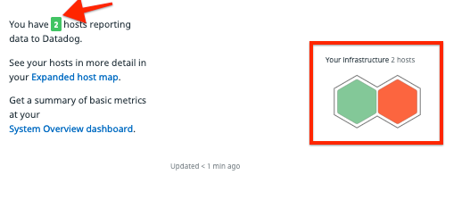
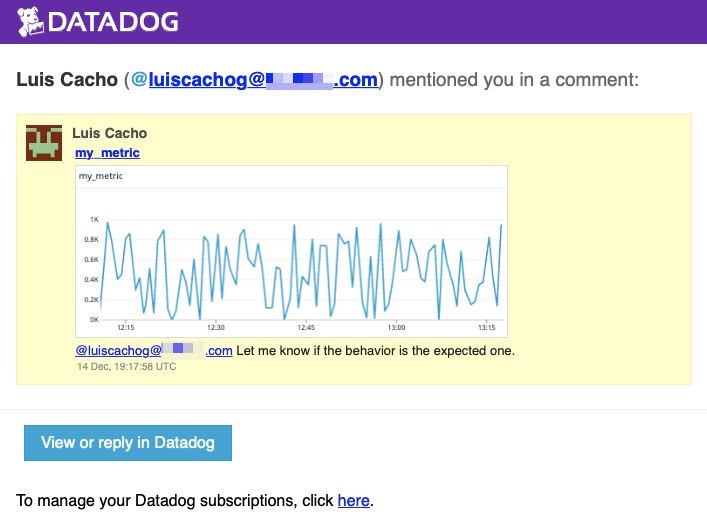
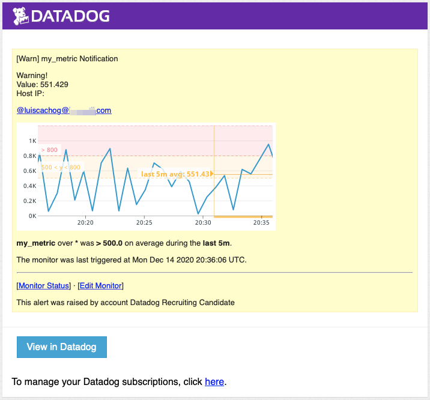
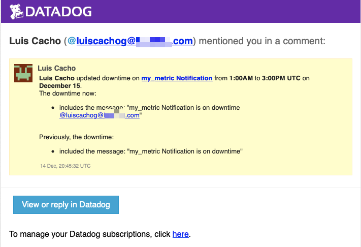
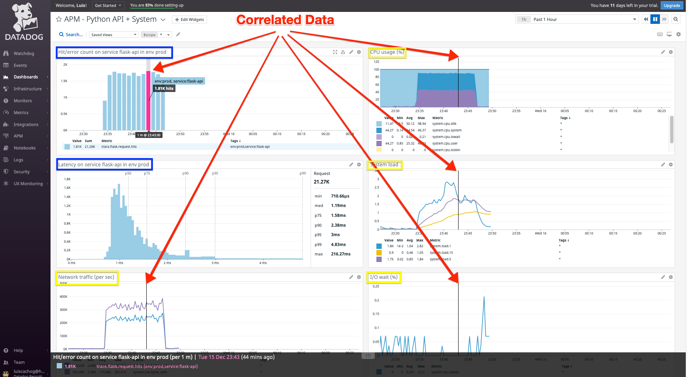

# My Answers

- [My Answers](#my-answers)
  - [My Answers in Spanish](#my-answers-in-spanish)
  - [Introduction](#introduction)
  - [Prerequisites - Setup the environment](#prerequisites---setup-the-environment)
    - [Create Datadog Account](#create-datadog-account)
    - [Host Configuration](#host-configuration)
  - [Collecting Metrics](#collecting-metrics)
    - [Task 1.1](#task-11)
    - [Task 1.2](#task-12)
    - [Task 1.3](#task-13)
    - [Task 1.4](#task-14)
    - [Task 1.5](#task-15)
  - [Visualizing Data](#visualizing-data)
    - [Task 2.1](#task-21)
      - [Task 2.2](#task-22)
      - [Task 2.3](#task-23)
  - [Monitoring Data](#monitoring-data)
    - [Task 3.1](#task-31)
    - [Task 3.2](#task-32)
  - [Collecting APM Data](#collecting-apm-data)
    - [Task 4.1](#task-41)
    - [Task 4.2](#task-42)
  - [Final Question](#final-question)

## [My Answers in Spanish](answers.es.md)

## Introduction

Hello Datadog team.

To understand better the Datadog product I'm going to walk you through a small implementation where I'm going to answer the best possible way the questions provided.

## Prerequisites - Setup the environment

### Create Datadog Account

We need to create a trial Datadog account; to do that, you'll need to follow the next steps:

1. Go to [https://www.datadoghq.com/](https://www.datadoghq.com/)
2. Right in the middle of the site, you will find a nice "Free Trial" purple button where you can start a 14 days trial as shown [here](static/images/dd_site_free_trial.png). For more information about the trial, visit [https://www.datadoghq.com/legal/free-trial-agreement/#free-trial-orders](https://www.datadoghq.com/legal/free-trial-agreement/#free-trial-orders).

3. Fill up a simple form to start using Datadog platform, as shown [here](static/images/dd_site_free_trial_form.png)

4. Once you are logged in, you are going to see all the supported platforms, services, languages that can be integrated with Datadog; you can choose your stack on a similar page to [this](static/images/dd_site_stack.png)

5. The final step in this section is to install the agent accordingly to the integration that you want to implement.

6. We are ready to start using Datadog.

### Host Configuration

I will use a local VM created with vagrant.

To create the MV based on Ubuntu 18.04 I run the commands:

```shell
  vagrant init hashicorp/bionic64
  vagrant up
  vagrant ssh
```

These will create a VM (Using a Vagranfile), it is going to start the VM and finally we will get connected using a ssh connection to our new VM.

The single step to install the Datadog agent is:

```shell
  DD_AGENT_MAJOR_VERSION=7 DD_API_KEY=<YOUR_API_KEY> DD_SITE="datadoghq.com" bash -c "$(curl -L https://s3.amazonaws.com/dd-agent/scripts/install_script.sh)"
```

**Note: Just for fun, and to have more metrics to show on my dashboard I have installed the agent on a docker container in my own laptop.**

## Collecting Metrics

Once I added my Ubuntu agent and the docker container agent I started to see my hosts/agents in the dashboard.



### Task 1.1
- **Add tags in the Agent config file and show us a screenshot of your host and its tags on the Host Map page in Datadog.**

For this task, you need to find the configuration files for the agents.

- For Ubuntu, the config file is on the path: `/etc/datadog-agent/datadog.yaml` and the section that we need to edit is `tags`

  ```yaml
    tags:
      - environment:prod
      - location:home-lab
  ```

After you finished to edit the file, you need to restart the Datadog agent:

  ```shell
    sudo service datadog-agent restart
  ```

- Once I added the tags and restarted the agent, I'm able to see the tags on the dashboard. To find the tags, you should do click on: **Sidebar Menu -> Infrastructure -> Host Map -> YOUR HOST**


For more information about the configurations files and tags, here are some documentation links:

- [https://docs.datadoghq.com/agent/guide/agent-configuration-files/](https://docs.datadoghq.com/agent/guide/agent-configuration-files/)
- [https://docs.datadoghq.com/getting_started/tagging/assigning_tags?tab=noncontainerizedenvironments#methods-for-assigning-tags](https://docs.datadoghq.com/getting_started/tagging/assigning_tags?tab=noncontainerizedenvironments#methods-for-assigning-tags)

### Task 1.2

**Install a database on your machine (MongoDB, MySQL, or PostgreSQL) and then install the respective Datadog integration for that database.**

I choose to use MySQL for convenience as I have previous experience with it. For instructions on how to download and install MySQL on Ubuntu refer to [this link](https://www.digitalocean.com/community/tutorials/how-to-install-mysql-on-ubuntu-18-04)
So, to install the MySQL integration, you need to go to **Sidebar Menu -> Integrations -> Integrations**. Then, you should search for the integration that you want to add, in this case, MySQL.


For more details on the MySQL integration:

- [https://docs.datadoghq.com/integrations/mysql/](https://docs.datadoghq.com/integrations/mysql/)

### Task 1.3

**Create a custom Agent check that submits a metric named my_metric with a random value between 0 and 1000.**

For this task, I followed the instructions that are on this [link](https://docs.datadoghq.com/developers/write_agent_check)

What I have done to configure the custom metric is:

- Create a Custom Metric configuration file

  ```shell
    cd /etc/datadog-agent
    mkdir conf.d/my_metric.d/
    echo instances: [{}] > conf.d/my_metric.d/conf.yaml
  ```

- Create the Custom Metric script, in this case, based on the tutorial and as I have some prior experience with python, the final script placed on path: `/etc/datadog-agent/checks.d/my_metric.py`

  ```python
  # the following try/except block will make the custom check compatible with any Agent version
  from random import randint
  try:
    # first, try to import the base class from new versions of the Agent...
    from datadog_checks.base import AgentCheck
  except ImportError:
    # ...if the above failed, the check is running in Agent version < 6.6.0
    from checks import AgentCheck

  # content of the special variable __version__ will be shown in the Agent status page
  __version__ = "1.0.0"

  class MyCustomCheck(AgentCheck):
    def check(self, instance):
        self.gauge('my_metric', randint(1,1000), tags=['check_name:my_metric','check_type:custom'])
  ```

**Note:** I've done some testing/debugging using the command `sudo -u dd-agent -- datadog-agent check my_metric`

### Task 1.4

**Change your check's collection interval so that it only submits the metric once every 45 seconds.**

By default the `collection interval` is `15` to change it to `45` I followed the next steps:

- Edit the file `/etc/datadog-agent/conf.d/my_metric.d/conf.yaml` with the next content

  ```yaml
  init_config:

  instances:
    - min_collection_interval: 45
  ```

- Restart the Datadog agent:

  ```shell
    sudo service datadog-agent restart
  ```

### Task 1.5

**Bonus Question Can you change the collection interval without modifying the Python check file you created?**

Yes, we can do it on the Custom Check configuration file that, for this example, is located on `/etc/datadog-agent/conf.d/my_metric.d/conf.yaml`

## Visualizing Data

### Task 2.1

**Utilize the Datadog API to create a Timeboard that contains:**

- **Your custom metric scoped over your host.**
- **Any metric from the Integration on your Database with the anomaly function applied.**
- **Your custom metric with the rollup function applied to sum up all the points for the past hour into one bucket**

**Please be sure, when submitting your hiring challenge, to include the script that you've used to create this Timeboard.**

For this task, we need to create an `API Key` and an `Application Key`; for that you'll need to go to **Sidebar Menu -> Integrations -> APIs** and verify that you have both; if not, just create a new one as shown on this [image](static/images/dd_api.png)

On my script I use both as:

```shell
  export DD_CLIENT_API_KEY=<API_KEY>
  export DD_CLIENT_APP_KEY=<APPLICATION_KEY>
```

You can find my script [here](code/timeboard.sh)

I published the `API_KEY` and `APPLICATION_KEY` on my code as an example of how to used in a complete example. Then I revoke them as this is not a best practice from the security perspective. I did it after received a notification from `GitGuardian` and Datadog Support.


#### Task 2.2

**Once this is created, access the Dashboard from your Dashboard List in the UI:**

- **Set the Timeboard's timeframe to the past 5 minutes**
- **Take a snapshot of this graph and use the @ notation to send it to yourself.**




#### Task 2.3

**Bonus Question: What is the Anomaly graph displaying?**

As described on the `Anomaly detection` [page](https://docs.datadoghq.com/monitors/monitor_types/anomaly/#overview), the anomaly function uses the past to **predict** what is expected in the future.
In this example, the anomaly graph is displaying both the **expected value**(on gray) and the **real value** measure with the agent (blue or red)

## Monitoring Data

### Task 3.1

**Since you’ve already caught your test metric going above 800 once, you don’t want to have to continually watch this dashboard to be alerted when it goes above 800 again. So let’s make life easier by creating a monitor.**

**Create a new Metric Monitor that watches the average of your custom metric (my_metric) and will alert if it’s above the following values over the past 5 minutes:**

- **Warning threshold of 500**
- **Alerting threshold of 800**
- **And also ensure that it will notify you if there is No Data for this query over the past 10m.**

**Please configure the monitor’s message so that it will:**

- **Send you an email whenever the monitor triggers.**
- **Create different messages based on whether the monitor is in an Alert, Warning, or No Data state.**
- **Include the metric value that caused the monitor to trigger and host ip when the Monitor triggers an Alert state.**
- **When this monitor sends you an email notification, take a screenshot of the email that it sends you.**



### Task 3.2

**Bonus Question: Since this monitor is going to alert pretty often, you don’t want to be alerted when you are out of the office. Set up two scheduled downtimes for this monitor:**

- **One that silences it from 7pm to 9am daily on M-F,**
- **And one that silences it all day on Sat-Sun.**
- **Make sure that your email is notified when you schedule the downtime and take a screenshot of that notification.**



## Collecting APM Data

### Task 4.1

**Given the following Flask app instrument this using Datadog’s APM solution:**

- **Provide a link and a screenshot of a Dashboard with both APM and Infrastructure Metrics.**
- **Please include your fully instrumented app in your submission, as well.**

For this step, we need to install some prerequisites on our VM as:

```shell
  pip install cython flask ddtrace
```

Then I used the `ENV variables` as mentioned on the [documentation](https://docs.datadoghq.com/tracing/setup_overview/setup/python), the command that I have run is:

```shell
   DD_RUNTIME_METRICS_ENABLED=true DD_SERVICE="flask-api" DD_ENV="prod" DD_LOGS_INJECTION=true DD_TRACE_SAMPLE_RATE="1" DD_PROFILING_ENABLED=true ddtrace-run python my_app.py
```

Where the tags that we need to add for the APM are:

```shell
  DD_SERVICE="flask-api"
  DD_ENV="prod"
```

Then for testing, I use the following bash commands to generate request to our Flask API.

```shell
  for i in {0..1000}; do curl localhost:5050/; curl localhost:5050/api/apm; curl localhost:5050/api/trace; done
```

The Flask API has three endpoints, so I stress the three of them.

The final screenshot and Dashboard Link are the following:

- 
- [Dashboard Public Link](https://p.datadoghq.com/sb/aobt5tbtpdu3g4bd-8d9a24bf7d109cf70e6e80c07a023313)

The instrumented app is the same that is on the example; I just run it with the environment variables that APM requires. You can find the code [here](code/my_app.py)

### Task 4.2

**Bonus Question: What is the difference between a Service and a Resource?**

According to the [documentation](https://docs.datadoghq.com/tracing/visualization/) `Service` is a given endpoint, query or job. In this case, I use the service called `flask-api`.
And a `Resource` is a particular domain of a customer application (Service). In our example the resources are `/, /api/apm, /api/trace`. Also, I understand that a resource is a part of a Service.

## Final Question

**Datadog has been used in a lot of creative ways in the past. We’ve written some blog posts about using Datadog to monitor the NYC Subway System, Pokemon Go, and even office restroom availability!**
**Is there anything creative you would use Datadog for?**

I can imagine using it to monitor the price of Cryptocurrency; we can use Machine Learning to try to predict the price :wink: . Also, I imagine we can use datadog to monitor how the CoVID-19 vaccine is being distributed and applied, and just for fun and learning purposes, I going to start using Datadog on my Raspberry-Pi to get more insights of my daily network usage/loscl services/avoided advertising/most visited sites/etc.

Thank you for the opportunity!
