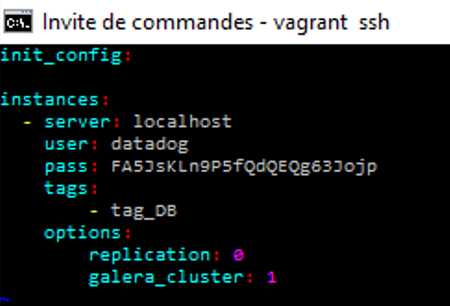
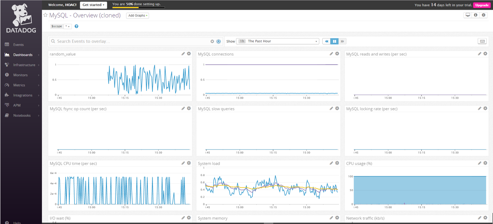
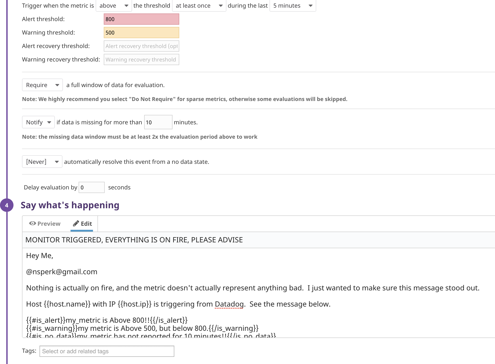
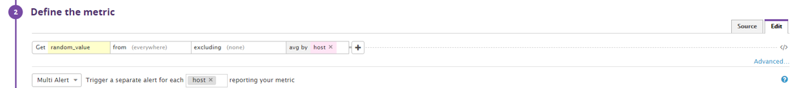
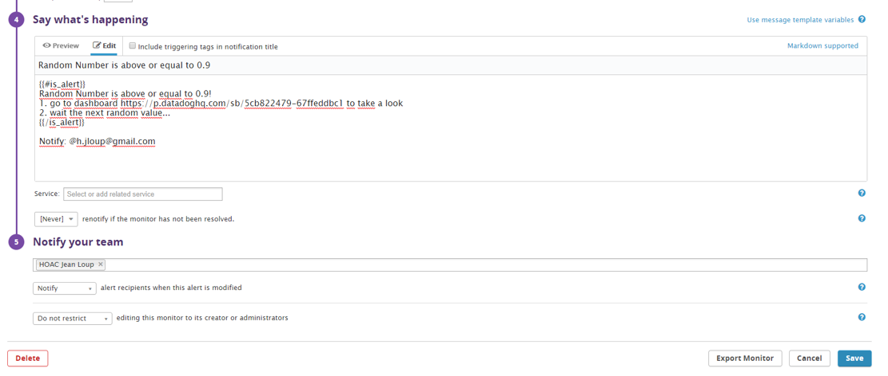
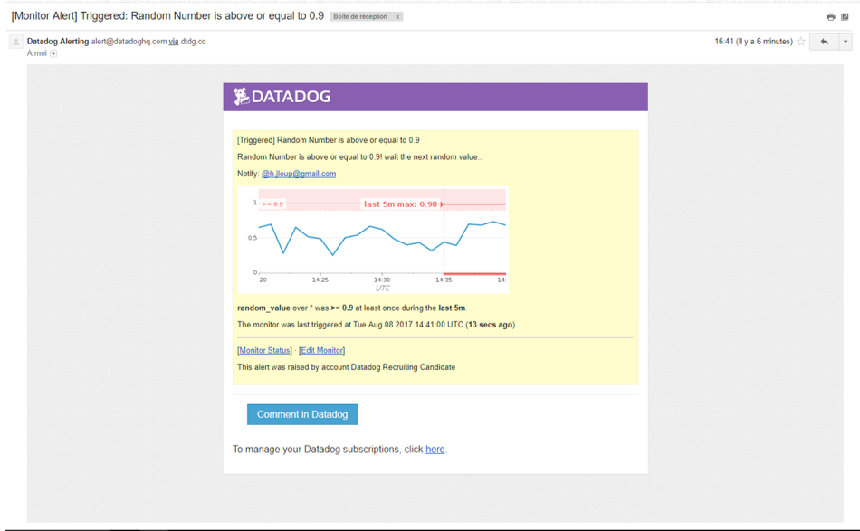
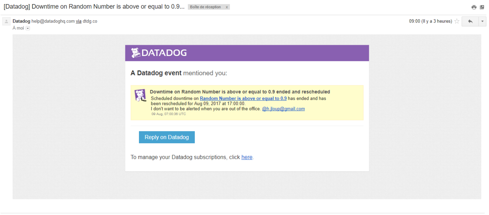

# Answers

## Level 0 (optional) - Setup an Ubuntu VM

I set up a Vagrant Ubuntu 12.04 VM for the hiring exercice as recommanded.

## Level 1 - Collecting your Data

I sign up for Datadog and follow the instructions seen in [datadog guides](https://docs.datadoghq.com/guides/basic_agent_usage/ubuntu/) to get the Agent reporting metrics

>*Bonus question: In your own words, what is the Agent?*

The agent is a service that will collect informations and data needeed and foward to Datadog Dashboard  in order to show graph and metric for Datadog  

The configuration file for the Agent is located in */etc/dd-agent/datadog.conf*


I also add tag using the UI


both tags appear in the host map page.

I choose MySQL and install the respective Datadog integration by following instructions [here](https://app.datadoghq.com/account/settings#integrations/mysql)

And check if the integration is ok by using the command : 
```sh
$ sudo /etc/init.d/datadog-agent info
```

<--  -->

I created *test.support.random.yaml* and *test.support.random.yaml* files on *checks.d* and *conf.d* repertory (respectively) 
Py file : 


Yaml file : 


And check the script by using the following command : 
```sh
$ sudo -u dd-agent dd-agent check test.support.random 
```

## Level 2 - Visualizing your Data

I clone my database integration dashboard by using the User Interface and add test.support.random metric by using [metrics explorer](https://app.datadoghq.com/metric/explorer)


> *Bonus question: What is the difference between a timeboard and a screenboard?*

I generate a timeboard and a screenboard in order to understand differencies.
They both can show same informations but not for differents needs : Screenboard is adapted for monitoring and Timeboard for troobleshooting.

Screenboard is as it says for screen (TV, wallboard..) it permits to have a global view or status of a service or infrastructure. It is flexible and customizable : you can add widgets and metrics with differing time scales.

Timeboard is for investigation : graphs are synchronised so it's better for troubleshooting and correlation. 


After taking a snapshot, it appears on the [events page](https://app.datadoghq.com/event/stream) : 


## Level 3 - Alerting on your Data

I go [here](https://app.datadoghq.com/monitors#create/metric) to create a monitor



> *Bonus points: Make it a multi-alert by host so that you won't have to recreate it if your infrastructure scales up.*
The multi alert setting is avalaible in step 2 : *define the metric*





Here the email notification : 


> *Bonus: Since this monitor is going to alert pretty often, you don't want to be alerted when you are out of the office. Set up a scheduled downtime for this monitor that silences it from 7pm to 9am daily. Make sure that your email is notified when you schedule the downtime and take a screenshot of that notification.*

I go [here](https://app.datadoghq.com/monitors#/downtime) to schedule my downtime


I got 2 mails mentionned the end and the start of th monitor 


