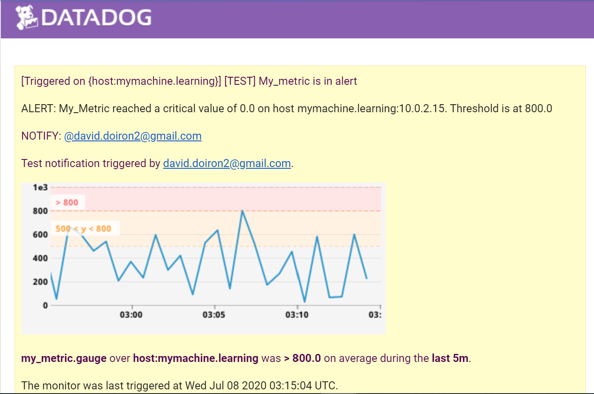
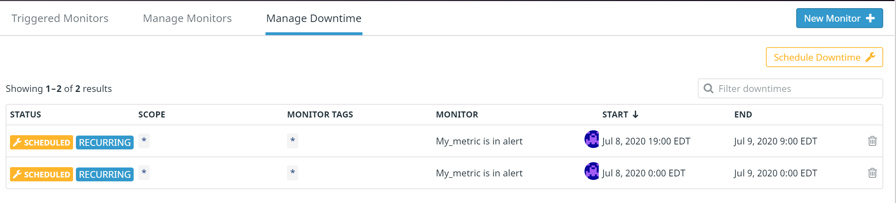

# 1:Setup the environment:
*  #### The first step of this exercise was to setup the environment. I followed the recommendation and decided to use a Vagrant VM running Ubuntu. I had a lot of experience deploying VM using VMware product, but it was a first for me with Vagrant. I used *VirtualBox 6.1.12 for Linux* as a virtualizer, pre-packaged with *Ubuntu 19.10 / 20.04*. Then I downloaded and launched *Vagrant 2.2.9_x86_64*
  ```
  > vagrant init hashicorp/bionic64
  > vagrant up
   ```
  
  Here is the result:
  

* #### I then went ahead and installed the Datadog Agent for Ubuntu by running the one-step install command:
```
DD_AGENT_MAJOR_VERSION=7 DD_API_KEY=3163017dc099bcab6c9860e05f3a7ade DD_SITE="datadoghq.com" bash -c "$(curl -L https://s3.amazonaws.com/dd-agent/scripts/install_script.sh)"
```
```
vagrant@vagrant:/etc/datadog-agent$ ls -ltr
total 148
-r--r-----   1 dd-agent dd-agent   918 Jun 17 10:28 system-probe.yaml.example
-rw-r--r--   1 dd-agent dd-agent 55687 Jun 17 10:28 datadog.yaml.example
drwxr-xr-x   2 dd-agent dd-agent  4096 Jul  7 02:45 selinux
-rw-r--r--   1 dd-agent dd-agent   117 Jul  7 02:45 install_info
-rw-------   1 dd-agent dd-agent    64 Jul  7 02:45 auth_token
-rw-r-----   1 dd-agent dd-agent 55700 Jul  7 03:33 datadog.yaml
drwxr-xr-x 144 dd-agent dd-agent  4096 Jul  7 03:41 conf.d
drwxr-xr-x   3 dd-agent dd-agent  4096 Jul  7 03:51 checks.d
-rw-r--r--   1 root     root      1195 Jul  7 16:43 my_dashboard.py
drwxr-xr-x   2 root     root      4096 Jul  8 15:45 DD_test
-rw-r--r--   1 root     root       685 Jul  8 18:13 trial_app.py
```
# 2:Collecting Metrics:
*  #### The next step was to setup tags in the agent config file. I decided to change the hostname, add a tag for the specific geolocalized area, and define the environment into which the host will be running. Those tags were changed in the datadog.yaml file 
  
  Here is the resulting Host Map Screenshot take from the Datadog WebUI: 

*  #### I went on and installed a local MySQL server and created the datadog user with the suggested grants
  ```
  sudo apt install mysql-server
  sudo mysql
  mysql>CREATE USER 'datadog'@'localhost' IDENTIFIED BY 'datadog';
  mysql> GRANT REPLICATION CLIENT ON *.* TO 'datadog'@'localhost' WITH MAX_USER_CONNECTIONS 5;
  mysql> GRANT PROCESS ON *.* TO 'datadog'@'localhost';
  mysql> GRANT SELECT ON performance_schema.* TO 'datadog'@'localhost';
  mysql>
  mysql> show databases like 'performance_schema';
  +-------------------------------+
  | Database (performance_schema) |
  +-------------------------------+
  | performance_schema            |
  +-------------------------------+
  1 row in set (0.00 sec)
  ```
  - MySQL runtime PID: 
  
* #### I then edited the MYSQL config file to add the metric collection configuration block. I also added a tag for dbtype because I thought in a multi-DB system it would be easier to track some metrics:
  ```
  instances:
  - server: 127.0.0.1
    user: datadog
    pass: datadog
    port: 3306
    tags:
       - dbtype:mysql
    options:
      replication: false
      galera_cluster: true
      extra_status_metrics: true
      extra_innodb_metrics: true
      extra_performance_metrics: true
      schema_size_metrics: false
      disable_innodb_metrics: false
   ```
  - You can find the complete yaml file here: [MYSQL conf.yaml](./mysql_conf.yaml)
  
  - Then in order to facilitate the log collection, I changed the default logging directory from */var/log/syslog* to */var/log/mysql/*. To do so, I went and edit the */etc/mysql/my.cnf* to add the following block:
  ```
  [mysqld_safe]
  log_error = /var/log/mysql/mysql_error.log

  [mysqld]
  general_log = on
  general_log_file = /var/log/mysql/mysql.log
  log_error = /var/log/mysql/mysql_error.log
  slow_query_log = on
  slow_query_log_file = /var/log/mysql/mysql_slow.log
  long_query_time = 2
  ```
  - I restarted the MySQL server using  `sudo service mysql restart`
  - I made sure the Agent had read access on the /var/log/mysql directory using
  ```
   cd /var/log/
   sudo chmod -R 777 mysql
   ```
   - I made sure that logrotate would take these logs into account by editing */etc/logrotate.d/mysql-server* with the following
     ```
     /var/log/mysql.log /var/log/mysql/*log {
        daily
        rotate 7
        missingok
        create 640 mysql adm
        compress
       
      }
      ```
  - I edited the agent's *datadog.yaml* file to enable the log collection
  ``` 
  logs_enabled: true
  ```
  - Then, as per the documentation, I added the following code block to */etc/datadog-agent/conf.d/mysql.d* configuration file to start collecting MySQL logs.
  ```
    logs:
    - type: file
      path: "<ERROR_LOG_FILE_PATH>"
      source: mysql
      service: "<SERVICE_NAME>"

    - type: file
      path: "<SLOW_QUERY_LOG_FILE_PATH>"
      source: mysql
      service: "<SERVICE_NAME>"
      log_processing_rules:
        - type: multi_line
          name: new_slow_query_log_entry
          pattern: "# Time:"
          # If mysqld was started with `--log-short-format`, use:
          # pattern: "# Query_time:"

    - type: file
      path: "<GENERAL_LOG_FILE_PATH>"
      source: mysql
      service: "<SERVICE_NAME>"
      # For multiline logs, if they start by the date with the format yyyy-mm-dd uncomment the following processing rule
      # log_processing_rules:
      #   - type: multi_line
      #     name: new_log_start_with_date
      #     pattern: \d{4}\-(0?[1-9]|1[012])\-(0?[1-9]|[12][0-9]|3[01])
   ```

* #### Then I had to setup a custom check agent that submits a metric named my_metric with a random value between 0 and 1000: Here is the Custom Check Agent python script */etc/datadog-agent/checks.d/my_metric.py*:
```python
import random

from datadog_checks.base import AgentCheck

__version__ = "1.0.0"

class MyClass(AgentCheck):
 def check(self, instance):
  self.gauge(
   "my_metric.gauge",
   random.randint(0, 1000),
   tags=["env:sandbox","metric_submission_type:gauge"])
```
  
* #### Next, I was asked to change the collection interval so that it only submits the metric once every 45 seconds. To do so I added a parameter *min_collection_interval: 45* to the */etc/datadog-agent/conf.d/my_metric.d/my_metric.yaml*
```yaml
init_config:

instances:
 - min_collection_interval: 45
```

* #### Bonus Question Can you change the collection interval without modifying the Python check file you created ?
Yes, through the metric’s config file located in */etc/datadog-agent/conf.d/my_metric.d/my_metric.yaml*

# 3:Visualizing Data:
* #### After that I had to use the API to create a dashboard containing 
  - my_metric scoped over my host.
  - Cpu_time taken by the Mysql Database with the anomaly function applied.
  - my_metric with the rollup function applied to sum up all the points for the past hour into one bucket

I decided to use python to script the creation of the Dashboard: 
```python
from datadog import initialize, api
import time
my_time = time.ctime(time.time())


options = {
        'api_key': '3163017dc099bcab6c9860e05f3a7ade',
        'app_key': '0c8be5163923b75f191e4e63c35f098dd172be3a'
        }

initialize(**options)

# Dashboard information
title = "My dashboard using API "+ my_time
description = "Dashboard created through the API"
layout_type = "ordered"

#Widgets
widgets = [{
    'definition': {
        'type' : 'timeseries',
        'requests' : [{'q' : 'avg:my_metric.gauge{host:mymachine.learning}'}],
        'title' : 'Avg of my_metric over mymachine.learning'
        }},

        {
    'definition' : {
        'type' : 'timeseries',
        'requests' : [{'q' : "anomalies(avg:mysql.performance.cpu_time{*}, 'basic', 2)"}],
        'title' : 'Avg of Mysql CPU_time over * w/ anomaly'
        }},
        {
    'definition' : {
         'type' : 'timeseries',
         'requests' : [{'q' : "sum:my_metric.gauge{*}.rollup(avg, 3600)", "display_type": "bars" }],
         'title' : 'my_metric summed over 1hr'
         }}
     ]

#Create Dashboard
api.Dashboard.create(title=title, description=description, layout_type=layout_type, widgets=widgets)
```
The script file can be found [here](./my_dashboard.py)
  
* #### Visually, the resulting dashboard looks like this.


* #### In order to dive deeper into the data values, we can change the timeframe to get more granular datapoints. Here's the result using a 5 minutes timeframe.


* #### For collaboration purposes, we can snapshot a certain timeframe of our widget and share it with teammates using the @notation. This is the email I received after being tagged in the snapshot.


 * #### Bonus Question: What is the Anomaly graph displaying? 
  DD: The anomaly graph is highlighting abnormal variations in data value as compared to the majority of values in the given interval. In my case it highlights spikes in cpu   utilization for the given timeframe.

# 4:Monitoring Data:
* #### The objective of an effective dashboard is to keep track of certains metrics, data and KPI. But for the operations' side of business, it's mostly useful to generate alerts on failing systems based on preconfigured data threshold. In the case of my_metric, we are generating random numbers between 0-1000, and for the sake of example, we will assume that :
  - Any value over 500 should be considered a Warning state
  - Any value over 800 is considered critical and should trigger an alert
  - If there is no data for this query for the last 10 minutes, it should also trigger an alert
  
  To make sense to the recepients of the alert, I had to edit the outgoing message to include valuable information such as:
  - Send myself an email whenever the monitor triggers.
  - Create different messages based on whether the monitor is in an Alert, Warning, or No Data state... and include the metric value and host ip.

Here is the metric monitor configuration page to incorporate all of the above parameters
  

Here is the resulting triggered alert email notification


* #### Bonus Question: 
  - In normal operating conditions, we may not want to be alerted of certain threshold during specific periods. To showcase this, I created 2 scheduled downtimes for the previous monitor:
      - Silence the alert from 7pm to 9am daily on weekdays
      - Silence the alert during the Weekends
  
  - Here is the resulting downtime schedules:
  
  
  - I also made sure that my email was notified when setting those downtimes. Here are the notification emails:  
  

 # 5:Collecting APM data
* #### To collect APM data on an application, I used the provided flask application:
```flask
from flask import Flask
import logging
import sys
import ddtrace.profile.auto

# Have flask use stdout as the logger
main_logger = logging.getLogger()
main_logger.setLevel(logging.DEBUG)
c = logging.StreamHandler(sys.stdout)
formatter = logging.Formatter('%(asctime)s - %(name)s - %(levelname)s - %(message)s')
c.setFormatter(formatter)
main_logger.addHandler(c)

app = Flask(__name__)

@app.route('/')
def api_entry():
    return 'Entrypoint to the Application'

@app.route('/api/apm')
def apm_endpoint():
    return 'Getting APM Started'

@app.route('/api/trace')
def trace_endpoint():
    return 'Posting Traces'

if __name__ == '__main__':
    app.run(host='0.0.0.0', port='5050')
```
File version of the app: [trial_app](./trial_app.py)

  - To succesfully run the app, I first had to install pip, flask and ddtrace.
  ```
  sudo apt install python-pip
  pip install ddtrace
  pip install flask
  ```
  - Also, as recommended by the documentation, I configured some important environment variables to explicitely describe what environment and service the application was running.
  ```
  export DD_ENV=sandbox
  export DD_SERVICE=flask_service
  ```
 
  - Then I could succesfully instrument the application, I launched it using the ddtrace-run command, as follows:
  ```
  ddtrace-run python trial_app.py
  ```
  
  - To generate traffic to the application, I generated resource calls to the service by typing multiple times these curl requests in the CLI. Note that I've intentionally inserted an invalid resource call to generate a 404 http response:
  ```
  curl http://127.0.0.1:5050/
  curl http://127.0.0.1:5050/api/trace
  curl http://127.0.0.1:5050/api/apm
  curl http://127.0.0.1:5050/asdf
  ```
  
* #### Then I logged onto my Dashboard and added 3 widgets related to the APM metrics.
  - Max http hits on the the flask app
  - Average request duration
  - Sum of each http response status

    - Here is the Dashboard Screenshot with Infrastructure and APM metrics: 
    
  
  You can access the Dashboard through this link. I keep the VM up and resend the curl requests from time to time to keep data in the Dashboard: https://p.datadoghq.com/sb/pplgzjts4v4gyxk3-4a2301f4a537fdf031350b2b0cb55419
  
  ### Bonus Question: What is the difference between a Service and a Resource?
  - A *service* is a group of processes \(queries, jobs, endpoints) that allow the creation of an application. \(i.e: The flask service in our examples)
  - A *resource* is a specific domain of an application \(single endpoint, single query) \(i.e: The specific request http://127.0.0.1:5050/api/trace from the example)

# Final Question:
  ### Is there anything creative you would use Datadog for? 
  I could see a very practical use of collecting metrics from kid’s screen time. There are applications that can calculate the amount of time spent on each app/device per kids. A custom Agent check could aggregate all this data and show it on a single pane of glass and keep track of the objectives the family has agreed on. These measures could be presented with clear visual markers to quickly show if the screentime is within the acceptable -green- range or is exceeding -red- the daily limit. 

Personally, I like to agree on some rules with my kids that, if they are bored and wish to use the tablet or phone or video game, I want them to first do some reading. I could setup a very simple webpage that they could enter their reading time into. That metric could be retreived by the agent on Then the reading time could also be shown, per kid, on the Dashboard. Again, we could agree on a target reading - screentime, and keep track of it to make sure it is always positive (equal or more reading time than screentime).

Finally, I'd set a monitoring alert that would send me an email notification on a weekly basis, if one my kid has reached their target ratio. That email would be tied to their weekly allowance and/or special movie night. :)

Just for the fun of it, I created a custom check agent that generates random screentime and reading time for my 2 kids.
```python
import random

from datadog_checks.base import AgentCheck

__version__ = "1.0.0"

class MyClass(AgentCheck):
 def check(self, instance):
  self.gauge(
   "my_kids.kid1.screentime",
   random.randint(0, 120),
   tags=["env:sandbox","metric_submission_type:gauge"])
  self.gauge(
   "my_kids.kid1.readtime",
   random.randint(0, 120),
   tags=["env:sandbox","metric_submission_type:gauge"])
  self.gauge(
   "my_kids.kid2.screentime",
   random.randint(0, 120),
   tags=["env:sandbox","metric_submission_type:gauge"])
  self.gauge(
    "my_kids.kid2.readtime",
    random.randint(0, 120),
    tags=["env:sandbox","metric_submission_type:gauge"])
   ```
   
The resulting Dashboard would look like that


#### I realy enjoyed discovering the Datadog product and I hope you enjoyed the reading too. 
#### David Doiron
   
  


