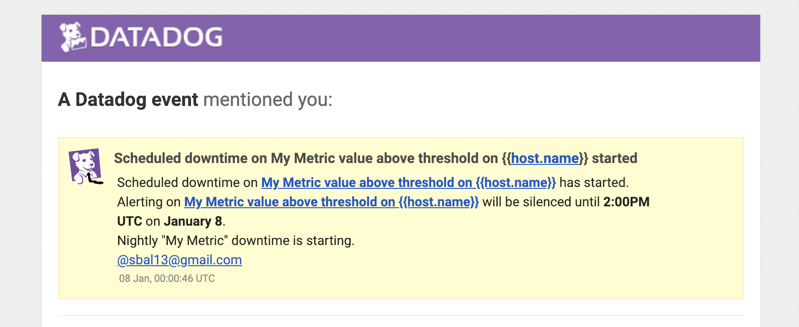

## Collecting Metrics

Tags are attached to the various hosts and integrations and are used by the Datadog Agent to group datasets. This is particularly useful for monitoring performance of multiple instances of a host/integration to establish baseline performance and detect anomalous behaviors.

Tags can be added in a number of ways. One such way is to modify the `datadog.yaml` file and add code such as the following:

```yaml
tags:
  - host:ubuntu
  - test_tag
```


There are a number of formats, but typically tags will be of the format `<key>:<value>`. Keys are used for grouping tags for easy filtering in the Agent.

When a tag has been successfully added, your Agent should automatically update after a few minutes to include your new tags.


Ordinarily streaming data into the Datadog Agent is done by installing an integration for that particular technology. However, custom check scripts can be written to programmatically obtain metrics. This involves creating a Python script within the `checks.d` directory and a YAML file of the same name within the `conf.d` directory. The Python check might look like the following:

```python
import random

from checks import AgentCheck


__version__ = "1.0.0"


class FirstCheck(AgentCheck):
    def check(self, instance):
        self.gauge('my_metric', random.randint(0,1001))


```

The `guage` method takes 2 arguments, the name of the metric (in this case called `my_metric`) and the value of the metric (in this case, a random number between 0 and 1000).

To collect data in the Agent about this metric, the YAML file in `conf.d` (its name being the same as that of your Python check file) should include at the minimum 

```
init_config:

instances: [{}]
```
The `[{}]` is added because the `instances` key must have at least this empty value and can be removed when additional configuration is desired. This file allows for the modification of a number of attributes about the collection. For instance, the rate of collection can be modified as such:
 
```
init_config:

instances:
  - min_collection_interval: 45
```

By default, a check is run every 15 seconds, but this configuration will set the check to run every 45 seconds.

The Agent has built-in integrations that can monitor performance of technologies on a host. These integrations have particular instructions for their installation which can be found within the Agent. Integrating MongoDB, for instance, requires the addition of a `mongo.yaml` file to the `conf.d` directory. It may look like the following:

```
init_config:

instances:
      -   server: mongodb://datadog:<UNIQUE KEY HERE>@localhost:27017
          tags:
              - role:database:mongo
              - host:vagrant_ubuntu

```


## Visualizing Data

Once metrics have been tagged and integrated, data can be visualized by creating dashboards. Dashboards can be created in the Agent itself or using the API. A Python script that uses the API might look like the following:

```python
from datadog import initialize, api

options = {
    'api_key': '<API KEY>',
    'app_key': '<APP KEY>'
}

initialize(**options)

title = "My Timeboard"
description = "Solutions Engineer Exercise"

# Graphs to be added to the dashboard
graphs = [{
    "definition": {
       # Datasets to be added to a particular graph 
       # In this case, 3 datasets are being visualized on one graph.
        "requests": [
            {
              "q": "avg:my_metric{host:vagrant_ubuntu}",
              "type": "line",
              "style": {
                "palette": "dog_classic",
                "type": "solid",
                "width": "normal"
              },
              "conditional_formats": []
            },
            {
              "q": "anomalies(avg:mongodb.mem.virtual{role:database:mongo}, 'basic', 2)",
              "type": "line",
              "style": {
                "palette": "purple",
                "type": "solid",
                "width": "normal"
              }
            },
            {
              "q": "sum:my_metric{host:vagrant_ubuntu} by {role}.rollup(sum, 3600)",
              "type": "line",
              "style": {
                "palette": "orange",
                "type": "solid",
                "width": "normal"
              }
            }
          ],
          "viz": "timeseries",
          "autoscale": True
        },
    "title": "First Timeboard"
}]

api.Timeboard.create(title=title,
                     description=description,
                     graphs=graphs)
```


This produces a timeboard that looks like the following:


The dashboard allows a user to take snapshots of graphs and send them to members of your team. A notification appears within the event feed of that team member and may look like the following:


Anomaly graphs use machine learning to detect deviations from established patterns of behavior of a particular metric.

## Monitoring Data

Monitors can be established to automatically notify team members in the case that a metric crosses certain boundaries. Monitors will automaticall email team members when specified thresholds are crossed or other conditions are met. This email may look like the following:

Crossing a warning threshold (orange region marks the "warning" zone"):


Crossing an alert threshold (red region marks the "alert" zone):


No Data email:


Downtime can be scheduled so that monitoring can be pasued during regularly occuring intervals such as nights and weekends. Notifications can be automatically sent to team members to notify them of the beginning/ending of downtime.




## APM Data

The APM can be configured to collect traces about applications running on the host by adding the following to the `datadog.yaml` file:

```
apm_config:
   enabled: true
   env: production
```

As an example, the APM can collect data about requests made to the following simple Flask application:

```
from flask import Flask, jsonify
import logging
import sys

from ddtrace import tracer
tracer.set_tags({'env': 'production'})

main_logger = logging.getLogger()
main_logger.setLevel(logging.DEBUG)
c = logging.StreamHandler(sys.stdout)
formatter = logging.Formatter('%(asctime)s - %(name)s - %(levelname)s - %(message)s')
c.setFormatter(formatter)
main_logger.addHandler(c)

app = Flask(__name__)


@app.route('/api/test')
def test_endpoint():
    test_data = [{"name": "Steven", "age": 28}, {"name": "Laura", "age": 26}]
    resp = jsonify(test_data)
    resp.status_code = 200

    return resp

if __name__ == '__main__':
    app.run(host='0.0.0.0', port='5050')
```

When endpoints to this application are hit, data is automatically streamed and collected in the agent. The resulting dashboard might look like the following:


## Uses

Datadog can be used for monitoring any number of things and trigger other scripts. For example, extremely high server load could trigger a monitor to send an email to a bot. A script that regularly checks that bot's email for Datadog alert emails could then adjust throttling on a server, begin caching requests in the event of an imminent server crash, or reroute incoming requests. 

One could even use Datadog to check for periods of increased latency on event ticket retailing sites like Ticketmaster and automatically notify you when there are surges of increased traffic will prevent you from purchasing a ticket and when that surge is beginning to relent.
