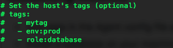

My environment is running on Mac Os.

Let's install virtualbox, then download vagrant and install ubuntu (from the command line)

Once the vm is up and running let's ssh into 

Meanwhile we need to create an account for DataDog.
Select the services you'll run (e.g MySQL, Python)

Then you need to install the agent.
Select ubuntu and copy and paste the installation script into the ubuntu shell

When trying to run the installation command, it will fail because there is no curl installed

Let's then install Curl

`vagrant@precise64:~$ sudo apt-get install curl`

Run it again now:

`vagrant@precise64:~$ DD_API_KEY=ff3c5f106b1e280f6be82c1e535a5dea bash -c "$(curl -L https://raw.githubusercontent.com/DataDog/datadog-agent/master/cmd/agent/install_script.sh)"`

wait for the installation to finish and for the agent to connect to the DataDog server.

This is what you'll see at the end if the installation is successfull

And the DataDog webpage you'll also see that the agent is reporting

So far so good!

Let's start with the metrics:

*Add tags in the Agent config file and show us a screenshot of your host and its tags on the Host Map page in Datadog.*

Become root (or use sudo before each command)

`sudo su`

Then open the datadog.yaml file
`root@precise64:/home/vagrant# vi /etc/datadog-agent/datadog.yaml`

Remove the comments and modify as needed

restart the Agent

`vagrant@precise64:~$ sudo stop datadog-agent
datadog-agent stop/waiting
vagrant@precise64:~$ sudo start datadog-agent
datadog-agent start/running, process 3908
vagrant@precise64:~$ `

I can see

create metric for dashboard

*Install a database on your machine (MongoDB, MySQL, or PostgreSQL) and then install the respective Datadog integration for that database.*

let's install mysql first

`vagrant@precise64:~$ sudo apt-get install mysql-server`

provide a password for mysql root access

from the DataDog website, go into Integration, select mysql and install

small modification to the script to define the user (root) and ask for password

`vagrant@precise64:~$ sudo mysql -uroot -p -e "CREATE USER 'datadog'@'localhost' IDENTIFIED BY '6NdoTrXndcwJUlR5g[KOjUQj';"`

`vagrant@precise64:~$ sudo mysql -uroot -p -e "GRANT REPLICATION CLIENT ON *.* TO 'datadog'@'localhost' WITH MAX_USER_CONNECTIONS 5;"`

insert the password you setup for the root account

`sudo mysql -uroot -p -e "GRANT PROCESS ON *.* TO 'datadog'@'localhost';"`

`sudo mysql -uroot -p -e "GRANT SELECT ON performance_schema.* TO 'datadog'@'localhost';"`

verification

now with the agent installation

`vagrant@precise64:~$ sudo cp /etc/datadog-agent/conf.d/mysql.d/conf.yaml.example /etc/datadog-agent/conf.d/mysql.yaml
vagrant@precise64:~$ sudo nano /etc/datadog-agent/conf.d/mysql.yaml`

  

  init_config:

`instances:
    # NOTE: Even if the server name is "localhost", the agent will connect to MySQL using TCP/IP, unless you also
    # provide a value for the sock key (below).
  - server: localhost
    user: datadog    
    pass: 6NdoTrXndcwJUlR5g[KOjUQj
    port: 3306             # Optional
    # sock: /path/to/sock    # Connect via Unix Socket
    # defaults_file: my.cnf  # Alternate configuration mechanism
    # connect_timeout: None  # Optional integer seconds
    tags:                  # Optional
      - optional_tag1
      - optional_tag2
    options:               # Optional
      replication: 0    
    #   replication_channel: channel_1  # If using multiple sources, the channel name to monitor
   #   replication_non_blocking_status: false  # grab slave count in non-blocking manner (req. performance_schema)
      galera_cluster: 1  `

restart  the Agent

`sudo datadog-agent status	`

check

Create a custom Agent check that submits a metric named my_metric with a random value between 0 and 1000.

https://docs.datadoghq.com/agent/agent_checks/

mycheck.yaml 

`vagrant@precise64:/etc/datadog-agent/conf.d$ cat mycheck.yaml
init_config:

instances:
   [{
      min_collection_interval: 1
   }]`

mycheck.py 

`vagrant@precise64:/etc/datadog-agent/checks.d$ cat mycheck.py
import random
from checks import AgentCheck
class mycheck(AgentCheck):
    def check(self, instance):
        self.gauge('test.my_metric', random.random()*1000)`

check if the custom agent is working

Change your check's collection interval so that it only submits the metric once every 45 seconds.

`vagrant@precise64:/etc/datadog-agent/conf.d$ sudo cat mycheck.yaml
init_config:

instances:
   [{
      min_collection_interval: 45
   }]`

   Bonus Question Can you change the collection interval without modifying the Python check file you created?

Visualizing Data:
Utilize the Datadog API to create a Timeboard that contains:

Your custom metric scoped over your host.
Any metric from the Integration on your Database with the anomaly function applied.
Your custom metric with the rollup function applied to sum up all the points for the past hour into one bucket

`curl  -X POST -H "Content-type: application/json" \
-d '{
      "graphs" : [{
          "title": "Test Timeboard",
          "definition": {
              "events": [],
              "requests": [
                  {"q": "avg:test.my_metric{*}"}
              ]
          },
          "viz": "timeseries"
      }],
      "title" : "A Test Timboard",
      "description" : "A dashboard with test info.",
      "template_variables": [{
          "name": "host1",
          "prefix": "host",
          "default": "host:precise64"
      }],
      "read_only": "True"
}' \
"https://api.datadoghq.com/api/v1/dash?api_key=${api_key}&application_key=${app_key}"`

https://docs.datadoghq.com/developers/metrics/

let's first install python pip

vagrant@precise64:~$ sudo apt-get install python-pip
